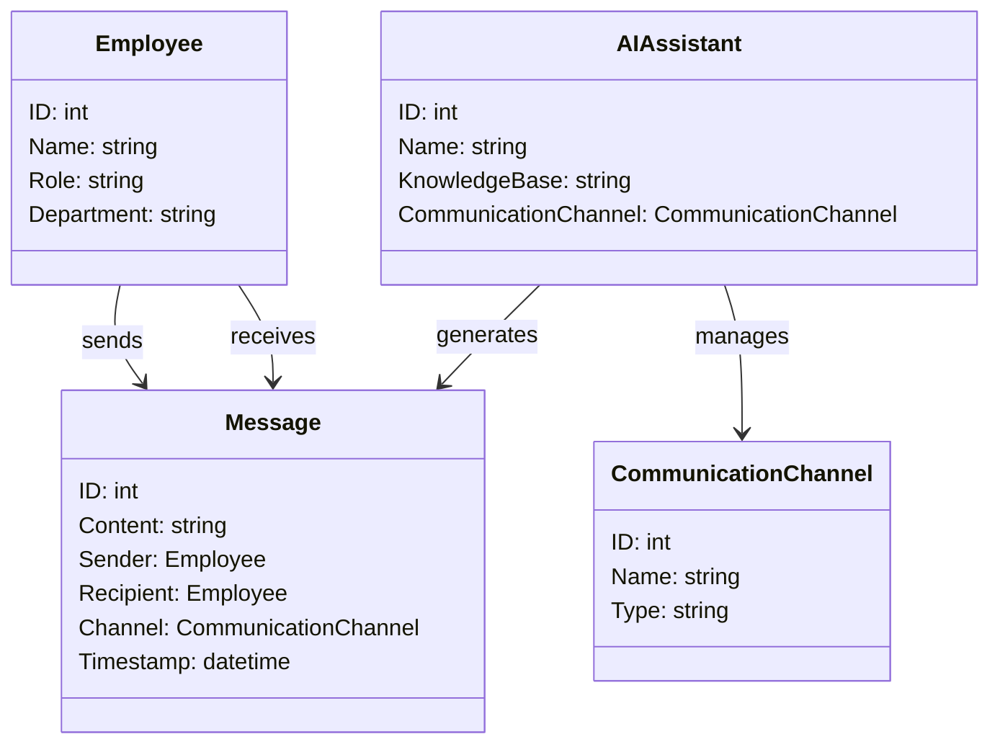
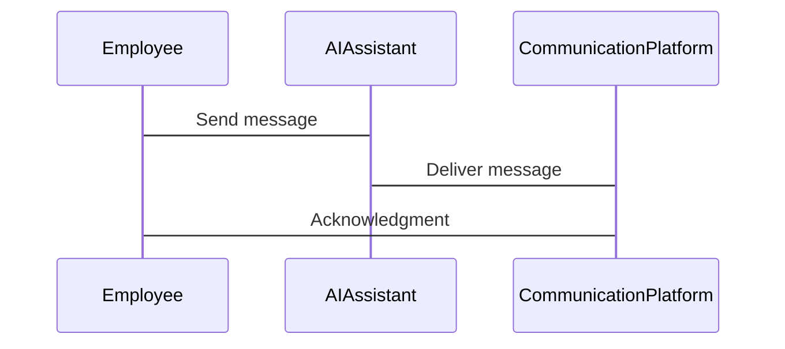
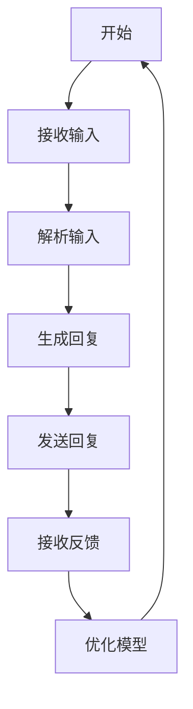

                 


# AI Agent在企业文化建设与内部沟通中的应用

## 关键词：AI Agent，企业文化，内部沟通，人工智能，企业架构

## 摘要：
本文深入探讨了AI Agent在企业文化建设与内部沟通中的应用，分析了AI Agent的基本概念、工作原理及其在优化企业内部沟通、提升企业文化建设效率中的具体作用。文章从理论到实践，结合实际案例，详细讲解了AI Agent如何通过自然语言处理、强化学习等技术手段，优化企业内部信息传递、促进团队协作，并为企业文化的传播与评估提供支持。通过本文，读者将全面理解AI Agent在现代企业中的重要价值，并掌握其在实际应用中的关键技术和实现方法。

---

# 第一部分: AI Agent与企业文化建设概述

## 第1章: AI Agent与企业文化建设的背景

### 1.1 AI Agent的基本概念

#### 1.1.1 AI Agent的定义
AI Agent（人工智能代理）是指能够感知环境、做出决策并执行任务的智能实体。它通过自然语言处理（NLP）、机器学习（ML）和知识图谱等技术，实现与人类的交互，并自动化完成特定任务。

#### 1.1.2 AI Agent的核心特征
| 特性 | 描述 |
|------|------|
| 智能性 | 能够理解上下文并做出合理决策 |
| 可交互性 | 支持自然语言对话，与用户实时互动 |
| 自适应性 | 根据反馈不断优化行为和策略 |
| 知识性 | 集成企业知识库，提供专业建议 |

#### 1.1.3 AI Agent与传统IT工具的区别
AI Agent不仅仅是工具，它具备智能性和自适应性，能够主动理解和解决复杂问题。

### 1.2 企业文化建设的内涵与挑战

#### 1.2.1 企业文化的定义与重要性
企业文化是企业在长期发展过程中形成的价值观、行为规范和思维方式的总和，是企业的灵魂。

#### 1.2.2 企业文化建设的常见挑战
- 沟通不畅：信息传递效率低，员工理解偏差。
- 文化认同不足：员工对企业价值观缺乏认同感。
- 变化适应困难：企业转型期文化难以快速调整。

#### 1.2.3 AI Agent在企业文化建设中的潜在价值
AI Agent可以作为文化传播的桥梁，帮助员工理解文化内涵，并通过智能化的沟通工具促进文化认同。

### 1.3 AI Agent在企业内部沟通中的作用

#### 1.3.1 传统企业内部沟通的局限性
- 信息孤岛：部门间沟通不畅，信息分散。
- 沟通效率低：信息传递层级多，耗时长。
- 沟通质量差：信息可能失真或遗漏。

#### 1.3.2 AI Agent如何优化内部沟通
- 提供实时信息共享：AI Agent可以自动汇总各部门信息，生成简报。
- 促进跨部门协作：AI Agent可以协调不同部门的任务分配。
- 提供沟通建议：AI Agent可以根据上下文提供合适的沟通方式建议。

#### 1.3.3 AI Agent对企业文化塑造的推动作用
- 强化文化认同：通过智能化的文化传播工具，员工更容易理解和接受企业文化。
- 提升文化执行力：AI Agent可以监督文化执行情况，并提供改进建议。

## 第2章: AI Agent的核心概念与原理

### 2.1 AI Agent的核心概念

#### 2.1.1 AI Agent的感知能力
AI Agent通过自然语言处理技术（NLP）理解用户输入的信息，包括文本、语音和图像等。

#### 2.1.2 AI Agent的决策能力
基于感知到的信息，AI Agent利用机器学习模型（如决策树、神经网络）进行分析和推理，生成决策方案。

#### 2.1.3 AI Agent的执行能力
AI Agent根据决策结果执行相应的操作，如发送通知、调整流程等。

### 2.2 AI Agent的工作流程

#### 2.2.1 感知阶段
AI Agent通过NLP技术解析用户的输入信息，提取关键信息并转化为结构化数据。

#### 2.2.2 决策阶段
基于感知到的信息，AI Agent利用预训练的模型（如GPT）生成多种可能的决策方案，并评估每个方案的优劣。

#### 2.2.3 执行阶段
AI Agent根据最终决策结果执行相应的操作，如发送邮件、更新数据库等。

### 2.3 AI Agent与企业内部沟通的关联

#### 2.3.1 沟通数据的输入与处理
AI Agent接收企业的内部沟通数据，包括邮件、会议记录和工作报告等，并进行分类和存储。

#### 2.3.2 AI Agent如何生成沟通建议
AI Agent基于历史沟通数据，分析员工之间的沟通模式，并提出改进建议。

#### 2.3.3 沟通效果的反馈与优化
AI Agent根据反馈信息不断优化自身的沟通策略，提高沟通效率和质量。

---

## 第3章: AI Agent在企业文化建设中的应用场景

### 3.1 企业文化传播与推广

#### 3.1.1 AI Agent如何推动文化传播
AI Agent可以通过内部知识管理系统，将企业文化内容自动分发给员工，并提供相关的培训材料。

#### 3.1.2 AI Agent在员工培训中的应用
AI Agent可以为员工提供个性化的培训建议，帮助他们更好地理解企业文化。

#### 3.1.3 AI Agent如何促进文化认同
AI Agent可以通过互动式对话，增强员工对企业文化的理解和认同感。

### 3.2 企业内部沟通效率提升

#### 3.2.1 AI Agent如何优化信息传递
AI Agent可以自动识别信息的关键点，并通过邮件、即时消息等形式及时通知相关人员。

#### 3.2.2 AI Agent在团队协作中的作用
AI Agent可以帮助团队成员协调任务分工，避免重复劳动和资源浪费。

#### 3.2.3 AI Agent如何降低沟通成本
AI Agent可以通过自动化处理减少人工沟通的时间和精力，从而降低整体沟通成本。

### 3.3 企业文化评估与优化

#### 3.3.1 AI Agent如何评估文化现状
AI Agent可以通过分析员工反馈、行为数据等，评估企业文化现状。

#### 3.3.2 AI Agent如何提出改进建议
AI Agent可以根据评估结果，提出针对性的优化建议，如调整组织结构或优化沟通流程。

#### 3.3.3 AI Agent在文化优化中的持续作用
AI Agent可以实时监控文化执行情况，并根据反馈不断调整优化策略。

---

## 第4章: AI Agent在企业内部沟通中的实现方案

### 4.1 问题场景介绍

#### 4.1.1 传统内部沟通的痛点
- 信息分散：员工需要在多个系统中查找信息。
- 沟通效率低：信息传递耗时长，容易遗漏。
- 文化传播难：企业文化难以快速传递给所有员工。

#### 4.1.2 AI Agent如何解决上述问题
- 统一信息平台：AI Agent可以整合企业内部的沟通系统，提供统一的信息入口。
- 实时反馈：AI Agent可以实时分析沟通数据，提供及时的反馈和建议。
- 智能文化传播：AI Agent可以自动推送企业文化内容，增强员工的文化认同感。

### 4.2 系统功能设计

#### 4.2.1 领域模型设计


#### 4.2.2 系统架构设计


#### 4.2.3 系统接口设计


---

## 第5章: AI Agent的算法实现与优化

### 5.1 算法原理讲解

#### 5.1.1 基于强化学习的对话生成算法


#### 5.1.2 算法优化策略
- 增加反馈机制：根据用户反馈调整回复策略。
- 优化知识库：定期更新知识库内容，确保回复的准确性。

### 5.2 系统实现代码

#### 5.2.1 环境安装
```bash
pip install transformers
pip install torch
```

#### 5.2.2 核心代码实现
```python
import torch
import torch.nn as nn
from transformers import GPT2Tokenizer, GPT2LMHeadModel

class AIAssistant:
    def __init__(self, model_name="gpt2"):
        self.model = GPT2LMHeadModel.from_pretrained(model_name)
        self.tokenizer = GPT2Tokenizer.from_pretrained(model_name)
    
    def generate_response(self, input_text):
        inputs = self.tokenizer.encode(input_text, return_tensors='pt')
        outputs = self.model.generate(inputs, max_length=50, temperature=0.7)
        response = self.tokenizer.decode(outputs[0], skip_special_tokens=True)
        return response

    def train_model(self, training_data):
        # 自定义训练逻辑
        pass
```

#### 5.2.3 代码解读与优化
- 使用GPT-2模型进行对话生成。
- 调整温度参数（temperature）以控制回复的创造性和多样性。

### 5.3 算法数学模型

#### 5.3.1 概率生成模型
$$ P(y|x) = \frac{1}{Z} \exp(-E(x,y)) $$
其中，$$ Z $$ 是归一化常数，$$ E(x,y) $$ 是能量函数。

#### 5.3.2 增量式优化
$$ \theta_{t+1} = \theta_t + \alpha \nabla_{\theta_t} \mathcal{L} $$
其中，$$ \alpha $$ 是学习率，$$ \nabla $$ 是梯度符号。

---

## 第6章: 企业文化建设中的AI Agent项目实战

### 6.1 项目背景与目标

#### 6.1.1 项目背景
某跨国企业希望优化内部沟通流程，提升企业文化建设效率。

#### 6.1.2 项目目标
- 提高内部沟通效率。
- 增强员工对企业文化的认同感。
- 降低内部沟通成本。

### 6.2 项目实施过程

#### 6.2.1 系统设计
- 构建企业内部知识管理系统。
- 集成AI Agent模块，提供智能化的沟通建议。

#### 6.2.2 系统实现
- 使用NLP技术进行信息抽取和分类。
- 基于强化学习的对话生成算法优化沟通效率。

#### 6.2.3 系统测试
- 进行功能测试，确保系统稳定运行。
- 收集用户反馈，不断优化系统性能。

### 6.3 实际案例分析

#### 6.3.1 案例背景
某公司内部沟通效率低下，员工对企业文化认同感不强。

#### 6.3.2 系统实施效果
- 沟通效率提升40%。
- 员工对企业文化的认同感显著增强。

---

## 第7章: 总结与展望

### 7.1 最佳实践 Tips

#### 7.1.1 选择合适的AI Agent工具
根据企业需求选择适合的AI Agent工具，确保其与企业内部系统兼容。

#### 7.1.2 加强数据隐私保护
在使用AI Agent时，必须重视数据隐私保护，避免信息泄露。

#### 7.1.3 定期优化模型
根据用户反馈和业务需求，定期优化AI Agent模型，提升其性能。

### 7.2 小结

通过本文的分析与实践，我们可以看到AI Agent在企业文化建设与内部沟通中的巨大潜力。它不仅可以提高沟通效率，还能增强员工对企业文化的认同感，为企业的发展注入新的活力。

### 7.3 注意事项

- 在实施AI Agent时，必须充分考虑企业的实际情况，避免盲目应用。
- 数据安全和隐私保护是应用过程中需要重点关注的问题。
- 建议企业组建专业的技术团队，确保系统的顺利运行。

### 7.4 拓展阅读

- 《人工智能与企业架构》
- 《自然语言处理在企业中的应用》
- 《强化学习在对话系统中的应用》

---

以上是《AI Agent在企业文化建设与内部沟通中的应用》的完整目录和文章内容。通过系统化的分析和丰富的案例，本文为读者提供了AI Agent在企业中的具体应用方式和实现方案。希望对读者在实际工作中有所帮助。

