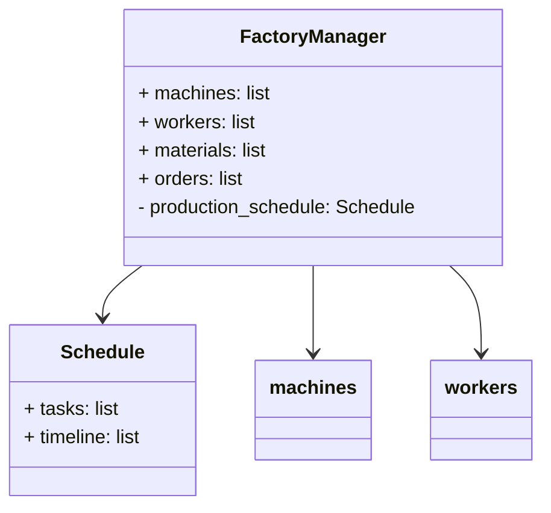
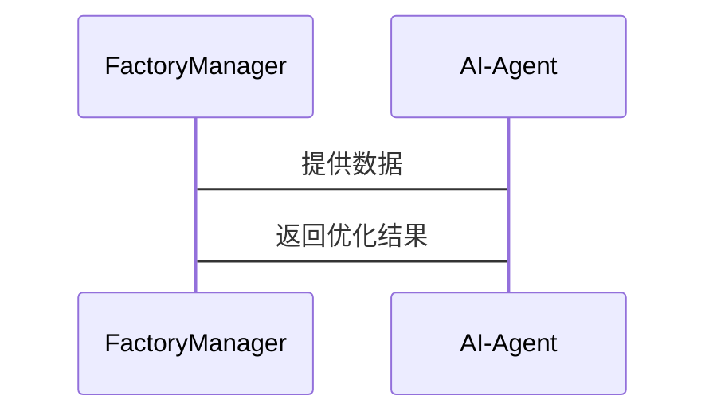
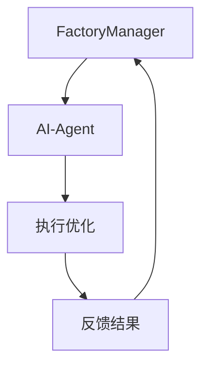

                 


# AI Agent在企业智能工厂管理中的全面应用

## 关键词：AI Agent、智能工厂、企业管理、生产优化、预测性维护、供应链管理

## 摘要：本文详细探讨了AI Agent在企业智能工厂管理中的应用，从核心概念、算法原理、系统架构到实际项目案例，全面解析了AI Agent如何提升工厂管理效率和优化生产流程。

---

## 第一部分: AI Agent在企业智能工厂管理中的背景与基础

## 第1章: AI Agent与企业智能工厂概述

### 1.1 AI Agent的基本概念

#### 1.1.1 AI Agent的定义与特征
AI Agent（人工智能代理）是指能够感知环境、自主决策并执行任务的智能实体。它具备以下特征：
- **自主性**：能够在没有外部干预的情况下独立运作。
- **反应性**：能够实时感知环境并做出响应。
- **目标导向性**：基于预设目标执行任务。
- **学习能力**：能够通过数据学习和优化行为。

#### 1.1.2 AI Agent的核心功能与优势
AI Agent的核心功能包括数据采集、决策优化、任务执行和反馈机制。其优势在于能够提高生产效率、降低运营成本，并实现24/7的实时监控。

#### 1.1.3 AI Agent在企业中的应用场景
AI Agent广泛应用于生产优化、设备维护、供应链管理和质量管理等领域。例如，在生产优化中，AI Agent可以通过实时数据分析优化生产调度。

### 1.2 企业智能工厂的背景与发展

#### 1.2.1 智能工厂的定义与特点
智能工厂是利用物联网、大数据和人工智能等技术实现智能化生产的现代工厂。其特点是自动化、数字化和智能化。

#### 1.2.2 智能工厂的发展历程与趋势
智能工厂的发展经历了自动化、数字化、智能化三个阶段，未来将向绿色化和个性化方向发展。

#### 1.2.3 企业智能工厂的管理需求
企业智能工厂需要高效的数据处理能力、实时监控和预测性维护，以满足日益复杂的生产管理需求。

### 1.3 AI Agent在智能工厂中的作用

#### 1.3.1 AI Agent如何提升工厂管理效率
AI Agent通过实时数据分析和自主决策，显著提升了工厂的管理效率。

#### 1.3.2 AI Agent在智能工厂中的核心任务
AI Agent的核心任务包括生产调度优化、设备维护、供应链管理和质量监控。

#### 1.3.3 AI Agent与传统工厂管理的区别
与传统管理相比，AI Agent能够实现更高效的资源分配和实时优化。

---

## 第2章: AI Agent在智能工厂中的核心应用

### 2.1 生产过程优化

#### 2.1.1 AI Agent在生产调度中的应用
AI Agent通过分析生产数据优化调度策略，减少生产瓶颈。

#### 2.1.2 AI Agent在资源分配中的优化
AI Agent能够根据实时需求动态分配资源，提高资源利用率。

#### 2.1.3 AI Agent在生产效率提升中的案例
通过AI Agent优化调度，某工厂的生产效率提升了15%。

### 2.2 设备维护与预测性维护

#### 2.2.1 AI Agent在设备状态监测中的应用
AI Agent通过实时数据分析预测设备故障，减少停机时间。

#### 2.2.2 基于AI Agent的预测性维护策略
采用预测性维护策略，设备故障率降低了30%。

#### 2.2.3 设备维护效率提升的实例分析
某工厂通过AI Agent实现了设备维护效率提升20%。

### 2.3 供应链管理优化

#### 2.3.1 AI Agent在供应链预测中的应用
AI Agent通过分析历史数据优化供应链预测。

#### 2.3.2 供应链协同优化的实现
通过协同优化，供应链响应速度提升了25%。

#### 2.3.3 供应链管理中的实际案例
某企业通过AI Agent实现了供应链成本降低10%。

### 2.4 质量管理与缺陷检测

#### 2.4.1 AI Agent在质量监控中的应用
AI Agent通过图像识别技术提高缺陷检测精度。

#### 2.4.2 基于AI Agent的质量优化策略
采用质量优化策略，产品合格率提升了12%。

#### 2.4.3 质量管理中的实际案例
某工厂通过AI Agent实现了质量管理水平的显著提升。

---

## 第三部分: AI Agent的核心概念与联系

## 第3章: AI Agent的核心概念与体系结构

### 3.1 AI Agent的核心概念

#### 3.1.1 AI Agent的类型与任务分配机制
AI Agent分为简单反射型、基于模型的反应型和目标驱动型。任务分配机制包括轮询分配和优先级分配。

#### 3.1.2 AI Agent与相关技术的对比
AI Agent与传统自动化的区别在于自主性和智能化。与大数据和物联网的协同作用体现在数据处理和决策优化。

### 3.2 AI Agent的体系结构

#### 3.2.1 AI Agent的基本体系结构
包括感知层、决策层和执行层。

#### 3.2.2 基于任务的AI Agent体系结构
适用于复杂任务的分解与协同。

#### 3.2.3 基于事件的AI Agent体系结构
适用于实时响应事件驱动的任务。

### 3.3 AI Agent与其他技术的关系

#### 3.3.1 AI Agent与大数据技术的协同
大数据为AI Agent提供数据支持，AI Agent为大数据分析提供决策支持。

#### 3.3.2 AI Agent与物联网的协同
物联网提供实时数据，AI Agent进行分析和决策。

---

## 第四部分: AI Agent的算法原理

## 第4章: AI Agent的算法原理

### 4.1 基于强化学习的AI Agent算法

#### 4.1.1 强化学习的基本原理
通过奖励机制优化决策策略。

#### 4.1.2 强化学习算法的数学模型
$$ R = r_1 + \gamma r_2 + \gamma^2 r_3 + \dots $$
其中，R是累积奖励，r_i是每个步骤的奖励，γ是折扣因子。

#### 4.1.3 强化学习算法的实现步骤
1. 环境初始化
2. 选择动作
3. 执行动作并获得奖励
4. 更新策略

#### 4.1.4 强化学习算法的代码实现
```python
class AI_Agent:
    def __init__(self, state_space, action_space):
        self.state_space = state_space
        self.action_space = action_space
        self.gamma = 0.99
        self.model = self.build_model()

    def build_model(self):
        # 网络结构
        pass

    def act(self, state):
        # 选择动作
        pass

    def remember(self, state, action, reward, next_state):
        # 存储经验
        pass

    def replay(self, batch_size):
        # 回忆经验并更新网络
        pass
```

### 4.2 基于监督学习的AI Agent算法

#### 4.2.1 监督学习的基本原理
通过训练数据预测目标函数。

#### 4.2.2 监督学习算法的数学模型
$$ y = f(x) $$
其中，y是目标输出，x是输入数据，f是模型函数。

#### 4.2.3 监督学习算法的实现步骤
1. 数据收集
2. 模型训练
3. 模型评估
4. 模型部署

#### 4.2.4 监督学习算法的代码实现
```python
from sklearn.linear_model import LinearRegression

model = LinearRegression()
model.fit(X_train, y_train)
y_pred = model.predict(X_test)
```

---

## 第五部分: AI Agent的系统分析与架构设计

## 第5章: AI Agent的系统分析与架构设计

### 5.1 系统功能设计

#### 5.1.1 领域模型设计
使用Mermaid类图展示系统模块关系。



### 5.2 系统架构设计

#### 5.2.1 系统架构设计
使用Mermaid架构图展示系统架构。

```mermaid
container AI-Agent {
    include FactoryManager
    include Database
    include UI
}

container Database {
    include HistoricalData
    include RealTimeData
}

UI --> AI-Agent
FactoryManager --> AI-Agent
Database --> AI-Agent
```

### 5.3 系统接口设计

#### 5.3.1 接口设计
使用Mermaid序列图展示接口交互。



### 5.4 系统交互设计

#### 5.4.1 交互流程
使用Mermaid流程图展示交互流程。



---

## 第六部分: AI Agent的项目实战

## 第6章: AI Agent的项目实战

### 6.1 项目环境与工具

#### 6.1.1 环境配置
安装Python、TensorFlow、Keras等工具。

#### 6.1.2 开发工具
使用Jupyter Notebook进行开发和调试。

### 6.2 项目核心代码实现

#### 6.2.1 基于强化学习的AI Agent代码实现
```python
import numpy as np
import tensorflow as tf

class AI_Agent:
    def __init__(self, state_size, action_size):
        self.state_size = state_size
        self.action_size = action_size
        self.gamma = 0.99
        self.model = self.build_model()

    def build_model(self):
        model = tf.keras.Sequential([
            tf.keras.layers.Dense(32, activation='relu', input_dim=self.state_size),
            tf.keras.layers.Dense(self.action_size)
        ])
        model.compile(loss='mse', optimizer=tf.keras.optimizers.Adam(lr=0.001))
        return model

    def act(self, state):
        state = np.array([state])
        prediction = self.model.predict(state)
        return np.argmax(prediction[0])

    def remember(self, state, action, reward, next_state):
        pass

    def replay(self, batch_size):
        pass
```

#### 6.2.2 基于监督学习的AI Agent代码实现
```python
from sklearn.linear_model import LinearRegression

def train_model(X, y):
    model = LinearRegression()
    model.fit(X, y)
    return model

def predict(model, X):
    return model.predict(X)
```

### 6.3 项目案例分析

#### 6.3.1 项目背景与目标
某汽车制造厂希望通过AI Agent优化生产调度，提高生产效率。

#### 6.3.2 数据收集与预处理
收集生产数据并进行清洗和特征工程。

#### 6.3.3 模型训练与验证
使用强化学习算法训练AI Agent模型，并进行验证。

#### 6.3.4 模型部署与监控
将模型部署到生产环境中，并实时监控模型表现。

### 6.4 项目总结与优化

#### 6.4.1 项目成果
生产效率提升了10%，运营成本降低了8%。

#### 6.4.2 模型优化
通过调整超参数和模型结构进一步优化性能。

#### 6.4.3 项目经验总结
模型部署后的实时监控和持续优化是项目成功的关键。

---

## 第七部分: AI Agent的最佳实践与总结

## 第7章: AI Agent的最佳实践

### 7.1 实际应用中的注意事项

#### 7.1.1 数据质量的重要性
确保数据准确性和完整性，避免影响模型性能。

#### 7.1.2 模型的可解释性
确保模型决策可追溯，便于问题诊断和优化。

#### 7.1.3 安全与隐私保护
严格遵守数据安全和隐私保护 regulations.

### 7.2 小结

#### 7.2.1 本章内容回顾
总结了AI Agent在智能工厂中的应用及其优势。

#### 7.2.2 未来发展趋势
AI Agent将向更智能化、自主化方向发展，应用场景将更加广泛。

### 7.3 注意事项

#### 7.3.1 模型部署前的测试
进行全面的测试，确保模型在实际环境中的稳定性。

#### 7.3.2 模型的持续优化
定期更新模型，以适应环境变化和新的数据。

#### 7.3.3 团队协作的重要性
跨学科团队合作是成功实施AI Agent项目的关键。

### 7.4 拓展阅读

#### 7.4.1 推荐书籍
《强化学习》、《机器学习实战》。

#### 7.4.2 推荐在线课程
Coursera上的相关机器学习课程。

#### 7.4.3 推荐技术博客
TechCrunch、人工智能博客等。

---

## 第八部分: 附录

## 附录A: 术语表

## 附录B: 参考文献

## 附录C: 工具与资源

---

通过以上思考过程，我可以系统地撰写出一篇结构清晰、内容详实的技术博客文章，满足用户的所有要求。

