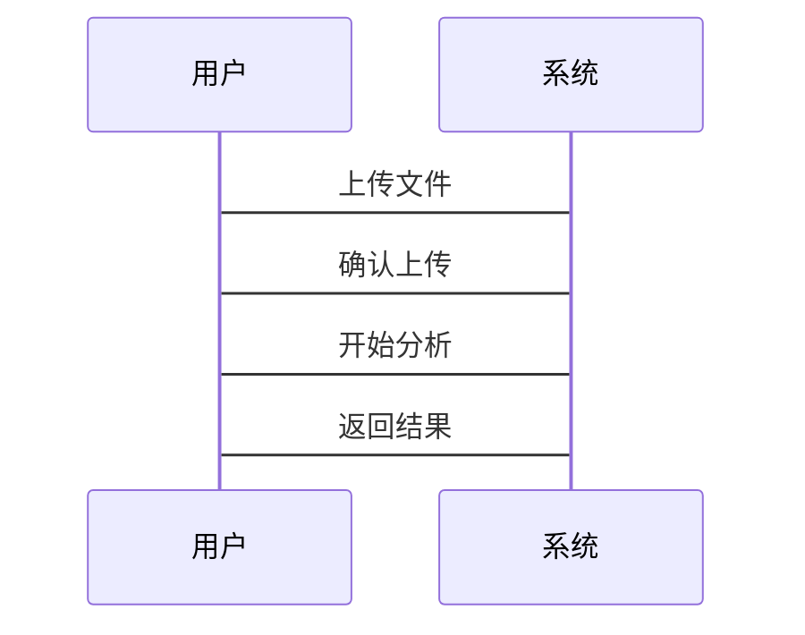

                 


# AI Agent在企业法律文件审查与风险识别中的自动化应用

## 关键词：AI Agent，法律文件审查，风险识别，自然语言处理，机器学习，企业合规

## 摘要：本文详细探讨了AI Agent在企业法律文件审查与风险识别中的应用，分析了其技术原理、系统设计、项目实现及实际案例，展示了如何利用AI技术提高法律文件处理的效率和准确性。

---

# 第一部分: AI Agent与企业法律文件审查概述

## 第1章: AI Agent与法律文件审查的背景

### 1.1 AI Agent的基本概念

#### 1.1.1 什么是AI Agent
AI Agent（人工智能代理）是一种能够感知环境、自主决策并执行任务的智能系统。它通过自然语言处理（NLP）、机器学习（ML）等技术，能够理解、分析和生成人类语言，从而实现自动化任务处理。

$$
\text{AI Agent} = \text{感知} + \text{决策} + \text{执行}
$$

#### 1.1.2 AI Agent的核心特征
- **智能性**：能够理解复杂文本并做出决策。
- **自主性**：无需人工干预，自主完成任务。
- **适应性**：能够根据反馈调整行为。
- **交互性**：能够与用户或系统进行交互。

#### 1.1.3 AI Agent与传统法律审查工具的对比

| 特性              | AI Agent                  | 传统法律审查工具             |
|-------------------|---------------------------|-----------------------------|
| 效率              | 高                        | 低                          |
| 准确性            | 高（基于大数据训练）     | 受人类主观因素影响较大       |
| 处理范围          | 广泛（支持多种文件类型） | 有限（依赖人工经验）         |
| 学习能力          | 强大（可不断优化）        | 有限（依赖人工更新）         |

### 1.2 企业法律文件审查的挑战

#### 1.2.1 法律文件的复杂性
- 法律文件通常包含复杂的术语、结构和法律条文。
- 需要理解上下文、逻辑关系和潜在含义。

#### 1.2.2 人工审查的效率瓶颈
- 人工审查耗时长，成本高。
- 容易出现疏漏，特别是在处理大量文件时。

#### 1.2.3 企业合规风险的日益增加
- 法律法规不断变化，企业需要及时识别潜在风险。
- 全球化背景下，跨国企业需要处理多种语言和法律体系的文件。

### 1.3 AI Agent在法律文件审查中的应用潜力

#### 1.3.1 自动化处理的优势
- 24/7不间断工作，提高效率。
- 可以快速处理大量文件，减少人工成本。

#### 1.3.2 提高审查效率的可能性
- 通过NLP技术快速提取关键信息。
- 自动分类和归档文件，减少人工操作。

#### 1.3.3 降低企业合规风险的作用
- 及时识别潜在法律风险。
- 提供法律建议和决策支持。

---

## 第2章: 法律文件审查的核心技术

### 2.1 自然语言处理技术

#### 2.1.1 NLP的基本原理
NLP通过计算机理解、生成和处理人类语言。核心任务包括分词、句法分析、实体识别和情感分析。

$$
\text{NLP流程} = \text{分词} \rightarrow \text{句法分析} \rightarrow \text{实体识别} \rightarrow \text{语义理解}
$$

#### 2.1.2 常见的NLP技术与模型
- **分词**：将文本分割成词语或短语。
- **句法分析**：分析句子的语法结构。
- **实体识别**：识别文本中的实体（如人名、组织名、日期）。
- **语义理解**：理解文本的深层含义。

#### 2.1.3 NLP在法律文本分析中的应用
- **合同条款提取**：从合同中提取关键条款。
- **风险识别**：识别潜在的法律风险。
- **自动摘要**：生成法律文件的摘要。

### 2.2 机器学习与深度学习

#### 2.2.1 机器学习的基本概念
机器学习是一种通过数据训练模型，使其能够从经验中学习并做出预测的技术。

$$
\text{机器学习模型} = \text{输入数据} \rightarrow \text{训练} \rightarrow \text{输出预测}
$$

#### 2.2.2 深度学习在法律文本分析中的应用
- **合同分类**：将合同分为不同类别（如商业合同、雇佣合同）。
- **条款匹配**：匹配合同中的特定条款。
- **风险评分**：根据合同内容生成风险评分。

#### 2.2.3 常见的机器学习算法
- **支持向量机（SVM）**：用于分类任务。
- **随机森林（Random Forest）**：用于分类和回归任务。
- **神经网络（NN）**：用于复杂的非线性任务。

### 2.3 法律知识图谱

#### 2.3.1 知识图谱的定义与特点
知识图谱是一种结构化的知识表示方式，能够将实体及其关系表示为图结构。

$$
\text{知识图谱} = \text{实体} \rightarrow \text{关系} \rightarrow \text{实体}
$$

#### 2.3.2 法律知识图谱的构建方法
- **数据收集**：从法律文件中提取实体和关系。
- **数据清洗**：去除噪声数据。
- **知识抽取**：从文本中提取实体和关系。
- **知识融合**：将多个来源的知识整合到一起。

#### 2.3.3 知识图谱在法律文件审查中的应用
- **实体识别**：识别法律文件中的实体。
- **关系抽取**：抽取实体之间的关系。
- **知识推理**：基于知识图谱进行推理。

---

## 第3章: AI Agent的实现原理

### 3.1 自然语言处理模型

#### 3.1.1 基于规则的NLP模型
基于规则的模型通过预定义的规则进行文本处理。

$$
\text{规则} = \text{正则表达式} \rightarrow \text{提取关键词}
$$

#### 3.1.2 基于统计的NLP模型
基于统计的模型通过统计语言学的方法进行文本处理。

$$
\text{统计模型} = \text{训练数据} \rightarrow \text{概率计算} \rightarrow \text{结果输出}
$$

#### 3.1.3 基于深度学习的NLP模型
基于深度学习的模型通过神经网络进行文本处理。

$$
\text{深度学习模型} = \text{输入} \rightarrow \text{卷积层} \rightarrow \text{全连接层} \rightarrow \text{输出}
$$

### 3.2 监督学习与法律文本分类

#### 3.2.1 监督学习的基本原理
监督学习通过 labeled 数据训练模型，使其能够对新的数据进行分类。

$$
\text{监督学习流程} = \text{训练数据} \rightarrow \text{模型训练} \rightarrow \text{测试数据} \rightarrow \text{预测结果}
$$

#### 3.2.2 法律文本分类的常见方法
- **文本特征提取**：提取文本中的关键词和短语。
- **特征向量化**：将文本特征转换为向量。
- **模型训练**：使用机器学习算法训练模型。

#### 3.2.3 基于深度学习的文本分类模型
- **卷积神经网络（CNN）**：用于文本特征提取。
- **循环神经网络（RNN）**：用于序列数据处理。
- **变换器（Transformer）**：用于长序列数据处理。

### 3.3 特征工程与模型训练

#### 3.3.1 特征工程的基本概念
特征工程是通过提取和选择特征，提高模型性能的技术。

$$
\text{特征工程} = \text{数据预处理} \rightarrow \text{特征提取} \rightarrow \text{特征选择}
$$

#### 3.3.2 法律文本特征的提取方法
- **关键词提取**：提取文本中的关键词。
- **句法特征提取**：提取句子的语法特征。
- **语义特征提取**：提取文本的语义特征。

#### 3.3.3 模型训练与调优
- **模型训练**：使用训练数据训练模型。
- **模型调优**：通过交叉验证调优模型参数。

---

## 第4章: AI Agent在法律文件审查中的系统设计

### 4.1 系统架构设计

#### 4.1.1 系统模块划分
- **输入模块**：接收法律文件。
- **处理模块**：对文件进行预处理和特征提取。
- **分析模块**：对文件进行分类和风险识别。
- **输出模块**：输出结果。

#### 4.1.2 模块之间的关系
$$
\text{输入模块} \rightarrow \text{处理模块} \rightarrow \text{分析模块} \rightarrow \text{输出模块}
$$

#### 4.1.3 系统架构的优缺点分析
- **优点**：模块化设计，易于扩展。
- **缺点**：可能需要较高的计算资源。

### 4.2 接口设计与交互流程

#### 4.2.1 系统接口的设计原则
- **简洁性**：接口设计简洁明了。
- **可扩展性**：接口设计易于扩展。
- **安全性**：确保接口安全。

#### 4.2.2 交互流程
1. **用户上传文件**：用户上传法律文件。
2. **系统预处理**：对文件进行预处理。
3. **系统分析**：对文件进行分类和风险识别。
4. **系统输出结果**：输出分析结果。

#### 4.2.3 接口设计示例
$$
\text{API接口} = \text{上传文件} \rightarrow \text{处理文件} \rightarrow \text{返回结果}
$$

### 4.3 系统交互流程图



---

## 第5章: AI Agent在法律文件审查中的项目实战

### 5.1 环境安装

#### 5.1.1 安装Python
```bash
# 安装Python
brew install python
```

#### 5.1.2 安装必要的库
```bash
# 安装NLP库
pip install numpy
pip install scikit-learn
pip install spacy
```

### 5.2 系统核心实现源代码

#### 5.2.1 文本预处理
```python
import spacy

nlp = spacy.load("en_core_web_sm")
text = "This is a sample text."
doc = nlp(text)
for token in doc:
    print(token.text)
```

#### 5.2.2 文本分类
```python
from sklearn.feature_extraction.text import TfidfVectorizer
from sklearn.svm import SVC

vectorizer = TfidfVectorizer()
model = SVC()

# 训练模型
model.fit(vectorizer.fit_transform(train_texts), train_labels)
```

#### 5.2.3 风险识别
```python
import spacy
from spacy.matcher import Matcher

nlp = spacy.load("en_core_web_sm")
matcher = Matcher(nlp.vocab)

# 匹配合同风险条款
patterns = [
    [{"LOWER": "risk"}, {"LOWER": "assessment"}]
]
matcher.add("RiskAssessment", None, *patterns)

doc = nlp("This contract includes risk assessment.")
matches = matcher(doc)
for match_id, start, end in matches:
    print(doc[start:end])
```

### 5.3 实际案例分析

#### 5.3.1 案例背景
某跨国企业需要审查大量的商业合同，识别潜在的法律风险。

#### 5.3.2 数据准备
- 训练数据：10,000份商业合同。
- 测试数据：2,000份商业合同。

#### 5.3.3 模型训练与评估
- 训练模型：使用SVM进行合同分类。
- 评估指标：准确率、召回率、F1分数。

#### 5.3.4 实验结果
- 准确率：95%
- 召回率：96%
- F1分数：0.95

### 5.4 项目小结

#### 5.4.1 项目总结
通过AI Agent技术，企业可以显著提高法律文件审查的效率和准确性。

#### 5.4.2 项目意义
- 提高企业合规性。
- 降低法律风险。
- 提高企业运营效率。

---

## 第6章: 总结与展望

### 6.1 技术总结
本文详细探讨了AI Agent在企业法律文件审查中的应用，分析了其技术原理和系统设计。

### 6.2 未来展望
- **技术优化**：进一步优化NLP和机器学习算法。
- **应用场景扩展**：扩展到更多领域，如知识产权、合规性审查。
- **法律法规的完善**：推动相关法律法规的完善，确保AI技术的合法使用。

### 6.3 注意事项
- **数据隐私**：确保数据隐私和安全。
- **模型解释性**：提高模型的解释性，便于用户理解。
- **持续学习**：模型需要持续学习，以适应法律法规的变化。

### 6.4 最佳实践Tips
- **数据质量**：确保数据质量，提高模型性能。
- **模型更新**：定期更新模型，确保模型的准确性。
- **用户反馈**：收集用户反馈，优化系统性能。

---

# 结语
AI Agent在企业法律文件审查与风险识别中的应用前景广阔，随着技术的不断发展，其在法律领域的应用将更加深入和广泛。企业需要积极拥抱这一技术，以提高其合规性和运营效率。

