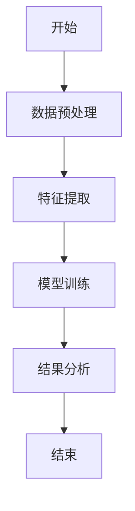
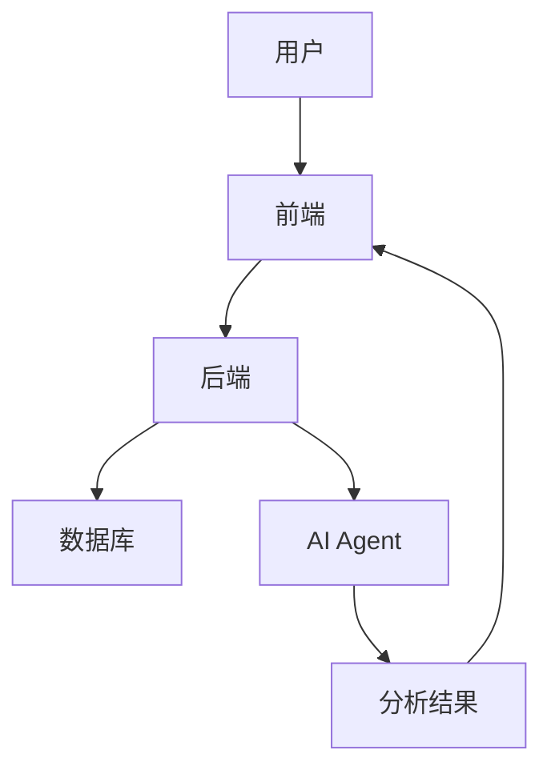
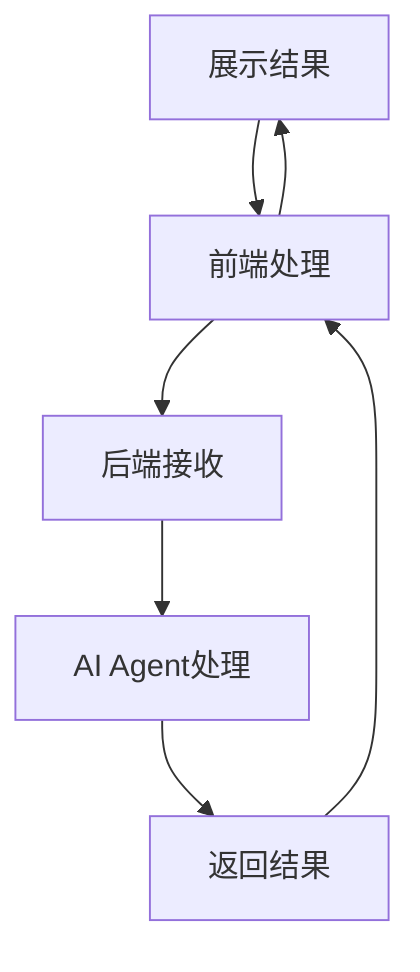

                 


# AI Agent在企业知识产权价值评估与运营策略制定中的应用

> 关键词：AI Agent, 企业知识产权, 价值评估, 运营策略, 人工智能, 数据分析

> 摘要：本文探讨了AI Agent在企业知识产权价值评估与运营策略制定中的应用。通过分析知识产权评估的核心概念、AI Agent的算法原理、系统架构设计以及实际项目案例，本文详细阐述了AI Agent如何提升企业知识产权管理的效率与准确性。文章还提供了最佳实践建议，帮助企业在知识产权管理中更好地应用AI技术。

---

# 第1章: 企业知识产权价值评估的背景与挑战

## 1.1 知识产权的基本概念

### 1.1.1 知识产权的定义与分类

知识产权是指个人或企业在创新活动中产生的智力成果所享有的法律权利，主要包括专利权、商标权、版权、商业秘密等。这些权利可以通过法律手段保护创新者的利益，同时也为企业提供了市场竞争的有力工具。

### 1.1.2 企业知识产权的重要性

企业在市场竞争中，知识产权不仅是核心资产之一，更是企业技术创新和市场竞争力的体现。有效的知识产权管理可以帮助企业避免侵权风险，提升产品附加值，并在技术纠纷中占据优势地位。

### 1.1.3 知识产权价值评估的难点

知识产权的价值评估是一个复杂的过程，涉及技术、法律、经济等多个维度。传统的方法往往依赖于人工分析，存在效率低、主观性强、数据覆盖面窄等问题。如何准确、高效地评估知识产权价值，成为企业面临的重要挑战。

---

## 1.2 AI Agent的基本概念

### 1.2.1 AI Agent的定义与特点

AI Agent（人工智能代理）是指能够感知环境、自主决策并执行任务的智能系统。它可以通过数据输入、模型分析和结果输出，帮助企业在知识产权管理中实现自动化和智能化。

### 1.2.2 AI Agent在企业中的应用场景

AI Agent可以在企业知识产权管理的多个环节中发挥作用，例如专利检索、技术分析、价值评估、风险预警等。通过AI Agent，企业可以更快速、更准确地获取和分析知识产权相关信息。

### 1.2.3 AI Agent与传统数据分析工具的区别

与传统数据分析工具相比，AI Agent具有更强的自主性和学习能力。它不仅可以处理结构化数据，还可以理解非结构化数据（如专利文档、技术报告），并根据实时数据动态调整分析策略。

---

## 1.3 企业知识产权价值评估与AI Agent的结合

### 1.3.1 知识产权价值评估的复杂性

知识产权价值评估需要考虑技术先进性、市场应用前景、法律保护力度等多种因素。传统方法难以全面、客观地反映知识产权的实际价值。

### 1.3.2 AI Agent在知识产权评估中的优势

AI Agent可以通过大数据分析和机器学习模型，快速识别关键技术和评估其市场价值。它还可以根据企业的具体需求，定制化评估模型，提高评估结果的准确性。

### 1.3.3 企业运营策略制定中的AI Agent应用前景

通过AI Agent，企业可以更精准地制定知识产权布局、技术研发和市场拓展策略。AI Agent不仅可以提供数据支持，还可以模拟不同策略的实施效果，为企业决策提供科学依据。

---

# 第2章: 企业知识产权价值评估的核心概念与联系

## 2.1 知识产权评估的核心要素

### 2.1.1 知识产权的法律属性

知识产权的法律属性包括保护范围、有效期、权利归属等。这些属性直接影响知识产权的市场价值和法律风险。

### 2.1.2 知识产权的经济价值

经济价值是知识产权评估的重要指标，包括市场潜力、收益能力、技术成熟度等。经济价值的评估需要结合行业特点和市场环境。

### 2.1.3 知识产权的市场竞争力

市场竞争力反映了知识产权在市场中的优势地位。通过分析竞争对手的技术布局和市场表现，可以评估知识产权的市场竞争力。

---

## 2.2 AI Agent在知识产权评估中的核心原理

### 2.2.1 数据驱动的知识产权分析

AI Agent通过收集和分析大量专利数据、技术文献、市场报告等信息，提取关键特征并构建评估模型。数据驱动的分析方法可以显著提高评估的客观性和全面性。

### 2.2.2 自然语言处理在专利文本分析中的应用

专利文档通常包含大量的技术细节和法律条款。通过自然语言处理技术，AI Agent可以自动提取关键词、识别技术领域和评估技术先进性。

### 2.2.3 机器学习在知识产权价值预测中的作用

机器学习模型可以通过历史数据训练，预测知识产权的市场价值和法律风险。模型的输出结果可以为企业制定运营策略提供数据支持。

---

## 2.3 知识产权评估与AI Agent的关系

### 2.3.1 知识产权评估的流程与AI Agent的结合

知识产权评估通常包括数据收集、特征提取、模型训练、结果分析等步骤。AI Agent可以通过自动化流程提高评估效率，并通过实时更新确保评估结果的准确性。

### 2.3.2 知识产权评估中的数据流与AI Agent的交互

数据流是知识产权评估的核心，AI Agent通过数据输入、处理和输出，实现对知识产权的全面分析。数据流的高效管理是AI Agent发挥功能的关键。

### 2.3.3 知识产权评估的动态性与AI Agent的适应性

知识产权市场和技术创新是动态变化的，AI Agent需要具备快速适应能力，及时更新模型和数据，以应对市场变化和技术进步。

---

# 第3章: AI Agent在企业知识产权价值评估中的算法原理

## 3.1 知识产权价值评估的数学模型

### 3.1.1 知识产权价值的线性回归模型

线性回归模型是一种常用的价值预测方法。通过将知识产权的特征变量（如技术领域、专利数量、法律状态等）与历史价值数据拟合，可以建立线性回归模型预测未来价值。

$$ Value = \beta_0 + \beta_1 \times Feature_1 + \beta_2 \times Feature_2 + \ldots + \beta_n \times Feature_n $$

### 3.1.2 知识产权价值的神经网络模型

神经网络模型（如LSTM、CNN）可以处理复杂的非线性关系，适用于高维数据的特征提取和价值预测。

### 3.1.3 知识产权价值的混合模型

混合模型结合了传统统计方法和机器学习技术，通过集成学习提高预测精度。

---

## 3.2 AI Agent算法的实现原理

### 3.2.1 基于规则的AI Agent设计

基于规则的AI Agent通过预定义的规则和逻辑进行决策，适用于简单的知识产权评估场景。

### 3.2.2 基于机器学习的AI Agent训练

通过监督学习、无监督学习等方法，AI Agent可以从历史数据中学习，提高评估精度。

### 3.2.3 基于深度学习的AI Agent优化

深度学习模型（如BERT、GPT）可以处理复杂的文本数据，进一步优化知识产权评估结果。

---

## 3.3 算法流程图

以下是一个AI Agent在知识产权评估中的算法流程图：



---

# 第4章: 系统架构与项目实战

## 4.1 系统功能设计

### 4.1.1 知识产权数据管理模块

负责数据的采集、存储和管理。

### 4.1.2 数据分析模块

包括特征提取、模型训练和结果输出。

### 4.1.3 用户交互模块

提供友好的用户界面，方便用户操作和结果查看。

---

## 4.2 系统架构设计

### 4.2.1 系统架构图



---

## 4.3 系统接口设计

### 4.3.1 数据接口

定义数据输入和输出的格式，确保系统与外部数据源的兼容性。

### 4.3.2 用户接口

设计友好的用户界面，方便用户输入需求和查看结果。

---

## 4.4 系统交互流程图



---

## 4.5 项目实战

### 4.5.1 环境安装

需要安装Python、TensorFlow、Keras等工具。

### 4.5.2 核心代码实现

以下是一个AI Agent的实现示例：

```python
class AIAgent:
    def __init__(self, data):
        self.data = data

    def analyze(self):
        # 数据分析逻辑
        pass

    def predict(self):
        # 预测逻辑
        pass
```

### 4.5.3 案例分析

以某企业的专利评估为例，展示AI Agent如何实现数据处理、模型训练和结果输出。

### 4.5.4 项目小结

总结项目实施的经验和教训，提出改进建议。

---

# 第5章: 总结与展望

## 5.1 最佳实践 tips

- 数据质量是AI Agent性能的关键，确保数据的准确性和完整性。
- 定期更新模型和数据，保持系统的适应性。
- 结合企业实际情况，灵活调整AI Agent的应用场景。

## 5.2 小结

本文详细探讨了AI Agent在企业知识产权价值评估中的应用，通过理论分析和实际案例，展示了AI Agent如何提升知识产权管理的效率和准确性。

## 5.3 注意事项

- 数据隐私和安全问题需要高度重视。
- 确保模型的可解释性，避免“黑箱”问题。
- 组建跨学科团队，确保技术与业务的深度结合。

## 5.4 拓展阅读

推荐阅读相关领域的书籍和论文，进一步了解AI Agent和知识产权管理的最新动态。

---

# 结语

AI Agent的应用为企业知识产权管理带来了新的机遇和挑战。通过不断的技术创新和实践积累，AI Agent将在企业知识产权价值评估与运营策略制定中发挥越来越重要的作用。

