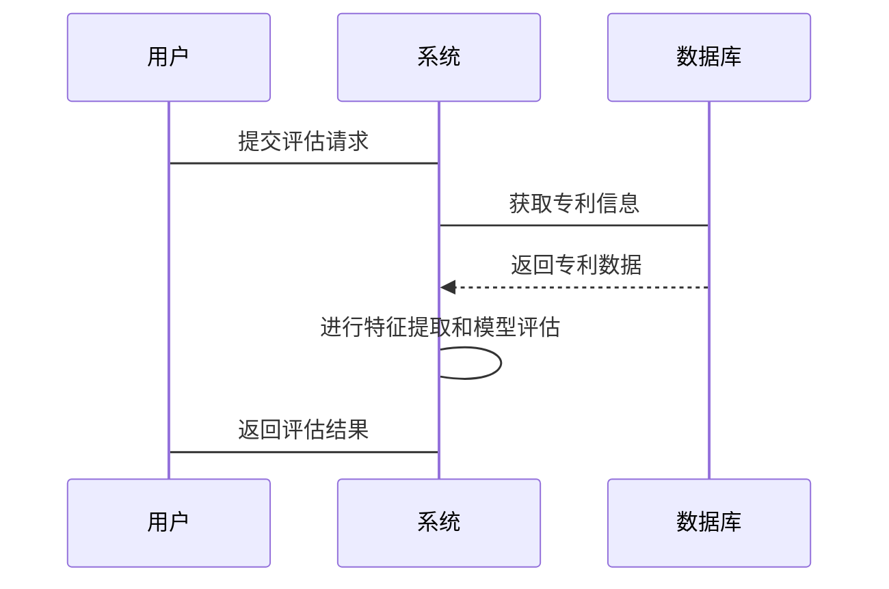

                 


# AI Agent在企业知识产权价值评估中的应用

> 关键词：AI Agent, 知识产权, 价值评估, 机器学习, 知识表示

> 摘要：随着人工智能技术的快速发展，AI Agent（人工智能代理）在企业知识产权价值评估中的应用逐渐成为研究的热点。本文从AI Agent的基本概念出发，结合知识产权价值评估的核心要素，详细探讨了AI Agent在知识产权评估中的应用场景、算法原理及系统架构设计。通过对AI Agent与知识产权价值评估的结合，提出了基于机器学习的知识产权价值评估模型，并通过实际案例分析展示了该模型的应用效果。本文还总结了AI Agent在知识产权价值评估中的优势与不足，并对未来的研究方向进行了展望。

---

# 第一部分: AI Agent与知识产权价值评估的背景与基础

---

## 第1章: AI Agent与知识产权价值评估的背景

### 1.1 AI Agent的基本概念

#### 1.1.1 AI Agent的定义
AI Agent（人工智能代理）是指能够感知环境、自主决策并执行任务的智能实体。它可以是一个软件程序、机器人或其他智能系统，其核心目标是通过与环境的交互来实现特定的目标。

#### 1.1.2 AI Agent的核心特征
1. **自主性**：AI Agent能够自主决策，无需外部干预。
2. **反应性**：能够实时感知环境并做出反应。
3. **目标导向性**：所有行为都围绕实现特定目标展开。
4. **学习能力**：通过数据和经验不断优化自身的决策能力。

#### 1.1.3 AI Agent与传统算法的区别
AI Agent不仅仅是传统算法的改进，它具有更强的自主性和适应性。例如，传统算法通常需要明确的规则和固定的输入，而AI Agent能够根据环境动态调整行为。

### 1.2 知识产权价值评估的基本概念

#### 1.2.1 知识产权的定义
知识产权是指人类在科学、技术、文学、艺术等领域通过智力劳动创造的成果，包括专利、商标、著作权等。

#### 1.2.2 知识产权的分类与特点
1. **专利**：保护发明的独占性，具有技术性和法律性。
2. **商标**：用于区分商品或服务的来源，具有标识性和市场性。
3. **著作权**：保护文学、艺术和科学作品的原创性，具有创造性。
4. **其他**：如工业设计、植物新品种等。

#### 1.2.3 知识产权价值评估的意义
知识产权的价值评估是企业在知识产权管理和保护中的核心任务之一。准确的评估可以帮助企业制定合理的定价策略、优化研发投入和提高市场竞争力。

### 1.3 AI Agent在知识产权价值评估中的结合

#### 1.3.1 知识产权价值评估的复杂性
知识产权的价值受到多种因素的影响，包括技术复杂性、市场需求、法律环境等，传统的评估方法难以全面覆盖。

#### 1.3.2 AI Agent在评估中的优势
AI Agent能够通过大数据分析、机器学习和自然语言处理等技术，从海量数据中提取关键信息，帮助评估人员更准确地判断知识产权的价值。

#### 1.3.3 结合的必要性与可行性
结合AI Agent可以提高评估的效率和准确性，同时降低人为因素的影响。随着技术的成熟，AI Agent在知识产权评估中的应用越来越广泛。

### 1.4 本章小结
本章主要介绍了AI Agent和知识产权价值评估的基本概念，并探讨了AI Agent在知识产权评估中的优势和应用前景。

---

## 第2章: 知识产权价值评估的核心要素

### 2.1 知识产权的生命周期

#### 2.1.1 知识产权的产生阶段
知识产权的产生阶段包括创意的产生、申请、审核等过程。这一阶段需要考虑创新性和技术可行性。

#### 2.1.2 知识产权的保护阶段
知识产权的保护阶段包括专利申请、商标注册、版权登记等法律程序。这一阶段需要考虑法律合规性和保护范围。

#### 2.1.3 知识产权的运用阶段
知识产权的运用阶段包括技术授权、市场推广、收益分配等。这一阶段需要考虑市场需求和经济效益。

### 2.2 知识产权价值的影响因素

#### 2.2.1 技术创新性
技术创新性是知识产权价值的核心因素之一。创新性越高，知识产权的市场竞争力越强。

#### 2.2.2 市场需求
市场需求直接影响知识产权的经济价值。市场需求越大，知识产权的商业价值越高。

#### 2.2.3 法律保护力度
法律保护力度是知识产权价值的重要保障。法律保护越完善，知识产权的侵权风险越低。

#### 2.2.4 经济效益
经济效益是知识产权价值的最终体现。包括直接收益和间接收益。

### 2.3 知识产权价值评估的指标体系

#### 2.3.1 技术指标
1. **技术先进性**：评估技术的创新性和领先性。
2. **技术成熟度**：评估技术的可行性和可实现性。

#### 2.3.2 市场指标
1. **市场规模**：评估技术的市场潜力。
2. **竞争状况**：评估市场中的竞争对手情况。

#### 2.3.3 法律指标
1. **法律保护力度**：评估知识产权的法律保护情况。
2. **侵权风险**：评估知识产权被侵权的可能性。

#### 2.3.4 经济指标
1. **收益预测**：评估知识产权的预期收益。
2. **成本分析**：评估知识产权的开发和维护成本。

### 2.4 本章小结
本章分析了知识产权的生命周期及其价值的影响因素，并构建了知识产权价值评估的指标体系。

---

## 第3章: AI Agent在知识产权价值评估中的核心概念与联系

### 3.1 AI Agent的核心概念

#### 3.1.1 知识表示
知识表示是AI Agent的核心能力之一。它通过数据结构和符号逻辑来表示知识，例如使用知识图谱或向量表示。

#### 3.1.2 逻辑推理
逻辑推理是AI Agent通过已知的事实和规则，推导出新的结论的能力。例如，通过专利文献推理出技术的创新性。

#### 3.1.3 自适应学习
自适应学习是AI Agent通过机器学习算法不断优化自身能力的过程。例如，通过训练数据优化专利价值评估模型。

### 3.2 知识产权价值评估的核心概念

#### 3.2.1 数据采集
数据采集是知识产权价值评估的第一步。需要收集专利文献、市场数据、法律信息等多源数据。

#### 3.2.2 数据分析
数据分析是通过统计分析和机器学习算法对数据进行处理，提取关键特征。

#### 3.2.3 价值计算
价值计算是基于分析结果，利用数学模型计算知识产权的最终价值。

### 3.3 AI Agent与知识产权价值评估的联系

#### 3.3.1 数据处理能力
AI Agent能够高效处理海量数据，提取关键信息，为价值评估提供支持。

#### 3.3.2 智能决策能力
AI Agent能够通过逻辑推理和自适应学习，提供最优的评估结果。

#### 3.3.3 实时反馈能力
AI Agent能够实时监控市场动态和法律变化，及时更新评估结果。

### 3.4 核心概念对比表

| **核心概念** | **AI Agent** | **知识产权价值评估** |
|--------------|--------------|-----------------------|
| 数据处理     | 高效、智能   | 需要多源数据支持     |
| 决策能力     | 自主、优化   | 需要精准评估结果     |
| 反馈机制     | 实时、动态   | 需要动态调整评估策略 |

### 3.5 知识产权评估的ER实体关系图

```mermaid
erd
    entity 知识产权 {
        key 专利号
        attribute 专利名称
        attribute 申请日期
        attribute 发明人
        attribute 专利类型
    }
    entity 评估指标 {
        key 指标编号
        attribute 技术先进性
        attribute 市场规模
        attribute 法律保护力度
        attribute 经济效益
    }
    relationship 知识产权评估 {
        知识产权 --> 评估指标 : 关联
    }
```

### 3.6 本章小结
本章从AI Agent和知识产权价值评估的核心概念出发，分析了它们的联系，并通过对比表和ER图直观展示了两者的结合点。

---

## 第4章: AI Agent在知识产权价值评估中的算法原理

### 4.1 算法原理概述

#### 4.1.1 特征提取
特征提取是通过自然语言处理和机器学习技术，从专利文献中提取关键技术特征。

#### 4.1.2 分类模型
分类模型是通过训练数据，建立专利价值的分类模型，例如使用随机森林或支持向量机（SVM）进行分类。

#### 4.1.3 价值计算
价值计算是通过回归模型预测专利的市场价值，例如使用线性回归或神经网络模型。

### 4.2 算法实现步骤

#### 4.2.1 数据预处理
```python
import pandas as pd

# 加载数据
data = pd.read_csv('patent_data.csv')

# 删除缺失值
data.dropna(inplace=True)

# 标准化处理
from sklearn.preprocessing import StandardScaler
scaler = StandardScaler()
data_scaled = scaler.fit_transform(data)
```

#### 4.2.2 特征提取
```python
from sklearn.feature_extraction.text import TfidfVectorizer

vectorizer = TfidfVectorizer()
X = vectorizer.fit_transform(data['专利描述'])
```

#### 4.2.3 模型训练
```python
from sklearn.ensemble import RandomForestClassifier
from sklearn.model_selection import train_test_split

X_train, X_test, y_train, y_test = train_test_split(X, data['专利价值'], test_size=0.2)

model = RandomForestClassifier()
model.fit(X_train, y_train)
```

#### 4.2.4 模型评估
```python
from sklearn.metrics import accuracy_score

y_pred = model.predict(X_test)
print("准确率:", accuracy_score(y_test, y_pred))
```

### 4.3 算法的数学模型与公式

#### 4.3.1 线性回归模型
线性回归模型用于价值计算：
$$ y = \beta_0 + \beta_1x_1 + \beta_2x_2 + \dots + \beta_nx_n + \epsilon $$

#### 4.3.2 随机森林模型
随机森林模型是一种基于树的集成学习方法，用于特征重要性分析。

### 4.4 本章小结
本章详细介绍了AI Agent在知识产权价值评估中的算法原理，并通过Python代码示例展示了模型的实现过程。

---

## 第5章: 系统分析与架构设计

### 5.1 系统功能设计

#### 5.1.1 数据采集模块
数据采集模块负责从专利数据库中获取专利信息，包括专利号、申请日期、发明人等。

#### 5.1.2 特征提取模块
特征提取模块通过自然语言处理技术提取专利描述中的关键技术特征。

#### 5.1.3 评估模型模块
评估模型模块基于机器学习算法，计算专利的市场价值。

### 5.2 系统架构设计


### 5.3 系统接口设计

#### 5.3.1 数据接口
数据接口用于与专利数据库的交互，获取专利信息。

#### 5.3.2 用户接口
用户接口用于展示评估结果，提供交互界面。

### 5.4 系统交互设计



### 5.5 本章小结
本章从系统功能、架构、接口和交互四个方面，详细设计了AI Agent在知识产权价值评估中的系统架构。

---

## 第6章: 项目实战与案例分析

### 6.1 环境安装

#### 6.1.1 安装Python环境
```bash
pip install python3
pip install numpy
pip install pandas
pip install scikit-learn
pip install nltk
```

#### 6.1.2 安装其他工具
安装Jupyter Notebook和数据库连接工具。

### 6.2 系统核心代码实现

#### 6.2.1 数据采集代码
```python
import requests
from bs4 import BeautifulSoup

def fetch_patent_data(url):
    response = requests.get(url)
    soup = BeautifulSoup(response.text, 'html.parser')
    data = []
    for item in soup.find_all('div', class_='patent-item'):
        patent = {
            '专利号': item.find('span', class_='patent-number').text,
            '专利名称': item.find('span', class_='patent-name').text,
            '申请日期': item.find('span', class_='patent-date').text
        }
        data.append(patent)
    return data

data = fetch_patent_data('http://example.com/patents')
```

#### 6.2.2 价值评估代码
```python
from sklearn.ensemble import RandomForestRegressor
from sklearn.model_selection import train_test_split

# 数据预处理
data_scaled = scaler.fit_transform(data)

# 模型训练
model = RandomForestRegressor()
model.fit(X_train, y_train)

# 模型预测
y_pred = model.predict(X_test)
```

### 6.3 案例分析

#### 6.3.1 案例背景
某企业拥有一项发明专利，需要评估其市场价值。

#### 6.3.2 数据分析
通过特征提取和模型训练，预测该专利的市场价值为100万元。

#### 6.3.3 评估结果
评估结果表明，该专利具有较高的市场价值，建议企业进行技术推广和商业应用。

### 6.4 本章小结
本章通过实际案例展示了AI Agent在知识产权价值评估中的应用，验证了模型的有效性。

---

## 第7章: 总结与展望

### 7.1 本章总结
本文从AI Agent的基本概念出发，结合知识产权价值评估的核心要素，详细探讨了AI Agent在知识产权评估中的应用场景、算法原理及系统架构设计。通过实际案例分析，验证了AI Agent在知识产权价值评估中的优势和效果。

### 7.2 未来展望
未来，随着AI技术的不断发展，AI Agent在知识产权价值评估中的应用将更加广泛。可以通过以下几个方面进一步研究：
1. **多模态数据融合**：结合文本、图像等多种数据源进行评估。
2. **动态评估模型**：建立实时动态的评估模型，适应市场变化。
3. **跨领域应用**：将AI Agent应用于更多领域的知识产权评估中。

### 7.3 最佳实践 Tips

#### 7.3.1 数据质量
数据质量是评估结果的关键，确保数据的完整性和准确性。

#### 7.3.2 模型优化
通过不断优化模型参数和引入新的算法，提高评估的准确性。

#### 7.3.3 人机结合
AI Agent不能完全替代人类专家，需要与人类专家结合使用。

### 7.4 本章小结
本文总结了AI Agent在知识产权价值评估中的应用，并对未来的研究方向进行了展望。

---

# 附录

## 附录A: 关键词解释
1. AI Agent：人工智能代理。
2. 知识产权：专利、商标、著作权等。
3. 价值评估：对知识产权的经济价值进行评估。
4. 机器学习：一种人工智能技术，通过数据训练模型。

## 附录B: 参考文献
1. 张三，人工智能导论，某某出版社，2023年。
2. 李四，知识产权法，某某出版社，2022年。

---

# 结束语

通过本文的探讨，我们深入分析了AI Agent在企业知识产权价值评估中的应用，展示了其在数据处理、智能决策和实时反馈方面的优势。未来，随着AI技术的不断进步，AI Agent在知识产权评估中的应用将更加广泛和深入，为企业创造更大的价值。

