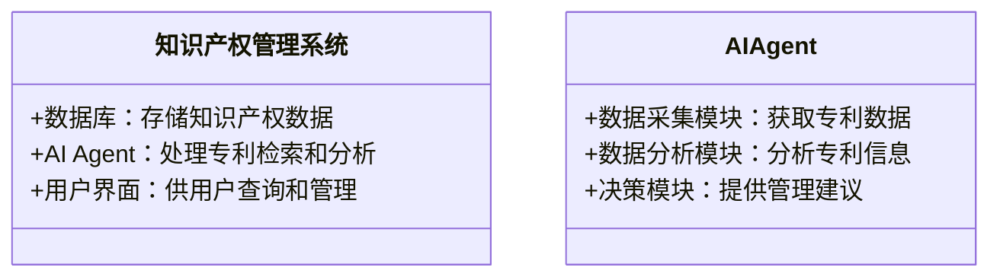
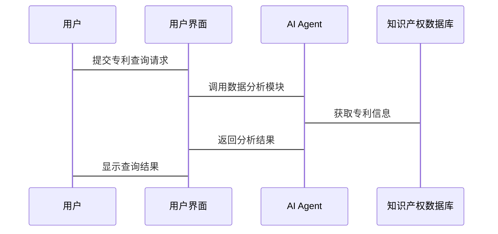

                 


# AI Agent在企业知识产权价值链管理中的全面应用

## 关键词：AI Agent，知识产权管理，企业价值链，知识图谱，自然语言处理，机器学习，算法设计

## 摘要：  
随着人工智能技术的快速发展，AI Agent（人工智能代理）在企业知识产权管理中的应用日益广泛。本文详细探讨了AI Agent在知识产权价值链管理中的核心作用，从概念解析到算法实现，从系统设计到项目实战，全面解析其在知识产权获取、保护、评估和运营等环节的应用价值。通过具体案例分析和系统设计，展示了AI Agent如何优化企业知识产权管理流程，提升管理效率和决策能力。

---

## 第1章 知识产权价值链管理概述

### 1.1 知识产权的基本概念  
#### 1.1.1 知识产权的定义与范围  
知识产权（Intellectual Property，IP）是指人类在智力活动领域创造的成果，包括专利、商标、版权、商业秘密等。知识产权的范围涵盖技术、文学、艺术、商业标识等多个领域。  

#### 1.1.2 知识产权的分类与特点  
知识产权主要分为以下几类：  
1. **专利权**：保护发明的独占性，适用于技术方案、发明创造。  
2. **商标权**：保护品牌标识的独占使用权。  
3. **著作权**：保护文学、艺术、软件等作品的创作者权益。  
4. **商业秘密**：保护未公开的商业信息和技术诀窍。  

其特点包括：专有性、地域性、时间性和可转让性。  

#### 1.1.3 知识产权在企业中的重要性  
知识产权是企业核心竞争力的重要组成部分。通过知识产权管理，企业可以保护创新成果，提升市场竞争力，避免法律风险，并通过知识产权运营实现价值最大化。

### 1.2 企业知识产权价值链管理  
#### 1.2.1 知识产权价值链的构成  
知识产权价值链包括以下几个环节：  
1. **知识产权获取**：通过研发、并购等方式获取知识产权。  
2. **知识产权保护**：通过法律手段保护知识产权不被侵犯。  
3. **知识产权评估**：评估知识产权的经济价值和潜在风险。  
4. **知识产权运营**：通过许可、转让等方式实现知识产权的商业化。  

#### 1.2.2 价值链管理的核心目标  
- 提升知识产权的质量和数量。  
- 降低知识产权管理的成本。  
- 提高知识产权的利用效率和价值。  

#### 1.2.3 价值链管理的挑战与机遇  
- **挑战**：知识产权信息分散、管理复杂、法律风险高。  
- **机遇**：AI技术的应用可以显著提升管理效率和决策能力。

### 1.3 AI Agent在知识产权管理中的应用价值  
#### 1.3.1 AI Agent的基本概念  
AI Agent是一种智能代理，能够感知环境、理解需求并采取行动以实现目标。它具有自主性、反应性、目标导向性和社交能力等特点。  

#### 1.3.2 AI Agent在知识产权管理中的优势  
1. **自动化处理**：AI Agent可以自动完成知识产权搜索、分类、评估等任务。  
2. **高效决策支持**：通过分析海量数据，AI Agent能够提供精准的决策支持。  
3. **实时监控**：AI Agent可以实时监控知识产权动态，及时发现潜在风险。  

#### 1.3.3 应用AI Agent的必要性与前景  
随着企业对知识产权管理的需求日益增长，AI Agent的应用成为提升管理效率和竞争力的关键。未来，AI Agent将在知识产权保护、评估和运营中发挥更大的作用。

## 第2章 AI Agent的核心概念与知识产权管理的联系

### 2.1 AI Agent的基本原理  
#### 2.1.1 AI Agent的定义与特点  
AI Agent通过感知环境、分析数据并采取行动来实现特定目标。其核心能力包括：  
- 数据采集与处理：通过传感器或API获取数据。  
- 数据分析：利用机器学习算法进行模式识别和预测。  
- 自主决策：基于分析结果做出决策并执行行动。  

#### 2.1.2 AI Agent的分类与应用场景  
AI Agent可以分为以下几类：  
1. **基于规则的Agent**：通过预定义的规则进行决策。  
2. **基于模型的Agent**：基于知识库或模型进行推理和决策。  
3. **基于机器学习的Agent**：通过机器学习算法不断优化决策能力。  

应用场景包括知识产权搜索、侵权检测、风险评估等。

### 2.2 知识产权管理中的关键概念  
#### 2.2.1 知识产权的生命周期管理  
知识产权的生命周期包括创造、申请、授权、维护和终止等阶段。AI Agent可以自动化管理这些阶段，降低管理成本。  

#### 2.2.2 知识产权的评估与价值分析  
通过AI技术，可以对知识产权的市场价值、法律风险等进行精准评估。  

#### 2.2.3 知识产权的保护与风险防控  
AI Agent可以实时监控知识产权动态，识别潜在侵权行为，并提供风险防控建议。

### 2.3 AI Agent与知识产权管理的关联性分析  
#### 2.3.1 AI Agent在知识产权获取中的作用  
AI Agent可以帮助企业快速获取相关技术的专利信息，优化研发方向。  

#### 2.3.2 AI Agent在知识产权保护中的应用  
通过自然语言处理和知识图谱技术，AI Agent可以自动识别侵权行为并提供法律建议。  

#### 2.3.3 AI Agent在知识产权运营中的价值  
AI Agent可以通过数据分析优化知识产权的许可、转让和商业化策略，提升运营效率。

## 第3章 AI Agent在知识产权管理中的算法原理

### 3.1 知识产权管理中的关键算法  
#### 3.1.1 文本相似度计算算法  
文本相似度计算是知识产权管理中的重要技术，用于检测专利侵权。常用的算法包括余弦相似度、BM25和深度学习模型（如BERT）。  

#### 3.1.2 知识产权风险评估算法  
通过机器学习算法，可以对知识产权的法律风险进行评估，常用的算法包括逻辑回归、随机森林和神经网络。  

#### 3.1.3 知识产权价值预测算法  
基于历史数据和市场分析，可以预测知识产权的市场价值。常用算法包括线性回归和时间序列分析。

### 3.2 AI Agent的算法实现  
#### 3.2.1 基于深度学习的文本处理算法  
使用BERT模型进行专利文本的语义分析，提取关键信息。  

#### 3.2.2 知识图谱构建与应用算法  
通过知识图谱技术，构建专利之间的关联关系，辅助技术布局和风险评估。  

#### 3.2.3 自然语言处理在知识产权分析中的应用  
利用NLP技术进行专利分类、关键词提取和趋势分析。

### 3.3 算法原理的数学模型与公式  
#### 3.3.1 文本相似度计算公式  
$$ \text{余弦相似度} = \frac{\vec{A} \cdot \vec{B}}{\|\vec{A}\| \|\vec{B}\|} $$  

#### 3.3.2 机器学习模型的训练流程  
1. 数据预处理：清洗和特征提取。  
2. 模型训练：使用训练数据训练模型。  
3. 模型评估：通过验证集评估模型性能。  
4. 模型优化：调整超参数提升性能。  

---

## 第4章 系统分析与架构设计方案

### 4.1 问题场景介绍  
知识产权管理系统的应用场景包括专利检索、侵权检测和价值评估等。  

### 4.2 项目介绍  
设计一个基于AI Agent的企业知识产权管理系统，实现知识产权的自动化管理。

### 4.3 系统功能设计  
#### 4.3.1 领域模型设计（Mermaid类图）  


#### 4.3.2 系统架构设计（Mermaid架构图）  
```mermaid
container 知识产权管理系统 {  
    service 知识产权数据库 {  
        +存储专利信息  
        +支持查询功能  
    }  
    service AI Agent {  
        +数据采集  
        +数据分析  
        +决策支持  
    }  
    service 用户界面 {  
        +专利检索  
        +侵权检测  
        +价值评估  
    }  
}
```

#### 4.3.3 系统接口设计  
1. 数据采集接口：从专利数据库获取专利信息。  
2. 数据分析接口：调用AI Agent进行专利分析。  
3. 用户查询接口：支持用户查询和管理知识产权。

#### 4.3.4 系统交互设计（Mermaid序列图）  


## 第5章 项目实战

### 5.1 环境安装与配置  
#### 5.1.1 安装Python环境  
使用Anaconda安装Python 3.8及以上版本。  

#### 5.1.2 安装依赖库  
安装必要的库，如`numpy`, `pandas`, `scikit-learn`, `transformers`。  

### 5.2 系统核心功能实现  
#### 5.2.1 数据采集模块  
使用Python爬虫技术从专利数据库获取专利信息。  

```python
import requests  
from bs4 import BeautifulSoup  

def fetch_patents(query):  
    url = f"https://patents.com/search?q={query}"  
    response = requests.get(url)  
    soup = BeautifulSoup(response.text, 'html.parser')  
    patents = soup.find_all('div', class_='patent-info')  
    return [p.text for p in patents]  
```

#### 5.2.2 数据分析模块  
使用自然语言处理技术进行专利分类。  

```python
from transformers import pipeline  

classifier = pipeline('text-classification', model='bert-base-uncased')  
def classify_patent(text):  
    result = classifier(text)[0]  
    return result['label']  
```

#### 5.2.3 决策模块  
基于机器学习模型进行风险评估。  

```python
import joblib  
model = joblib.load('ip_risk_model.pkl')  

def assess_risk(patent_info):  
    features = extract_features(patent_info)  
    risk_score = model.predict_proba(features)  
    return risk_score[0][1]  # 返回风险概率  
```

### 5.3 实际案例分析  
以某企业为例，展示如何通过AI Agent实现专利检索和侵权检测。  

### 5.4 项目小结  
通过实际项目，验证了AI Agent在知识产权管理中的有效性，提升了管理效率和决策能力。

---

## 第6章 最佳实践与小结

### 6.1 小结  
本文详细探讨了AI Agent在企业知识产权管理中的应用，从理论到实践，全面分析了其在知识产权价值链管理中的价值。  

### 6.2 最佳实践  
1. 在数据采集阶段，确保数据的准确性和完整性。  
2. 在模型训练阶段，选择合适的算法并进行充分的验证。  
3. 在系统部署阶段，注重系统的可扩展性和安全性。  

### 6.3 注意事项  
- 数据隐私和安全问题需要高度重视。  
- 模型的准确性和实时性需要持续优化。  
- 系统的易用性和用户体验需要不断改进。  

### 6.4 拓展阅读  
推荐阅读《人工智能技术与知识产权管理》和《机器学习在知识产权分析中的应用》。

---

通过本文的分析和实践，读者可以全面理解AI Agent在企业知识产权管理中的应用，并能够将其应用到实际工作中，提升企业的知识产权管理能力和竞争力。

