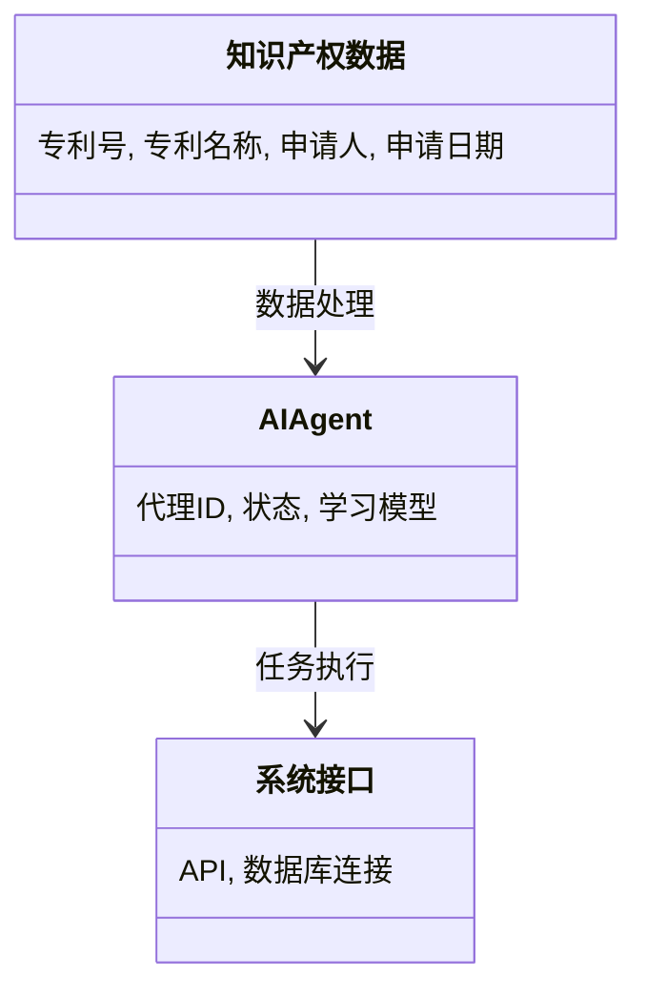
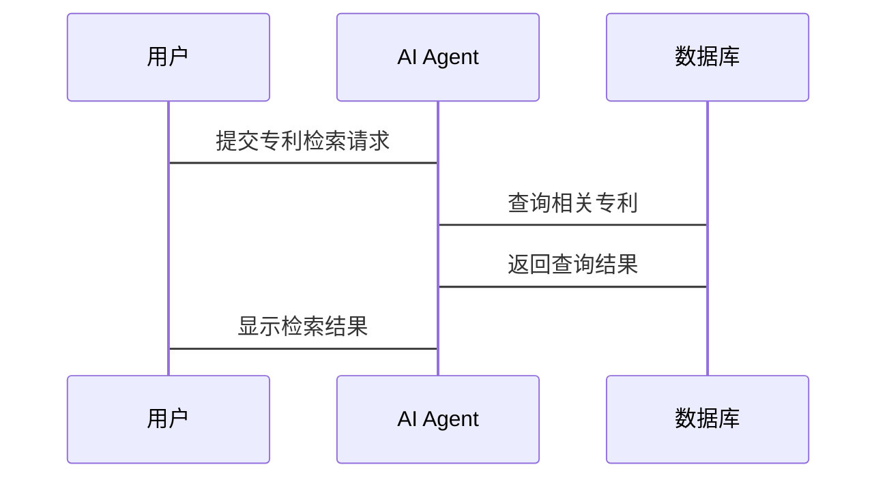

                 


# AI Agent在企业知识产权管理中的应用

> 关键词：AI Agent, 企业知识产权管理, 智能检索, 侵权检测, 知识产权风险评估

> 摘要：本文深入探讨了AI Agent在企业知识产权管理中的应用，从背景、核心概念、算法原理、系统架构到项目实战，全面解析了如何利用AI技术提升知识产权管理的效率与准确性。文章通过详细的技术分析和实际案例，展示了AI Agent在知识产权管理中的独特优势和未来发展方向。

---

# 第1章: 知识产权管理的现状与挑战

## 1.1 知识产权管理的基本概念
### 1.1.1 知识产权的定义与分类
- **定义**：知识产权是指法律所确认的创造性智力成果或标识的所有权，包括专利权、商标权、版权、商业秘密等。
- **分类**：
  - 专利权：保护发明的实用性。
  - 商标权：保护商业标识。
  - 版权：保护文学、艺术和科学作品。
  - 商业秘密：保护未公开的商业信息。

### 1.1.2 企业知识产权管理的重要性
- 知识产权是企业的核心资产之一。
- 有效的知识产权管理可以防止侵权、提升竞争力。
- 知识产权管理涉及法律、技术和管理的多方面。

### 1.1.3 知识产权管理的常见挑战
- 数据分散，难以统一管理。
- 知识产权法律复杂，难以快速检索和分析。
- 侵权检测和风险评估的难度较大。

---

## 1.2 AI Agent的基本概念
### 1.2.1 AI Agent的定义与特点
- **定义**：AI Agent是一种能够感知环境并采取行动以实现目标的智能实体。
- **特点**：
  - 自主性：能够独立决策。
  - 反应性：能够根据环境变化调整行为。
  - 学习能力：能够通过数据优化自身性能。

### 1.2.2 AI Agent与传统软件的区别
| 特性 | 传统软件 | AI Agent |
|------|----------|----------|
| 决策方式 | 预先编写规则 | 自主学习与优化 |
| 交互方式 | 单向输入输出 | 可以主动发起任务 |
| 智能水平 | 基于规则 | 基于数据学习 |

### 1.2.3 AI Agent在企业中的应用前景
- **自动化处理**：AI Agent可以自动处理知识产权数据，如专利检索、商标注册等。
- **高效决策**：通过数据分析，AI Agent可以帮助企业在知识产权布局上做出更优决策。
- **实时监控**：AI Agent可以实时监控市场动态，发现潜在侵权行为。

---

## 1.3 AI Agent与知识产权管理的结合
### 1.3.1 知识产权管理中的自动化需求
- **数据采集**：AI Agent可以自动采集专利、商标等数据。
- **数据分析**：AI Agent可以分析数据，找出潜在的知识产权风险。
- **自动化处理**：AI Agent可以自动处理简单的知识产权事务，如提交申请。

### 1.3.2 AI Agent在知识产权管理中的优势
- **高效性**：AI Agent可以快速处理大量数据。
- **准确性**：AI Agent基于数据驱动的决策，准确性更高。
- **实时性**：AI Agent可以实时监控市场动态。

### 1.3.3 本章小结
本章介绍了知识产权管理的基本概念、常见挑战以及AI Agent的基本特点和优势。通过对比分析，展示了AI Agent在知识产权管理中的巨大潜力。

---

# 第2章: 知识产权管理的核心概念

## 2.1 知识产权管理的领域模型
### 2.1.1 专利管理
- **流程**：申请、审查、授权、维护。
- **挑战**：专利检索复杂，侵权风险高。

### 2.1.2 商标管理
- **流程**：注册、监测、维权。
- **挑战**：商标近似判断困难。

### 2.1.3 版权管理
- **流程**：登记、确权、维权。
- **挑战**：版权保护范围广，难以追踪侵权行为。

### 2.1.4 商业秘密管理
- **流程**：保密协议、内部管理。
- **挑战**：难以防止内部泄露。

---

## 2.2 AI Agent在知识产权管理中的核心功能
### 2.2.1 智能检索与分析
- **功能**：通过自然语言处理技术，快速检索相关专利、商标等信息。
- **优势**：提高检索效率，降低人工成本。

### 2.2.2 自动化侵权检测
- **功能**：通过图像识别和自然语言处理，检测潜在侵权行为。
- **优势**：实时监控，减少人工干预。

### 2.2.3 知识产权风险评估
- **功能**：基于历史数据和市场动态，评估知识产权风险。
- **优势**：提前预警，降低风险。

---

## 2.3 知识产权管理中的关键问题
### 2.3.1 数据的准确性和完整性
- **问题**：数据来源多样，难以保证准确性和完整性。
- **解决方案**：建立统一的数据采集和处理标准。

### 2.3.2 知识产权的法律合规性
- **问题**：法律条款复杂，难以快速理解。
- **解决方案**：AI Agent可以学习相关法律知识，辅助合规性检查。

### 2.3.3 知识产权的全球化管理
- **问题**：不同国家的知识产权法律差异大。
- **解决方案**：AI Agent可以支持多语言和多法律体系的处理。

---

## 2.4 AI Agent与知识产权管理的实体关系
### 2.4.1 实体关系图（ER图）
```mermaid
er
    entity 知识产权数据 {
        key 专利号
        attribute 专利名称, 申请人, 申请日期
    }
    entity AI Agent {
        key 代理ID
        attribute 状态, 学习模型
    }
    relationship AI Agent与知识产权数据的关系 {
        role AI Agent -> 知识产权数据: 处理
    }
```

### 2.4.2 AI Agent与知识产权数据的关系
- **数据流向**：AI Agent从知识产权数据库中获取数据，进行处理。
- **处理流程**：数据采集 -> 数据分析 -> 数据输出。

---

# 第3章: AI Agent在知识产权管理中的算法原理

## 3.1 AI Agent的核心算法
### 3.1.1 决策树算法
- **原理**：通过特征选择和剪枝，构建决策树模型。
- **公式**：信息熵公式：
  $$ H(S) = -\sum_{i=1}^{n} p_i \log p_i $$

### 3.1.2 聚类分析
- **原理**：通过K-means算法将知识产权数据分为不同的类别。
- **公式**：K-means目标函数：
  $$ \min \sum_{i=1}^{K} \sum_{j=1}^{n} (x_i - c_j)^2 $$

### 3.1.3 自然语言处理模型
- **原理**：使用BERT或GPT等模型进行文本分析。
- **示例**：文本相似度计算：
  $$ \text{相似度} = \cos(\theta) = \frac{\vec{A} \cdot \vec{B}}{|\vec{A}| |\vec{B}|} $$

---

## 3.2 AI Agent与知识产权管理的算法应用
### 3.2.1 专利检索的算法实现
```python
def patent_search(query):
    # 数据库查询
    results = db.query(query)
    # 文本相似度计算
    scores = [cosine_similarity(query, doc) for doc in results]
    # 排序并返回
    return sorted(results, key=lambda x: scores[x], reverse=True)
```

### 3.2.2 侵权检测的流程
1. 数据采集：获取疑似侵权的产品描述。
2. 特征提取：提取关键特征。
3. 模型匹配：与数据库中的知识产权数据进行匹配。
4. 结果输出：输出检测结果。

---

## 3.3 算法优化与实际应用
### 3.3.1 算法优化
- **优化目标**：提高检索效率和准确性。
- **方法**：使用分布式计算和模型微调。

### 3.3.2 实际案例
- **案例**：AI Agent帮助某企业快速检索并分析专利，避免了侵权风险。

---

# 第4章: 系统分析与架构设计方案

## 4.1 问题场景介绍
### 4.1.1 问题描述
- 企业需要高效管理知识产权数据，但现有系统效率低下，难以应对复杂查询和侵权检测。

### 4.1.2 项目介绍
- 开发一个基于AI Agent的知识产权管理系统，实现数据采集、分析和侵权检测。

---

## 4.2 系统功能设计
### 4.2.1 领域模型


### 4.2.2 系统架构设计


### 4.2.3 系统接口设计
- **接口1**：数据采集接口。
- **接口2**：侵权检测接口。
- **接口3**：风险评估接口。

---

## 4.3 系统交互流程


---

# 第5章: 项目实战

## 5.1 环境安装
### 5.1.1 安装Python和相关库
```bash
pip install numpy pandas scikit-learn transformers
```

### 5.1.2 数据库安装
```bash
pip install SQLAlchemy pymysql
```

---

## 5.2 核心代码实现
### 5.2.1 数据采集模块
```python
import requests
from bs4 import BeautifulSoup

def fetch_patent_data(url):
    response = requests.get(url)
    soup = BeautifulSoup(response.text, 'html.parser')
    # 提取数据
    return data
```

### 5.2.2 侵权检测模块
```python
from sklearn.metrics.pairwise import cosine_similarity

def detect_infringement(text, database):
    # 特征提取
    features = extract_features(text)
    # 计算相似度
    scores = cosine_similarity(features, database)
    return scores
```

---

## 5.3 代码应用解读与分析
### 5.3.1 数据采集模块
- **功能**：从指定URL获取专利数据。
- **实现细节**：使用BeautifulSoup解析网页内容。

### 5.3.2 侵权检测模块
- **功能**：计算待测文本与数据库中的文本相似度。
- **实现细节**：使用余弦相似度计算。

---

## 5.4 实际案例分析
### 5.4.1 案例背景
- 某企业需要检测其新产品是否侵犯他人专利。

### 5.4.2 案例分析
1. 数据采集：获取相关专利数据。
2. 特征提取：提取产品描述的关键词。
3. 检测结果：相似度高于阈值，存在侵权风险。

---

## 5.5 项目小结
通过本项目，展示了AI Agent在知识产权管理中的实际应用，证明了其在数据处理和侵权检测方面的优势。

---

# 第6章: AI Agent在知识产权管理中的最佳实践与未来展望

## 6.1 最佳实践
### 6.1.1 数据质量管理
- 确保数据的准确性和完整性。

### 6.1.2 模型优化
- 定期更新模型，提升准确率。

### 6.1.3 安全与合规
- 确保数据处理的合规性，防止数据泄露。

---

## 6.2 未来展望
### 6.2.1 技术进步
- 更先进的AI算法将提升知识产权管理的效率。

### 6.2.2 应用拓展
- AI Agent将应用于更多的知识产权管理领域。

---

## 6.3 小结
通过本文的分析和实践，我们可以看到AI Agent在知识产权管理中的巨大潜力。未来，随着技术的进步，AI Agent将为企业知识产权管理提供更强大的支持。

---

# 结语
AI Agent的应用不仅提升了企业知识产权管理的效率，还为企业提供了更智能化的解决方案。通过本文的深入分析，我们可以看到，AI Agent在知识产权管理中的应用前景广阔，值得进一步研究和推广。

