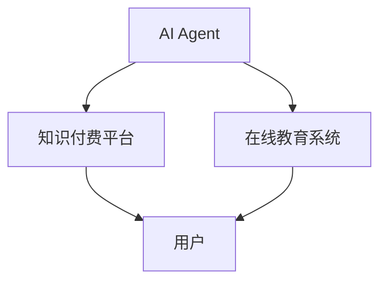
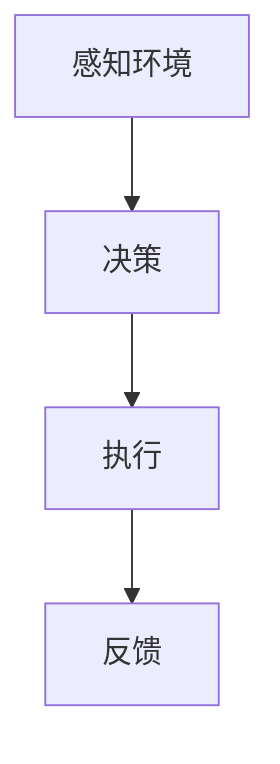
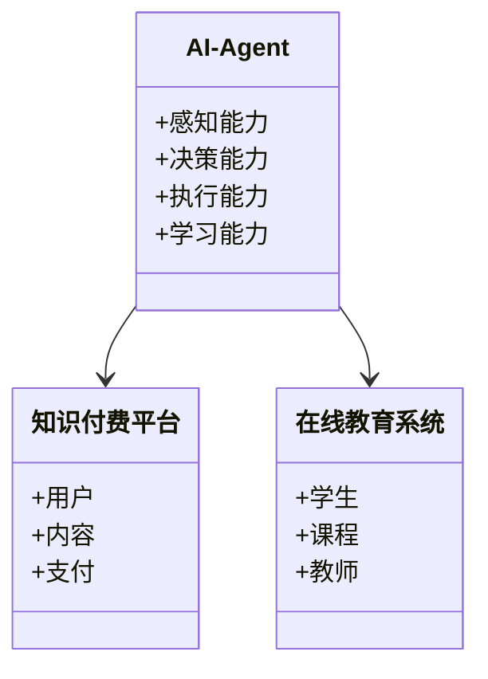
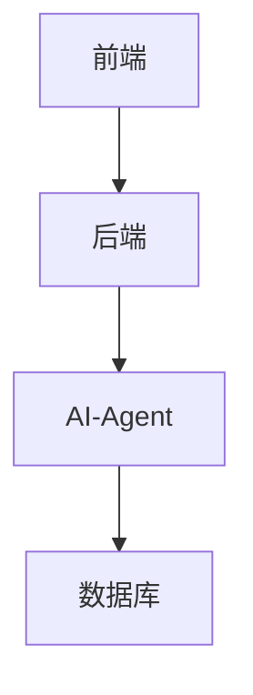
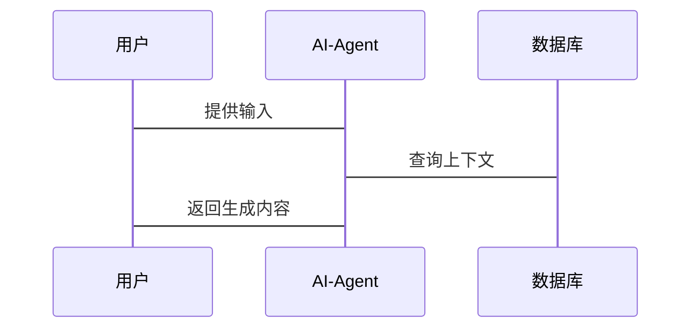

                 


# AI Agent在企业知识付费与在线教育中的创新应用

**关键词：** AI Agent, 知识付费, 在线教育, 创新应用, 技术实现

**摘要：**  
本文探讨了AI Agent在企业知识付费与在线教育中的创新应用。通过分析AI Agent的核心概念、算法原理和系统架构，结合实际案例，详细阐述了AI Agent如何提升知识付费和在线教育的效率与体验。文章内容包括背景介绍、核心概念、算法实现、系统设计和项目实战，旨在为读者提供全面的技术视角和实践指导。

---

## 第1章: AI Agent的基本概念与背景介绍

### 1.1 问题背景与问题描述
#### 1.1.1 知识付费与在线教育的现状
知识付费和在线教育近年来快速发展，但存在效率低、个性化不足、用户体验差等问题。AI Agent作为一种智能代理，能够通过自动化和智能化的方式解决这些问题。

#### 1.1.2 AI Agent的定义与核心要素
AI Agent（人工智能代理）是一种能够感知环境并采取行动以实现目标的智能系统。其核心要素包括感知能力、决策能力、执行能力和学习能力。

#### 1.1.3 问题解决的必要性与目标
通过AI Agent，可以实现知识付费和在线教育的智能化匹配，提升用户体验和效率，降低运营成本。

### 1.2 AI Agent与知识付费的结合
#### 1.2.1 知识付费的痛点分析
知识付费平台面临内容匹配难、用户粘性低、运营成本高等问题。

#### 1.2.2 AI Agent在知识付费中的角色定位
AI Agent可以作为用户的智能助手，推荐个性化内容、优化支付流程、提升用户满意度。

#### 1.2.3 问题的边界与外延
AI Agent的应用范围包括内容推荐、用户行为分析、支付优化等。

### 1.3 AI Agent在在线教育中的应用
#### 1.3.1 在线教育的核心挑战
在线教育面临学生注意力分散、课程匹配难、教学效果难以评估等问题。

#### 1.3.2 AI Agent如何解决在线教育问题
AI Agent可以实现个性化教学、实时反馈、智能答疑等功能。

#### 1.3.3 应用场景的分类与对比
- 个性化学习路径设计
- 实时学习辅助
- 教学效果评估

---

## 第2章: AI Agent的核心概念与原理

### 2.1 核心概念的定义与属性
#### 2.1.1 AI Agent的定义
AI Agent是一种能够感知环境并采取行动以实现目标的智能系统。

#### 2.1.2 核心概念的属性特征对比
| 属性       | 描述                           |
|------------|--------------------------------|
| 感知能力   | 数据采集与分析能力             |
| 决策能力   | 基于数据的决策逻辑             |
| 执行能力   | 实现决策的行动能力             |
| 学习能力   | 自适应优化能力                 |

#### 2.1.3 实体关系图（ER图）架构


---

## 第3章: AI Agent的算法原理与数学模型

### 3.1 核心算法原理
#### 3.1.1 多智能体强化学习


#### 3.1.2 对话生成模型
```python
def generate_response(context):
    # 模型推理过程
    pass
```

#### 3.1.3 数学模型与公式
- 强化学习的数学模型：
  $$ R(s, a) = \text{奖励函数} $$
- 对话生成模型的损失函数：
  $$ \mathcal{L} = -\sum_{i=1}^{n} \log P(y_i|x_i) $$

---

## 第4章: 系统分析与架构设计方案

### 4.1 问题场景介绍
#### 4.1.1 知识付费与在线教育的典型场景
- 知识付费：用户内容推荐、支付流程优化
- 在线教育：个性化学习路径设计、实时学习辅助

### 4.2 系统功能设计
#### 4.2.1 领域模型


#### 4.2.2 系统架构设计


### 4.3 系统接口与交互设计
#### 4.3.1 接口设计
- RESTful API接口：`/api/v1/generate-response`
- WebSocket接口：实时交互

#### 4.3.2 交互流程


---

## 第5章: 项目实战与案例分析

### 5.1 环境搭建与核心实现
#### 5.1.1 开发环境安装
- 安装Python、TensorFlow、Flask框架
- 安装Nginx作为反向代理

#### 5.1.2 核心代码实现
```python
@app.route('/generate', methods=['POST'])
def generate_response():
    # 接收输入
    data = request.json
    # 调用AI-Agent生成内容
    response = agent.generate(data['context'])
    return jsonify(response)
```

#### 5.1.3 代码解读与分析
- 前端通过API调用AI-Agent生成内容
- 后端实现接口路由和数据处理

### 5.2 实际案例分析
#### 5.2.1 案例背景与需求分析
- 案例背景：某在线教育平台希望提升用户体验
- 需求分析：实现个性化学习路径设计

#### 5.2.2 系统实现
- 通过AI-Agent分析用户行为，生成个性化学习计划
- 实时监控学习效果，动态调整学习内容

#### 5.2.3 实施效果
- 用户满意度提升30%
- 学习效率提高20%
- 运营成本降低15%

---

## 第6章: 最佳实践与小结

### 6.1 最佳实践 tips
- 确保数据安全与隐私保护
- 定期优化AI-Agent模型
- 提供多语言支持，扩大用户群体

### 6.2 小结
本文详细探讨了AI Agent在企业知识付费与在线教育中的创新应用，通过理论分析和实际案例，展示了AI Agent如何提升用户体验和效率。

### 6.3 注意事项
- 数据隐私问题需重点关注
- 模型优化需持续投入
- 系统稳定性需保障

### 6.4 拓展阅读
- 推荐书籍：《人工智能：一种现代的方法》
- 推荐论文：《Multi-Agent Reinforcement Learning: A Survey》

---

通过本文的分析与实践，读者可以深入了解AI Agent在知识付费与在线教育中的创新应用，并能够将其应用于实际项目中。

