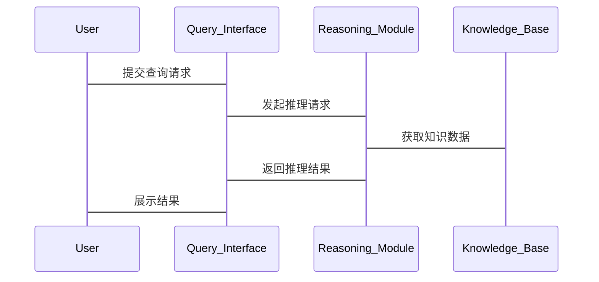

                 


# AI Agent在企业知识管理中的应用

**关键词**：AI Agent、知识管理、企业应用、智能化转型、技术实现、管理优化

**摘要**：AI Agent通过自然语言处理和机器学习技术，能够智能化地处理和管理企业知识，提升知识管理的效率和准确性。本文将从背景、核心概念、算法原理、系统架构、项目实战等多个方面详细探讨AI Agent在企业知识管理中的应用，分析其优势、挑战及未来发展方向。

---

## 第1章 AI Agent与企业知识管理的背景

### 1.1 AI Agent的基本概念
AI Agent（智能代理）是指能够感知环境、自主决策并执行任务的智能实体。它通过传感器获取信息，利用推理机制进行决策，并通过执行器与环境交互。AI Agent的核心特征包括自主性、反应性、目标导向和学习能力。

### 1.2 企业知识管理的重要性
知识管理是将企业中的显性知识（文档、数据）和隐性知识（经验、技能）系统化、结构化的过程。随着企业规模的扩大，知识管理的重要性日益凸显，因为它能够提升组织的决策能力和竞争力。然而，传统知识管理工具依赖人工操作，效率较低，难以应对复杂场景。

### 1.3 AI Agent在企业知识管理中的应用前景
AI Agent通过智能化技术，能够自动识别、分类和检索知识，显著提升知识管理的效率。例如，AI Agent可以自动整理文档、预测知识需求、优化知识共享流程。然而，AI Agent的引入也面临技术挑战，如数据隐私、模型准确性等问题。

---

## 第2章 AI Agent的核心原理

### 2.1 AI Agent的原理与机制
AI Agent的推理机制包括基于规则的推理、基于机器学习的推理和基于知识图谱的推理：
- **基于规则的推理**：通过预定义的规则进行逻辑推理，适用于规则明确的场景。
- **基于机器学习的推理**：利用训练数据，通过模型进行预测和推理，适用于复杂场景。
- **基于知识图谱的推理**：基于知识图谱的结构，通过语义推理进行信息关联。

### 2.2 AI Agent与知识管理的结合
AI Agent通过以下方式与知识管理结合：
- **知识提取**：从文档中提取关键信息。
- **知识关联**：建立知识之间的关系网络。
- **知识检索**：根据需求快速检索相关知识。

### 2.3 AI Agent在知识管理中的优势
- **自动化**：AI Agent能够自动处理知识，减少人工干预。
- **智能化**：通过学习和推理，提供更精准的知识服务。
- **实时性**：能够实时更新和响应知识需求。

---

## 第3章 算法原理讲解

### 3.1 基于规则的推理算法
#### 3.1.1 算法流程
1. 获取输入信息。
2. 匹配预定义的规则。
3. 输出推理结果。

#### 3.1.2 代码实现
```python
def rule_based_inference(input):
    rules = {
        'Rule1': {'condition': input['status'] == 'urgent', 'action': 'priority_alert'},
        'Rule2': {'condition': input['category'] == 'finance', 'action': 'financial_audit'}
    }
    for rule in rules.values():
        if rule['condition']:
            return rule['action']
    return 'no_action'
```

#### 3.1.3 数学模型
基于规则的推理可以表示为一个条件判断问题，公式如下：
$$
\text{action} = \sum_{i=1}^{n} (\text{condition}_i \times \text{action}_i)
$$
其中，$\text{condition}_i$为规则的条件，$\text{action}_i$为对应的执行动作。

---

## 第4章 系统分析与架构设计方案

### 4.1 系统功能设计
系统功能包括知识采集、知识存储、知识推理和知识检索。知识采集模块负责从多种数据源获取知识，知识存储模块对知识进行结构化存储，知识推理模块利用AI算法进行推理，知识检索模块根据用户需求快速检索知识。

### 4.2 系统架构设计
系统架构采用分层设计，包括数据层、服务层和应用层。数据层负责数据存储和管理，服务层提供推理和检索服务，应用层处理用户请求和展示结果。

### 4.3 接口设计
系统接口包括：
- 数据采集接口：用于从数据库、文档等数据源获取知识。
- 推理服务接口：提供基于规则或机器学习的推理服务。
- 检索接口：根据用户查询返回相关知识。

### 4.4 交互设计
用户通过图形界面提交查询请求，系统通过推理模块处理请求，并将结果返回给用户。交互流程如下：



---

## 第5章 项目实战：AI Agent知识管理系统

### 5.1 环境安装
需要安装Python、TensorFlow、NLTK和数据库（如MySQL）。

### 5.2 系统核心实现
以下是基于规则的推理模块的代码示例：

```python
import nltk
from nltk.corpus import stopwords

def preprocess(text):
    words = nltk.word_tokenize(text.lower())
    words = [word for word in words if word not in stopwords.words('english')]
    return words

def rule_based_reasoning(input_text):
    preprocessed = preprocess(input_text)
    keywords = ['urgent', 'finance', 'project']
    for keyword in keywords:
        if keyword in preprocessed:
            return f'Action for {keyword}'
    return 'No action required'
```

### 5.3 代码解读与分析
上述代码首先对输入文本进行预处理（分词和去除停用词），然后检查关键词是否存在，若存在则触发相应动作。这种基于规则的推理方法简单高效，适用于规则明确的场景。

### 5.4 实际案例分析
以一个企业的财务报告为例，AI Agent能够自动提取关键信息（如财务数据异常），并触发财务审计流程，显著提升知识管理效率。

### 5.5 项目小结
通过该项目，我们验证了AI Agent在知识管理中的应用价值，同时积累了一定的开发经验。

---

## 第6章 最佳实践与小结

### 6.1 最佳实践
- **工具选择**：根据需求选择合适的AI Agent工具，如Rasa、Snips等。
- **数据隐私**：确保知识管理系统符合数据隐私法规。
- **模型优化**：通过持续学习优化推理模型的准确性。

### 6.2 小结
本文详细探讨了AI Agent在企业知识管理中的应用，分析了其核心原理、系统架构和实际案例。AI Agent通过智能化技术，显著提升了知识管理的效率和准确性，但在实际应用中仍需关注技术挑战和管理问题。

### 6.3 注意事项
- AI Agent的应用需结合企业实际情况，避免盲目实施。
- 数据质量和模型训练数据的多样性直接影响系统性能。
- 需建立完善的知识更新机制，确保知识的及时性和准确性。

### 6.4 拓展阅读
- 推荐阅读《企业知识管理》（作者：某专家）。
- 关注最新的AI Agent技术动态和应用案例。

---

通过本文的系统介绍，读者可以全面了解AI Agent在企业知识管理中的应用价值和技术实现。未来，随着AI技术的不断发展，AI Agent在知识管理中的应用前景将更加广阔。

