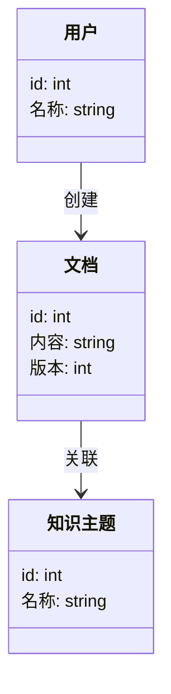
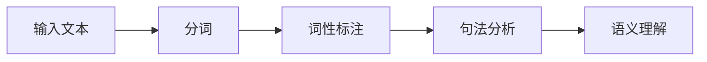
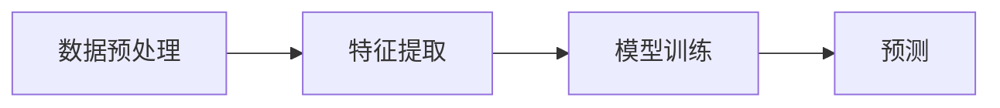
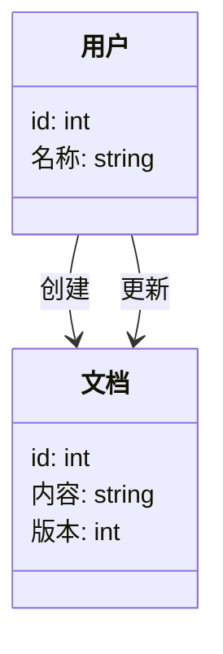
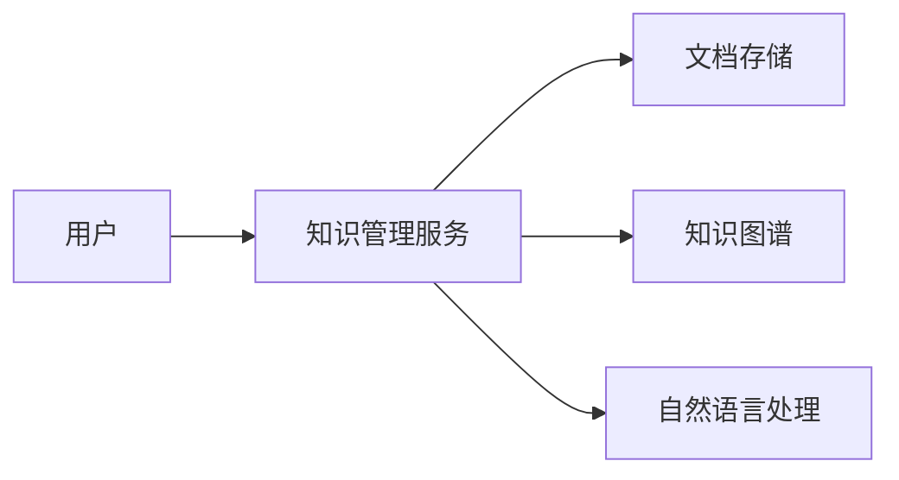

                 


# AI Agent在企业知识管理中的应用与价值

## 关键词：AI Agent, 企业知识管理, 人工智能, 知识图谱, 自然语言处理

## 摘要

本文系统地探讨了AI Agent在企业知识管理中的应用及其带来的价值。首先介绍了AI Agent的基本概念和核心要素，分析了企业知识管理的背景与挑战。接着深入讲解了AI Agent的核心原理与系统架构，包括自然语言处理、机器学习和知识图谱等技术。然后详细阐述了AI Agent在企业知识管理中的算法原理和系统设计，包括数据采集、处理、分析、存储和交互模块。最后通过项目实战和案例分析，展示了AI Agent的实际应用效果，并总结了最佳实践和未来发展方向。

---

## 第1章 AI Agent的基本概念与知识管理的背景

### 1.1 AI Agent的定义与核心要素

AI Agent是一种能够感知环境、自主决策并采取行动以实现特定目标的智能实体。其核心要素包括：

- **智能性**：通过学习和推理处理复杂问题。
- **自主性**：无需外部干预，自主完成任务。
- **反应性**：实时感知环境变化并作出反应。
- **主动性**：主动采取行动以实现目标。

### 1.2 企业知识管理的背景与挑战

企业知识管理（KM）旨在系统化地收集、整理、存储和应用企业知识，以提升竞争力。然而，传统知识管理存在以下挑战：

- **知识分散**：知识存储在不同部门和系统中，难以整合。
- **更新不及时**：知识更新速度慢，难以适应变化。
- **缺乏深度分析**：难以从海量数据中提取有价值的信息。

### 1.3 AI Agent在企业知识管理中的价值

AI Agent通过智能化手段解决了传统KM的痛点，其价值体现在：

- **提高效率**：自动化处理知识，减少人工干预。
- **增强共享性**：统一管理知识，提升共享效率。
- **优化决策**：通过深度分析提供数据支持。

---

## 第2章 AI Agent的核心原理与系统架构

### 2.1 AI Agent的核心原理

AI Agent的核心原理包括：

- **自然语言处理（NLP）**：用于理解和生成人类语言。
- **机器学习（ML）**：通过数据训练模型，实现智能决策。
- **知识图谱**：构建结构化知识，支持语义理解。

### 2.2 AI Agent与传统知识管理系统的对比

以下是AI Agent与传统知识管理系统的对比：

| **特性**       | **传统知识管理系统**           | **AI Agent**                   |
|----------------|------------------------------|--------------------------------|
| 自动化程度     | 低                           | 高                           |
| 决策能力       | 依赖人工                     | 自主决策                     |
| 知识处理能力   | 简单处理                     | 深度分析                     |

### 2.3 系统架构设计

#### 2.3.1 实体关系图

```mermaid
erd
  知识管理系统的实体包括：用户、文档、知识主题、版本、标签。
  用户与文档之间是一对多关系。
  文档与知识主题之间是一对多关系。
  文档与标签之间是多对多关系。
```

#### 2.3.2 类图



---

## 第3章 AI Agent的算法原理

### 3.1 自然语言处理（NLP）

#### 3.1.1 算法流程



#### 3.1.2 Python代码示例

```python
import spacy

nlp = spacy.load("en_core_web_sm")
doc = nlp("This is a test sentence.")

for token in doc:
    print(token.text, token.pos_)
```

### 3.2 机器学习（ML）

#### 3.2.1 算法流程



#### 3.2.2 数学模型

贝叶斯定理：
$$P(A|B) = \frac{P(B|A)P(A)}{P(B)}$$

向量空间模型：
$$\text{相似度} = \frac{\vec{A} \cdot \vec{B}}{|\vec{A}| |\vec{B}|}$$

---

## 第4章 系统分析与架构设计

### 4.1 系统功能设计

#### 4.1.1 领域模型



#### 4.1.2 系统架构图



---

## 第5章 项目实战

### 5.1 环境安装

安装必要的库：
```bash
pip install spacy transformers
```

### 5.2 核心代码实现

#### 5.2.1 文本处理

```python
from transformers import pipeline

nlp = pipeline("question-answering")
response = nlp("What is AI Agent?", "AI Agent is an intelligent entity that performs tasks autonomously.")
print(response)
```

#### 5.2.2 知识抽取

```python
from spacy.lang.zh import Chinese

nlp_zh = Chinese()
doc = nlp_zh("这是一个测试句子。")
for token in doc:
    print(token)
```

### 5.3 案例分析

以企业文档管理为例，AI Agent能够自动分类、标签化文档，并生成知识图谱，提升知识检索效率。

---

## 第6章 最佳实践与总结

### 6.1 最佳实践

- **数据隐私**：确保数据安全和隐私保护。
- **模型迭代**：定期更新模型，保持其准确性。
- **用户反馈**：收集用户反馈，优化系统性能。

### 6.2 小结

AI Agent通过智能化手段革新了企业知识管理方式，提高了效率和决策能力。随着技术进步，其应用将更加广泛和深入。

### 6.3 注意事项

- **技术选型**：选择合适的AI技术，避免过度复杂化。
- **团队协作**：需要跨学科团队合作。
- **持续优化**：定期评估系统性能，进行优化。

### 6.4 拓展阅读

推荐书籍：
- 《自然语言处理入门》
- 《机器学习实战》
- 《知识图谱：概念、方法与应用》

---

以上是《AI Agent在企业知识管理中的应用与价值》的完整目录和内容概览，旨在系统地介绍AI Agent在企业知识管理中的应用，结合理论与实践，为读者提供深入的见解和实用指导。

