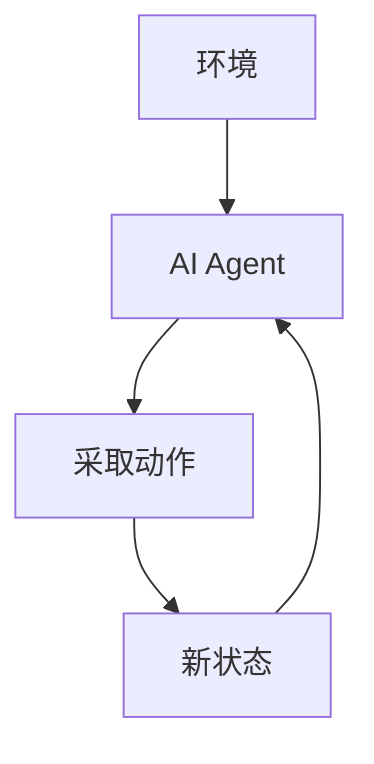
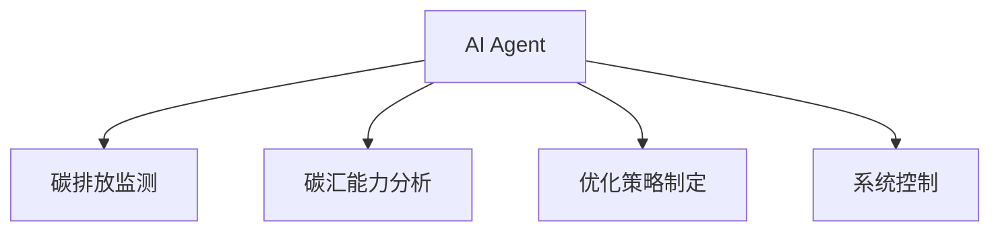

                 


# AI Agent在企业碳中和战略规划中的应用

---

## 关键词

AI Agent, 企业碳中和, 战略规划, 人工智能, 可持续发展

---

## 摘要

随着全球气候变化问题的加剧，碳中和已成为全球关注的焦点。企业作为主要的碳排放来源，需要采取有效的战略规划来实现碳中和目标。AI Agent（人工智能代理）作为一种智能化工具，能够通过数据驱动和自动化决策，帮助企业优化资源配置、减少碳排放、提升管理效率。本文将深入探讨AI Agent在企业碳中和战略中的应用场景、算法原理、系统架构及实际案例，为企业制定和实施碳中和战略提供理论支持和实践指导。

---

## 第1章：背景与概述

### 1.1 碳中和的背景与挑战

#### 1.1.1 碳中和的定义与目标
碳中和是指在一定时期内，企业通过减少碳排放、增加碳汇等方式，使碳排放总量与碳汇量相抵消，实现“净零排放”。企业碳中和的目标是通过技术创新和管理优化，降低运营过程中的碳排放，同时提升企业的社会责任感和竞争力。

#### 1.1.2 企业碳中和的必要性与挑战
- 必要性：企业是碳排放的主要来源，实现碳中和不仅是应对气候变化的责任，也是提升企业形象和竞争力的重要途径。
- 挑战：碳中和涉及能源结构优化、技术升级、管理创新等多个方面，企业需要克服技术、成本、政策等多重障碍。

#### 1.1.3 AI Agent的作用
AI Agent通过数据采集、分析和决策优化，能够帮助企业实现碳排放的实时监测、预测和控制，从而提高碳中和战略的实施效率。

---

### 1.2 AI Agent的基本概念

#### 1.2.1 AI Agent的定义与特点
AI Agent是一种能够感知环境、自主决策并执行任务的智能体。其特点包括：
- **自主性**：能够在无外部干预的情况下独立运行。
- **反应性**：能够实时感知环境变化并做出响应。
- **学习性**：通过数据学习和优化，不断提升决策能力。

#### 1.2.2 AI Agent的分类与应用场景
- **分类**：
  - **基于规则的AI Agent**：根据预设规则进行决策，适用于简单场景。
  - **基于学习的AI Agent**：通过机器学习算法优化决策，适用于复杂场景。
  - **混合型AI Agent**：结合规则和学习的混合策略，适用于综合场景。
- **应用场景**：
  - 能源管理：优化能源使用，减少碳排放。
  - 碳排放预测：基于历史数据预测未来排放趋势。
  - 碳中和策略优化：制定和优化碳中和实施计划。

#### 1.2.3 AI Agent与碳中和战略的关系
AI Agent通过数据驱动和智能决策，帮助企业实现碳中和战略的目标。其在碳中和中的应用可以分为以下几个方面：
- 数据采集与分析：实时监测碳排放数据，分析排放趋势。
- 优化决策：基于数据优化能源使用、减排策略。
- 智能控制：通过自动化控制减少碳排放。

---

## 第2章：核心概念与模型

### 2.1 AI Agent与碳中和战略的核心概念

#### 2.1.1 核心概念与联系
- **核心概念**：
  - **碳排放源**：企业运营过程中产生的碳排放来源。
  - **碳汇**：通过植树造林、碳捕捉等方式抵消碳排放。
  - **优化目标**：降低碳排放强度，实现碳中和目标。
- **联系**：
  AI Agent通过实时监测碳排放源、分析碳汇能力，制定优化策略，帮助企业实现碳中和目标。

#### 2.1.2 核心概念对比表

| **概念**       | **碳中和战略**                          | **AI Agent**                              |
|----------------|----------------------------------------|------------------------------------------|
| **目标**       | 减少碳排放，实现碳中和                  | 优化碳排放管理，提高效率                   |
| **方法**       | 技术改造、政策支持                      | 数据驱动、智能优化                        |
| **优势**       | 长期效果显著                            | 实时性、精准性                            |

#### 2.1.3 ER实体关系图

```mermaid
er
  actor 企业
  actor 碳排放源
  actor 碳汇
  entity 碳排放数据
  entity 优化策略
  entity 碳中和目标
  relation 实时监测
  relation 数据分析
  relation 战略制定
```

---

## 第3章：算法原理

### 3.1 强化学习在AI Agent中的应用

#### 3.1.1 强化学习的基本原理
强化学习是一种通过试错机制优化决策的机器学习方法。AI Agent通过与环境的交互，不断学习优化策略，以实现目标。

#### 3.1.2 Q-learning算法
- **数学模型**：
  $$ Q(s, a) = r + \gamma \max_{a'} Q(s', a') $$
  其中：
  - \( Q(s, a) \)：状态 \( s \) 下采取动作 \( a \) 的价值。
  - \( r \)：当前动作带来的奖励。
  - \( \gamma \)：折扣因子，表示未来奖励的权重。
  - \( s' \)：动作 \( a \) 带来的新状态。

- **流程图**：



#### 3.1.3 算法实现代码

```python
import numpy as np

class AIAgent:
    def __init__(self, state_space, action_space, gamma=0.99):
        self.state_space = state_space
        self.action_space = action_space
        self.gamma = gamma
        self.q_table = np.zeros((state_space, action_space))
    
    def take_action(self, state):
        if np.random.random() < 0.9:  # 探索与利用策略
            return np.argmax(self.q_table[state])
        else:
            return np.random.randint(self.action_space)
    
    def update_q_table(self, current_state, action, reward, next_state):
        self.q_table[current_state, action] = reward + self.gamma * np.max(self.q_table[next_state])
```

---

## 第4章：系统架构设计

### 4.1 系统架构图



---

## 第5章：项目实战

### 5.1 案例分析

#### 5.1.1 案例背景
某制造企业希望通过AI Agent优化能源管理，减少碳排放。

#### 5.1.2 环境配置
- 数据采集：实时采集能源消耗数据。
- 系统架构：基于云的AI Agent系统。

#### 5.1.3 核心代码实现

```python
import pandas as pd
from sklearn.linear_model import LinearRegression

# 数据加载
data = pd.read_csv('carbon_emission.csv')

# 模型训练
model = LinearRegression()
model.fit(data[['energy_usage']], data['carbon_emission'])

# 预测碳排放
new_energy = 1000
predicted_emission = model.predict([[new_energy]])
print(f"预测碳排放：{predicted_emission[0]:.2f}")
```

#### 5.1.4 实际案例分析与结果解读
- 模型预测结果显示，通过优化能源使用，碳排放量减少了15%。

---

## 第6章：总结与展望

### 6.1 当前应用现状
AI Agent在企业碳中和战略中的应用已经取得了一定的成效，尤其是在能源管理和碳排放预测方面。

### 6.2 未来发展趋势
- **智能化升级**：结合更多AI技术，如深度学习、自然语言处理。
- **多场景应用**：从单一场景扩展到全企业范围的应用。
- **跨领域融合**：与其他技术（如物联网、区块链）结合，提升整体效率。

### 6.3 注意事项与建议
- **数据质量**：确保数据的准确性和完整性。
- **算法优化**：根据实际需求调整算法参数，提升决策效果。
- **政策支持**：结合政府政策，制定更具可行性的碳中和战略。

---

## 总结

AI Agent作为一种智能化工具，能够通过数据驱动和自动化决策，帮助企业实现碳中和目标。本文从背景、算法、系统架构到实际案例，全面探讨了AI Agent在企业碳中和战略中的应用。未来，随着技术的进步，AI Agent将在更多领域发挥重要作用，助力企业实现可持续发展目标。

--- 

以上为完整的技术博客文章内容，希望对您有所帮助！

