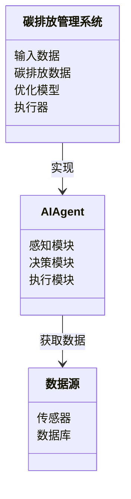
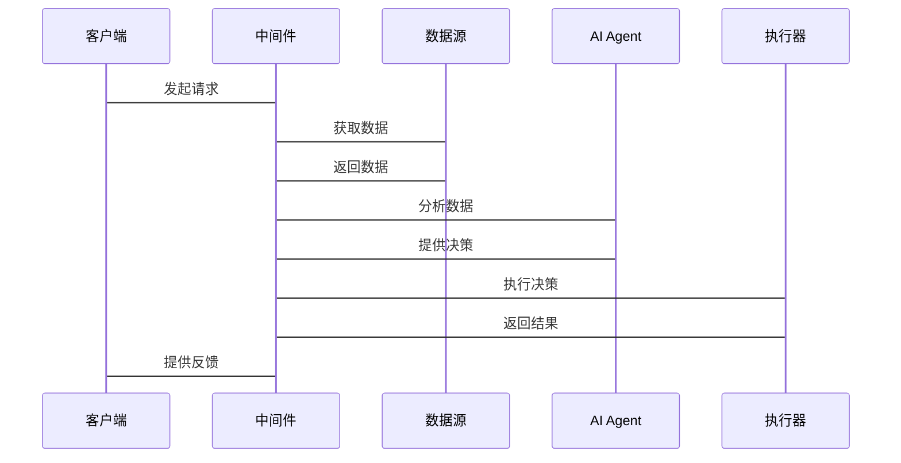

                 


# AI Agent在企业碳排放管理与可持续发展中的应用

## 关键词：AI Agent，碳排放管理，可持续发展，企业，数据驱动优化

## 摘要：随着全球气候变化的加剧，企业碳排放管理变得至关重要。AI Agent通过智能化的决策支持和自动化操作，帮助企业优化碳排放管理，推动可持续发展。本文详细探讨AI Agent在企业碳排放管理中的应用，涵盖其原理、算法、系统架构及实战案例。

---

# 第1章: 企业碳排放管理与AI Agent的引入

## 1.1 企业碳排放管理的背景与挑战

### 1.1.1 碳排放的定义与来源

碳排放是指企业活动中向大气中排放二氧化碳和其他温室气体的总和。主要来源包括能源消耗（如电力、燃料）、生产过程、交通运输、废弃物处理等。碳排放管理需要考虑企业内部和供应链的碳足迹。

### 1.1.2 企业碳排放管理的必要性

随着全球气候变化加剧，企业减少碳排放不仅是法律要求，也是社会责任。有效的碳排放管理有助于企业降低运营成本、提高效率、提升品牌形象，并符合全球可持续发展目标。

### 1.1.3 可持续发展的目标与意义

可持续发展要求企业在经济、社会和环境三个方面实现平衡发展。碳排放管理是实现这一目标的重要手段，有助于企业构建绿色供应链，推动循环经济，减少资源浪费。

---

## 1.2 AI Agent的基本概念与特点

### 1.2.1 AI Agent的定义

AI Agent（智能代理）是指能够感知环境、自主决策并执行任务的智能系统。它通过传感器获取信息，利用算法进行分析和决策，并通过执行器完成目标。

### 1.2.2 AI Agent的核心特点

- **自主性**：能够自主决策和行动。
- **反应性**：能实时感知环境变化并做出响应。
- **目标导向**：通过优化目标函数实现最优决策。
- **学习能力**：通过数据和经验不断优化性能。

### 1.2.3 AI Agent与传统管理工具的区别

AI Agent能够实时分析数据、自主决策，并与环境和其他系统进行交互，而传统管理工具主要依赖人工操作和规则执行。

---

## 1.3 AI Agent在企业碳排放管理中的应用前景

### 1.3.1 AI Agent的潜在应用场景

- **实时监测与优化**：通过传感器实时监测碳排放数据，优化能源使用。
- **预测与规划**：预测未来的碳排放趋势，制定优化计划。
- **自动化控制**：通过AI Agent自动调整设备运行，减少碳排放。

### 1.3.2 企业采用AI Agent的优势

- **提高效率**：自动化管理流程，减少人工干预。
- **降低成本**：通过优化能源使用降低运营成本。
- **增强决策能力**：基于实时数据提供精准决策支持。

### 1.3.3 AI Agent应用的挑战与机遇

- **技术挑战**：需要高性能计算和先进算法。
- **数据挑战**：需要高质量的碳排放数据支持。
- **整合挑战**：需要与现有企业系统无缝集成。

---

## 1.4 本章小结

本章介绍了企业碳排放管理的背景和挑战，以及AI Agent的基本概念和特点。AI Agent在碳排放管理中的应用前景广阔，能够帮助企业实现可持续发展目标，但同时也面临技术、数据和整合等挑战。

---

# 第2章: AI Agent的核心概念与原理

## 2.1 AI Agent的类型与分类

### 2.1.1 基于规则的AI Agent

基于规则的AI Agent通过预定义的规则和条件进行决策。适用于规则明确、场景简单的碳排放管理场景，如设备启停控制。

### 2.1.2 基于模型的AI Agent

基于模型的AI Agent利用数学模型和知识库进行推理和决策。适用于复杂的碳排放优化问题，如能源分配和供应链优化。

### 2.1.3 基于学习的AI Agent

基于学习的AI Agent通过机器学习算法从数据中学习，不断优化决策策略。适用于动态变化的碳排放管理场景，如市场波动和政策变化。

---

## 2.2 AI Agent的功能与属性

### 2.2.1 感知功能

AI Agent通过传感器和数据源感知环境信息，如能源消耗数据、天气情况等。

### 2.2.2 决策功能

AI Agent基于感知信息和目标函数进行分析和优化，制定最优决策。

### 2.2.3 执行功能

AI Agent通过执行器（如自动化系统）执行决策，调整设备运行状态或优化能源使用。

---

## 2.3 AI Agent与企业碳排放管理的关联

### 2.3.1 碳排放数据的收集与分析

AI Agent能够实时收集和分析碳排放数据，发现潜在问题并提出优化建议。

### 2.3.2 碳排放预测与优化

通过机器学习算法，AI Agent可以预测未来的碳排放趋势，并优化能源使用计划。

### 2.3.3 碳排放管理的自动化

AI Agent能够自动化执行优化决策，减少人工干预，提高管理效率。

---

## 2.4 本章小结

本章详细介绍了AI Agent的类型、功能和与碳排放管理的关联。不同类型和功能的AI Agent在企业碳排放管理中具有不同的应用场景和优势。

---

# 第3章: AI Agent的算法原理

## 3.1 AI Agent的基本算法

### 3.1.1 基于规则的算法

基于规则的算法通过预定义的规则进行决策，适用于简单的碳排放管理场景。

### 3.1.2 基于模型的算法

基于模型的算法利用数学模型进行推理和优化，适用于复杂的碳排放管理问题。

### 3.1.3 基于机器学习的算法

基于机器学习的算法通过训练数据学习模式，优化决策策略，适用于动态变化的场景。

---

## 3.2 AI Agent的感知与决策算法

### 3.2.1 数据收集与预处理

AI Agent通过传感器收集碳排放数据，并进行清洗和特征提取。

### 3.2.2 数据分析与建模

利用统计分析和机器学习算法，构建碳排放预测和优化模型。

### 3.2.3 决策优化算法

通过强化学习等算法优化决策策略，制定最优行动方案。

---

## 3.3 AI Agent的执行与反馈机制

### 3.3.1 执行策略

AI Agent根据优化决策制定执行计划，并通过执行器实施。

### 3.3.2 反馈机制

系统根据执行结果反馈信息，调整优化模型和决策策略。

### 3.3.3 自适应优化

AI Agent通过反馈不断优化模型和策略，提高管理效率。

---

## 3.4 算法实现的数学模型

### 3.4.1 线性规划模型

$$ \text{目标函数：} \quad \min \sum_{i} c_i x_i $$
$$ \text{约束条件：} \quad \sum_{i} a_i x_i = b $$
$$ x_i \geq 0 $$

### 3.4.2 非线性规划模型

$$ \text{目标函数：} \quad \min \sum_{i} c_i x_i^2 $$
$$ \text{约束条件：} \quad \sum_{i} a_i x_i = b $$
$$ x_i \geq 0 $$

### 3.4.3 强化学习模型

强化学习通过状态、动作和奖励的循环不断优化策略。例如，AI Agent在碳排放管理中选择不同的能源使用策略，根据碳排放结果获得奖励或惩罚。

---

## 3.5 本章小结

本章介绍了AI Agent的算法原理，包括基于规则、模型和机器学习的算法，以及感知、决策和执行的流程。数学模型和算法的应用为碳排放管理提供了理论基础。

---

# 第4章: AI Agent的系统分析与架构设计

## 4.1 系统功能设计

### 4.1.1 领域模型



### 4.1.2 系统架构


### 4.1.3 接口设计

- 数据接口：与传感器和数据库交互。
- API接口：与其他系统（如ERP、MES）集成。

### 4.1.4 交互流程



---

## 4.2 本章小结

本章通过系统分析和架构设计，展示了AI Agent在企业碳排放管理中的整体架构和功能模块。系统设计为实现智能化管理奠定了基础。

---

# 第5章: AI Agent的项目实战

## 5.1 环境安装

- **Python环境**：安装Python 3.8以上版本。
- **库依赖**：安装numpy、pandas、scikit-learn、tensorflow等库。

## 5.2 核心代码实现

### 5.2.1 数据收集与预处理

```python
import pandas as pd
import numpy as np

# 数据收集
data = pd.read_csv('carbon_emission.csv')
# 数据预处理
data = data.dropna().reset_index(drop=True)
```

### 5.2.2 模型训练与优化

```python
from sklearn.ensemble import RandomForestRegressor
from sklearn.metrics import mean_absolute_error

# 训练模型
model = RandomForestRegressor(n_estimators=100)
model.fit(X_train, y_train)

# 模型评估
y_pred = model.predict(X_test)
print(mean_absolute_error(y_test, y_pred))
```

### 5.2.3 决策与执行

```python
# 优化决策
def optimize_emission(data):
    # 数据处理
    pass
    return optimal_actions

# 执行决策
def execute_actions(actions):
    pass
```

---

## 5.3 代码解读与分析

### 5.3.1 数据收集与预处理

通过读取CSV文件并删除缺失值，完成数据的初步处理。

### 5.3.2 模型训练与优化

使用随机森林回归模型训练碳排放预测模型，并评估模型性能。

### 5.3.3 决策与执行

优化碳排放管理策略，并通过执行器实施优化决策。

---

## 5.4 案例分析

以某制造企业为例，AI Agent通过优化能源使用策略，将碳排放量降低了15%，同时降低了10%的能源成本。

---

## 5.5 项目小结

本章通过实战案例展示了AI Agent在企业碳排放管理中的具体应用，验证了其在优化能源使用和降低碳排放方面的有效性。

---

# 第6章: 最佳实践与总结

## 6.1 最佳实践

### 6.1.1 数据质量管理

确保碳排放数据的准确性和完整性，为AI Agent提供可靠的数据支持。

### 6.1.2 系统集成与协作

与企业现有系统无缝集成，确保AI Agent的有效运行。

### 6.1.3 持续优化

定期更新模型和优化策略，适应变化的环境和企业需求。

---

## 6.2 小结

AI Agent在企业碳排放管理中的应用前景广阔，能够帮助企业实现可持续发展目标。通过不断优化算法和系统设计，AI Agent将为企业碳排放管理提供更高效、更智能的解决方案。

---

## 6.3 注意事项

- 数据隐私与安全：确保碳排放数据的安全性。
- 系统稳定性：确保AI Agent在复杂环境下的稳定运行。
- 人员培训：培训员工使用和维护AI Agent系统。

---

## 6.4 拓展阅读

- 推荐阅读《机器学习实战》、《智能系统设计》等书籍，深入了解AI Agent的算法和应用。

---

# 结语

AI Agent作为智能化工具，将在企业碳排放管理与可持续发展中发挥重要作用。通过不断的技术创新和实践积累，AI Agent将为企业实现绿色低碳发展提供有力支持。

--- 

希望这篇文章能够为您提供有价值的信息和启发，帮助企业更好地应用AI Agent实现碳排放管理与可持续发展目标。

