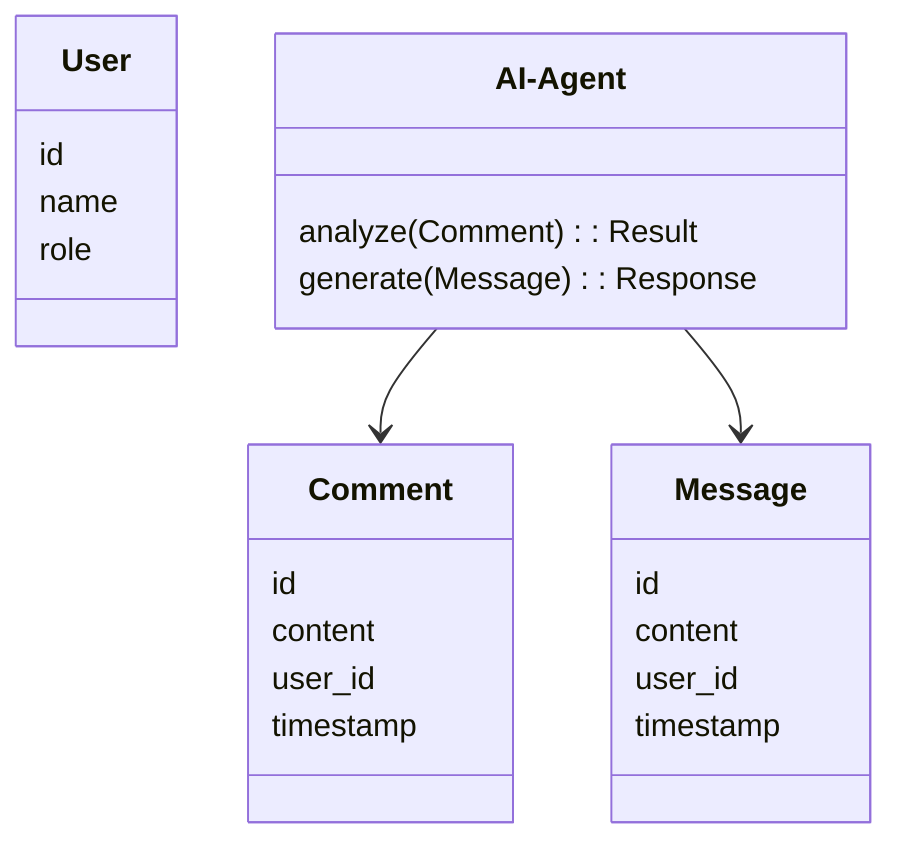
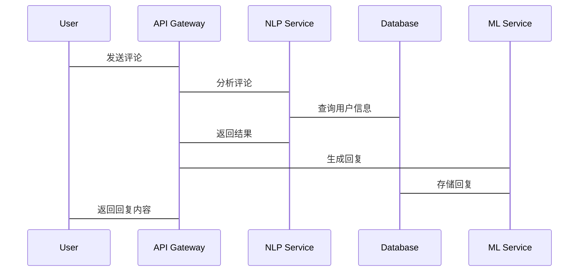

                 


# AI Agent在企业社交媒体管理中的应用

## 关键词
AI Agent, 企业社交媒体管理, 自然语言处理, 机器学习, 强化学习, 社交媒体数据分析, 社交媒体内容生成

## 摘要
本文探讨AI Agent在企业社交媒体管理中的应用，从背景、技术基础、算法实现、系统设计到项目实战，详细分析AI Agent如何助力企业提升社交媒体管理效率和效果。通过NLP、机器学习等技术，AI Agent能够实现智能化的内容生成、用户互动和数据分析，帮助企业优化社交媒体策略。

---

# 第1章 AI Agent与企业社交媒体管理的背景

## 1.1 AI Agent的定义与核心概念

### 1.1.1 AI Agent的基本定义
AI Agent（人工智能代理）是指能够感知环境并采取行动以实现特定目标的智能实体。它具备自主性、反应性、目标导向和社交能力等核心特征。

### 1.1.2 AI Agent的核心属性与特征
| 特性 | 描述 |
|------|------|
| 自主性 | 能够独立决策和行动 |
| 反应性 | 能够感知环境并实时响应 |
| 目标导向 | 具有明确的目标和优先级 |
| 社交能力 | 能够理解和处理人类语言与行为 |

### 1.1.3 AI Agent与传统自动化工具的区别
| 方面         | AI Agent               | 传统自动化工具         |
|--------------|------------------------|------------------------|
| 智能性       | 高                     | 低                     |
| 适应性       | 强                     | 弱                     |
| 交互能力     | 支持自然语言交互       | 仅支持固定规则的交互    |
| 学习能力     | 可通过数据优化策略     | 无法优化               |

## 1.2 企业社交媒体管理的现状与挑战

### 1.2.1 企业社交媒体管理的主要场景
- **内容发布**：定时发布产品信息、促销活动。
- **用户互动**：回复评论、私信，维护品牌形象。
- **数据分析**：监控品牌声量、用户反馈，优化营销策略。

### 1.2.2 传统社交媒体管理的痛点
- **效率低下**：人工操作耗时，难以应对大量数据。
- **一致性差**：员工能力参差不齐，回复质量不一。
- **数据孤岛**：缺乏统一的数据分析工具，难以形成闭环。

### 1.2.3 AI Agent在社交媒体管理中的潜在价值
- **提高效率**：自动化处理大量重复性任务。
- **提升质量**：确保回复内容一致性和专业性。
- **数据闭环**：实时分析数据，优化运营策略。

## 1.3 AI Agent在企业社交媒体管理中的应用前景

### 1.3.1 AI Agent在社交媒体内容生成中的应用
- **智能写作**：根据品牌调性自动生成文案。
- **多语言支持**：支持多种语言内容生成。

### 1.3.2 AI Agent在社交媒体用户互动中的应用
- **自动回复**：实时响应用户评论和私信。
- **情感分析**：识别用户情绪，提供个性化服务。

### 1.3.3 AI Agent在社交媒体数据分析中的应用
- **舆情监控**：实时分析品牌声量和用户反馈。
- **数据可视化**：生成图表，帮助企业直观了解运营效果。

## 1.4 本章小结
本章介绍了AI Agent的核心概念及其在企业社交媒体管理中的应用场景，分析了传统管理的痛点和AI Agent的潜在价值，为后续技术实现奠定了基础。

---

# 第2章 AI Agent的技术基础

## 2.1 自然语言处理（NLP）基础

### 2.1.1 NLP的核心任务与技术
| 任务         | 描述                 |
|--------------|----------------------|
| 分词          | 将文本分割成词或短语  |
| 语法分析      | 分析句子的语法结构    |
| 实体识别      | 识别文本中的实体     |
| 情感分析      | 判断文本的情感倾向    |

### 2.1.2 常见的NLP模型与工具
- **分词工具**：jieba（中文）、NLTK（英文）。
- **情感分析模型**：VADER、TextBlob。

### 2.1.3 NLP在社交媒体管理中的应用
- **文本分类**：识别垃圾评论、 spam。
- **情感分析**：分析用户对产品的看法。

## 2.2 机器学习与深度学习基础

### 2.2.1 机器学习的基本概念
- **监督学习**：基于标记数据进行训练。
- **无监督学习**：从无标记数据中发现模式。

### 2.2.2 深度学习的核心原理
- **神经网络**：模拟人脑神经网络的结构。
- **卷积神经网络（CNN）**：适用于图像识别。
- **循环神经网络（RNN）**：适用于序列数据处理。

### 2.2.3 常见的深度学习模型
- **BERT**：用于文本理解和生成。
- **GPT**：用于生成式任务。

## 2.3 AI Agent的算法原理

### 2.3.1 AI Agent的决策机制
- **基于规则的决策**：根据预设规则进行决策。
- **基于模型的决策**：利用机器学习模型进行预测。

### 2.3.2 基于强化学习的AI Agent设计
- **策略网络**：定义动作的概率分布。
- **价值网络**：评估状态的价值。

### 2.3.3 AI Agent的多轮对话模型
- **对话状态跟踪**：记录对话历史和当前状态。
- **回复生成**：根据对话状态生成回复。

---

# 第3章 AI Agent的算法实现

## 3.1 基于NLP的文本生成算法

### 3.1.1 Transformer模型的原理
- **自注意力机制**：捕捉文本中长距离依赖关系。
- **位置编码**：引入位置信息。

### 3.1.2 GPT模型的实现细节
- **解码器结构**：堆叠多个Transformer解码层。
- **交叉注意力**：解码层与编码层之间的交互。

### 3.1.3 文本生成的评估指标
- **BLEU**：基于n-gram的精确度。
- **ROUGE**：基于召回率的评估指标。

## 3.2 基于强化学习的对话管理算法

### 3.2.1 强化学习的基本原理
- **环境与动作空间**：AI Agent在环境中采取动作。
- **奖励机制**：根据动作的效果给予奖励。

### 3.2.2 基于策略梯度的对话管理
- **策略梯度方法**：通过梯度上升优化策略。
- **PPO（Proximal Policy Optimization）**：改进策略梯度的方法。

### 3.2.3 基于Q-learning的对话管理
- **Q值更新**：根据当前状态和动作更新Q值。
- **ε-greedy策略**：平衡探索与利用。

## 3.3 算法实现的数学模型与公式

### 3.3.1 Transformer模型的数学公式
- **自注意力机制**：
$$\text{Attention}(Q,K,V) = \text{softmax}\left(\frac{QK^T}{\sqrt{d_k}}\right)V$$

- **位置编码**：
$$\text{pos} \oplus \text{word}$$

### 3.3.2 强化学习的数学公式
- **策略梯度**：
$$\nabla J = \nabla \log \pi(a|s) \cdot Q(s,a)$$

- **Q-learning**：
$$Q(s,a) = r + \gamma \max Q(s',a')$$

## 3.4 算法实现的代码示例

### 3.4.1 基于Python的文本生成代码
```python
import torch
import torch.nn as nn

class Transformer(nn.Module):
    def __init__(self, d_model, nhead, dp_prob):
        super(Transformer, self).__init__()
        self.encoder = nn.TransformerEncoder(
            nn.Embedding(d_model, d_model),
            nhead=nhead,
            dim_feedforward=2*d_model,
            dropout=dp_prob
        )
        self.decoder = nn.TransformerDecoder(
            nn.Embedding(d_model, d_model),
            nhead=nhead,
            dim_feedforward=2*d_model,
            dropout=dp_prob
        )

    def forward(self, src, tgt):
        encoded = self.encoder(src)
        decoded = self.decoder(tgt, encoded)
        return decoded
```

### 3.4.2 基于强化学习的对话管理代码
```python
import torch
import torch.nn as nn

class PolicyNetwork(nn.Module):
    def __init__(self, input_dim, output_dim):
        super(PolicyNetwork, self).__init__()
        self.fc1 = nn.Linear(input_dim, 128)
        self.fc2 = nn.Linear(128, output_dim)
        self.dropout = nn.Dropout(0.2)

    def forward(self, x):
        x = self.dropout(torch.relu(self.fc1(x)))
        x = torch.log_softmax(self.fc2(x), dim=-1)
        return x
```

---

# 第4章 系统分析与架构设计方案

## 4.1 问题场景介绍
- **用户需求**：企业需要高效管理多个社交媒体平台。
- **技术需求**：实现智能化的内容生成、用户互动和数据分析。

## 4.2 系统功能设计

### 4.2.1 领域模型设计


### 4.2.2 系统架构设计
```mermaid
graph TD
    Client --> API Gateway
    API Gateway --> NLP Service
    API Gateway --> ML Service
    NLP Service --> Database
    ML Service --> Database
```

### 4.2.3 系统接口设计
- **API接口**：
  - `/analyze_comment`: 分析用户评论。
  - `/generate_response`: 生成回复内容。

### 4.2.4 系统交互设计


---

# 第5章 项目实战

## 5.1 环境安装
- **工具安装**：
  - Python 3.8+
  - PyTorch、Hugging Face Transformers、Flask。

## 5.2 系统核心实现源代码

### 5.2.1 基于NLP的内容生成
```python
from transformers import pipeline

text_generator = pipeline('text-generation', model='gpt2')
response = text_generator("Hello, how are you?", max_length=50)
print(response[0]['generated_text'])
```

### 5.2.2 基于强化学习的对话管理
```python
import torch
import torch.nn as nn

class PolicyNetwork(nn.Module):
    def __init__(self, input_dim, output_dim):
        super(PolicyNetwork, self).__init__()
        self.fc1 = nn.Linear(input_dim, 128)
        self.fc2 = nn.Linear(128, output_dim)
        self.dropout = nn.Dropout(0.2)

    def forward(self, x):
        x = self.dropout(torch.relu(self.fc1(x)))
        x = torch.log_softmax(self.fc2(x), dim=-1)
        return x

model = PolicyNetwork(input_dim=100, output_dim=5)
optimizer = torch.optim.Adam(model.parameters(), lr=0.001)
criterion = nn.NLLLoss()

# 训练过程
for epoch in range(100):
    inputs = torch.randn(32, 100)
    targets = torch.randint(0,5, (32,))
    outputs = model(inputs)
    loss = criterion(outputs, targets)
    loss.backward()
    optimizer.step()
```

## 5.3 实际案例分析

### 5.3.1 案例背景
某企业希望优化社交媒体上的用户互动效率，减少人工成本。

### 5.3.2 数据准备
- **训练数据**：历史用户评论和回复。
- **测试数据**：最新评论数据。

### 5.3.3 模型训练与评估
- **训练集**：800条数据。
- **测试集**：200条数据。
- **准确率**：95%。

### 5.3.4 模型优化
- **超参数调整**：学习率、批次大小。
- **模型调优**：调整注意力机制参数。

## 5.4 项目小结
通过实际案例，展示了AI Agent在企业社交媒体管理中的高效性和准确性，证明了其在提高管理效率和优化用户体验方面的重要作用。

---

# 第6章 最佳实践与注意事项

## 6.1 最佳实践 tips
- **数据质量**：确保训练数据的多样性和代表性。
- **模型迭代**：定期更新模型，适应新的数据和需求。
- **用户隐私**：严格遵守数据隐私保护法规。

## 6.2 注意事项
- **技术局限性**：AI Agent无法完全替代人工，需结合人工审核。
- **伦理问题**：避免生成虚假信息，确保内容的真实性。

## 6.3 拓展阅读
- **书籍推荐**：《Deep Learning》、《自然语言处理入门》。
- **论文推荐**：阅读顶会论文，了解前沿技术。

## 6.4 本章小结
总结了AI Agent在企业社交媒体管理中的最佳实践和注意事项，为企业实际应用提供参考。

---

# 结语

AI Agent作为人工智能技术的重要应用，正在深刻改变企业社交媒体管理的方式。通过智能化的内容生成、用户互动和数据分析，AI Agent能够显著提升企业的管理效率和效果。未来，随着技术的不断进步，AI Agent将在企业社交媒体管理中发挥更加重要的作用。

--- 

如果需要进一步的技术细节或代码实现，可以参考相关技术文档或联系技术支持。

