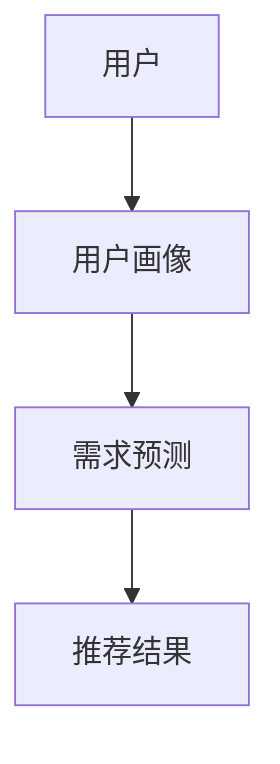
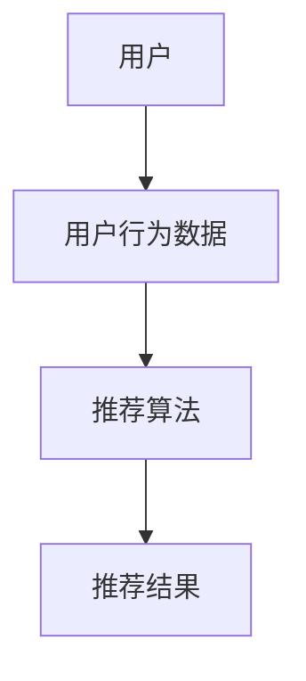
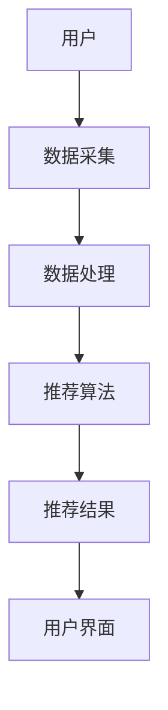

                 


```markdown
# AI Agent在企业精准营销与个性化推荐中的应用

> 关键词：AI Agent，企业精准营销，个性化推荐，机器学习，推荐算法，数据驱动

> 摘要：本文探讨AI Agent在企业精准营销与个性化推荐中的应用，分析其核心概念、算法原理及系统架构，结合实际案例和代码实现，为企业提供实践指导。

---

## 第一部分: AI Agent在企业精准营销与个性化推荐中的应用概述

### 第1章: AI Agent的基本概念与背景

#### 1.1 AI Agent的定义与核心概念
AI Agent（人工智能代理）是指能够感知环境并采取行动以实现目标的智能体。在企业营销领域，AI Agent主要用于精准营销和个性化推荐。

#### 1.2 AI Agent的发展历程
从传统营销到数据驱动营销，AI Agent的出现标志着营销技术的升级。传统营销依赖人工经验，而AI Agent通过大数据和机器学习实现精准营销，显著提高了效率和效果。

#### 1.3 AI Agent在精准营销中的应用场景
个性化推荐系统、精准广告投放、客户行为预测与分析、客户分群与画像构建是AI Agent的主要应用场景。例如，电商网站使用AI Agent根据用户浏览和购买记录推荐商品。

#### 1.4 本章小结
本章介绍了AI Agent的基本概念、发展历程和应用场景，为后续内容打下基础。

---

## 第二部分: AI Agent的核心概念与原理

### 第2章: AI Agent的核心概念与联系

#### 2.1 AI Agent的核心原理
AI Agent通过数据驱动的推荐算法和机器学习模型实现精准营销。推荐算法包括协同过滤、内容推荐和混合推荐，机器学习模型则用于预测用户行为。

#### 2.2 核心概念对比表
| 概念       | 特点                   | 示例场景                 |
|------------|-----------------------|--------------------------|
| 用户画像   | 基于数据构建用户特征   | 基于购买记录推荐商品     |
| 需求预测   | 预测用户潜在需求       | 基于历史数据预测销售趋势 |
| 场景化推荐 | 根据场景动态调整推荐   | 根据时间推荐不同产品     |

#### 2.3 ER实体关系图


#### 2.4 本章小结
本章通过对比表和ER图展示了AI Agent的核心概念及其相互关系。

---

## 第三部分: AI Agent的算法原理与数学模型

### 第3章: 推荐算法原理

#### 3.1 协同过滤算法
协同过滤算法包括基于用户的协同过滤和基于物品的协同过滤，以及混合推荐算法。其流程如下：

##### 3.1.1 基于用户的协同过滤
1. 找出与目标用户相似的用户群体。
2. 根据这些用户的喜好推荐商品。

##### 3.1.2 基于物品的协同过滤
1. 找出与目标用户已购买商品相似的其他商品。
2. 推荐这些相似商品。

##### 3.1.3 混合推荐算法
结合基于用户的协同过滤和基于物品的协同过滤，利用两者的优势进行推荐。

##### 3.2 算法流程图


##### 3.3 算法实现
以下是协同过滤算法的Python实现示例：

```python
import numpy as np

def user_based_recommender(data, user_id, num_recommendations=5):
    # 计算用户相似度
    user_similarity = np.dot(data.T, data)
    # 排除自己相似度
    np.fill_diagonal(user_similarity, 0)
    # 找出最相似的用户
    similar_users = np.argsort(user_similarity[user_id])[::-1]
    # 推荐商品
    recommendations = []
    for user in similar_users[:3]:
        recommendations.extend(list(data[user]))
    # 去重并排序
    recommendations = list(set(recommendations))
    recommendations.sort(key=lambda x: -data[user_id].count(x))
    return recommendations[:num_recommendations]

data = {
    0: [1, 2, 3],
    1: [2, 3, 4],
    2: [3, 4, 5],
    3: [4, 5, 6]
}

user_id = 0
print(user_based_recommender(data, user_id))
```

#### 3.4 本章小结
本章详细讲解了协同过滤算法及其在AI Agent中的应用，通过代码示例加深理解。

---

## 第四部分: AI Agent的系统架构与实现

### 第4章: 系统架构设计

#### 4.1 系统功能设计
- 用户画像构建模块
- 需求预测模块
- 推荐算法模块
- 推荐结果展示模块

#### 4.2 系统架构设计


#### 4.3 接口设计
- 数据接口：负责数据的输入和输出
- 算法接口：负责推荐算法的调用和结果返回

#### 4.4 本章小结
本章详细讲解了AI Agent的系统架构设计，包括功能模块、架构图和接口设计。

---

## 第五部分: 项目实战与最佳实践

### 第5章: 项目实战

#### 5.1 环境搭建
- 安装必要的Python库：numpy、pandas、scikit-learn

#### 5.2 核心代码实现
以下是基于协同过滤算法的推荐系统实现：

```python
from sklearn.metrics.pairwise import cosine_similarity

def item_based_recommender(data, user_id, num_recommendations=5):
    # 创建用户-商品矩阵
    user_item_matrix = data.T
    # 计算余弦相似度
    similarity = cosine_similarity(user_item_matrix)
    # 找出与目标用户相似的物品
    similar_items = np.argsort(similarity[user_id])[::-1]
    # 推荐商品
    recommendations = []
    for item in similar_items[:3]:
        recommendations.extend(list(data[item]))
    # 去重并排序
    recommendations = list(set(recommendations))
    recommendations.sort(key=lambda x: -data[user_id].count(x))
    return recommendations[:num_recommendations]

data = {
    0: [1, 2, 3],
    1: [2, 3, 4],
    2: [3, 4, 5],
    3: [4, 5, 6]
}

user_id = 0
print(item_based_recommender(data, user_id))
```

#### 5.3 测试与优化
测试推荐系统的准确性和召回率，优化算法参数以提高推荐效果。

#### 5.4 案例分析
通过具体案例分析，展示AI Agent在实际营销中的应用效果。

#### 5.5 本章小结
本章通过项目实战，详细讲解了AI Agent的实现过程，包括环境搭建、代码实现和案例分析。

---

## 第六部分: 总结与展望

### 第6章: 总结与展望

#### 6.1 核心观点总结
AI Agent通过数据驱动和机器学习，实现企业精准营销和个性化推荐，显著提高营销效果。

#### 6.2 未来展望
随着AI技术的发展，AI Agent在营销领域的应用将更加广泛，推荐算法也将更加智能化和个性化。

#### 6.3 最佳实践Tips
- 数据质量是关键，确保数据的准确性和完整性。
- 选择合适的推荐算法，根据业务需求进行调整和优化。
- 定期更新用户画像和推荐模型，保持推荐的准确性和时效性。

#### 6.4 本章小结
本章总结了AI Agent的核心观点，展望了未来的发展，并提供了最佳实践建议。

---

## 第七部分: 参考文献与拓展阅读

### 7.1 参考文献
- [1] 《机器学习实战》
- [2] 《推荐系统实践》
- [3] 《人工智能导论》

### 7.2 拓展阅读
- 推荐系统论文阅读
- 最新AI技术在营销中的应用研究

---

## 结语

通过本文的详细讲解，读者可以全面了解AI Agent在企业精准营销与个性化推荐中的应用，掌握其核心概念、算法原理和系统架构，并通过实际案例和代码实现，提升自身的技术能力。

---

# END
```

