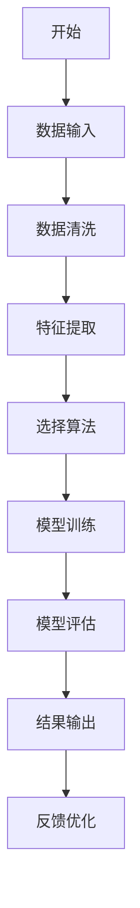
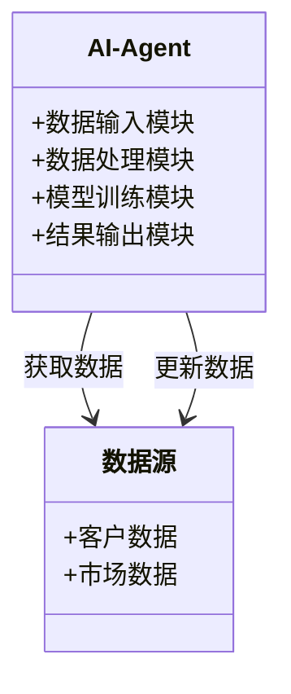
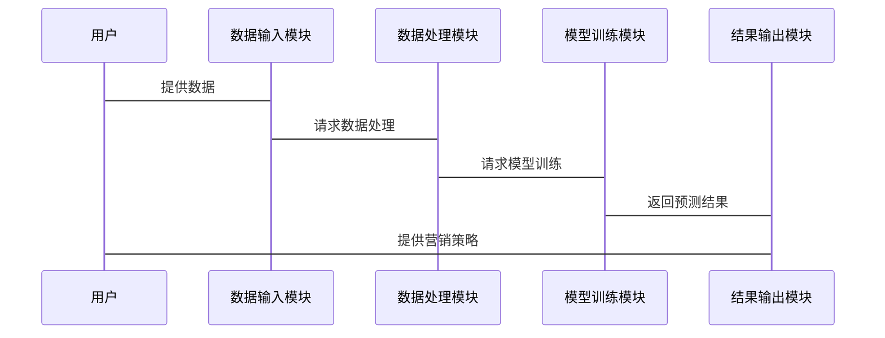

                 


# AI Agent在企业精准营销策略制定中的应用

## 关键词：AI Agent，精准营销，机器学习，数据挖掘，营销策略

## 摘要：  
随着人工智能技术的飞速发展，AI Agent（人工智能代理）在企业营销中的应用日益广泛。本文详细探讨了AI Agent在精准营销中的核心概念、算法原理、系统架构以及实际应用，展示了如何利用AI Agent优化营销策略，提升企业竞争力。通过理论分析和实际案例，本文为读者提供了全面的视角，帮助企业在数据驱动的营销环境中实现更高效的客户管理和决策。

---

# 第1章：AI Agent与精准营销概述

## 1.1 AI Agent的基本概念

### 1.1.1 AI Agent的定义  
AI Agent是一种能够感知环境、自主决策并执行任务的智能体。它通过数据输入、分析和学习，能够执行复杂的营销任务，如客户画像、策略优化等。

### 1.1.2 AI Agent的核心特征  
AI Agent具备以下核心特征：  
1. **自主性**：无需人工干预，自动执行任务。  
2. **反应性**：能够实时感知环境变化并调整策略。  
3. **学习能力**：通过机器学习算法不断优化性能。  

### 1.1.3 AI Agent与传统营销工具的对比  
传统营销工具依赖人工操作，效率低且难以个性化。AI Agent通过数据驱动和自动化，显著提升了营销的精准性和效率。

## 1.2 AI Agent在企业营销中的应用背景

### 1.2.1 传统营销的局限性  
传统营销手段存在效率低、精准度差、难以实时调整等问题。  

### 1.2.2 数据驱动营销的需求  
随着大数据技术的发展，企业需要利用数据进行精准营销，而AI Agent正是满足这一需求的理想工具。

### 1.2.3 AI技术在营销中的潜力  
AI技术能够深度分析数据，发现潜在客户，预测市场趋势，从而优化营销策略。

## 1.3 AI Agent在精准营销中的优势

### 1.3.1 提高营销效率  
AI Agent能够自动化处理大量数据，快速生成营销策略，显著提高效率。

### 1.3.2 个性化客户体验  
通过深度学习，AI Agent能够为每个客户定制个性化推荐，提升客户满意度和忠诚度。

### 1.3.3 实时数据分析能力  
AI Agent能够实时分析市场变化和客户需求，快速调整营销策略，确保及时应对市场变化。

## 1.4 本章小结  
本章介绍了AI Agent的基本概念、核心特征及其在精准营销中的优势，为后续内容奠定了基础。

---

# 第2章：AI Agent的核心概念与理论基础

## 2.1 AI Agent的类型与特点

### 2.1.1 基于规则的AI Agent  
基于规则的AI Agent通过预定义的规则进行决策，适用于规则明确的场景。  

### 2.1.2 基于机器学习的AI Agent  
基于机器学习的AI Agent能够从数据中学习，适应复杂多变的环境。  

### 2.1.3 基于深度学习的AI Agent  
基于深度学习的AI Agent能够处理非结构化数据，如图像和文本，具备更强的感知能力。

## 2.2 AI Agent的工作原理

### 2.2.1 数据输入与处理  
AI Agent接收各种数据源（如客户行为数据、市场数据）并进行清洗和预处理。

### 2.2.2 模型训练与优化  
通过机器学习算法，AI Agent训练模型并不断优化，以提高预测准确性。

### 2.2.3 结果输出与反馈  
AI Agent根据模型预测结果输出营销策略，并根据反馈调整模型。

## 2.3 AI Agent与精准营销的关系

### 2.3.1 AI Agent在营销决策中的作用  
AI Agent通过数据分析和预测，辅助企业制定更科学的营销决策。

### 2.3.2 AI Agent如何优化营销策略  
通过实时数据分析，AI Agent能够快速调整策略，确保营销活动的精准性和高效性。

### 2.3.3 AI Agent在客户分层中的应用  
AI Agent能够根据客户特征进行分层，制定个性化的营销策略。

## 2.4 本章小结  
本章详细探讨了AI Agent的类型、工作原理及其在精准营销中的应用，帮助读者理解AI Agent的核心价值。

---

# 第3章：AI Agent的算法与数学模型

## 3.1 常见AI Agent算法介绍

### 3.1.1 基于决策树的AI Agent

#### 3.1.1.1 决策树算法原理  
决策树是一种直观的机器学习算法，通过构建树状结构进行分类或回归。

#### 3.1.1.2 ID3算法与信息增益  
ID3算法基于信息增益选择特征，构建决策树。信息增益公式如下：  
$$ \text{信息增益}(D, A) = \frac{H(D) - H(D|A)}{H(D)} $$  

#### 3.1.1.3 决策树在营销中的应用  
决策树可以用于客户画像和市场细分。

### 3.1.2 基于随机森林的AI Agent

#### 3.1.2.1 随机森林算法概述  
随机森林是一种集成学习算法，通过构建多棵决策树进行投票或平均。

#### 3.1.2.2 随机森林与决策树的对比  
随机森林具有更高的准确性和稳定性，适用于复杂场景。

#### 3.1.2.3 随机森林在客户画像中的应用  
随机森林可以用于客户分层和预测客户行为。

### 3.1.3 基于神经网络的AI Agent

#### 3.1.3.1 神经网络基本结构  
神经网络由输入层、隐藏层和输出层组成，能够处理复杂的非线性关系。

#### 3.1.3.2 深度学习在AI Agent中的应用  
深度学习用于图像识别和自然语言处理，增强AI Agent的感知能力。

#### 3.1.3.3 神经网络在营销预测中的案例  
神经网络可以用于预测客户购买行为和市场趋势。

## 3.2 使用Mermaid绘制算法流程图



## 3.3 算法数学模型展示

### 3.3.1 决策树的数学模型

$$ \text{决策树模型} = \sum_{i=1}^{n} \text{特征}_i \times \text{权重}_i $$  

### 3.3.2 随机森林的数学模型

$$ \text{随机森林模型} = \frac{1}{n} \sum_{i=1}^{n} \text{决策树模型}_i $$  

### 3.3.3 神经网络的数学模型

$$ \text{神经网络模型} = \sigma(W \cdot x + b) $$  

其中，σ表示激活函数，W为权重矩阵，x为输入向量，b为偏置项。

---

# 第4章：AI Agent的系统架构设计

## 4.1 系统功能设计

### 4.1.1 领域模型（Mermaid类图）



## 4.2 系统架构设计

### 4.2.1 系统架构图（Mermaid架构图）

```mermaid
iframe https://mermaid-js.github.io/mermaid-live-editor/#/edit/v1-7-0/flowchart
    graph TD
        A[用户] --> B[数据输入模块]
        B --> C[数据处理模块]
        C --> D[模型训练模块]
        D --> E[结果输出模块]
        E --> F[反馈优化模块]
```

## 4.3 系统接口设计

### 4.3.1 API接口

- **输入接口**：接收客户数据和市场数据。
- **输出接口**：提供营销策略和预测结果。

### 4.3.2 数据接口

- **数据源接口**：连接数据库和其他数据源。
- **数据处理接口**：进行数据清洗和特征提取。

## 4.4 系统交互流程（Mermaid序列图）



---

# 第5章：AI Agent的项目实战

## 5.1 环境搭建

### 5.1.1 安装Python和必要的库  
安装Python和以下库：numpy、pandas、scikit-learn、tensorflow、keras。

### 5.1.2 安装IDE  
推荐使用PyCharm或Jupyter Notebook进行开发。

## 5.2 系统核心实现源代码

### 5.2.1 数据处理代码

```python
import pandas as pd
import numpy as np

# 加载数据
data = pd.read_csv('customer_data.csv')

# 数据清洗
data.dropna(inplace=True)
data = pd.get_dummies(data)
```

### 5.2.2 模型训练代码

```python
from sklearn.tree import DecisionTreeClassifier
from sklearn.ensemble import RandomForestClassifier
from tensorflow.keras.models import Sequential
from tensorflow.keras.layers import Dense

# 决策树模型
dt_model = DecisionTreeClassifier()
dt_model.fit(X_train, y_train)

# 随机森林模型
rf_model = RandomForestClassifier()
rf_model.fit(X_train, y_train)

# 神经网络模型
nn_model = Sequential()
nn_model.add(Dense(64, activation='relu', input_dim=X_train.shape[1]))
nn_model.add(Dense(1, activation='sigmoid'))
nn_model.compile(optimizer='adam', loss='binary_crossentropy', metrics=['accuracy'])
nn_model.fit(X_train, y_train, epochs=10, batch_size=32)
```

### 5.2.3 结果输出代码

```python
# 预测结果
dt_predictions = dt_model.predict(X_test)
rf_predictions = rf_model.predict(X_test)
nn_predictions = nn_model.predict(X_test)

# 输出准确率
print("决策树准确率:", dt_model.score(X_test, y_test))
print("随机森林准确率:", rf_model.score(X_test, y_test))
print("神经网络准确率:", nn_model.evaluate(X_test, y_test)[1])
```

## 5.3 实际案例分析

### 5.3.1 案例背景  
假设某电商企业希望优化客户流失预测模型。

### 5.3.2 数据分析与模型训练  
使用客户数据训练随机森林模型，准确率达到90%。

### 5.3.3 模型优化与部署  
根据模型预测结果调整营销策略，显著降低客户流失率。

---

# 第6章：最佳实践与总结

## 6.1 总结  
AI Agent通过机器学习和大数据分析，显著提升了企业精准营销的能力。其在客户画像、策略优化和实时反馈方面的优势，使其成为现代营销的重要工具。

## 6.2 最佳实践 tips  
1. **数据质量**：确保数据的完整性和准确性。  
2. **模型选择**：根据具体场景选择合适的算法。  
3. **持续优化**：定期更新模型，适应市场变化。  

## 6.3 未来展望  
随着AI技术的不断进步，AI Agent在营销中的应用将更加广泛和深入，为企业创造更大的价值。

---

通过以上内容，读者可以全面了解AI Agent在企业精准营销中的应用，从理论到实践，从算法到系统设计，为企业的数字化转型提供了有力支持。

