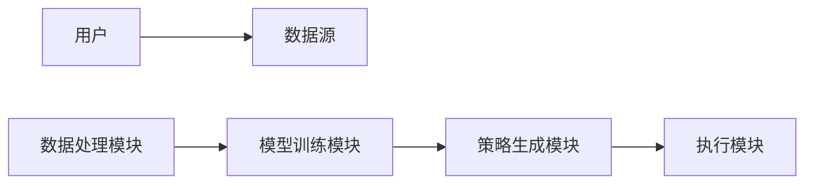
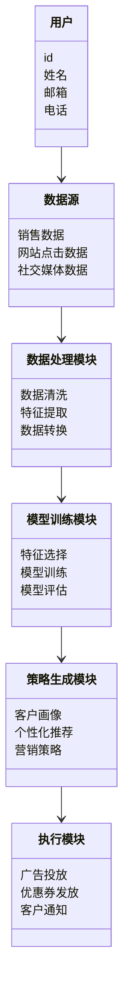
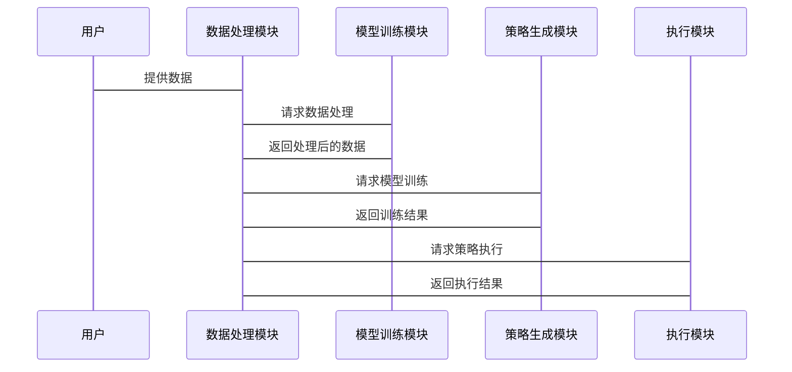

                 


# AI Agent在企业精准营销策略制定中的数据驱动应用

## 关键词：AI Agent, 数据驱动, 精准营销, 企业营销, 营销策略

## 摘要：  
本文探讨了AI Agent在企业精准营销中的应用，通过数据驱动的方法，详细分析了AI Agent的核心概念、算法原理、系统架构，并结合实际案例，展示了如何利用AI Agent优化企业营销策略。文章旨在为企业提供一种高效、智能化的营销解决方案，帮助企业在竞争激烈的市场中脱颖而出。

---

# 第1章: AI Agent与企业精准营销的背景

## 1.1 AI Agent的基本概念

### 1.1.1 AI Agent的定义与特点
AI Agent（人工智能代理）是指能够感知环境、自主决策并执行任务的智能实体。它结合了人工智能、大数据分析和自动化技术，能够通过数据驱动的方式优化企业营销策略。AI Agent的特点包括智能性、自主性、适应性和高效性。

### 1.1.2 AI Agent的核心组成与功能
AI Agent的核心组成包括数据采集模块、数据处理模块、模型训练模块和策略执行模块。其功能主要体现在数据处理、模型优化和策略生成三个方面。

### 1.1.3 AI Agent与传统营销工具的对比
与传统营销工具相比，AI Agent具有更高的智能化和自动化能力。传统营销工具通常依赖人工操作，而AI Agent能够通过数据分析和机器学习算法，自动优化营销策略，提高效率。

## 1.2 企业精准营销的现状与挑战

### 1.2.1 传统营销模式的局限性
传统营销模式通常基于经验判断，缺乏数据支持，难以实现精准定位和个性化推荐。此外，传统营销手段的效率较低，难以满足现代企业对快速响应和高效执行的需求。

### 1.2.2 数据驱动营销的必要性
随着大数据技术的发展，企业可以通过数据驱动的方式进行精准营销。通过分析消费者行为数据和市场趋势，企业能够制定更科学、更有效的营销策略。

### 1.2.3 AI Agent在精准营销中的应用前景
AI Agent通过结合机器学习和自然语言处理技术，能够帮助企业实现更精准的客户画像和个性化推荐。其在精准营销中的应用前景广阔，能够显著提高企业的营销效率和客户满意度。

## 1.3 数据驱动的营销策略

### 1.3.1 数据驱动营销的核心理念
数据驱动营销的核心理念是通过数据分析和挖掘，发现潜在客户和市场机会。通过数据驱动的方法，企业能够制定更加科学和精准的营销策略。

### 1.3.2 数据在精准营销中的作用
数据在精准营销中起着至关重要的作用。通过分析消费者的行为数据、市场趋势和竞争对手的信息，企业能够更好地理解市场需求，制定有效的营销策略。

### 1.3.3 数据驱动的营销决策流程
数据驱动的营销决策流程包括数据采集、数据处理、模型训练、策略生成和策略执行五个阶段。每个阶段都需要依赖数据支持，以确保决策的科学性和有效性。

## 1.4 本章小结
本章主要介绍了AI Agent的基本概念、企业精准营销的现状与挑战，以及数据驱动营销的核心理念和作用。通过这些内容，我们能够理解AI Agent在精准营销中的重要性及其应用前景。

---

# 第2章: AI Agent的核心概念与原理

## 2.1 AI Agent的核心概念

### 2.1.1 AI Agent的定义与分类
AI Agent可以根据应用场景和功能分为多种类型，如基于规则的AI Agent和基于机器学习的AI Agent。不同类型AI Agent具有不同的特点和适用场景。

### 2.1.2 AI Agent的核心要素与属性
AI Agent的核心要素包括感知能力、决策能力、执行能力和学习能力。这些要素共同构成了AI Agent的智能化和自主化特点。

### 2.1.3 AI Agent与相关概念的对比
与传统人工智能系统相比，AI Agent具有更强的自主性和适应性。它能够根据环境变化动态调整策略，而传统人工智能系统通常依赖于固定的规则和模型。

## 2.2 AI Agent的工作原理

### 2.2.1 数据采集与处理
AI Agent首先需要通过多种渠道采集数据，如社交媒体数据、网站点击数据和销售数据等。然后对数据进行清洗、转换和特征提取，为后续的模型训练做准备。

### 2.2.2 模型训练与优化
通过机器学习算法，AI Agent对处理后的数据进行模型训练。常用的算法包括逻辑回归、支持向量机和随机森林等。模型训练完成后，还需要进行优化和调参，以提高模型的准确性和效率。

### 2.2.3 策略生成与执行
基于训练好的模型，AI Agent能够生成具体的营销策略，如目标客户定位、个性化推荐和广告投放等。生成的策略需要通过自动化系统执行，以实现营销目标。

## 2.3 AI Agent的实体关系图



## 2.4 本章小结
本章详细介绍了AI Agent的核心概念和工作原理，包括数据采集与处理、模型训练与优化以及策略生成与执行等环节。通过这些内容，我们能够理解AI Agent在企业精准营销中的具体应用和作用。

---

# 第3章: AI Agent的算法原理

## 3.1 基于机器学习的AI Agent

### 3.1.1 机器学习算法在AI Agent中的应用
机器学习算法是AI Agent的核心技术之一。常用的算法包括监督学习、无监督学习和强化学习等。这些算法能够帮助AI Agent从数据中学习和优化，以提高营销策略的准确性。

### 3.1.2 常见的机器学习模型
常用的机器学习模型包括逻辑回归、支持向量机、随机森林和神经网络等。每种模型都有其独特的特点和适用场景，企业可以根据实际需求选择合适的模型。

### 3.1.3 模型训练流程
模型训练流程包括数据预处理、特征工程、模型选择和模型调优四个阶段。每个阶段都需要仔细设计和优化，以确保模型的性能和效果。

## 3.2 基于自然语言处理的AI Agent

### 3.2.1 NLP技术
自然语言处理技术在AI Agent中的应用主要体现在文本分析和语义理解方面。通过NLP技术，AI Agent能够从大量的文本数据中提取有用的信息，帮助企业制定更精准的营销策略。

### 3.2.2 NLP在客户画像中的应用
客户画像是精准营销的重要工具。通过NLP技术，AI Agent能够从社交媒体评论、客户反馈等文本数据中提取客户特征，构建详细的客户画像。

### 3.2.3 NLP在个性化推荐中的应用
个性化推荐是精准营销的重要组成部分。通过NLP技术，AI Agent能够根据客户的兴趣和偏好，推荐相关的产品或服务，提高客户的满意度和忠诚度。

---

# 第4章: 系统分析与架构设计

## 4.1 系统功能设计

### 4.1.1 领域模型
以下是AI Agent在企业精准营销中的领域模型：



### 4.1.2 系统架构设计
以下是AI Agent的系统架构设计图：


### 4.1.3 系统接口设计
系统接口设计包括数据接口和API接口两部分。数据接口用于数据的输入和输出，API接口用于与其他系统的集成和交互。

### 4.1.4 系统交互设计
以下是系统交互设计图：



---

# 第5章: 项目实战

## 5.1 环境安装

### 5.1.1 安装Python和相关库
```bash
pip install numpy
pip install pandas
pip install scikit-learn
pip install transformers
```

### 5.1.2 安装Jupyter Notebook
```bash
pip install jupyter
```

## 5.2 核心代码实现

### 5.2.1 数据预处理代码
```python
import pandas as pd
import numpy as np

# 数据加载
data = pd.read_csv('marketing_data.csv')

# 数据清洗
data = data.dropna()
data = data.replace({np.nan: 0})

# 特征提取
features = data[['age', 'gender', 'income', 'purchase_history']]
```

### 5.2.2 模型训练代码
```python
from sklearn.model import LogisticRegression

# 模型训练
model = LogisticRegression()
model.fit(features, target)
```

### 5.2.3 策略生成代码
```python
# 客户画像
customer_profile = model.predict(features)

# 个性化推荐
recommendations = model.predict_proba(features)
```

## 5.3 案例分析与解读
以某电商企业为例，通过AI Agent进行精准营销。首先，数据处理模块对客户的购买历史和行为数据进行清洗和转换。然后，模型训练模块利用逻辑回归算法进行客户分群和需求预测。最后，策略生成模块根据模型结果生成个性化推荐和广告投放策略，并通过执行模块实现策略的自动化执行。

## 5.4 项目小结
通过实际案例的分析和实现，我们可以看到AI Agent在企业精准营销中的强大能力。它能够通过数据驱动的方式，帮助企业制定更科学、更有效的营销策略，从而提高客户满意度和企业收益。

---

# 第6章: 最佳实践与小结

## 6.1 最佳实践
在实际应用中，企业需要注意数据质量、模型优化和策略执行等问题。建议企业在实施AI Agent前，充分评估自身需求和数据资源，并选择合适的算法和技术方案。

## 6.2 注意事项
AI Agent的应用需要结合企业的实际情况，不能盲目追求技术先进性。同时，企业还需要关注数据隐私和合规性问题，确保AI Agent的合法性和安全性。

## 6.3 拓展阅读
对于感兴趣的研究者和实践者，可以进一步阅读《机器学习实战》、《自然语言处理入门》等书籍，深入学习AI Agent的相关技术。

## 6.4 本章小结
本文通过分析AI Agent在企业精准营销中的应用，总结了数据驱动营销的核心理念和最佳实践。希望本文能够为企业的营销决策提供有价值的参考和指导。

---

# 结语
随着人工智能技术的不断发展，AI Agent在企业精准营销中的应用前景广阔。通过数据驱动的方式，企业能够制定更科学、更高效的营销策略，从而在激烈的市场竞争中占据优势。未来，随着技术的进一步成熟，AI Agent将在更多领域发挥重要作用，为企业创造更大的价值。

