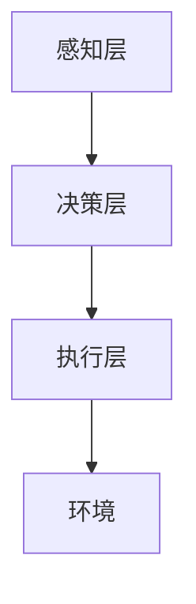

                 


# AI Agent在企业组织文化评估与塑造中的应用

## 关键词：AI Agent, 企业文化评估, 企业文化塑造, 人工智能, 组织文化管理, 系统架构设计

## 摘要：
本文探讨了AI Agent在企业组织文化评估与塑造中的应用，详细分析了AI Agent的核心原理、系统架构，并通过实际案例展示了其在企业文化管理中的应用。文章从理论到实践，系统地介绍了如何利用AI技术优化企业文化管理，为企业提供了一个创新的解决方案。

---

# 第1章: AI Agent与企业组织文化概述

## 1.1 AI Agent的基本概念

### 1.1.1 AI Agent的定义与特点
- **定义**：AI Agent（人工智能代理）是指能够感知环境、自主决策并执行任务的智能实体。
- **特点**：
  - 智能性：能够处理复杂信息并做出决策。
  - 自主性：无需人工干预，自主完成任务。
  - 反应性：实时感知环境变化并调整行为。
  - 学习能力：通过数据和经验不断优化自身能力。

### 1.1.2 AI Agent与传统组织管理的区别
- **传统管理**：依赖人工分析和经验判断，效率较低，且主观性较强。
- **AI Agent**：通过数据驱动，快速分析并提供优化建议，具有更高的效率和准确性。

### 1.1.3 AI Agent在企业中的应用前景
- 提高企业文化管理的效率和精准度。
- 为企业提供数据驱动的决策支持。
- 优化组织文化，提升员工满意度和企业绩效。

## 1.2 企业组织文化的核心要素

### 1.2.1 企业文化的定义与内涵
- 企业文化是指企业在长期经营中形成的，全体员工共同遵循的价值观、行为规范和思维方式。

### 1.2.2 企业文化评估的关键指标
- 价值观一致性：员工是否认同企业核心价值观。
- 行为规范遵循度：员工行为是否符合企业规范。
- 员工满意度：员工对企业的认可度和归属感。
- 团队协作性：团队之间的协作效率和默契程度。

### 1.2.3 企业文化塑造的目标与方法
- **目标**：构建积极向上的企业文化，提升员工凝聚力和企业竞争力。
- **方法**：通过培训、激励机制和文化宣导等方式，逐步塑造企业文化。

## 1.3 AI Agent在企业文化管理中的作用

### 1.3.1 AI Agent在文化评估中的优势
- **数据驱动**：通过分析大量数据，准确评估企业文化现状。
- **实时反馈**：快速识别文化问题并提供解决方案。
- **个性化建议**：根据企业具体情况，提供定制化建议。

### 1.3.2 AI Agent在文化塑造中的创新点
- **智能化设计**：AI Agent能够自主学习并优化文化管理策略。
- **动态调整**：根据企业环境变化，实时调整文化管理措施。
- **跨部门协作**：促进各部门之间的信息共享和协作。

### 1.3.3 AI Agent对企业文化管理的整体价值
- 提高企业文化管理的科学性和效率。
- 为企业提供数据支持，优化管理决策。
- 帮助企业在复杂环境中保持竞争优势。

## 1.4 本章小结
本章介绍了AI Agent的基本概念和特点，分析了其与传统组织管理的区别，探讨了企业文化的核心要素，并阐述了AI Agent在企业文化管理中的重要作用。通过这些内容，读者可以初步了解AI Agent在企业文化管理中的潜力和价值。

---

# 第2章: AI Agent的核心原理

## 2.1 AI Agent的基本原理

### 2.1.1 AI Agent的感知与决策机制
- **感知**：通过传感器或数据分析工具，获取环境中的相关信息。
- **决策**：基于感知到的信息，利用算法进行分析和判断，制定最优决策。

### 2.1.2 AI Agent的行为规划与执行
- **规划**：根据决策结果，制定具体的行动方案。
- **执行**：按照规划的方案，执行具体的任务。

### 2.1.3 AI Agent的学习与优化能力
- **学习**：通过机器学习算法，不断优化自身的决策和执行能力。
- **优化**：根据执行结果，调整策略，提高效率和准确性。

## 2.2 AI Agent的算法基础

### 2.2.1 基于规则的AI Agent
- **特点**：依赖预定义的规则和逻辑，适合处理规则明确的问题。
- **优缺点**：
  - 优点：简单易懂，实现成本低。
  - 缺点：适应性差，无法处理复杂问题。

### 2.2.2 基于模型的AI Agent
- **特点**：基于数学模型和知识库进行推理和决策。
- **优缺点**：
  - 优点：能够处理复杂问题，适应性强。
  - 缺点：模型构建复杂，需要大量数据支持。

### 2.2.3 基于强化学习的AI Agent
- **特点**：通过与环境的交互，不断优化自身的决策策略。
- **优缺点**：
  - 优点：适应性强，能够处理动态变化的环境。
  - 缺点：需要大量数据和计算资源。

## 2.3 AI Agent的系统架构

### 2.3.1 分层架构
- **感知层**：负责数据的采集和处理。
- **决策层**：负责策略的制定和优化。
- **执行层**：负责具体任务的执行。

### 2.3.2 微服务架构
- **特点**：将系统划分为多个独立的服务，每个服务负责特定的功能。
- **优势**：模块化程度高，易于扩展和维护。

---

**图2-1 AI Agent的分层架构图**



## 2.4 本章小结
本章详细介绍了AI Agent的核心原理，包括感知、决策和执行的机制，分析了不同算法的基础，并探讨了系统的架构设计。通过这些内容，读者可以理解AI Agent在企业组织文化管理中的技术基础。

---

# 第3章: AI Agent在企业文化评估中的应用

## 3.1 企业文化评估模型的构建

### 3.1.1 文化评估的核心维度
- **价值观一致性**：员工是否认同企业核心价值观。
- **行为规范遵循度**：员工行为是否符合企业规范。
- **员工满意度**：员工对企业的认可度和归属感。
- **团队协作性**：团队之间的协作效率和默契程度。

### 3.1.2 评估模型的构建方法
- **数据采集**：通过问卷调查、访谈等方式收集数据。
- **数据分析**：利用统计学方法和机器学习算法，分析数据并提取特征。
- **模型构建**：基于分析结果，构建企业文化评估模型。

### 3.1.3 评估模型的验证与优化
- **验证**：通过实际数据验证模型的准确性和可靠性。
- **优化**：根据验证结果，调整模型参数，提高评估效果。

### 3.1.4 企业文化评估模型的实现步骤
1. **数据采集**：设计问卷并收集数据。
2. **数据分析**：利用Python进行数据清洗和分析。
3. **模型构建**：基于数据分析结果，构建评估模型。
4. **模型验证**：通过实际数据验证模型的准确性。
5. **模型优化**：根据验证结果，优化模型参数。

## 3.2 企业文化评估的系统实现

### 3.2.1 系统功能设计
- **数据采集模块**：负责采集企业文化相关的数据。
- **数据分析模块**：负责对数据进行清洗和分析。
- **评估模型模块**：负责构建和优化企业文化评估模型。
- **结果展示模块**：负责展示评估结果和优化建议。

### 3.2.2 系统实现的代码示例

```python
import pandas as pd
from sklearn.model_selection import train_test_split
from sklearn.ensemble import RandomForestClassifier
from sklearn.metrics import accuracy_score

# 数据加载
data = pd.read_csv('culture_data.csv')

# 数据预处理
X = data.drop('culture_type', axis=1)
y = data['culture_type']

# 数据划分
X_train, X_test, y_train, y_test = train_test_split(X, y, test_size=0.2, random_state=42)

# 模型训练
model = RandomForestClassifier()
model.fit(X_train, y_train)

# 模型预测
y_pred = model.predict(X_test)

# 模型评估
accuracy = accuracy_score(y_test, y_pred)
print(f'模型准确率为: {accuracy}')
```

### 3.2.3 评估结果的分析与解读
- **准确率**：模型对文化类型的分类准确率。
- **混淆矩阵**：分析模型在各个文化类型上的分类效果。
- **特征重要性**：识别影响企业文化的关键因素。

## 3.3 本章小结
本章详细介绍了AI Agent在企业文化评估中的应用，包括评估模型的构建方法和系统实现的步骤。通过具体的代码示例和分析，读者可以理解如何利用AI技术优化企业文化评估过程。

---

# 第4章: AI Agent在企业文化塑造中的应用

## 4.1 企业文化塑造的AI Agent框架

### 4.1.1 文化价值观的提炼
- **目标**：明确企业的核心价值观和文化理念。
- **方法**：通过数据分析和专家访谈，提炼文化价值观。

### 4.1.2 行为规范的制定
- **目标**：制定符合企业文化的员工行为规范。
- **方法**：基于数据分析结果，制定具体的行为准则。

### 4.1.3 文化传播与执行
- **目标**：通过有效的文化传播，提升员工对企业文化的认同感。
- **方法**：利用AI Agent进行文化传播和执行。

## 4.2 企业文化塑造的系统实现

### 4.2.1 系统功能设计
- **文化价值观提炼模块**：负责提炼企业的核心价值观。
- **行为规范制定模块**：负责制定员工行为规范。
- **文化传播模块**：负责通过多种渠道传播企业文化。

### 4.2.2 系统实现的代码示例

```python
import pandas as pd
from sklearn.naive_bayes import MultinomialNB
from sklearn.feature_extraction.text import TfidfVectorizer

# 数据加载
data = pd.read_csv('culture_text.csv')

# 特征提取
vectorizer = TfidfVectorizer()
X = vectorizer.fit_transform(data['text'])

# 模型训练
model = MultinomialNB()
model.fit(X, data['category'])

# 文化价值观提炼
def extract_culture(text):
    X_test = vectorizer.transform([text])
    prediction = model.predict(X_test)
    return data['category'].unique()[prediction[0]]

print(extract_culture("我们重视创新和团队合作"))
```

### 4.2.3 文化传播效果的评估
- **员工满意度**：评估文化传播的效果。
- **行为规范遵循度**：评估员工行为是否符合规范。
- **文化认同度**：评估员工对企业文化的认同程度。

## 4.3 本章小结
本章介绍了AI Agent在企业文化塑造中的应用，包括文化价值观的提炼、行为规范的制定和文化传播的实现。通过具体的代码示例和分析，读者可以理解如何利用AI技术优化企业文化塑造过程。

---

# 第5章: 项目实战——AI Agent在企业文化管理中的应用

## 5.1 项目背景与需求分析
- **项目背景**：某企业希望通过AI Agent优化企业文化管理。
- **需求分析**：需要构建一个能够评估和优化企业文化的AI Agent系统。

## 5.2 系统设计与实现

### 5.2.1 系统功能设计
- **数据采集模块**：负责采集企业文化相关的数据。
- **数据分析模块**：负责对数据进行清洗和分析。
- **评估模型模块**：负责构建和优化企业文化评估模型。
- **文化传播模块**：负责通过多种渠道传播企业文化。

### 5.2.2 系统实现的代码示例

```python
import pandas as pd
from sklearn.ensemble import RandomForestClassifier
from sklearn.metrics import accuracy_score

# 数据加载
data = pd.read_csv('culture_data.csv')

# 数据预处理
X = data.drop('culture_type', axis=1)
y = data['culture_type']

# 数据划分
X_train, X_test, y_train, y_test = train_test_split(X, y, test_size=0.2, random_state=42)

# 模型训练
model = RandomForestClassifier()
model.fit(X_train, y_train)

# 模型预测
y_pred = model.predict(X_test)

# 模型评估
accuracy = accuracy_score(y_test, y_pred)
print(f'模型准确率为: {accuracy}')
```

### 5.2.3 项目实现的步骤与注意事项
1. **需求分析**：明确项目目标和需求。
2. **系统设计**：设计系统的功能模块和架构。
3. **数据采集**：收集企业文化相关的数据。
4. **系统实现**：根据设计进行系统开发。
5. **测试与优化**：测试系统功能并进行优化。
6. **部署与应用**：将系统部署到实际环境中应用。

## 5.3 项目小结
本章通过一个实际案例展示了AI Agent在企业文化管理中的应用。通过系统的构建和实现，读者可以理解如何利用AI技术优化企业文化管理过程。

---

# 第6章: 系统优化与扩展

## 6.1 系统优化方案

### 6.1.1 数据处理效率的提升
- **优化方法**：通过并行计算和分布式处理提高数据处理效率。
- **工具推荐**：使用Dask或Spark进行大数据处理。

### 6.1.2 模型优化策略
- **优化方法**：通过超参数调优和模型集成提高模型性能。
- **工具推荐**：使用GridSearchCV和XGBoost进行模型优化。

### 6.1.3 系统架构优化
- **优化方法**：通过微服务架构和容器化技术提高系统的扩展性和可靠性。
- **工具推荐**：使用Docker和Kubernetes进行容器化部署。

## 6.2 系统扩展与应用

### 6.2.1 与其他技术的结合
- **区块链技术**：通过区块链技术确保数据的安全性和不可篡改性。
- **增强学习**：通过增强学习进一步提高系统的自适应能力。

### 6.2.2 应用场景扩展
- **跨企业应用**：将系统应用于多个企业，实现跨企业的文化管理。
- **国际化应用**：将系统扩展到不同国家和文化背景的企业。

## 6.3 本章小结
本章探讨了系统优化与扩展的策略，包括数据处理效率的提升、模型优化策略和系统架构优化等方面。同时，还讨论了系统与其他技术的结合和应用场景的扩展，为读者提供了系统的优化和扩展方向。

---

# 第7章: 总结与展望

## 7.1 全文总结
本文详细探讨了AI Agent在企业组织文化评估与塑造中的应用，从理论到实践，系统地介绍了如何利用AI技术优化企业文化管理。通过具体的案例分析和系统实现，读者可以理解AI Agent在企业文化管理中的潜力和价值。

## 7.2 未来展望
随着AI技术的不断发展，AI Agent在企业文化管理中的应用将更加广泛和深入。未来的研究方向可能包括：
- 更加智能化和个性化的文化评估与塑造方法。
- 多模态数据的融合与分析，提高系统的感知和决策能力。
- AI Agent与其他前沿技术（如区块链和增强学习）的结合，拓展应用范围。

## 7.3 最佳实践 Tips
- 在实际应用中，应注重数据的准确性和完整性。
- 系统设计时，应充分考虑可扩展性和可维护性。
- 在使用AI技术时，应关注数据隐私和模型的可解释性。

## 7.4 本章小结
本章总结了全文的主要内容，并展望了未来的研究方向和应用前景。通过这些内容，读者可以更好地理解AI Agent在企业文化管理中的应用价值，并为未来的实践提供参考。

---

# 附录: 工具与资源

## 附录A: 数据采集工具推荐
- **问卷星**：在线问卷调查工具。
- **Google Forms**：谷歌表单，适合小规模数据采集。
- **SurveyMonkey**：功能强大的在线调查工具。

## 附录B: 数据分析工具推荐
- **Python**：强大的数据分析和机器学习工具。
- **R语言**：适合统计分析和数据可视化的工具。
- **Tableau**：数据可视化工具。

## 附录C: 机器学习框架推荐
- **Scikit-learn**：经典的机器学习库。
- **XGBoost**：高效的梯度提升库。
- **Keras**：深度学习框架。

## 附录D: 开发与部署工具推荐
- **Docker**：容器化部署工具。
- **Kubernetes**：容器编排工具。
- **Jupyter Notebook**：数据科学常用的开发工具。

---

通过以上内容，读者可以系统地了解AI Agent在企业组织文化评估与塑造中的应用，并能够将其应用到实际的企业管理中。

