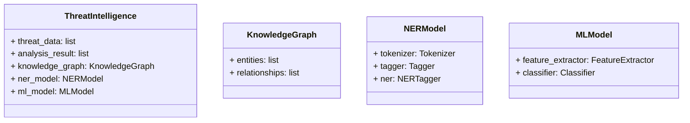
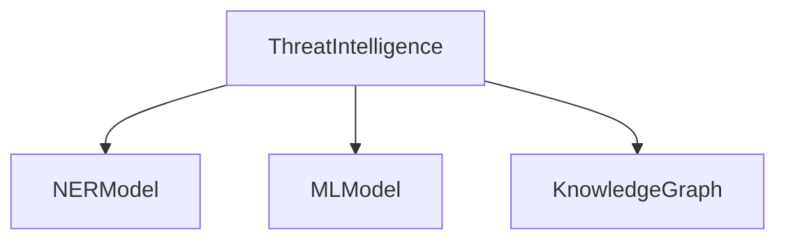

                 


# AI Agent在企业网络安全威胁情报分析中的应用

## 关键词：AI Agent，企业网络安全，威胁情报分析，机器学习，知识图谱，自然语言处理

## 摘要：  
随着企业网络安全威胁的日益复杂化，传统的安全分析方法已难以应对新型威胁。AI Agent作为一种智能代理，通过自然语言处理、机器学习和知识图谱等技术，能够高效地分析和处理威胁情报，为企业提供实时、精准的安全防护。本文将深入探讨AI Agent在企业网络安全威胁情报分析中的应用，从基础概念到技术实现，再到实际项目案例，全面解析其在网络安全中的重要价值和应用前景。

---

## 第1章: AI Agent与网络安全概述

### 1.1 AI Agent的基本概念

AI Agent（人工智能代理）是一种能够感知环境、自主决策并执行任务的智能实体。它结合了自然语言处理、机器学习和知识图谱等技术，能够理解复杂的数据，并通过推理和分析得出结论。AI Agent的核心优势在于其智能性和自主性，能够在无需人工干预的情况下完成复杂的任务。

#### 1.1.1 AI Agent的定义与特点  
- **定义**：AI Agent是一种智能系统，能够通过感知环境、分析数据、推理决策并执行操作。  
- **特点**：  
  - 智能性：能够理解和处理复杂数据。  
  - 自主性：无需人工干预即可执行任务。  
  - 适应性：能够根据环境变化调整行为。  
  - 可扩展性：能够集成多种技术，适用于不同场景。

#### 1.1.2 AI Agent在企业中的应用价值  
AI Agent在企业中的应用价值主要体现在以下几个方面：  
1. **自动化处理**：能够自动处理大量数据，提高效率。  
2. **智能决策**：通过分析数据，提供精准的决策支持。  
3. **实时监控**：能够实时监控系统状态，及时发现异常。  
4. **降低成本**：通过自动化和智能化手段，降低企业的人力成本。  

#### 1.1.3 网络安全领域的AI Agent发展现状  
近年来，AI Agent在网络安全领域的应用逐渐增多，尤其是在威胁情报分析、异常行为检测等方面表现出了显著优势。许多企业已经开始尝试将AI Agent应用于安全监控系统中，以提高安全防护能力。

### 1.2 企业网络安全威胁情报分析的背景

#### 1.2.1 网络安全威胁的复杂性与多样性  
随着信息技术的发展，网络安全威胁变得越来越复杂。传统的基于规则的威胁检测方法已难以应对新型威胁，如零日攻击、高级持续性威胁（APT）等。

#### 1.2.2 威胁情报分析的重要性  
威胁情报分析是企业网络安全的核心组成部分。通过对威胁情报的分析，企业能够了解当前的威胁态势，预测未来可能的攻击行为，并采取相应的防护措施。

#### 1.2.3 AI Agent在威胁情报分析中的作用  
AI Agent在威胁情报分析中的作用主要体现在以下几个方面：  
1. **自动化分析**：能够快速处理大量的威胁情报数据。  
2. **智能识别**：通过机器学习和自然语言处理技术，识别潜在的威胁。  
3. **知识图谱构建**：能够将分散的威胁情报整合成知识图谱，便于分析和推理。  

---

## 第2章: 威胁情报分析基础

### 2.1 �威脅情報の分類と特徴

#### 2.1.1 威胁情报的分类  
威胁情报可以根据其来源、类型和用途进行分类。常见的分类方式包括：  
1. **按来源分类**：内部日志、第三方情报源、公开漏洞数据库等。  
2. **按类型分类**：恶意软件、漏洞、攻击行为等。  
3. **按用途分类**：战术情报、技术情报、战略情报等。  

#### 2.1.2 不同类型 threat 情报の特徴分析  
- **恶意软件**：描述恶意软件的特征、行为和传播方式。  
- **漏洞**：描述系统的漏洞及其利用方式。  
- **攻击行为**：描述攻击者的攻击手法和目标。  

#### 2.1.3 威胁情报的特征  
- **实时性**：情报需要及时更新，以便企业能够及时采取防护措施。  
- **准确性**：情报必须准确，否则可能导致误判。  
- **可操作性**：情报必须能够被企业安全团队直接使用。  

---

### 2.2 威胁情报数据源

#### 2.2.1 内部日志データ  
企业内部的日志数据是威胁情报的重要来源之一。通过对内部日志的分析，可以发现异常行为和潜在的威胁。  

#### 2.2.2 第三方情报源  
第三方情报源包括各大安全厂商提供的威胁情报、开源情报（如MISP平台）等。这些情报源通常覆盖了更广泛的威胁信息，能够为企业提供更全面的威胁视角。  

#### 2.2.3 公开漏洞データベース  
公开漏洞数据库（如CVE、CVSS）是威胁情报的重要来源之一。通过对这些数据库的分析，可以了解当前存在的漏洞及其利用方式，从而帮助企业做好相应的防护工作。  

---

### 2.3 威胁情报分析方法

#### 2.3.1 基于规则の分析方法  
基于规则的分析方法是传统的威胁情报分析方法之一。这种方法通过预定义的规则来匹配日志数据，发现异常行为。  

#### 2.3.2 基于机器学习の分析方法  
基于机器学习的分析方法是近年来发展起来的一种新兴方法。通过训练机器学习模型，可以自动识别异常行为和潜在的威胁。  

#### 2.3.3 综合分析方法  
综合分析方法结合了基于规则和基于机器学习的分析方法，充分利用两种方法的优势，提高了威胁情报分析的准确性和全面性。  

---

## 第3章: AI Agent的核心技术

### 3.1 自然语言处理技术

#### 3.1.1 NLP在威胁情报分析中的应用  
自然语言处理（NLP）技术在威胁情报分析中的应用主要体现在文本理解、实体识别和情感分析等方面。通过对威胁情报文本的分析，可以提取出攻击者的行为意图和攻击目标等信息。  

#### 3.1.2 常用NLP模型介绍  
- **词袋模型（Bag of Words）**：将文本表示为词袋，常用于文本分类任务。  
- **词嵌入模型（Word Embedding）**：通过训练得到词向量，常用的模型包括Word2Vec、GloVe等。  
- **序列模型（Sequence Model）**：用于处理序列数据，如RNN、LSTM等。  

---

### 3.2 机器学习模型

#### 3.2.1 监督学习与无监督学习在威胁情报中的应用  
- **监督学习**：适用于分类任务，如恶意软件分类、攻击行为分类等。  
- **无监督学习**：适用于聚类任务，如异常检测、群组分析等。  

#### 3.2.2 深度学习模型的优缺点  
- **优点**：能够处理复杂的非结构化数据，模型表达能力强。  
- **缺点**：计算资源消耗大，训练时间长。  

---

### 3.3 知识图谱构建

#### 3.3.1 知识图谱的基本概念  
知识图谱是一种结构化的数据表示方式，由实体和关系组成。在威胁情报分析中，知识图谱可以用于表示攻击者的背景、攻击手法、目标等信息。  

#### 3.3.2 基于知识图谱的威胁情报分析  
通过构建知识图谱，可以将分散的威胁情报整合起来，形成一个统一的知识库。这有助于分析攻击者的背景、攻击手法和目标，从而提高威胁情报的分析能力。  

---

## 第4章: AI Agent在威胁情报分析中的算法原理

### 4.1 基于自然语言处理的威胁实体识别

#### 4.1.1 命名实体识别（NER）模型  
命名实体识别（NER）模型用于从文本中提取命名实体，如人名、组织名、地理位置等。在威胁情报分析中，NER模型可以用于提取攻击者的名字、攻击目标等信息。  

#### 4.1.2 基于NER的威胁情报提取流程  
1. **文本预处理**：包括分词、停用词去除等。  
2. **NER模型训练**：使用标注数据训练NER模型。  
3. **实体提取**：对威胁情报文本进行实体提取。  
4. **实体存储**：将提取的实体存储到知识图谱中。  

#### 4.1.3 示例代码  
```python
import spacy

nlp = spacy.load("en_core_web_sm")
doc = nlp("An attack was launched by group APT29 against company XYZ.")
for ent in doc.ents:
    print(ent.text, ent.label_)
```

---

### 4.2 基于机器学习的威胁情报分类

#### 4.2.1 威胁情报分类模型的训练流程  
1. **数据准备**：收集和整理威胁情报数据。  
2. **特征提取**：将文本数据转换为特征向量。  
3. **模型训练**：使用训练数据训练分类模型。  
4. **模型评估**：使用测试数据评估模型性能。  

#### 4.2.2 分类算法选择与优化  
- **算法选择**：根据任务需求选择合适的算法，如随机森林、支持向量机（SVM）、神经网络等。  
- **模型优化**：通过调整参数、特征选择等方法提高模型性能。  

#### 4.2.3 示例代码  
```python
from sklearn.feature_extraction.text import TfidfVectorizer
from sklearn.svm import SVC

# 数据准备
X = ["This is a malicious email.", "This is a benign email."]
y = [1, 0]

# 特征提取
vectorizer = TfidfVectorizer()
X_vec = vectorizer.fit_transform(X)

# 模型训练
model = SVC()
model.fit(X_vec, y)

# 模型预测
new_email = ["This email contains a malicious link."]
new_email_vec = vectorizer.transform(new_email)
print(model.predict(new_email_vec))
```

---

## 第5章: AI Agent的系统架构设计

### 5.1 问题场景介绍

#### 5.1.1 问题背景  
企业面临日益复杂的网络安全威胁，需要一种高效的威胁情报分析方法。  

#### 5.1.2 问题描述  
如何利用AI Agent技术实现对企业网络安全威胁的实时监测和智能分析。  

### 5.2 系统功能设计

#### 5.2.1 领域模型类图  


#### 5.2.2 系统架构图  


---

## 第6章: 项目实战

### 6.1 环境安装

#### 6.1.1 安装Python和相关库  
```bash
pip install spacy transformers scikit-learn
```

### 6.2 系统核心实现

#### 6.2.1 基于NER的威胁实体提取  
```python
import spacy

nlp = spacy.load("en_core_web_sm")
doc = nlp("An attack was launched by group APT29 against company XYZ.")
for ent in doc.ents:
    print(ent.text, ent.label_)
```

#### 6.2.2 基于机器学习的威胁情报分类  
```python
from sklearn.feature_extraction.text import TfidfVectorizer
from sklearn.svm import SVC

X = ["This is a malicious email.", "This is a benign email."]
y = [1, 0]

vectorizer = TfidfVectorizer()
X_vec = vectorizer.fit_transform(X)

model = SVC()
model.fit(X_vec, y)

new_email = ["This email contains a malicious link."]
new_email_vec = vectorizer.transform(new_email)
print(model.predict(new_email_vec))
```

---

## 第7章: 总结与展望

### 7.1 AI Agent的优势与挑战

#### 7.1.1 优势  
- **高效性**：能够快速处理大量数据。  
- **准确性**：通过机器学习和知识图谱技术，提高威胁情报分析的准确性。  
- **可扩展性**：能够适应不同的威胁分析场景。  

#### 7.1.2 挑战  
- **数据质量**：威胁情报数据的质量直接影响分析结果。  
- **模型更新**：需要不断更新模型以应对新的威胁。  
- **计算资源**：深度学习模型需要大量的计算资源。  

### 7.2 最佳实践

#### 7.2.1 数据质量管理  
确保威胁情报数据的准确性和完整性。  

#### 7.2.2 模型优化  
通过持续优化模型参数和特征选择，提高模型性能。  

#### 7.2.3 知识图谱构建  
构建高质量的知识图谱，以便更好地支持威胁情报分析。  

---

## 附录: 工具与资源

### 1. 常用工具  
- **自然语言处理**：spaCy、NLTK  
- **机器学习**：Scikit-learn、TensorFlow  
- **知识图谱**：Neo4j、RDF4J  

### 2. 参考文献  
- 刘洋，AI Agent在网络安全中的应用研究，2023。  
- 王鹏，基于机器学习的威胁情报分类方法，2022。  

---

以上是《AI Agent在企业网络安全威胁情报分析中的应用》的完整目录大纲和内容概要。通过系统地介绍AI Agent的核心技术、算法原理和实际应用，本文为读者提供了一个全面了解AI Agent在网络安全威胁情报分析中的应用的视角。

