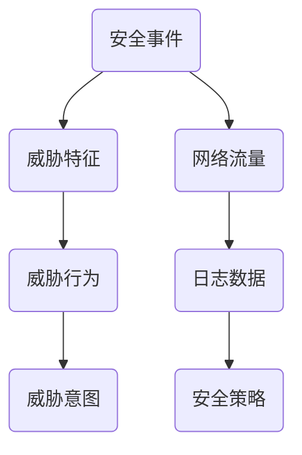
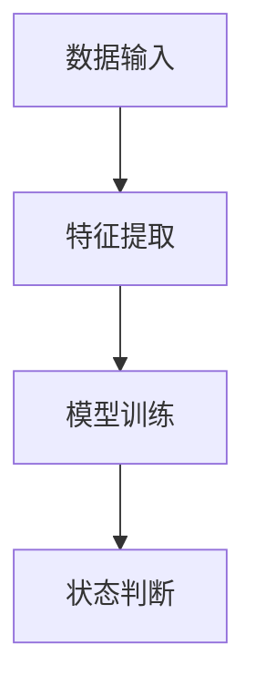
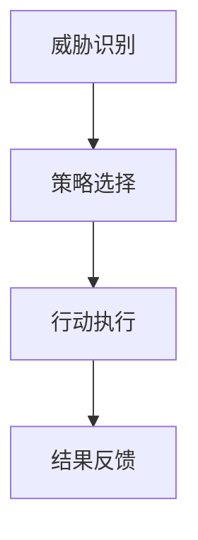
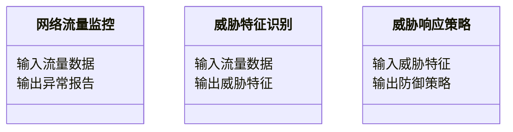
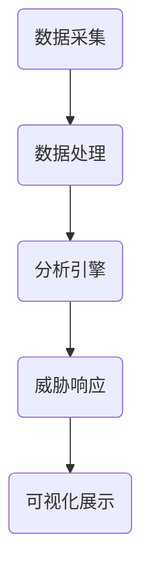
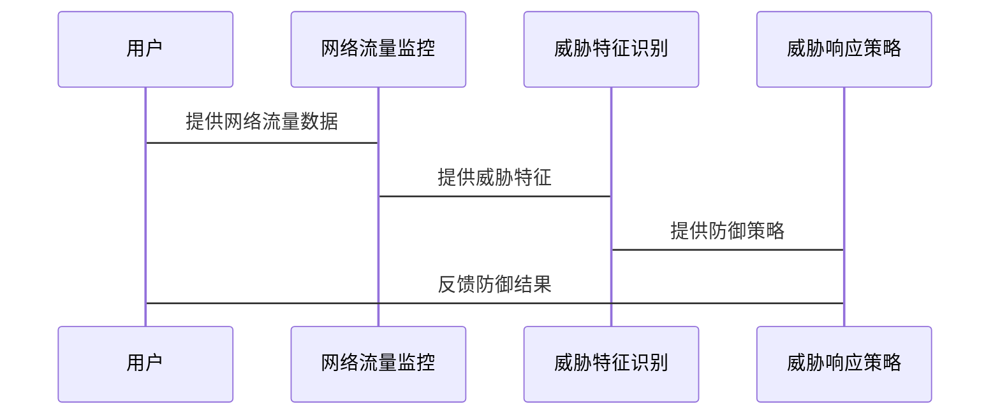

                 


# AI Agent在企业网络安全态势感知与威胁响应中的应用

## 关键词：AI Agent, 网络安全, 态势感知, 威胁响应, 机器学习, 强化学习, 网络安全体系

## 摘要：本文深入探讨了AI Agent在企业网络安全态势感知与威胁响应中的应用，分析了其核心概念、算法原理、系统架构以及实际应用场景。通过结合数学模型、算法流程图和Python代码示例，详细阐述了AI Agent如何帮助企业在复杂的网络环境中实现智能、高效的网络安全管理。

---

## 第1章 AI Agent与网络安全态势感知概述

### 1.1 问题背景与问题描述

#### 1.1.1 传统网络安全的局限性
传统的网络安全防护手段依赖于规则和静态策略，难以应对日益复杂的网络攻击手段。攻击者不断进化，而防御系统却难以实时适应变化。

#### 1.1.2 网络安全态势感知的定义与目标
网络安全态势感知是一种通过收集、分析和综合多种安全数据，评估网络安全状态，并预测未来趋势的技术。其目标是帮助企业在复杂的网络环境中实时了解安全状态，并采取相应的防御措施。

#### 1.1.3 AI Agent在网络安全中的作用
AI Agent（人工智能代理）能够实时监控网络环境，分析海量数据，识别潜在威胁，并自动采取响应措施。它是实现网络安全态势感知的核心技术之一。

### 1.2 AI Agent的核心概念与原理

#### 1.2.1 AI Agent的定义与分类
AI Agent是一种能够感知环境、自主决策并执行任务的智能体。在网络安全领域，AI Agent通常分为监督式、非监督式和强化学习式三种类型。

#### 1.2.2 状态感知与威胁响应的基本原理
状态感知通过收集网络流量、日志、威胁情报等数据，利用机器学习模型进行分析，识别异常行为。威胁响应则基于感知结果，采取主动防御措施，如封锁IP、隔离设备等。

#### 1.2.3 AI Agent与网络安全的结合
AI Agent通过实时监控网络环境，分析潜在威胁，并根据预设策略或动态学习结果，自动采取响应措施，从而提升企业网络安全防护能力。

### 1.3 网络安全态势感知的体系结构

#### 1.3.1 网络安全态势感知的组成要素
网络安全态势感知系统通常包括数据采集、数据分析、状态评估、威胁响应和可视化展示五个部分。

#### 1.3.2 状态感知与威胁响应的边界与外延
状态感知关注当前网络环境的安全状况，而威胁响应则是对外部威胁的主动应对。二者的结合构成了完整的网络安全防护体系。

#### 1.3.3 系统整体架构与功能模块
网络安全态势感知系统通常包括数据源、数据处理、分析引擎、决策支持和响应执行五个功能模块。

---

## 第2章 AI Agent与网络安全态势感知的核心概念

### 2.1 核心概念原理

#### 2.1.1 状态感知的数学模型
状态感知可以通过概率图模型进行建模，例如马尔可夫链和贝叶斯网络。以下是马尔可夫链的简单示例：

$$P(A|B) = \frac{P(B|A)P(A)}{P(B)}$$

其中，$A$表示网络异常行为，$B$表示网络流量特征。

#### 2.1.2 威胁响应的逻辑框架
威胁响应通常基于规则和机器学习模型进行决策。以下是一个简单的规则引擎示例：

$$R = \{r_1, r_2, ..., r_n\}$$

其中，$r_i$表示一条安全规则，例如$r_1$可以表示“检测到多次失败登录尝试即为异常”。

### 2.2 核心概念对比分析

#### 2.2.1 AI Agent与传统安全工具的对比

| 特性           | AI Agent                     | 传统安全工具               |
|----------------|------------------------------|-----------------------------|
| 智能性         | 高                           | 低                         |
| 自适应性       | 强                           | 弱                         |
| 响应速度       | 快                           | 中                         |
| 处理复杂性     | 复杂                         | 简单                       |

#### 2.2.2 状态感知与威胁响应的特征对比

| 特性           | 状态感知                   | 威胁响应                   |
|----------------|---------------------------|---------------------------|
| 输入           | 网络流量、日志数据         | 网络异常行为               |
| 输出           | 网络安全状态评估           | 防御策略或执行指令         |
| 目标           | 了解当前安全状态           | 应对潜在威胁               |

### 2.3 系统架构的ER实体关系图



---

## 第3章 网络安全态势感知的算法原理

### 3.1 状态感知算法

#### 3.1.1 基于机器学习的异常检测



以下是一个简单的异常检测算法示例：

```python
import numpy as np
from sklearn.ensemble import IsolationForest

# 示例数据
X = np.random.randn(100, 2)
outliers = np.random.uniform(low=-4, high=4, size=(10, 2))
X_outliers = np.vstack((X, outliers))

# 模型训练
model = IsolationForest(contamination=0.1)
model.fit(X_outliers)

# 预测结果
y_pred = model.predict(X)
```

#### 3.1.2 基于深度学习的威胁检测
深度学习模型（如LSTM）可以用于时间序列数据的异常检测：

$$LSTM(t) = f(LSTM(t-1), x_t)$$

其中，$LSTM(t)$表示时间$t$的长短期记忆网络状态，$x_t$表示输入数据。

### 3.2 威胁响应算法

#### 3.2.1 基于强化学习的威胁应对策略



以下是一个强化学习算法的示例：

```python
import gym
from gym import spaces
from gym.utils import seeding

class ThreatResponseEnv(gym.Env):
    def __init__(self):
        self.action_space = spaces.Discrete(3)  # 0:封锁IP，1:隔离设备，2:发送警报
        self.observation_space = spaces.Box(low=0, high=1, shape=(4,))
        self._seed()

    def _step(self, action):
        # 根据动作返回新的状态和奖励
        pass

    def _reset(self):
        # 初始化环境
        pass

    def _render(self, mode='human'):
        # 可视化环境
        pass
```

---

## 第4章 系统分析与架构设计

### 4.1 问题场景介绍

#### 4.1.1 企业网络安全的典型问题
企业常见的网络安全问题包括：DDoS攻击、钓鱼邮件、内部威胁等。

#### 4.1.2 网络安全态势感知的应用场景
网络安全态势感知适用于企业网络监控、云安全、工业控制系统安全等领域。

### 4.2 系统功能设计

#### 4.2.1 领域模型类图



#### 4.2.2 系统架构设计



### 4.3 系统接口设计

#### 4.3.1 API接口设计
以下是系统提供的API接口：

```python
class SecuritySystem:
    def __init__(self):
        self.agent = AI-Agent()

    def get_status(self):
        # 获取网络安全状态
        pass

    def respond Threat(self, threat_info):
        # 响应威胁
        pass
```

### 4.4 系统交互流程



---

## 第5章 项目实战

### 5.1 环境安装与配置

#### 5.1.1 安装依赖
```bash
pip install numpy scikit-learn gym matplotlib
```

### 5.2 核心功能实现

#### 5.2.1 异常检测算法实现

```python
import numpy as np
from sklearn.ensemble import IsolationForest

def detect_anomaly(X):
    model = IsolationForest(contamination=0.1)
    model.fit(X)
    y_pred = model.predict(X)
    return y_pred
```

#### 5.2.2 强化学习模型实现

```python
class ThreatResponseEnv(gym.Env):
    def __init__(self):
        self.action_space = spaces.Discrete(3)
        self.observation_space = spaces.Box(low=0, high=1, shape=(4,))
        self._seed()

    def _step(self, action):
        # 根据动作返回新的状态和奖励
        pass

    def _reset(self):
        # 初始化环境
        pass

    def _render(self, mode='human'):
        # 可视化环境
        pass
```

### 5.3 案例分析与结果解读

#### 5.3.1 案例分析
假设某企业网络中检测到多次异常登录尝试，AI Agent会自动封锁该IP并触发警报。

#### 5.3.2 结果解读
通过分析日志数据，确认此次异常登录尝试是由于DDoS攻击导致的，AI Agent成功阻止了攻击。

### 5.4 项目小结

---

## 第6章 最佳实践与总结

### 6.1 最佳实践

#### 6.1.1 数据质量
确保数据的完整性和准确性，数据预处理是关键。

#### 6.1.2 模型调优
根据实际场景调整模型参数，提升检测精度。

#### 6.1.3 系统维护
定期更新模型和规则库，适应新的威胁。

### 6.2 小结

### 6.3 注意事项

### 6.4 拓展阅读

---

通过以上章节的详细讲解，我们深入探讨了AI Agent在企业网络安全态势感知与威胁响应中的应用，从理论到实践，全面分析了其实现原理和应用价值。希望本文能为企业网络安全防护提供新的思路和参考。

