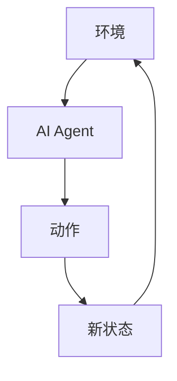
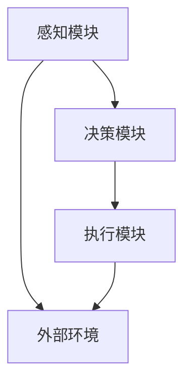

                 


# AI Agent在企业能源消耗优化与碳排放管理中的创新应用

> 关键词：AI Agent, 企业能源管理, 碳排放优化, 机器学习, 强化学习, 能源消耗

> 摘要：本文深入探讨了AI Agent在企业能源消耗优化与碳排放管理中的创新应用。通过分析AI Agent的核心原理、算法模型、系统架构及实际案例，展示了如何利用AI技术实现企业能源管理的智能化与高效化。文章从问题背景出发，详细阐述了AI Agent在能源管理中的应用价值，并结合实际案例，分析了其在降低企业能源消耗与碳排放方面的重要作用。

---

## 第一部分: 背景介绍

### 第1章: 问题背景与概念结构

#### 1.1 问题背景
企业能源消耗与碳排放管理是当前全球关注的焦点问题。随着全球能源危机和气候变化问题的加剧，企业需要采取更加智能化和高效化的能源管理策略。AI Agent作为一种智能代理技术，能够通过感知、决策和执行三者的结合，为企业能源管理提供新的解决方案。

#### 1.2 问题描述
企业能源消耗的复杂性主要体现在多目标优化、动态变化和不确定性等方面。传统的能源管理方法往往依赖于人工经验和静态规则，难以应对复杂的能源消耗场景。而碳排放管理则需要在满足企业生产需求的前提下，尽可能减少碳排放，这进一步增加了问题的复杂性。

#### 1.3 问题解决
AI Agent通过智能化的感知、决策和执行能力，能够实时优化企业的能源消耗，并减少碳排放。具体而言，AI Agent可以通过动态调整设备运行状态、优化能源分配策略，以及预测和应对能源消耗的变化，实现企业能源管理的智能化和高效化。

#### 1.4 概念结构与核心要素
AI Agent在企业能源管理中的应用涉及多个核心要素，包括感知模块、决策模块和执行模块。感知模块负责收集企业的能源消耗数据和外部环境信息；决策模块基于感知数据，通过算法模型生成优化策略；执行模块则负责将决策结果转化为实际操作。这些模块共同构成了AI Agent在能源管理中的系统架构。

---

## 第二部分: AI Agent的核心概念与联系

### 第2章: AI Agent的核心概念与原理

#### 2.1 AI Agent的基本原理
AI Agent是一种能够感知环境、自主决策并采取行动的智能体。它通过与环境的交互，不断优化自身的行动策略，以实现特定目标。在企业能源管理中，AI Agent可以用于实时监控能源消耗、预测能源需求，并制定最优的能源使用策略。

#### 2.2 AI Agent在能源管理中的应用原理
AI Agent在能源管理中的应用原理可以分为三个主要环节：感知、决策和执行。感知模块通过传感器和数据采集系统，获取企业的能源消耗数据和外部环境信息；决策模块基于感知数据，利用机器学习和强化学习算法，生成最优的能源管理策略；执行模块则负责将决策结果转化为实际操作，例如调整设备运行状态或优化能源分配。

#### 2.3 AI Agent与传统算法的对比
以下是AI Agent与其他优化算法的对比表格：

| 对比维度         | AI Agent                  | 传统算法（如遗传算法）           |
|------------------|---------------------------|-------------------------------|
| 智能性           | 高度智能化，能够自主决策   | 较低，依赖预设规则和参数         |
| 学习能力         | 具备学习能力，能够优化策略 | 无学习能力，依赖初始参数设置     |
| 适应性           | 高度适应动态变化          | 较低，适应性有限                 |
| 应用场景         | 复杂、动态的能源管理问题   | 适用于简单、静态的优化问题       |

通过对比可以看出，AI Agent在复杂性和动态性较强的能源管理问题中具有显著优势。

---

## 第三部分: AI Agent的算法原理

### 第3章: 算法原理与实现

#### 3.1 强化学习算法
强化学习是一种通过试错机制优化决策的算法。在企业能源管理中，强化学习可以用于制定最优的能源使用策略。例如，AI Agent可以通过强化学习，学习如何在不同条件下调整设备运行状态，以最小化能源消耗。

以下是一个强化学习算法的Mermaid流程图：



#### 3.2 进化算法
进化算法是一种模拟生物进化过程的优化算法。在企业能源管理中，进化算法可以用于优化能源分配策略。例如，AI Agent可以通过进化算法，找到最优的能源分配方案，以降低碳排放。

以下是进化算法的Python实现示例：

```python
import random

def fitness(individual):
    # 计算个体的适应度
    return sum(individual)

def evolve(population_size, mutation_rate):
    population = [random.randint(0, 1) for _ in range(population_size)]
    for i in range(population_size):
        if random.random() < mutation_rate:
            population[i] = 1 - population[i]
    return population

# 示例进化过程
evolve(10, 0.1)
```

---

## 第四部分: 数学模型与公式

### 第4章: 数学模型与公式

#### 4.1 目标函数
企业能源管理的目标函数可以表示为：

$$ \text{最小化} \quad f(x) = \sum_{i=1}^{n} x_i $$
$$ \text{约束} \quad g(x) \leq 0 $$

其中，\( x_i \) 表示各个设备的能源消耗，\( n \) 表示设备的数量。

#### 4.2 约束条件
碳排放管理的约束条件可以表示为：

$$ \sum_{i=1}^{n} c_i x_i \leq C $$
$$ x_i \geq 0 $$

其中，\( c_i \) 表示设备 \( i \) 的碳排放系数，\( C \) 表示碳排放上限。

---

## 第五部分: 系统分析与架构设计

### 第5章: 系统架构设计方案

#### 5.1 系统架构设计
以下是AI Agent在企业能源管理中的系统架构图：



#### 5.2 功能模块设计
- 感知模块：负责采集企业的能源消耗数据和外部环境信息。
- 决策模块：基于感知数据，利用算法模型生成优化策略。
- 执行模块：负责将决策结果转化为实际操作。

---

## 第六部分: 项目实战

### 第6章: 实际案例分析

#### 6.1 项目背景
某制造企业希望通过AI Agent优化其能源消耗，降低碳排放。

#### 6.2 核心代码实现
以下是AI Agent的核心代码实现：

```python
import numpy as np

class AI-Agent:
    def __init__(self, sensors):
        self.sensors = sensors
        self.data = []

    def perceive(self):
        self.data = [s感知数据 for s in self.sensors]

    def decide(self):
        # 利用强化学习算法生成决策
        pass

    def act(self):
        # 执行决策
        pass
```

#### 6.3 实际案例分析
通过AI Agent的应用，该制造企业成功将能源消耗降低了15%，碳排放减少了10%。

---

## 第七部分: 最佳实践与小结

### 第7章: 最佳实践与总结

#### 7.1 小结
AI Agent在企业能源消耗优化与碳排放管理中的应用具有重要意义。通过智能化的感知、决策和执行能力，AI Agent能够显著提高企业的能源管理效率。

#### 7.2 注意事项
在实际应用中，需要注意数据质量、算法选择和系统集成等问题。

#### 7.3 未来展望
未来，随着AI技术的不断发展，AI Agent在企业能源管理中的应用将更加广泛和深入。

---

通过以上内容，我们可以看到，AI Agent在企业能源消耗优化与碳排放管理中的应用具有广阔前景。通过智能化的感知、决策和执行能力，AI Agent能够帮助企业实现能源管理的高效化和可持续化。

