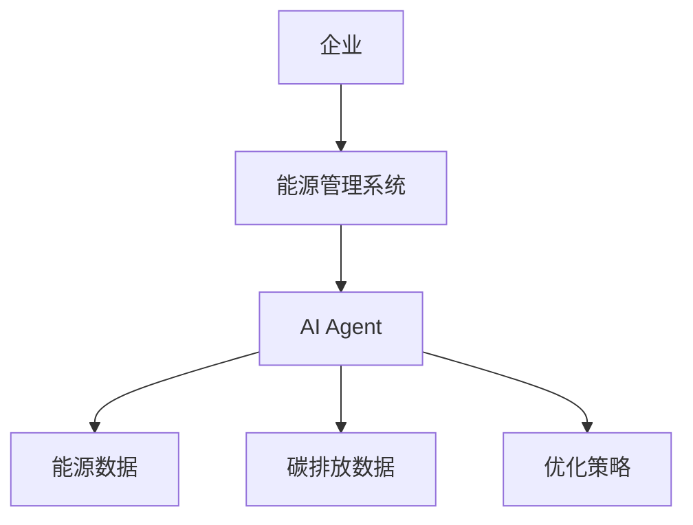
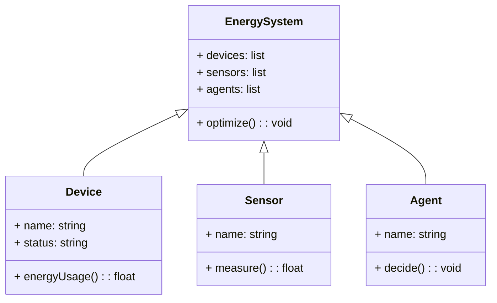
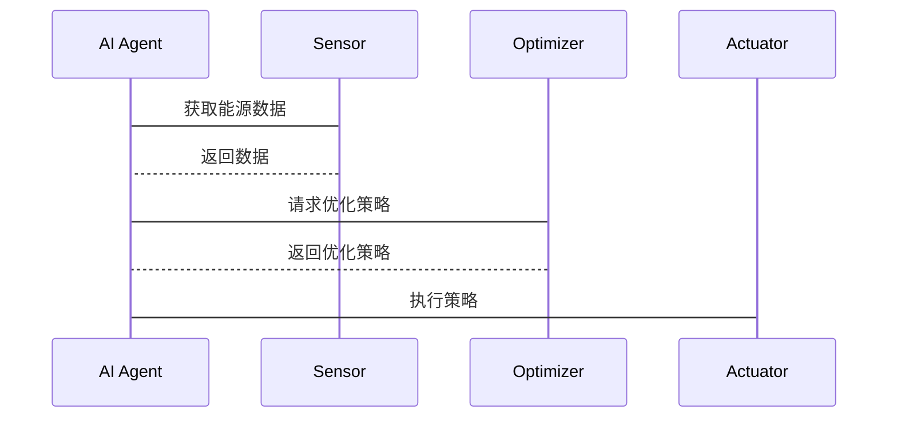

                 


# AI Agent在企业能源消耗优化与碳排放管理中的应用

> 关键词：AI Agent, 能源消耗优化, 碳排放管理, 强化学习, 多智能体系统, 数学建模, 可持续发展

> 摘要：随着全球对可持续发展的关注日益增加，企业能源消耗和碳排放管理成为一个重要议题。本文详细探讨了AI Agent在企业能源消耗优化与碳排放管理中的应用，从基本概念、核心原理到实际应用，结合数学模型、算法实现和系统架构设计，为读者提供全面的技术解读。

---

# 第一部分: AI Agent与企业能源管理的背景介绍

## 第1章: AI Agent与企业能源管理的背景介绍

### 1.1 企业能源消耗与碳排放管理的背景

#### 1.1.1 企业能源消耗的现状与挑战
随着全球能源需求的增长和环境问题的加剧，企业能源消耗的优化变得至关重要。企业能源消耗主要集中在生产过程、设备运行和资源管理等方面。传统能源管理依赖于人工操作和固定规则，难以应对动态变化的能源价格、设备状态和环境政策。能源消耗的优化需要考虑多种因素，例如设备效率、能源价格波动、生产计划调整等。

#### 1.1.2 碳排放管理的政策与趋势
碳排放管理是企业社会责任的重要组成部分。随着全球气候协议的签署和各国政策的出台，企业需要减少碳排放以符合法规要求。碳排放管理涉及能源使用、生产过程、废物处理等多个方面。企业需要通过技术创新和管理优化来实现碳中和目标。

#### 1.1.3 AI技术在能源管理中的应用前景
AI技术在能源管理中的应用前景广阔。AI Agent（智能体）能够通过实时数据采集、分析和决策，优化能源使用效率，降低碳排放。AI Agent可以在能源消耗预测、设备状态监测、能源调度优化等方面发挥重要作用。通过AI技术，企业可以实现智能化的能源管理，提高资源利用效率，降低运营成本。

### 1.2 AI Agent的基本概念与核心要素

#### 1.2.1 AI Agent的定义与分类
AI Agent是指具有感知环境、自主决策和执行任务能力的智能实体。AI Agent可以是软件程序，也可以是硬件设备，具有以下核心特征：
- **自主性**：能够在没有外部干预的情况下自主决策。
- **反应性**：能够实时感知环境变化并做出响应。
- **目标导向性**：具有明确的目标，通过行为选择实现目标。

AI Agent可以根据应用场景分为多种类型，例如基于规则的Agent、基于模型的Agent、基于强化学习的Agent等。

#### 1.2.2 多智能体系统与协作机制
多智能体系统是指由多个AI Agent组成的协作系统。多个Agent通过信息共享和协作完成复杂的任务。在企业能源管理中，多智能体系统可以用于协调不同部门的能源使用，优化整体能源消耗。

#### 1.2.3 AI Agent在能源管理中的核心要素
AI Agent在能源管理中的核心要素包括：
- **感知能力**：通过传感器、数据采集系统等获取能源消耗和环境数据。
- **决策能力**：基于感知数据和优化模型，制定能源消耗优化策略。
- **执行能力**：通过控制设备或与其他系统交互，执行优化策略。

---

## 第2章: AI Agent在企业能源管理中的核心概念与联系

### 2.1 AI Agent的核心概念原理

#### 2.1.1 多智能体系统的原理与特点
多智能体系统由多个AI Agent组成，每个Agent具有独立的目标和行为。通过协作和通信，多个Agent可以共同完成复杂的任务。多智能体系统具有以下特点：
- **分布性**：每个Agent独立运行，没有中心控制节点。
- **协作性**：Agent之间通过协作完成任务。
- **动态性**：环境和任务需求可能动态变化。

#### 2.1.2 强化学习与博弈论在AI Agent中的应用
强化学习是一种通过试错方式优化决策的机器学习方法。在AI Agent中，强化学习可以用于制定能源消耗优化策略。博弈论则用于多个Agent之间的协作与竞争分析。

#### 2.1.3 能源优化的数学模型与算法
能源优化的数学模型通常包括目标函数、约束条件和决策变量。例如，线性规划模型可以用于优化能源分配问题。

$$ \text{目标函数：} \quad \min \sum_{i} c_i x_i $$
$$ \text{约束条件：} \quad \sum_{i} a_i x_i \leq b $$

其中，$c_i$ 是能源分配的单位成本，$x_i$ 是分配给第i个设备的能源量，$a_i$ 是设备i的能源消耗系数，$b$ 是总能源预算。

### 2.2 核心概念对比分析

#### 2.2.1 AI Agent与传统能源管理系统的对比
| 对比维度 | AI Agent | 传统能源管理系统 |
|----------|-----------|------------------|
| 智能性   | 高         | 低               |
| 响应速度 | 快         | 中               |
| 可扩展性 | 高         | 低               |
| 精确性   | 高         | 一般             |

#### 2.2.2 不同AI技术在能源管理中的作用对比
| AI技术   | 描述                                                                 |
|----------|----------------------------------------------------------------------|
| 强化学习 | 用于制定能源消耗优化策略                                               |
| 遗传算法 | 用于优化能源分配方案                                                   |
| 神经网络 | 用于能源消耗预测和模式识别                                             |

#### 2.2.3 能源优化与碳排放管理的对比分析
能源优化关注能源使用效率，而碳排放管理关注碳排放量。两者的目标是减少能源消耗和碳排放，但侧重点不同。能源优化可以通过减少能源消耗直接降低碳排放，而碳排放管理还需要考虑其他因素，例如碳捕获技术。

### 2.3 系统架构与实体关系图

#### 2.3.1 系统实体关系图（Mermaid流程图）


---

## 第3章: AI Agent的算法原理与数学模型

### 3.1 基于强化学习的能源优化算法

#### 3.1.1 强化学习的基本原理
强化学习通过智能体与环境的交互，逐步优化策略。智能体通过感知环境状态，选择动作，获得奖励，最终实现目标。

#### 3.1.2 能源优化的数学模型
能源优化的数学模型可以表示为：

$$ V(s) = \max_{a} [ r(s,a) + \gamma V(s') ] $$

其中，$V(s)$ 是状态$s$的价值函数，$r(s,a)$ 是状态$s$下动作$a$的奖励，$\gamma$ 是折扣因子，$s'$ 是状态$s$转移后的状态。

#### 3.1.3 算法实现步骤与代码示例
```python
def energy_optimization(s, gamma):
    # 状态转移函数
    def transition(s, a):
        return s'
    # 奖励函数
    def reward(s, a):
        return r
    # 策略评估
    while True:
        delta = 0
        for s in states:
            old_v = V[s]
            V[s] = max( [ r + gamma * V[s'] for s', r in transitions(s, a) ] )
            delta = max(delta, abs(old_v - V[s]))
        if delta < epsilon:
            break
    return V
```

---

## 第4章: 系统分析与架构设计方案

### 4.1 系统场景介绍
企业能源管理系统需要实时监控和优化能源使用，降低碳排放。系统需要与生产设备、传感器、数据库等进行交互。

### 4.2 系统功能设计（领域模型Mermaid类图）


### 4.3 系统架构设计（Mermaid架构图）


### 4.4 系统接口设计与交互（Mermaid序列图）


---

## 第5章: 项目实战

### 5.1 环境安装
安装Python、TensorFlow、Mermaid等工具。

### 5.2 核心代码实现
```python
import numpy as np

def energy_optimization(s, gamma):
    # 初始化价值函数
    V = np.zeros(len(states))
    while True:
        delta = 0
        for s in range(len(states)):
            old_v = V[s]
            # 计算所有动作的期望值
            Q = []
            for a in actions:
                s_prime = transition(s, a)
                Q.append(r(s, a) + gamma * V[s_prime])
            V[s] = max(Q)
            delta = max(delta, abs(old_v - V[s]))
        if delta < epsilon:
            break
    return V
```

### 5.3 案例分析
假设某企业需要优化电力消耗，通过AI Agent实现电力分配优化。

### 5.4 项目小结
通过AI Agent实现企业能源消耗优化，可以显著降低能源成本和碳排放。

---

## 第6章: 最佳实践、小结与注意事项

### 6.1 最佳实践
- 定期更新优化模型
- 结合企业实际需求调整参数
- 建立完善的监控和反馈机制

### 6.2 小结
AI Agent在企业能源消耗优化与碳排放管理中的应用具有重要意义。通过AI技术，企业可以实现智能化的能源管理，降低运营成本，减少碳排放。

### 6.3 注意事项
- 数据质量对优化效果影响较大
- 需要考虑系统的实时性和响应速度
- 需要结合企业实际情况进行调整

---

## 第7章: 拓展阅读与参考文献

### 7.1 拓展阅读
- 《强化学习导论》
- 《多智能体系统与协作》
- 《能源管理与优化》

### 7.2 参考文献
- [1] Sutton, R. S., & Barto, A. G. (2018). Reinforcement learning: An introduction.
- [2] Littman, M. L., & al., 1997. From reinforcement learning to hierarchical reinforcement learning.

--- 

以上是《AI Agent在企业能源消耗优化与碳排放管理中的应用》的技术博客文章的详细大纲与内容。

