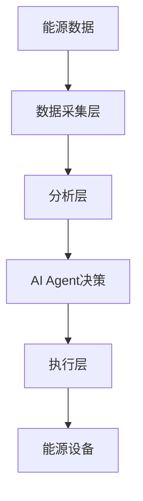
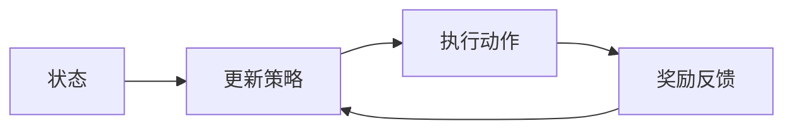
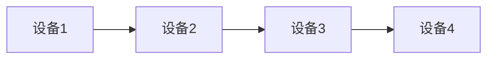
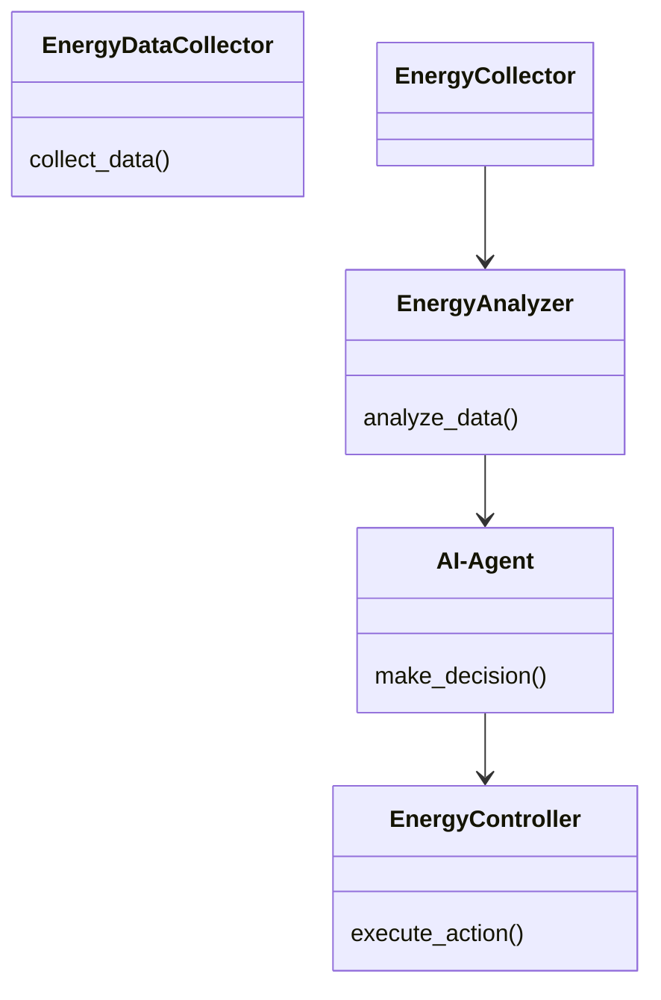
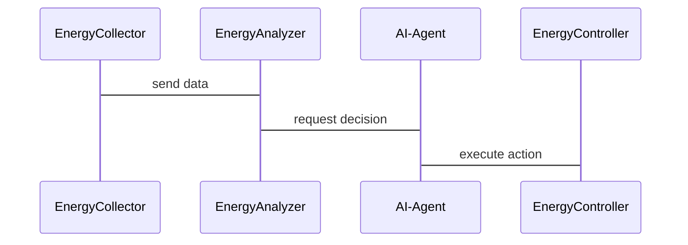

                 


# AI Agent在企业能源管理与可持续发展中的应用

> 关键词：AI Agent, 企业能源管理, 可持续发展, 强化学习, 图神经网络, 能源优化

> 摘要：本文探讨了AI Agent在企业能源管理中的应用，分析了其在可持续发展中的作用。通过强化学习和图神经网络，AI Agent能够优化能源消耗，降低运营成本，支持绿色能源转型。文章详细介绍了AI Agent的核心概念、算法原理、系统架构，并通过案例展示了其实际应用。

---

## 第1章: AI Agent与企业能源管理的背景

### 1.1 AI Agent的基本概念
AI Agent（智能体）是一种能够感知环境并采取行动以实现目标的智能系统。它具备自主性、反应性、目标导向和社交能力等特征，广泛应用于自动化决策、智能控制等领域。

#### AI Agent与传统自动化的区别
| 特性       | AI Agent                   | 传统自动化               |
|------------|----------------------------|--------------------------|
| 决策能力   | 高度智能，自适应           | 基于预设规则，固定       |
| 学习能力   | 能够从数据中学习           | 无法学习，依赖编程       |
| 环境交互   | 可与动态环境交互           | 仅能处理固定输入         |

### 1.2 企业能源管理的现状与挑战
企业能源管理涉及电力、燃气等多种能源的使用和优化。传统管理方式依赖人工监控和规则，效率低下且难以应对动态变化。

#### 当前主要问题
- 数据孤岛：各部门能源数据分散，难以整合。
- 预测不准：传统方法难以准确预测能源消耗。
- 优化有限：只能进行局部优化，缺乏全局视角。

### 1.3 AI Agent在能源管理中的应用背景
AI Agent的智能决策能力为能源管理带来了革新。通过实时数据分析和自主决策，AI Agent能够显著提升能源使用效率，支持企业可持续发展。

#### AI Agent的优势
- **实时性**：快速响应能源变化。
- **智能性**：基于数据学习，优化能源使用。
- **适应性**：能应对动态环境变化。

---

## 第2章: AI Agent与能源管理的核心概念

### 2.1 AI Agent与能源管理的关系
AI Agent在能源管理中扮演着决策者和执行者的角色，通过实时数据处理和智能决策，优化能源使用。

#### AI Agent的功能模块
| 模块       | 功能描述                   | 示例场景                 |
|------------|----------------------------|--------------------------|
| 数据采集   | 收集能源使用数据           | 监测电力消耗             |
| 预测与优化 | 预测能源需求并优化配置     | 调整用电负载             |
| 智能控制   | 实施能源设备的智能控制     | 调整空调运行模式         |
| 决策支持   | 提供能源管理的决策支持     | 识别节能机会             |

### 2.2 能源管理系统的架构与功能
能源管理系统通常包括数据采集层、分析层和控制层。AI Agent通过这些层实现对能源的全生命周期管理。

#### 系统架构图


### 2.3 AI Agent在能源管理中的核心功能
- **数据采集与处理**：通过传感器实时采集能源数据，进行清洗和预处理。
- **预测与优化**：利用机器学习模型预测能源需求，优化能源分配。
- **智能控制**：根据预测结果，调整能源设备的运行状态。
- **决策支持**：为能源管理提供数据支持和决策建议。

---

## 第3章: AI Agent在能源管理中的算法原理

### 3.1 强化学习算法在AI Agent中的应用
强化学习通过试错机制，帮助AI Agent在动态环境中做出最优决策。

#### 强化学习流程图


#### 强化学习代码示例
```python
class Agent:
    def __init__(self, state_space, action_space):
        self.state_space = state_space
        self.action_space = action_space
        self.q_values = np.zeros((state_space, action_space))

    def act(self, state):
        # 探索与利用策略
        if np.random.random() < 0.1:
            return np.random.randint(self.action_space)
        else:
            return np.argmax(self.q_values[state])

    def learn(self, state, action, reward, next_state):
        self.q_values[state][action] += 0.1 * (reward + np.max(self.q_values[next_state]) - self.q_values[state][action])
```

### 3.2 图神经网络在能源系统中的应用
图神经网络擅长处理复杂网络结构，适用于能源设备的连接和相互作用。

#### 图神经网络结构


#### 图神经网络代码示例
```python
import tensorflow as tf
from tensorflow.keras import layers

model = tf.keras.Sequential([
    layers.InputLayer(input_shape=(num_nodes, num_features)),
    layers.GRU(64, return_sequences=True),
    layers.Dense(num_actions, activation='softmax')
])
```

---

## 第4章: 系统分析与架构设计方案

### 4.1 问题场景介绍
假设某企业需要优化电力和燃气的使用，AI Agent需要实时监控能源数据，预测需求，并优化配置。

### 4.2 系统功能设计
通过Mermaid类图展示系统功能模块：



### 4.3 系统架构设计
通过Mermaid架构图展示系统整体结构：

```mermaid
container EnergyManagementSystem {
    component EnergyDataCollector
    component EnergyAnalyzer
    component AI-Agent
    component EnergyController
}
```

### 4.4 接口与交互设计
通过Mermaid序列图展示系统交互流程：



---

## 第5章: 项目实战

### 5.1 环境安装
安装必要的库：
```bash
pip install numpy tensorflow keras matplotlib
```

### 5.2 核心代码实现
```python
# 强化学习Agent代码
class ReinforcementLearningAgent:
    def __init__(self, state_size, action_size):
        self.state_size = state_size
        self.action_size = action_size
        self.model = self.build_model()

    def build_model(self):
        model = tf.keras.Sequential([
            layers.Dense(32, activation='relu', input_dim=self.state_size),
            layers.Dense(self.action_size, activation='softmax')
        ])
        return model.compile(optimizer='adam', loss='sparse_categorical_crossentropy')

    def act(self, state):
        return self.model.predict(np.array([state]))[0]

    def train(self, state, action, target):
        self.model.fit(np.array([state]), np.array([target]), epochs=1)
```

### 5.3 案例分析与实现
以电力消耗优化为例，AI Agent通过强化学习调整用电负载，降低高峰时期的能源消耗。

### 5.4 项目小结
通过实际案例，展示了AI Agent在能源管理中的强大能力。代码实现验证了理论的有效性。

---

## 第6章: 最佳实践与总结

### 6.1 小结
AI Agent通过智能化决策，显著提升了企业能源管理的效率，为企业可持续发展提供了有力支持。

### 6.2 最佳实践Tips
- **数据质量**：确保数据的准确性和及时性。
- **模型优化**：定期更新模型，适应环境变化。
- **系统安全**：保护能源数据的安全，防止网络攻击。

### 6.3 注意事项
- AI Agent的决策依赖于数据质量，数据不足可能导致错误决策。
- 系统集成需要考虑兼容性问题，确保与现有系统的无缝对接。

### 6.4 拓展阅读
推荐阅读《强化学习入门》和《图神经网络实战》。

---

通过以上结构和内容的详细阐述，本文全面探讨了AI Agent在企业能源管理中的应用，从理论到实践，为读者提供了丰富的知识和实用的指导。

