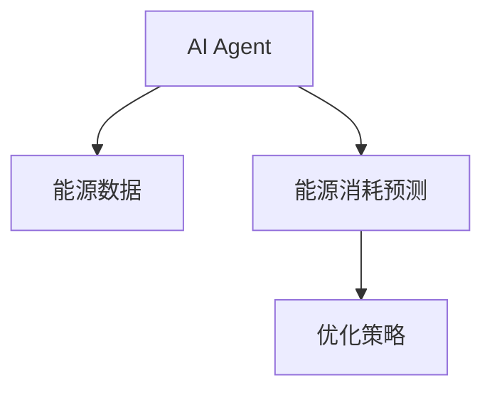
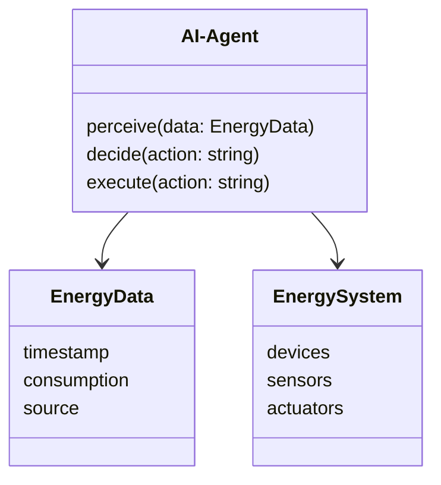
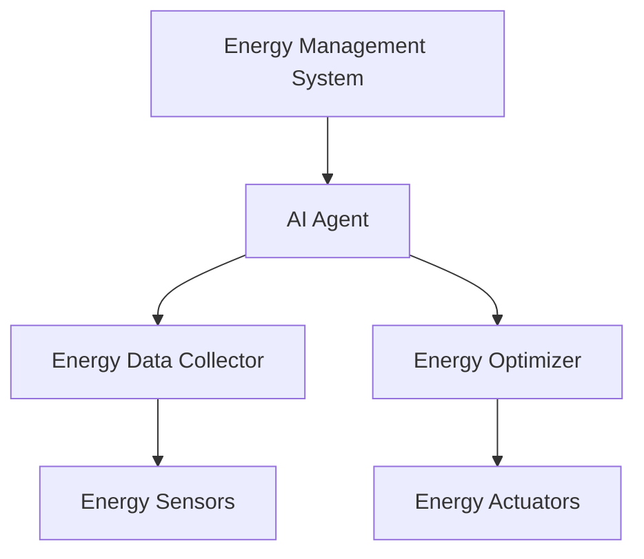

                 


# AI Agent在企业能源管理与可持续发展中的应用

## 关键词
AI Agent, 企业能源管理, 可持续发展, 强化学习, 能源优化

## 摘要
本文探讨了AI Agent在企业能源管理中的应用，详细分析了AI Agent的核心概念、算法原理、系统架构以及实际案例，展示了其在推动企业可持续发展中的巨大潜力。文章从理论到实践，全面阐述了如何利用AI技术优化能源管理，实现节能减排的目标。

---

# 目录大纲

## 第一部分: AI Agent与企业能源管理概述

### 第1章: AI Agent与企业能源管理概述

#### 1.1 AI Agent的基本概念
- 1.1.1 AI Agent的定义与特点
- 1.1.2 AI Agent在企业中的作用
- 1.1.3 AI Agent与能源管理的结合

#### 1.2 企业能源管理的背景与挑战
- 1.2.1 企业能源管理的定义
- 1.2.2 当前企业能源管理的主要挑战
- 1.2.3 可持续发展的目标与意义

#### 1.3 AI Agent在能源管理中的应用前景
- 1.3.1 AI Agent在能源管理中的潜在应用领域
- 1.3.2 企业采用AI Agent的优势
- 1.3.3 AI Agent应用的挑战与机遇

#### 1.4 本章小结

---

## 第二部分: AI Agent的核心概念与原理

### 第2章: AI Agent的核心概念与联系

#### 2.1 AI Agent的核心原理
- 2.1.1 AI Agent的基本原理
- 2.1.2 AI Agent的感知与决策机制
- 2.1.3 AI Agent的执行与反馈机制

#### 2.2 AI Agent与能源管理的核心要素
- 2.2.1 能源数据的采集与处理
- 2.2.2 能源消耗预测与优化
- 2.2.3 能源管理的智能化决策

#### 2.3 AI Agent与能源管理的实体关系图


#### 2.4 本章小结

---

## 第三部分: AI Agent的算法原理与数学模型

### 第3章: AI Agent的算法原理

#### 3.1 常见的AI Agent算法
- 3.1.1 基于强化学习的AI Agent
- 3.1.2 基于监督学习的AI Agent
- 3.1.3 基于无监督学习的AI Agent

#### 3.2 强化学习算法的数学模型
- 3.2.1 Q-learning算法
- 3.2.2 Deep Q-Networks (DQN)算法
- 3.2.3 算法的数学表达式
$$ Q(s, a) = r + \gamma \max_{a'} Q(s', a') $$

#### 3.3 算法实现的代码示例
```python
import numpy as np

class AI_Agent:
    def __init__(self, state_space, action_space):
        self.state_space = state_space
        self.action_space = action_space
        self.Q = np.zeros((state_space, action_space))

    def take_action(self, state, epsilon=0.1):
        if np.random.random() < epsilon:
            return np.random.randint(self.action_space)
        else:
            return np.argmax(self.Q[state, :])

    def update_Q(self, state, action, reward, next_state, alpha=0.1, gamma=0.99):
        target = reward + gamma * np.max(self.Q[next_state, :])
        self.Q[state, action] = (1 - alpha) * self.Q[state, action] + alpha * target
```

#### 3.4 本章小结

---

## 第四部分: 系统分析与架构设计

### 第4章: 系统分析与架构设计方案

#### 4.1 问题场景介绍
- 4.1.1 能源消耗监控系统
- 4.1.2 能源优化目标
- 4.1.3 系统功能需求

#### 4.2 系统功能设计
- 4.2.1 领域模型设计


#### 4.3 系统架构设计


#### 4.4 系统接口设计
- 4.4.1 接口定义
- 4.4.2 接口交互流程

#### 4.5 本章小结

---

## 第五部分: 项目实战

### 第5章: 项目实战

#### 5.1 环境安装
- 5.1.1 安装Python环境
- 5.1.2 安装必要的库（如numpy, matplotlib, scikit-learn）

#### 5.2 系统核心实现
```python
import numpy as np
import matplotlib.pyplot as plt
from sklearn.model_selection import train_test_split
from sklearn.metrics import mean_squared_error

class EnergyPredictor:
    def __init__(self):
        self.model = None

    def train(self, X, y):
        X_train, X_test, y_train, y_test = train_test_split(X, y, test_size=0.2)
        # 假设使用线性回归模型
        from sklearn.linear_model import LinearRegression
        self.model = LinearRegression()
        self.model.fit(X_train, y_train)

    def predict(self, X):
        return self.model.predict(X)

    def evaluate(self, X, y):
        y_pred = self.model.predict(X)
        return mean_squared_error(y, y_pred)

# 示例数据
X = np.linspace(0, 10, 100).reshape(-1, 1)
y = 2 * X + 1 + np.random.normal(0, 0.5, 100)

predictor = EnergyPredictor()
predictor.train(X, y)
print(predictor.evaluate(X, y))
plt.scatter(X, y, label='True')
plt.scatter(X, predictor.predict(X), label='Predicted')
plt.legend()
plt.show()
```

#### 5.3 案例分析
- 5.3.1 案例背景
- 5.3.2 数据分析
- 5.3.3 模型训练与优化
- 5.3.4 结果展示与解读

#### 5.4 本章小结

---

## 第六部分: 最佳实践与总结

### 第6章: 最佳实践与总结

#### 6.1 最佳实践
- 6.1.1 数据质量的重要性
- 6.1.2 模型选择与调优
- 6.1.3 系统维护与更新

#### 6.2 小结
- 6.2.1 AI Agent在能源管理中的核心作用
- 6.2.2 未来发展趋势

#### 6.3 注意事项
- 6.3.1 数据隐私与安全
- 6.3.2 系统稳定性与可靠性
- 6.3.3 技术与业务的结合

#### 6.4 拓展阅读
- 6.4.1 推荐书籍
- 6.4.2 相关论文
- 6.4.3 在线资源

#### 6.5 本章小结

---

## 附录: 参考文献与代码仓库

### 附录A: 参考文献

### 附录B: 代码仓库地址

---

以上目录大纲涵盖了从理论到实践的各个方面，结构清晰，内容详实。每一章都有具体的子主题，并配以图表和代码示例，确保读者能够深入理解和应用AI Agent在企业能源管理中的应用。

