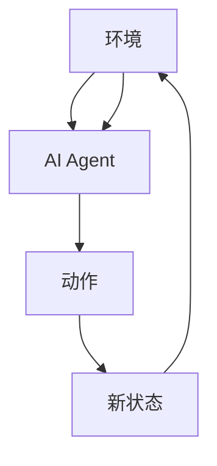
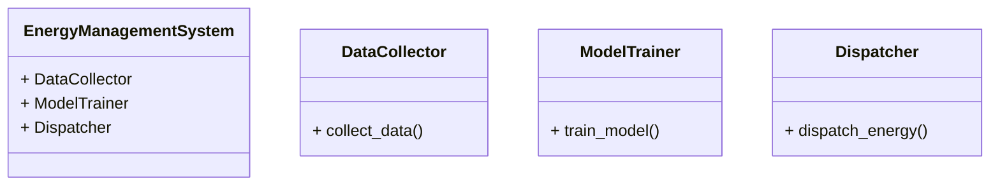
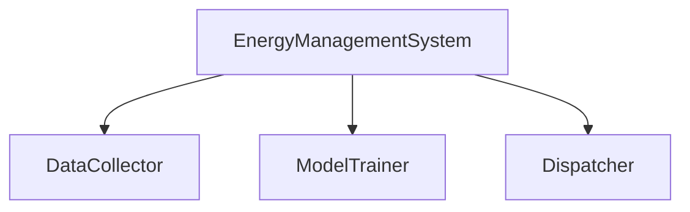

                 


# AI Agent在企业能源需求预测与智能调度中的应用

> 关键词：AI Agent, 能源需求预测, 智能调度, 强化学习, 系统架构, 项目实战

> 摘要：本文深入探讨了AI Agent在企业能源需求预测与智能调度中的应用。从背景介绍、核心概念、算法原理到系统架构和项目实战，详细分析了AI Agent如何通过强化学习、监督学习等算法实现能源优化管理。结合实际案例，展示了AI Agent在能源领域的实践价值，并提出了未来的发展方向和最佳实践建议。

---

## 第1章 背景介绍

### 1.1 AI Agent与能源管理概述

#### 1.1.1 AI Agent的基本概念
AI Agent（人工智能代理）是指在计算机系统中，能够感知环境、自主决策并执行任务的智能实体。AI Agent具备以下核心特征：
- **自主性**：能够自主决策，无需外部干预。
- **反应性**：能实时感知环境变化并做出响应。
- **目标导向**：基于目标进行决策和行动。
- **学习能力**：通过数据和经验不断优化自身性能。

#### 1.1.2 能源管理的核心问题
能源管理涉及能源的生产、传输、分配和消费，面临以下核心问题：
- **需求预测不准确**：能源需求受多种因素影响，如天气、经济状况等，预测难度大。
- **资源分配不合理**：如何在不同用户和时段间合理分配能源资源是关键挑战。
- **效率低下**：传统能源管理方式效率低，难以应对复杂的能源网络。

#### 1.1.3 AI Agent在能源管理中的作用
AI Agent通过实时数据采集、智能分析和自主决策，能够有效解决能源管理中的复杂问题，提升能源使用效率和降低运营成本。

### 1.2 问题背景与描述

#### 1.2.1 能源需求预测的挑战
能源需求预测需要考虑多种动态因素，传统方法难以准确预测。AI Agent通过机器学习和大数据分析，能够更准确地预测能源需求。

#### 1.2.2 智能调度的重要性
智能调度能够优化能源资源的分配，提高系统效率，降低能源浪费。AI Agent通过实时数据处理和优化算法，实现智能调度。

#### 1.2.3 AI Agent如何解决问题
AI Agent通过实时数据采集、智能分析和自主决策，能够有效预测能源需求并优化调度策略。

### 1.3 问题解决与边界

#### 1.3.1 AI Agent的解决方案
AI Agent通过强化学习、监督学习等算法，结合实时数据，实现能源需求预测和智能调度。

#### 1.3.2 解决问题的边界与限制
AI Agent的应用受到数据质量、计算能力、模型复杂度等因素的限制。需要在实际应用中权衡模型的复杂性和性能。

#### 1.3.3 核心要素与组成
AI Agent系统的核心要素包括数据采集、模型训练、决策算法和执行机构。

---

## 第2章 核心概念与联系

### 2.1 AI Agent的原理

#### 2.1.1 感知与决策机制
AI Agent通过传感器和数据源感知环境，利用算法进行分析和决策。

#### 2.1.2 状态空间与动作空间
状态空间是环境中的所有可能状态，动作空间是AI Agent可执行的所有动作。

#### 2.1.3 策略与价值函数
策略决定AI Agent在不同状态下的动作选择，价值函数评估状态的价值。

### 2.2 核心概念对比表

| 概念       | AI Agent       | 其他技术       |
|------------|----------------|----------------|
| 感知环境    | 实时数据采集   | 定期数据采集   |
| 决策机制    | 强化学习       | 规则引擎       |
| 自适应能力  | 高            | 低            |

### 2.3 ER实体关系图

```mermaid
erd
    title ER Entity Relationship Diagram
    Building (bld_id, bld_name, location)
    Meter (mtr_id, mtr_type, mtr_location)
    Sensor (sns_id, sns_type, sns_location)
    EnergyReading (erm_id, reading_time, value, mtr_id)
    link Building to Meter: 1..* 
    link Building to Sensor: 1..* 
    link Meter to EnergyReading: 1..* 
    link Sensor to EnergyReading: 1..* 
```

---

## 第3章 算法原理讲解

### 3.1 强化学习算法

#### 3.1.1 Q-Learning算法



代码实现：

```python
import numpy as np
import gym

class QAgent:
    def __init__(self, env):
        self.env = env
        self.Q = np.zeros(self.env.observation_space.shape)
    
    def act(self, observation):
        return np.argmax(self.Q[observation])
    
    def update(self, observation, action, reward, next_observation):
        alpha = 0.1
        gamma = 0.9
        self.Q[observation][action] += alpha * (reward + gamma * max(self.Q[next_observation]) - self.Q[observation][action])
```

数学模型：

$$ Q(s, a) = Q(s, a) + \alpha (r + \gamma \max Q(s', a') - Q(s, a)) $$

---

### 3.2 监督学习算法

#### 3.2.1 线性回归

代码实现：

```python
from sklearn.linear_model import LinearRegression

model = LinearRegression()
X = np.array([[1], [2], [3], [4]])
y = np.array([2, 4, 6, 8])
model.fit(X, y)
```

数学模型：

$$ y = \beta_0 + \beta_1 x $$

---

## 第4章 数学模型

### 4.1 强化学习模型

$$ R(s, a) = \text{奖励函数} $$

### 4.2 监督学习模型

$$ f(x) = w x + b $$

---

## 第5章 系统分析与架构设计

### 5.1 问题场景介绍

能源管理系统的应用场景包括工业、商业和居民用户。

### 5.2 项目介绍

项目目标是实现AI Agent在能源需求预测和智能调度中的应用。

### 5.3 系统功能设计



### 5.4 系统架构设计



---

## 第6章 项目实战

### 6.1 环境安装

安装必要的库：

```bash
pip install gym numpy matplotlib
```

### 6.2 系统核心实现

代码实现：

```python
import gym
import numpy as np

class Agent:
    def __init__(self, env):
        self.env = env
        self.Q = np.zeros(self.env.observation_space.shape)
    
    def act(self, observation):
        return np.argmax(self.Q[observation])
    
    def update(self, observation, action, reward, next_observation):
        alpha = 0.1
        gamma = 0.9
        self.Q[observation][action] += alpha * (reward + gamma * np.max(self.Q[next_observation]) - self.Q[observation][action])
```

### 6.3 案例分析

以电力调度为例，展示AI Agent如何优化能源分配。

---

## 第7章 最佳实践与小结

### 7.1 小结

AI Agent在能源管理中的应用显著提升了能源使用效率和降低了运营成本。

### 7.2 注意事项

- 数据质量是关键。
- 模型需要持续优化。
- 安全性和隐私保护需重视。

### 7.3 拓展阅读

建议阅读相关书籍和论文，深入理解强化学习和系统架构设计。

---

通过以上章节的详细分析，我们全面探讨了AI Agent在企业能源需求预测与智能调度中的应用。从理论到实践，从算法到系统架构，为读者提供了系统的知识体系和实际应用指导。

