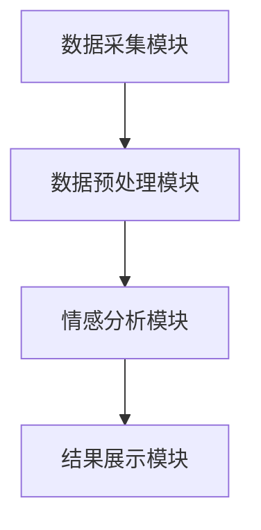

                 


# AI Agent在企业舆情分析与品牌情感监控中的应用

## 关键词：AI Agent, 舆情分析, 品牌情感监控, 自然语言处理, 机器学习, 情感分析, 系统架构设计

## 摘要：  
本文详细探讨了AI Agent在企业舆情分析与品牌情感监控中的应用。首先介绍了AI Agent的基本概念与核心特征，分析了企业舆情分析与品牌情感监控的背景和重要性。接着，深入讲解了AI Agent的核心技术，包括自然语言处理、机器学习和情感分析算法的实现。然后，详细设计了系统的架构，包括模块划分、功能设计和系统交互流程。最后，通过实际项目案例，展示了AI Agent在企业舆情分析中的实战应用，并总结了最佳实践和未来发展方向。

---

## 第1章: AI Agent的基本概念与应用价值

### 1.1 AI Agent的定义与核心特征
AI Agent（人工智能代理）是指能够感知环境、自主决策并执行任务的智能实体。它具有以下核心特征：
- **自主性**：能够自主决策和行动。
- **反应性**：能够实时感知环境并做出反应。
- **目标导向**：以实现特定目标为导向。
- **学习能力**：能够通过数据学习和优化。

### 1.2 企业舆情分析与品牌情感监控的背景
企业舆情分析是指对公众对企业或其产品的看法进行分析，而品牌情感监控则是关注消费者对品牌的情感倾向。随着社交媒体的普及，企业需要实时监控舆情，及时发现并处理负面信息，维护品牌形象。

### 1.3 AI Agent在舆情分析中的应用价值
- **提高舆情分析效率**：AI Agent能够快速处理海量数据，显著提高分析效率。
- **增强情感分析准确性**：通过机器学习算法，AI Agent能够更准确地识别情感倾向。
- **实时监控与动态调整**：AI Agent能够实时跟踪舆情变化，帮助企业快速响应。

---

## 第2章: 舆情分析与品牌情感监控的核心技术

### 2.1 自然语言处理技术
自然语言处理（NLP）是AI Agent实现情感分析的核心技术。常见的NLP技术包括：
- **分词**：将文本分割成词语或短语。
- **词性标注**：对词语进行词性分类（如名词、动词）。
- **情感分析**：判断文本的情感倾向（正面、负面、中性）。

### 2.2 机器学习与深度学习
- **机器学习**：通过训练数据，模型能够自动学习情感分析的规律。
- **深度学习**：基于神经网络的模型（如LSTM、BERT）能够更准确地捕捉文本情感。

### 2.3 情感分析算法
- **基于规则的情感分析**：通过预设规则（如关键词匹配）判断情感。
- **基于机器学习的情感分析**：利用训练数据，模型自动学习情感分类。
- **基于深度学习的情感分析**：使用预训练的大语言模型（如BERT）进行情感分析。

---

## 第3章: AI Agent的核心技术实现

### 3.1 自然语言处理模型
- **BERT模型**：一种基于Transformer的预训练模型，能够理解上下文语义。
- **GPT模型**：生成式模型，用于文本生成和情感分析。

### 3.2 情感分析算法实现
- **基于规则的情感分析实现**：通过关键词匹配判断情感。
- **基于机器学习的情感分析实现**：使用支持向量机（SVM）或随机森林（Random Forest）进行分类。
- **基于深度学习的情感分析实现**：使用卷积神经网络（CNN）或长短期记忆网络（LSTM）进行情感分类。

### 3.3 AI Agent的实现流程
1. **数据采集**：从社交媒体、新闻网站等渠道采集文本数据。
2. **数据预处理**：清洗数据，去除噪声（如停用词、特殊符号）。
3. **情感分析**：利用NLP模型和算法对文本进行情感分类。
4. **结果输出**：将情感分析结果输出或存储到数据库中。

---

## 第4章: 系统架构设计

### 4.1 系统模块划分
- **数据采集模块**：负责从多种渠道采集舆情数据。
- **数据预处理模块**：对数据进行清洗和转换。
- **情感分析模块**：利用AI Agent对数据进行情感分类。
- **结果展示模块**：将分析结果以可视化形式展示。

### 4.2 系统功能设计
- **数据采集功能**：支持多种数据源（如微博、Twitter）的采集。
- **数据预处理功能**：包括分词、去停用词、实体识别等。
- **情感分析功能**：支持多种情感分析模型（如SVM、LSTM）。
- **结果展示功能**：以图表形式展示情感分布、关键词分析等。

### 4.3 系统架构图


---

## 第5章: 项目实战

### 5.1 环境安装
- 安装Python环境：`python --version`
- 安装依赖库：`pip install numpy, pandas, scikit-learn, transformers`

### 5.2 核心代码实现
```python
from transformers import pipeline

# 初始化情感分析模型
sentiment_pipeline = pipeline("sentiment-analysis")

# 情感分析函数
def analyze_sentiment(text):
    result = sentiment_pipeline(text)
    return result[0]['label']

# 示例文本
text = "This product is great!"
print(analyze_sentiment(text))  # 输出: 'POSITIVE'
```

### 5.3 案例分析
假设我们要分析某品牌在社交媒体上的舆情，首先采集相关文本数据，然后进行情感分析，最终生成情感分布图表。

### 5.4 项目小结
通过实际项目，我们验证了AI Agent在企业舆情分析中的有效性，并展示了如何利用Python和深度学习模型实现情感分析。

---

## 第6章: 最佳实践与未来展望

### 6.1 最佳实践
- **数据质量**：确保数据清洗和预处理的质量。
- **模型优化**：定期更新模型，保持其准确性。
- **实时监控**：确保系统能够实时处理舆情数据。

### 6.2 未来展望
- **多模态分析**：结合图像、视频等多种数据源进行分析。
- **自适应学习**：模型能够自适应调整，应对新的舆情变化。
- **全球部署**：支持多语言情感分析，适用于全球化企业。

---

## 结语

AI Agent在企业舆情分析与品牌情感监控中的应用前景广阔。通过不断优化算法和系统架构，我们可以更高效、更准确地帮助企业维护品牌形象和公众声誉。未来，随着AI技术的不断发展，AI Agent将在这一领域发挥更大的作用。

