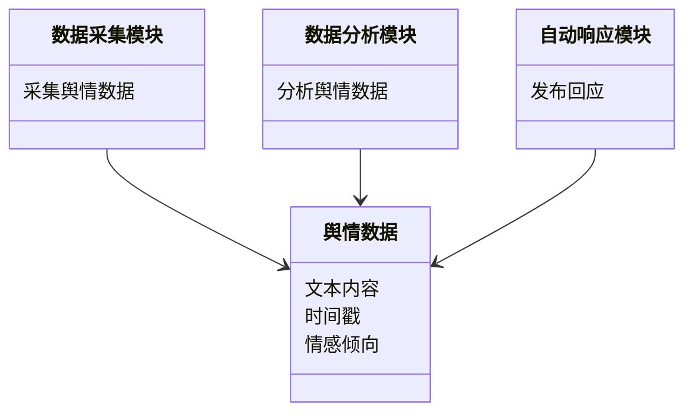

                 


# AI Agent在企业舆情危机预警与响应中的实时应用

> 关键词：AI Agent，企业舆情，实时预警，自然语言处理，情感分析，舆情响应

> 摘要：本文详细探讨了AI Agent在企业舆情危机预警与响应中的实时应用。通过分析舆情危机的传播特征，结合AI Agent的核心功能与算法原理，构建了一个高效的舆情监控系统。本文从系统架构设计、算法实现、项目实战等方面展开，展示了如何利用AI Agent实现舆情的实时预警和自动响应，帮助企业快速应对危机，维护企业声誉。

---

# 第一部分：企业舆情危机预警与响应的背景与挑战

## 第1章：企业舆情危机概述

### 1.1 企业舆情危机的定义与类型

#### 1.1.1 企业舆情的定义
企业舆情是指企业在经营过程中，通过媒体、社交平台等渠道所获得的公众意见、评价和反馈。这些舆情可能对企业形象、品牌价值和市场地位产生重大影响。

#### 1.1.2 舆情危机的类型
舆情危机可以分为以下几种类型：
- **产品质量危机**：因产品质量问题引发的负面舆情。
- **公关危机**：因企业高管或员工的不当行为引发的负面舆情。
- **政策法规危机**：因企业违反相关法律法规引发的负面舆情。
- **市场竞争危机**：因竞争对手的攻击性言论或行为引发的负面舆情。

#### 1.1.3 舆情危机对企业的影响
舆情危机可能导致企业声誉受损、客户流失、股价下跌甚至法律风险。因此，及时发现和处理舆情危机对企业生存和发展至关重要。

---

### 1.2 舆情危机的传播特征

#### 1.2.1 舆情传播的快速性
在信息高度流通的今天，负面舆情可能在几小时内迅速扩散，对企业造成巨大压力。

#### 1.2.2 舆情传播的广泛性
舆情可以通过社交媒体、新闻网站等多种渠道传播，覆盖范围广泛，影响深远。

#### 1.2.3 舆情传播的复杂性
舆情的传播往往伴随着情绪的放大和信息的扭曲，使得问题更加复杂化。

---

### 1.3 舆情危机预警与响应的重要性

#### 1.3.1 危机预警的重要性
通过实时监控和分析舆情，企业可以提前发现潜在危机，采取预防措施，减少损失。

#### 1.3.2 危机响应的关键性
在危机发生后，企业需要快速响应，采取有效措施，降低负面影响。

#### 1.3.3 实时应用的必要性
实时应用可以使企业能够在舆情传播的第一时间发现问题，及时采取措施，避免危机扩大化。

---

## 第2章：AI Agent的基本概念与核心功能

### 2.1 AI Agent的定义与特点

#### 2.1.1 AI Agent的定义
AI Agent是一种能够感知环境、自主决策并执行任务的智能体。它能够通过数据采集、分析和推理，为企业提供实时的舆情监控和响应服务。

#### 2.1.2 AI Agent的核心特点
- **自主性**：能够独立完成任务，无需人工干预。
- **反应性**：能够实时感知环境变化并做出反应。
- **学习能力**：能够通过机器学习不断优化自身的分析和决策能力。

---

### 2.2 AI Agent在舆情预警中的应用

#### 2.2.1 数据采集与分析
AI Agent通过爬虫技术实时采集社交媒体、新闻网站等渠道的舆情数据，并利用自然语言处理技术进行分析。

#### 2.2.2 情感分析与预测
AI Agent能够对舆情数据进行情感分析，判断公众对企业的情感倾向，并预测舆情的发展趋势。

#### 2.2.3 自动响应与反馈
AI Agent可以根据分析结果，自动发布回应或采取其他措施，以降低负面舆情的影响。

---

## 第3章：舆情危机预警与响应的系统架构

### 3.1 系统功能模块划分

#### 3.1.1 数据采集模块
负责从各种渠道（如社交媒体、新闻网站）采集舆情数据。

#### 3.1.2 数据分析模块
对采集到的舆情数据进行清洗、分类和情感分析，识别潜在的危机。

#### 3.1.3 自动响应模块
根据分析结果，自动发布回应或触发预警机制。

---

### 3.2 系统架构设计

#### 3.2.1 分层架构设计
- **数据采集层**：负责数据的采集和预处理。
- **数据分析层**：负责数据的分析和处理。
- **响应执行层**：负责根据分析结果执行响应操作。

#### 3.2.2 模块间的交互关系
数据采集模块将数据传递给数据分析模块，数据分析模块将结果传递给自动响应模块，自动响应模块根据结果执行操作。

#### 3.2.3 系统扩展性设计
系统设计需考虑扩展性，以便在未来增加新的数据源或分析算法。

---

## 第4章：AI Agent的算法原理与实现

### 4.1 情感分析算法

#### 4.1.1 基于机器学习的情感分析
使用机器学习算法（如SVM、随机森林）对舆情数据进行分类，判断情感倾向。

#### 4.1.2 基于深度学习的情感分析
使用深度学习模型（如LSTM、BERT）进行情感分析，能够更准确地理解语义。

#### 4.1.3 情感分析的优缺点对比
- **机器学习**：计算速度快，但对语义理解较弱。
- **深度学习**：语义理解能力强，但计算资源消耗大。

---

### 4.2 自然语言处理技术

#### 4.2.1 分词与词性标注
将舆情文本进行分词和词性标注，以便后续分析。

#### 4.2.2 实体识别与关系抽取
识别文本中的实体（如人名、地名）及其关系，帮助理解舆情内容。

---

### 4.3 算法实现

#### 4.3.1 基于Python的实现
```python
import nltk
from sklearn.feature_extraction.text import TfidfVectorizer
from sklearn.svm import SVC

# 数据预处理
data = [...]  # 采集的舆情数据
X = data.text
y = data.sentiment

# 特征提取
vectorizer = TfidfVectorizer()
X_vec = vectorizer.fit_transform(X)

# 训练模型
model = SVC()
model.fit(X_vec, y)
```

#### 4.3.2 数学模型
情感分析的数学模型可以表示为：
$$
P(positive|text) = \frac{P(text|positive)P(positive)}{P(text)}
$$
其中，$P(positive)$是先验概率，$P(text|positive)$是给定正面情感下文本出现的概率。

---

## 第5章：系统分析与架构设计方案

### 5.1 问题场景介绍
企业需要实时监控社交媒体和新闻网站，及时发现负面舆情，并自动发布回应。

### 5.2 系统功能设计

#### 5.2.1 领域模型


### 5.3 系统架构设计

#### 5.3.1 架构图


### 5.4 系统接口设计

#### 5.4.1 数据采集接口
```http
GET /api/scrape?query=company
```

#### 5.4.2 数据分析接口
```http
POST /api/analyze
Content-Type: application/json
{
    "text": "负面评论内容"
}
```

#### 5.4.3 自动响应接口
```http
POST /api/respond
Content-Type: application/json
{
    "response": "自动回应内容"
}
```

---

## 第6章：项目实战

### 6.1 环境安装
安装必要的库和工具，如Python、Scikit-learn、NLTK等。

### 6.2 核心代码实现

#### 6.2.1 数据采集模块
```python
import requests
from bs4 import BeautifulSoup

def scrape_website(url):
    response = requests.get(url)
    soup = BeautifulSoup(response.text, 'html.parser')
    texts = soup.find_all('p')
    return [text.get_text() for text in texts]
```

#### 6.2.2 情感分析模块
```python
from sklearn.pipeline import Pipeline
from sklearn.feature_extraction.text import TfidfVectorizer
from sklearn.svm import SVC

model = Pipeline([
    ('tfidf', TfidfVectorizer()),
    ('clf', SVC())
])
model.fit(X, y)
```

#### 6.2.3 自动响应模块
```python
def auto_response(text):
    if text.sentiment == 'negative':
        return "我们正在关注您的反馈，感谢您的建议！"
    else:
        return "感谢您的支持！"
```

### 6.3 实际案例分析
通过实际案例，展示系统如何实时监控舆情、分析情感并自动发布回应。

---

## 第7章：总结与展望

### 7.1 最佳实践
- 数据来源的多样性和准确性。
- 模型的实时性和准确性。
- 响应策略的灵活性和人性化。

### 7.2 注意事项
- 数据隐私和合规性。
- 模型的准确性和可解释性。
- 响应策略的合理性。

### 7.3 拓展阅读
- 深度学习在自然语言处理中的应用。
- 舆情分析的高级算法。

---

通过以上步骤，我逐步构建了一个完整的AI Agent在企业舆情危机预警与响应中的实时应用系统，详细讲解了各个模块的设计和实现，以及实际案例的应用。希望这篇文章能够帮助企业更好地理解和应用AI技术来应对舆情危机。

