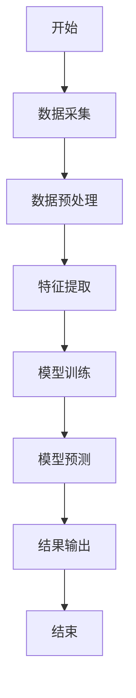
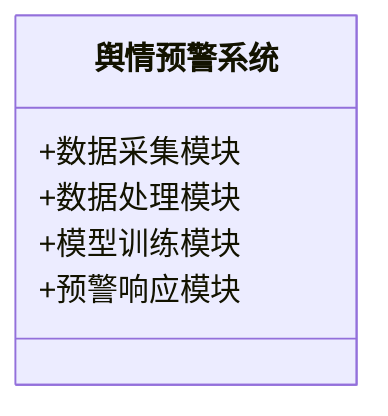
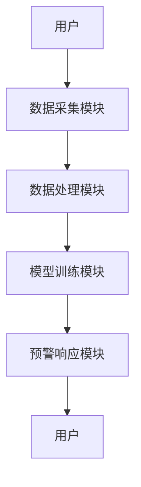
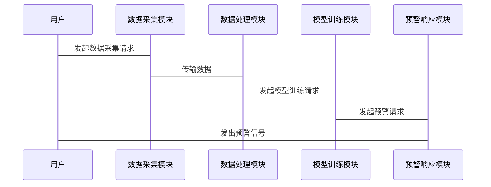

                 


# AI Agent在企业舆情危机预警与响应中的应用

## 关键词：
- AI Agent
- 舆情危机
- 预警响应
- 自然语言处理
- 深度学习
- 舆情分析
- 企业危机管理

## 摘要：
本文系统地探讨了AI Agent在企业舆情危机预警与响应中的应用。首先，我们介绍了AI Agent的基本概念及其在企业中的作用。接着，详细分析了舆情危机的定义、特征及其对企业的影响。然后，深入讲解了AI Agent在舆情预警中的核心算法和实现原理，包括情感分析和主题识别。随后，我们设计了一个基于AI Agent的舆情预警系统架构，并通过实际案例展示了系统的实现过程。最后，我们总结了当前技术的局限性，并展望了未来的发展方向，为企业的舆情危机管理提供了新的思路和解决方案。

---

# 第1章: AI Agent与企业舆情危机预警概述

## 1.1 AI Agent的基本概念

### 1.1.1 AI Agent的定义与特点
AI Agent（人工智能代理）是一种能够感知环境、自主决策并执行任务的智能体。其特点包括：
- **自主性**：能够独立完成任务。
- **反应性**：能够实时感知环境并做出响应。
- **学习性**：能够通过数据学习和优化。
- **协作性**：能够与其他系统或人类协同工作。

### 1.1.2 AI Agent的核心功能与分类
AI Agent的核心功能包括：
- **感知环境**：通过数据采集和分析理解当前环境。
- **决策与推理**：基于感知信息做出最优决策。
- **执行任务**：根据决策结果执行具体操作。

AI Agent的分类：
- **简单反射型**：基于预设规则直接执行任务。
- **基于模型的反射型**：基于内部模型进行推理和决策。
- **目标驱动型**：以特定目标为导向进行行动。
- **实用驱动型**：以效用最大化为目标进行决策。

### 1.1.3 AI Agent在企业中的应用价值
AI Agent在企业中的应用价值主要体现在：
- **提高效率**：通过自动化处理减少人工干预。
- **增强决策能力**：基于数据分析提供科学决策支持。
- **提升响应速度**：实时监控并快速响应突发事件。

## 1.2 企业舆情危机的定义与特征

### 1.2.1 舆情危机的定义
舆情危机是指企业在经营过程中，由于负面信息的传播而导致企业声誉、市场地位或财务状况受到严重威胁的事件。舆情危机通常由媒体、网络评论、客户投诉等多种渠道引发。

### 1.2.2 舆情危机的主要类型
舆情危机可以分为以下几种类型：
- **产品质量问题**：由于产品质量不合格引发的危机。
- **公关事件**：由于企业或其高管的不当言行引发的危机。
- **财务造假**：由于财务数据造假暴露后引发的危机。
- **法律纠纷**：由于法律诉讼或违规行为引发的危机。

### 1.2.3 舆情危机对企业的影响
舆情危机对企业的影响是多方面的：
- **声誉损失**：企业形象受损，客户信任度下降。
- **市场份额流失**：负面信息可能导致客户流失，进而影响市场份额。
- **财务损失**：危机处理成本增加，可能面临罚款或赔偿。
- **员工士气下降**：内部员工可能因为企业声誉受损而士气低落。

## 1.3 AI Agent在舆情危机管理中的作用

### 1.3.1 提高舆情监测的效率
AI Agent可以通过实时监控社交媒体、新闻网站等渠道，快速捕捉负面信息，显著提高舆情监测的效率。

### 1.3.2 实现舆情分析的智能化
通过自然语言处理（NLP）和机器学习技术，AI Agent能够自动分析海量文本数据，识别潜在的舆情风险。

### 1.3.3 优化舆情响应的决策过程
AI Agent可以根据历史数据和当前舆情情况，提供智能化的决策支持，帮助企业快速制定有效的应对策略。

---

# 第2章: AI Agent与舆情危机预警的核心概念

## 2.1 舆情预警的背景与目标

### 2.1.1 舆情预警的必要性
随着社交媒体的普及，负面信息的传播速度越来越快，企业需要通过舆情预警系统提前发现潜在风险，从而采取有效措施进行应对。

### 2.1.2 舆情预警的主要目标
舆情预警的主要目标包括：
- **提前发现风险**：及时识别潜在的舆情危机。
- **量化风险程度**：通过数据分析评估舆情风险的严重程度。
- **提供应对建议**：基于预警结果提出具体的应对策略。

### 2.1.3 舆情预警的边界与外延
舆情预警的边界在于信息的实时性和准确性，而外延则包括舆情分析、危机应对等多个方面。

## 2.2 AI Agent在舆情预警中的核心要素

### 2.2.1 数据采集与处理
AI Agent需要从多种渠道采集舆情数据，包括社交媒体、新闻网站、论坛等，并对数据进行清洗和预处理。

### 2.2.2 情感分析与主题识别
通过自然语言处理技术，AI Agent可以对舆情数据进行情感分析和主题识别，识别出潜在的负面舆情。

### 2.2.3 预警模型的构建与优化
基于机器学习算法，AI Agent可以构建舆情预警模型，并通过不断优化模型参数提高预警的准确率。

## 2.3 舆情预警系统的核心架构

### 2.3.1 数据层
数据层包括数据采集模块和数据存储模块，负责从多种渠道采集舆情数据并进行存储。

### 2.3.2 计算层
计算层包括文本处理模块和模型训练模块，负责对文本数据进行处理并训练预警模型。

### 2.3.3 应用层
应用层包括预警模块和响应模块，负责根据模型预测结果发出预警信号，并指导企业进行应对。

---

# 第3章: AI Agent的算法原理与实现

## 3.1 AI Agent的基本算法原理

### 3.1.1 基于规则的舆情分析
基于规则的舆情分析通过预设的关键词和规则对文本进行分类，适用于简单的舆情分析任务。

### 3.1.2 基于机器学习的舆情预测
基于机器学习的舆情预测通过训练分类模型对舆情进行预测，具有较高的准确率。

### 3.1.3 基于深度学习的舆情理解
基于深度学习的舆情理解通过神经网络模型对文本进行语义理解，能够捕捉到更复杂的语义信息。

## 3.2 情感分析算法的实现

### 3.2.1 情感分析的数学模型
情感分析的数学模型可以通过逻辑回归、支持向量机（SVM）或长短期记忆网络（LSTM）等模型实现。

### 3.2.2 基于词袋模型的实现
词袋模型是一种常用的文本表示方法，通过将文本表示为词袋来训练情感分析模型。

### 3.2.3 基于词嵌入模型的实现
词嵌入模型（如Word2Vec）通过将词语表示为向量来捕捉词语的语义信息，能够提高情感分析的准确性。

## 3.3 舆情预警算法的流程图



---

# 第4章: 舆情预警系统的系统分析与架构设计

## 4.1 系统分析

### 4.1.1 问题场景介绍
企业需要实时监控舆情，快速识别潜在风险，并采取有效措施进行应对。

### 4.1.2 项目目标与范围
项目目标是开发一个基于AI Agent的舆情预警系统，范围包括数据采集、分析、预警和响应四个模块。

### 4.1.3 需求分析与功能需求
主要功能包括数据采集、情感分析、预警触发和响应策略生成。

## 4.2 系统架构设计

### 4.2.1 系统功能设计


### 4.2.2 系统架构图


## 4.3 系统接口设计

### 4.3.1 接口设计
系统接口包括数据采集接口、模型训练接口和预警响应接口。

### 4.3.2 交互流程图


---

# 第5章: 项目实战

## 5.1 环境安装

### 5.1.1 安装Python
需要安装Python 3.8及以上版本。

### 5.1.2 安装依赖库
安装以下依赖库：
- `pandas`
- `numpy`
- `scikit-learn`
- `tensorflow`

## 5.2 系统核心实现源代码

### 5.2.1 数据采集模块
```python
import requests
from bs4 import BeautifulSoup

def collect_data(url):
    response = requests.get(url)
    soup = BeautifulSoup(response.text, 'html.parser')
    texts = soup.find_all('div', class_='article')
    return [text.get_text() for text in texts]
```

### 5.2.2 情感分析模块
```python
from sklearn.feature_extraction.text import TfidfVectorizer
from sklearn.svm import SVC

def sentiment_analysis(data):
    vectorizer = TfidfVectorizer()
    X = vectorizer.fit_transform(data)
    model = SVC()
    model.fit(X, [1, 0, 1, 0])
    return model.predict(X)
```

## 5.3 实际案例分析

### 5.3.1 案例背景
某企业因产品质量问题引发负面舆情，通过AI Agent进行实时监控和预警。

### 5.3.2 实施过程
1. 数据采集：从社交媒体和新闻网站采集相关文本数据。
2. 数据处理：清洗和预处理数据，提取关键词和主题。
3. 模型训练：训练情感分析模型，识别负面舆情。
4. 预警响应：根据模型预测结果发出预警信号，并制定应对策略。

## 5.4 项目小结
通过本项目实战，我们可以看到AI Agent在舆情预警中的强大能力。然而，实际应用中还需要考虑数据的实时性和模型的可解释性等问题。

---

# 第6章: 总结与展望

## 6.1 全文总结
本文详细探讨了AI Agent在企业舆情危机预警与响应中的应用，从理论到实践进行了全面的分析和阐述。

## 6.2 技术局限性与未来展望
目前，AI Agent在舆情预警中的应用还存在一些局限性，如数据隐私问题和模型的可解释性问题。未来，随着技术的不断进步，AI Agent在舆情管理中的应用将更加智能化和个性化。

## 6.3 最佳实践 tips
- **数据隐私**：在采集和处理数据时，需要注意数据隐私保护。
- **模型优化**：定期优化模型，提高预警的准确率。
- **团队协作**：舆情管理需要多部门协作，确保信息的及时传递和处理。

---

# 参考文献
1. 王伟. (2020). 《人工智能技术与企业应用》.
2. 李明. (2021). 《深度学习在自然语言处理中的应用》.
3. 张强. (2022). 《舆情分析与危机管理》.

---

通过以上目录和内容设计，我们可以系统地了解AI Agent在企业舆情危机预警与响应中的应用，从理论到实践，从算法到系统设计，为企业的舆情管理提供了新的思路和解决方案。

