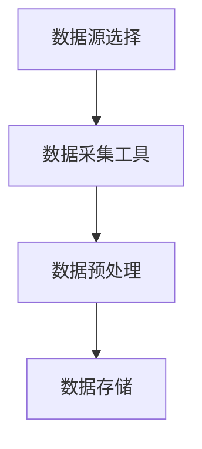
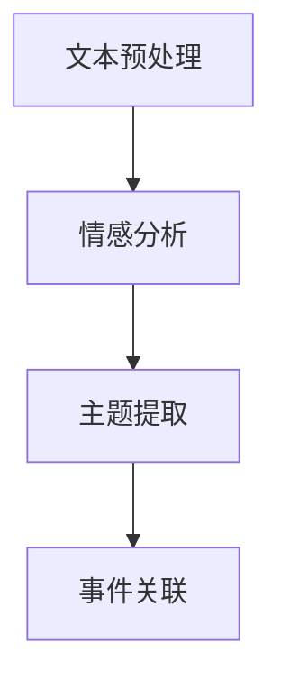
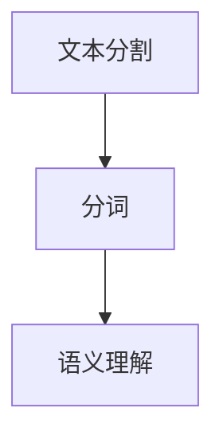
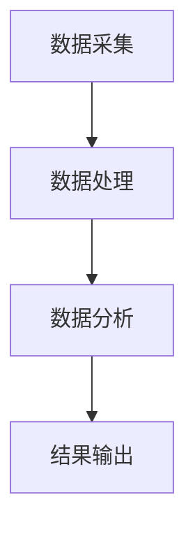
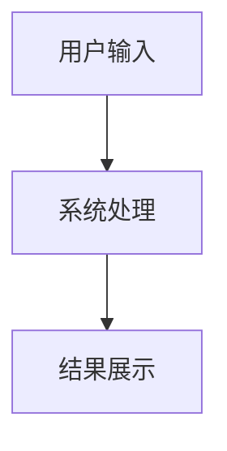

                 


# AI Agent在企业舆情监测与危机公关中的应用

> 关键词：AI Agent，企业舆情监测，危机公关，自然语言处理，机器学习，舆情预警，智能化危机管理

> 摘要：本文深入探讨AI Agent在企业舆情监测与危机公关中的应用，分析其核心原理、技术实现、系统架构及实际案例，揭示其对企业危机管理的重要价值。通过详细的技术分析与实战演示，为企业智能化舆情管理提供参考。

---

## 第二部分: AI Agent的核心原理与技术实现

# 第2章: AI Agent的核心原理与技术实现

## 2.1 AI Agent的基本原理

### 2.1.1 感知层：数据采集与处理

AI Agent通过多种渠道采集舆情数据，包括社交媒体、新闻网站、论坛、客服对话等。以下是数据采集的主要步骤：

1. **数据源选择**：确定舆情数据的来源，例如微博、微信、知乎、新闻网站等。
2. **数据采集工具**：使用API接口、网络爬虫或其他工具进行数据抓取。
3. **数据预处理**：对采集到的数据进行清洗、去重和格式化处理，确保数据质量。



### 2.1.2 决策层：信息分析与判断

AI Agent通过自然语言处理（NLP）和机器学习技术对数据进行分析，生成舆情报告。以下是主要步骤：

1. **文本预处理**：包括分词、去除停用词、词干提取等。
2. **情感分析**：使用NLP模型对文本进行情感分析，判断舆情的正面、负面或中性。
3. **主题提取**：提取文本中的关键词和主题，识别舆情的主要内容。
4. **事件关联**：通过时间戳和关键词关联分析，识别事件的发展趋势。



### 2.1.3 执行层：行动与反馈

AI Agent根据分析结果采取相应行动，例如：

1. **自动响应**：在社交媒体上自动回复用户的评论。
2. **触发预警**：当负面舆情达到预设阈值时，触发预警机制。
3. **生成报告**：定期生成舆情分析报告，供企业决策参考。

---

## 2.2 自然语言处理技术在AI Agent中的应用

### 2.2.1 NLP技术的基本原理

自然语言处理（NLP）是AI Agent实现舆情分析的核心技术。以下是NLP的主要步骤：

1. **文本分割**：将文本分割成句子或词语。
2. **分词**：将词语分割成有意义的词汇。
3. **语义理解**：通过词嵌入（如Word2Vec）或上下文表示（如BERT）理解文本的语义。



### 2.2.2 常见的NLP模型与工具

以下是一些常用的NLP模型和工具：

| **模型/工具** | **描述** | **应用场景** |
|----------------|-----------|--------------|
| Word2Vec       | 词向量模型 | 词语嵌入      |
| Gensim         | NLP工具库   | 主题建模      |
| BERT           | 深度学习模型 | 语义理解      |
|spaCy            | NLP工具库   | 实体识别      |

### 2.2.3 NLP在舆情分析中的具体应用

以下是NLP技术在舆情分析中的具体应用：

1. **情感分析**：识别文本的情感倾向。
2. **关键词提取**：提取文本中的关键词。
3. **实体识别**：识别文本中的实体（如人名、地名、公司名）。

---

## 2.3 机器学习在AI Agent中的应用

### 2.3.1 机器学习的基本原理

机器学习是一种通过数据训练模型的技术，以下是机器学习的主要步骤：

1. **数据准备**：收集和清洗数据。
2. **特征提取**：从数据中提取特征。
3. **模型训练**：使用训练数据训练模型。
4. **模型评估**：通过测试数据评估模型的性能。

### 2.3.2 常见的机器学习算法

以下是一些常用的机器学习算法：

| **算法** | **描述** | **应用场景** |
|-----------|-----------|--------------|
| KNN       | k近邻算法   | 分类          |
| SVM       | 支持向量机   | 分类          |
| RF        | 随机森林     | 分类          |
| LR        | 线性回归     | 回归          |

### 2.3.3 机器学习在舆情监测中的具体应用

以下是机器学习技术在舆情监测中的具体应用：

1. **情感分类**：使用机器学习模型对文本进行情感分类。
2. **舆情预测**：预测舆情的发展趋势。
3. **异常检测**：检测异常的舆情变化。

---

## 第3章: 企业舆情监测的流程与AI Agent的介入

### 3.1 企业舆情监测的基本流程

以下是企业舆情监测的基本流程：

1. **数据采集**：从多个渠道采集舆情数据。
2. **数据处理**：清洗、去重和格式化处理数据。
3. **数据分析**：使用NLP和机器学习技术对数据进行分析。
4. **结果输出**：生成舆情分析报告。



### 3.2 AI Agent在舆情监测中的具体介入

以下是AI Agent在舆情监测中的具体介入：

1. **数据采集的智能化**：AI Agent可以自动采集数据并识别数据源。
2. **数据分析的自动化**：AI Agent可以自动分析数据并生成舆情报告。
3. **结果输出的精准化**：AI Agent可以自动调整分析结果的输出格式。

### 3.3 基于AI Agent的舆情预警机制

以下是基于AI Agent的舆情预警机制：

1. **预警机制的基本原理**：通过实时监测舆情数据，当负面舆情达到预设阈值时，触发预警。
2. **AI Agent在预警中的角色**：AI Agent可以自动识别负面舆情并触发预警。

---

## 第4章: 危机公关中的AI Agent应用

### 4.1 危机公关的基本概念与流程

以下是危机公关的基本流程：

1. **危机识别**：识别潜在的危机。
2. **危机分析**：分析危机的影响范围和严重程度。
3. **危机应对**：制定应对策略并实施。
4. **危机总结**：总结危机应对的经验和教训。

### 4.2 AI Agent在危机公关中的具体应用

以下是AI Agent在危机公关中的具体应用：

1. **危机识别**：通过实时监测舆情数据，识别潜在的危机。
2. **危机分析**：通过NLP和机器学习技术分析危机的影响范围和严重程度。
3. **危机应对**：根据分析结果，制定应对策略并实施。

### 4.3 基于AI Agent的智能化危机管理

以下是基于AI Agent的智能化危机管理：

1. **实时监测**：实时监测舆情数据，识别潜在的危机。
2. **智能决策**：通过NLP和机器学习技术，智能决策危机应对策略。
3. **效果评估**：评估危机应对的效果，并总结经验教训。

---

## 第5章: 项目实战与系统架构设计

### 5.1 系统架构设计

以下是系统架构设计：

1. **领域模型**：包括数据采集、数据处理、数据分析和结果输出。
2. **系统架构**：采用分层架构，包括数据层、业务逻辑层和用户界面层。


### 5.2 系统功能设计

以下是系统功能设计：

1. **数据采集**：从多个渠道采集舆情数据。
2. **数据处理**：清洗、去重和格式化处理数据。
3. **数据分析**：使用NLP和机器学习技术对数据进行分析。
4. **结果输出**：生成舆情分析报告。

### 5.3 系统接口设计

以下是系统接口设计：

1. **数据采集接口**：用于采集舆情数据。
2. **数据分析接口**：用于对数据进行分析。
3. **结果输出接口**：用于输出分析结果。

### 5.4 系统交互设计

以下是系统交互设计：

1. **用户输入**：用户输入查询条件。
2. **系统处理**：系统根据查询条件进行数据处理。
3. **结果展示**：系统展示分析结果。



---

## 第6章: 项目实战与优化

### 6.1 项目实战

以下是项目实战：

1. **环境配置**：安装必要的工具和库，例如Python、Numpy、Pandas、Scikit-learn等。
2. **代码实现**：实现舆情监测和分析的代码。
3. **案例分析**：通过具体案例分析舆情监测和分析的结果。

### 6.2 代码实现

以下是代码实现：

```python
import numpy as np
from sklearn.feature_extraction.text import TfidfVectorizer
from sklearn.naive_bayes import MultinomialNB

# 数据预处理
def preprocess(text):
    # 分词
    words = text.split()
    # 去除停用词
    stop_words = set(["的", "了", "是", "在"])
    filtered_words = [word for word in words if word not in stop_words]
    return ' '.join(filtered_words)

# 数据集
texts = [
    "这家公司的产品真的很垃圾，质量差，服务也差",
    "这家公司的产品很好，质量高，服务也很好",
    "这家公司的产品还可以，质量一般，服务一般",
    "这家公司的产品非常优秀，质量很高，服务很到位"
]

# 特征提取
vectorizer = TfidfVectorizer()
X = vectorizer.fit_transform([preprocess(text) for text in texts])

# 模型训练
model = MultinomialNB()
model.fit(X, np.array([0, 1, 1, 1]))

# 预测
new_text = "这家公司的产品质量很差，服务也差"
new_X = vectorizer.transform([preprocess(new_text)])
print(model.predict(new_X))
```

### 6.3 优化与建议

以下是优化与建议：

1. **优化数据预处理**：进一步优化数据预处理步骤，例如使用更高效的分词工具。
2. **优化模型选择**：尝试不同的机器学习算法，选择性能最佳的算法。
3. **优化结果展示**：优化结果展示的可视化效果，例如使用图表展示分析结果。

---

## 第7章: 总结与展望

### 7.1 总结

AI Agent在企业舆情监测与危机公关中的应用具有重要意义。通过NLP和机器学习技术，AI Agent可以实现舆情的智能化监测与分析，帮助企业更好地应对舆情危机。

### 7.2 展望

未来，随着AI技术的不断发展，AI Agent在企业舆情监测与危机公关中的应用将更加广泛和深入。例如，可以进一步优化AI Agent的算法，提高舆情分析的准确性和效率。

---

## 结语

AI Agent作为人工智能领域的核心技术，已经在企业舆情监测与危机公关中展现出巨大的潜力。通过本文的深入分析与实战演示，我们可以看到AI Agent在舆情监测与危机公关中的重要价值。未来，随着技术的不断进步，AI Agent将在企业智能化管理中发挥更大的作用。

