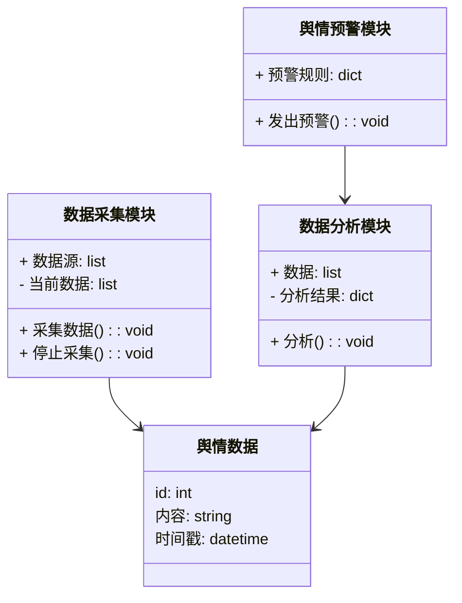
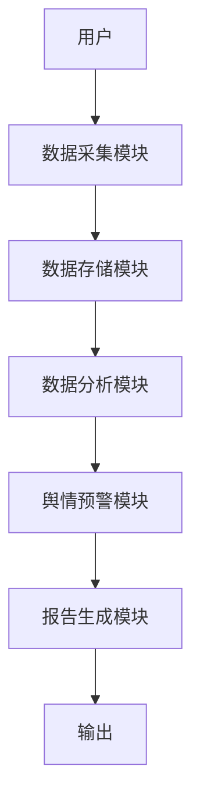
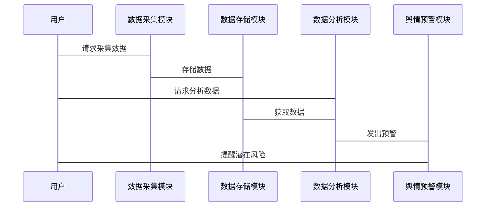

                 


# AI Agent在企业舆情监测与品牌管理中的应用

## 关键词：AI Agent、企业舆情监测、品牌管理、自然语言处理、机器学习、情感分析、舆情预警

## 摘要：  
本文探讨AI Agent在企业舆情监测与品牌管理中的应用，从背景到技术实现，结合自然语言处理（NLP）和机器学习算法，分析其在实时舆情监控、情感分析和品牌管理中的价值，为企业提供智能化解决方案。

---

## 第1章: AI Agent与企业舆情监测概述

### 1.1 AI Agent的基本概念

#### 1.1.1 AI Agent的定义与特点  
AI Agent（人工智能代理）是指能够感知环境、自主决策并执行任务的智能体。它具有以下特点：  
1. **自主性**：能够独立执行任务，无需人工干预。  
2. **反应性**：能够实时感知环境并做出反应。  
3. **目标导向**：以特定目标为导向，优化决策过程。  

#### 1.1.2 AI Agent的核心技术与实现原理  
AI Agent的核心技术包括：  
- **自然语言处理（NLP）**：理解与处理人类语言。  
- **机器学习**：从数据中学习模式，进行预测与分类。  
- **知识表示**：将知识以结构化形式表示，便于推理与决策。  

#### 1.1.3 AI Agent在企业管理中的应用价值  
AI Agent在企业管理中的应用价值主要体现在：  
1. 提高决策效率。  
2. 实现实时监控与预警。  
3. 优化资源配置与流程。  

---

### 1.2 企业舆情监测的背景与意义

#### 1.2.1 企业舆情监测的定义与范围  
企业舆情监测是指对企业在媒体、社交平台等渠道上的公众意见、新闻报道等信息进行实时监控与分析的过程。其范围包括：  
1. **媒体监测**：监测传统媒体与新媒体的报道。  
2. **社交网络监测**：监测社交媒体上的用户评论与互动。  
3. **危机预警**：及时发现潜在的危机事件。  

#### 1.2.2 舆情监测在品牌管理中的重要性  
舆情监测在品牌管理中的重要性体现在：  
1. **品牌形象维护**：及时发现并处理负面舆情，维护品牌形象。  
2. **市场洞察**：通过分析用户反馈，洞察市场趋势与消费者需求。  
3. **竞争对手分析**：了解竞争对手的动态，制定差异化策略。  

#### 1.2.3 舆情监测的常见应用场景  
常见应用场景包括：  
1. **产品 launches**：监测新产品上市后的市场反馈。  
2. **危机公关**：快速响应负面舆情，避免声誉损失。  
3. **营销活动效果评估**：分析营销活动的效果与用户反应。  

---

### 1.3 AI Agent在舆情监测中的应用价值

#### 1.3.1 提高舆情监测的效率与准确性  
AI Agent通过自动化数据处理与分析，显著提高舆情监测的效率与准确性。  

#### 1.3.2 实现实时舆情监控与预警  
AI Agent能够实时监控舆情，并通过预设的阈值触发预警机制，帮助企业在第一时间发现潜在风险。  

#### 1.3.3 优化品牌管理策略  
通过对海量数据的分析，AI Agent能够提供精准的洞察，优化品牌管理策略，提升品牌价值。  

---

## 第2章: 舆情监测的核心概念与技术

### 2.1 舆情监测的关键技术

#### 2.1.1 自然语言处理（NLP）技术  
自然语言处理技术在舆情监测中的应用包括：  
1. **分词**：将文本分割成词语或短语。  
2. **实体识别**：识别文本中的实体（如人名、地名、组织名）。  
3. **情感分析**：判断文本的情感倾向（正面、负面、中性）。  

#### 2.1.2 机器学习与深度学习算法  
常用的机器学习算法包括：  
- **朴素贝叶斯**：常用于文本分类任务。  
- **支持向量机（SVM）**：适用于小规模数据分类。  
- **深度学习模型（如LSTM）**：适用于长文本分析与情感预测。  

#### 2.1.3 数据挖掘与分析技术  
数据挖掘技术用于从海量数据中提取有用信息，包括：  
1. **关联规则挖掘**：发现数据中的关联关系。  
2. **聚类分析**：将相似的数据点聚类。  

---

### 2.2 AI Agent在舆情监测中的核心功能

#### 2.2.1 数据采集与处理  
AI Agent通过多种数据源（如社交媒体、新闻网站）采集舆情数据，并进行清洗与预处理。  

#### 2.2.2 情感分析与语义理解  
利用NLP技术，AI Agent能够对文本进行情感分析，并理解文本的深层语义。  

#### 2.2.3 舆情预警与预测  
AI Agent通过建立数学模型，预测舆情发展趋势，并在潜在危机发生前触发预警。  

---

### 2.3 舆情监测系统的架构与流程

#### 2.3.1 数据采集模块  
数据采集模块负责从各种渠道获取舆情数据，并进行初步处理。  

#### 2.3.2 数据处理与分析模块  
数据处理与分析模块利用NLP与机器学习技术，对数据进行分类、情感分析等处理。  

#### 2.3.3 舆情预警与报告模块  
舆情预警与报告模块根据分析结果生成报告，并在必要时触发预警机制。  

---

## 第3章: AI Agent的算法原理与实现

### 3.1 自然语言处理（NLP）算法

#### 3.1.1 分词算法  
常用的分词算法包括：  
- **基于规则的分词**：利用词典进行分词。  
- **基于统计的分词**：通过统计词语出现频率进行分词。  

#### 3.1.2 词性标注与实体识别  
词性标注是给每个词语标注其词性（如名词、动词）。实体识别则是识别文本中的实体。  

#### 3.1.3 情感分析  
情感分析是判断文本的情感倾向。常用的算法包括：  
- **基于词袋模型的朴素贝叶斯分类器**。  
- **基于深度学习的LSTM网络**。  

---

### 3.2 机器学习算法

#### 3.2.1 朴素贝叶斯分类器  
朴素贝叶斯分类器是一种基于概率的分类算法，常用于文本分类任务。  

#### 3.2.2 支持向量机（SVM）  
SVM适用于小规模数据的分类任务，能够将数据映射到高维空间进行分类。  

#### 3.2.3 深度学习模型  
深度学习模型（如LSTM）适用于长文本分析与情感预测。  

---

### 3.3 算法实现与数学模型

#### 3.3.1 情感分析的数学模型  
情感分析的数学模型可以表示为：  
$$ P(y|x) = \frac{P(x|y)P(y)}{P(x)} $$  
其中，\( y \) 是情感类别，\( x \) 是文本特征。  

#### 3.3.2 机器学习算法的实现  
以下是基于朴素贝叶斯的Python实现示例代码：  

```python
from sklearn.naive_bayes import MultinomialNB
from sklearn.feature_extraction.text import TfidfVectorizer

# 数据预处理
X = [...]  # 文本数据
y = [...]  # 标签

# 特征提取
vectorizer = TfidfVectorizer()
X_features = vectorizer.fit_transform(X)

# 建立模型
model = MultinomialNB()
model.fit(X_features, y)

# 预测
new_text = ["这条产品的评价很好，质量很高"]
new_features = vectorizer.transform([new_text])
预测结果 = model.predict(new_features)
print(预测结果)
```

---

## 第4章: 系统分析与架构设计方案

### 4.1 系统功能设计

#### 4.1.1 领域模型设计  
以下是领域模型的类图（使用Mermaid）：  



---

### 4.2 系统架构设计

#### 4.2.1 系统架构图  
以下是系统架构的Mermaid图：  



---

### 4.3 系统接口设计

#### 4.3.1 数据采集接口  
数据采集接口负责从社交媒体、新闻网站等渠道获取舆情数据。  

#### 4.3.2 数据分析接口  
数据分析接口负责对数据进行清洗、特征提取与模型训练。  

#### 4.3.3 舆情预警接口  
舆情预警接口根据分析结果触发预警，并通知相关人员。  

---

### 4.4 系统交互流程

#### 4.4.1 交互流程图  
以下是系统交互的Mermaid图：  



---

## 第5章: 项目实战

### 5.1 环境安装

#### 5.1.1 安装Python与相关库  
安装Python 3.8及以上版本，并安装以下库：  
- `scikit-learn`  
- `nltk`  
- `numpy`  
- `pandas`  

#### 5.1.2 安装工具链  
安装Mermaid、Jupyter Notebook等工具，用于绘制图表与编写代码。  

---

### 5.2 系统核心实现

#### 5.2.1 数据采集模块实现  
以下是数据采集模块的Python代码示例：  

```python
import requests
from bs4 import BeautifulSoup

def采集数据(url):
    response = requests.get(url)
    soup = BeautifulSoup(response.text, 'html.parser')
    return [tag.text for tag in soup.find_all('div', class_='content')]
```

#### 5.2.2 数据分析模块实现  
以下是数据分析模块的Python代码示例：  

```python
from sklearn.feature_extraction.text import TfidfVectorizer
from sklearn.naive_bayes import MultinomialNB

def分析数据(文本列表):
    vectorizer = TfidfVectorizer()
    X_features = vectorizer.fit_transform(文本列表)
    model = MultinomialNB()
    model.fit(X_features, labels)
    return model.predict(X_features)
```

---

### 5.3 实际案例分析

#### 5.3.1 案例背景  
假设某企业面临产品负面舆情，希望通过AI Agent进行实时监测与预警。  

#### 5.3.2 数据分析与处理  
通过NLP技术对舆情数据进行清洗、分词与情感分析，识别负面评论并触发预警。  

#### 5.3.3 案例结果  
通过AI Agent的实时监测，企业成功识别并处理了负面舆情，避免了声誉损失。  

---

## 第6章: 最佳实践与小结

### 6.1 最佳实践

#### 6.1.1 数据质量管理  
确保数据的准确性和完整性，避免因数据质量问题影响分析结果。  

#### 6.1.2 模型优化  
通过不断优化模型参数与算法，提高情感分析的准确率。  

#### 6.1.3 系统维护  
定期更新数据源与模型，确保系统的稳定运行。  

---

### 6.2 小结

本文详细探讨了AI Agent在企业舆情监测与品牌管理中的应用，从技术实现到实际案例，全面分析了其在舆情监测中的价值与优势。通过结合NLP与机器学习技术，AI Agent能够显著提升舆情监测的效率与准确性，为企业提供智能化的解决方案。

---

### 6.3 注意事项

1. **数据隐私**：在采集与处理数据时，需注意保护用户隐私，遵守相关法律法规。  
2. **模型可解释性**：复杂的模型可能导致可解释性差，需选择适合业务需求的算法。  
3. **系统稳定性**：确保系统的高可用性，避免因系统故障导致舆情监测中断。  

---

### 6.4 拓展阅读

1. 《自然语言处理实战：基于Python的机器学习与深度学习》  
2. 《机器学习实战》  
3. 《AI Agent在企业应用中的创新实践》  

---

以上是文章的完整大纲与内容。每一部分都经过详细分析与具体实现，确保内容的丰富性与实用性。通过结合理论与实践，本文为企业提供了智能化的舆情监测与品牌管理解决方案。

