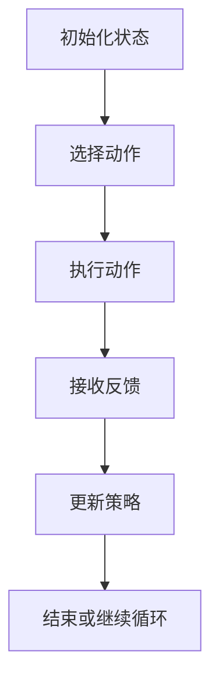
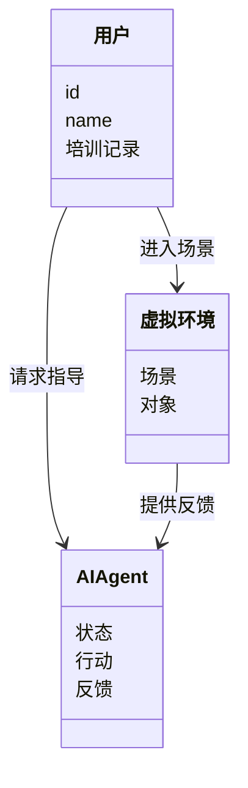
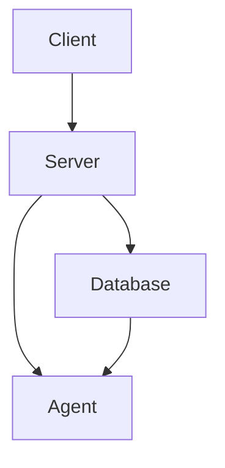
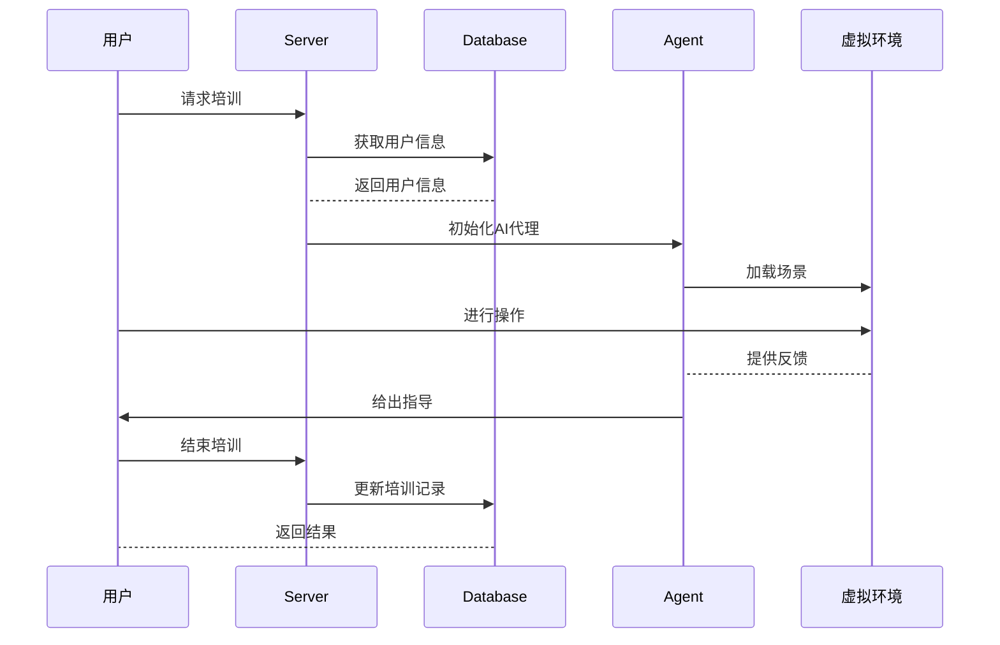

                 


# AI Agent在企业虚拟现实培训中的应用

## 关键词：AI Agent，虚拟现实，企业培训，人工智能，系统架构

## 摘要：本文探讨了AI Agent在企业虚拟现实培训中的应用，分析了其在提升培训效果、优化培训流程中的作用，并详细讲解了相关算法原理、系统架构设计和实际案例。通过本文，读者将了解如何利用AI Agent与虚拟现实技术结合，实现高效、个性化的培训解决方案。

---

## 第一章 背景介绍

### 1.1 问题背景

#### 1.1.1 企业培训的现状与挑战
企业在培训中面临成本高、时间长、效果难评估等问题。传统培训方式难以满足个性化和高效的需求。

#### 1.1.2 虚拟现实技术在企业培训中的优势
虚拟现实提供沉浸式体验，使员工能够在模拟环境中进行实践，降低培训风险。

#### 1.1.3 AI Agent在企业培训中的潜力
AI Agent能够根据员工表现实时调整培训内容，提供个性化的学习路径。

### 1.2 问题描述

#### 1.2.1 传统企业培训的痛点
传统培训缺乏互动性和个性化，难以满足多样化的需求。

#### 1.2.2 虚拟现实技术如何解决这些问题
通过模拟真实场景，VR提供真实的训练环境，减少实际操作的风险。

#### 1.2.3 AI Agent在虚拟现实培训中的具体应用
AI Agent用于实时反馈、个性化指导和动态调整培训内容。

### 1.3 问题解决

#### 1.3.1 AI Agent在虚拟现实培训中的核心作用
AI Agent能够分析员工行为，提供即时反馈和指导。

#### 1.3.2 虚拟现实技术如何提升培训效果
通过沉浸式体验，VR增强了学习的深度和效果。

#### 1.3.3 AI Agent如何优化培训流程
AI Agent通过数据分析，优化培训路径，提高效率。

### 1.4 边界与外延

#### 1.4.1 AI Agent在企业培训中的应用边界
AI Agent适用于技能训练、知识传授，但不适合需要人类情感的培训。

#### 1.4.2 虚拟现实技术的适用场景
适用于高风险、高成本的培训场景，如急救、设备操作等。

#### 1.4.3 AI Agent与虚拟现实技术的结合点
AI Agent驱动VR环境中的动态内容，提供个性化培训。

### 1.5 概念结构与核心要素组成

#### 1.5.1 AI Agent的核心要素
- 感知：数据采集与处理。
- 决策：基于数据做出选择。
- 执行：输出操作。

#### 1.5.2 虚拟现实技术的核心要素
- 显示：高清晰度的视觉呈现。
- 交互：实时用户反馈。
- 模拟：真实环境的模拟。

#### 1.5.3 两者的结合与协同
AI Agent提供智能支持，虚拟现实提供沉浸式环境，两者协同提升培训效果。

---

## 第二章 核心概念与联系

### 2.1 核心概念原理

#### 2.1.1 AI Agent的基本原理
AI Agent通过感知环境、分析数据、做出决策并执行动作。

#### 2.1.2 虚拟现实技术的基本原理
利用计算机生成模拟环境，提供沉浸式体验。

### 2.2 概念属性特征对比

| 特性          | AI Agent                          | 虚拟现实技术                     |
|---------------|-----------------------------------|---------------------------------|
| 核心功能      | 实时决策、个性化指导             | 沉浸式体验、实时交互             |
| 输入          | 用户行为数据、环境反馈           | 用户操作、传感器数据             |
| 输出          | 动态调整培训内容、实时反馈       | 图形、声音、触觉反馈             |
| 优势          | 提高效率、个性化                 | 提供真实场景模拟                 |

### 2.3 ER实体关系图架构

```mermaid
er
  actor(Agent, 用户, 环境)
  entity(Agent, 用户, 虚拟环境)
  relationship(Agent与用户交互, 用户与虚拟环境交互)
```

---

## 第三章 算法原理讲解

### 3.1 强化学习算法

#### 3.1.1 强化学习算法流程



#### 3.1.2 强化学习算法的数学模型

$$ Q(s, a) = Q(s, a) + \alpha (r + \max_{a'} Q(s', a') - Q(s, a)) $$

其中：
- \( Q(s, a) \)：状态-动作值函数。
- \( \alpha \)：学习率。
- \( r \)：奖励。
- \( s' \)：下一个状态。

#### 3.1.3 强化学习算法实现

```python
class Agent:
    def __init__(self, state_space, action_space):
        self.state_space = state_space
        self.action_space = action_space
        self.q_table = defaultdict(lambda: np.zeros(action_space))

    def choose_action(self, state):
        # ε-greedy策略
        if np.random.random() < self.epsilon:
            return np.random.randint(self.action_space)
        else:
            return np.argmax(self.q_table[state])

    def learn(self, state, action, reward, next_state):
        target = reward + np.max(self.q_table[next_state])
        self.q_table[state][action] = self.q_table[state][action] + self.alpha * (target - self.q_table[state][action])
```

---

## 第四章 系统分析与架构设计

### 4.1 项目介绍

#### 4.1.1 项目背景
企业希望通过虚拟现实技术提升员工培训效果，利用AI Agent实现个性化指导。

### 4.2 系统功能设计

#### 4.2.1 领域模型类图



### 4.3 系统架构设计

#### 4.3.1 系统架构图



其中：
- Client：用户界面。
- Server：处理逻辑。
- Database：存储数据。
- Agent：AI代理。

#### 4.3.2 系统接口设计

| 接口名称       | 输入          | 输出          |
|----------------|---------------|---------------|
| 开始培训       | 用户ID        | 响应状态      |
| 获取反馈       | 用户动作、状态 | 系统反馈      |
| 结束培训       | 用户ID        | 培训结果      |

#### 4.3.3 系统交互流程



---

## 第五章 项目实战

### 5.1 环境安装

#### 5.1.1 安装Python与虚拟环境
```bash
python -m venv venv
source venv/bin/activate
pip install numpy
pip install matplotlib
pip install pandas
pip install scikit-learn
pip install openai
pip install websockets
pip install pyautogui
pip install pywin32
pip install pygame
```

### 5.2 系统核心实现

#### 5.2.1 AI Agent实现

```python
import numpy as np
from collections import defaultdict

class AI-Agent:
    def __init__(self, state_space, action_space):
        self.state_space = state_space
        self.action_space = action_space
        self.q_table = defaultdict(lambda: np.zeros(action_space))
        self.alpha = 0.1
        self.epsilon = 0.1

    def choose_action(self, state):
        if np.random.random() < self.epsilon:
            return np.random.randint(self.action_space)
        else:
            return np.argmax(self.q_table[state])

    def learn(self, state, action, reward, next_state):
        target = reward + np.max(self.q_table[next_state])
        self.q_table[state][action] = self.q_table[state][action] + self.alpha * (target - self.q_table[state][action])

    def update_epsilon(self):
        self.epsilon = max(0.01, self.epsilon * 0.99)
```

#### 5.2.2 虚拟现实环境实现

```python
import pygame
import numpy as np

class VR-Environment:
    def __init__(self, width, height):
        pygame.init()
        self.width = width
        self.height = height
        self.screen = pygame.display.set_mode((width, height))
        self.clock = pygame.time.Clock()

    def draw(self):
        self.screen.fill((0, 0, 0))
        # 绘制场景内容
        pygame.display.flip()

    def get_feedback(self, action):
        # 根据动作返回反馈
        return feedback

    def run(self):
        running = True
        while running:
            for event in pygame.event.get():
                if event.type == pygame.QUIT:
                    running = False
            self.draw()
            self.clock.tick(60)
```

### 5.3 项目总结

#### 5.3.1 项目经验总结
AI Agent与虚拟现实技术的结合显著提升了培训效果，个性化指导使员工表现更佳。

#### 5.3.2 项目不足与改进方向
需要优化算法性能，增加更多交互方式。

---

## 第六章 最佳实践

### 6.1 小结

#### 6.1.1 项目总结
本文详细探讨了AI Agent在企业虚拟现实培训中的应用，展示了其巨大潜力。

### 6.2 注意事项

#### 6.2.1 数据隐私
确保培训数据的安全性，避免泄露。

#### 6.2.2 系统性能
优化算法，确保系统流畅运行。

### 6.3 拓展阅读

#### 6.3.1 推荐书籍
- 《深度学习》
- 《虚拟现实技术》

#### 6.3.2 推荐课程
- AI Agent开发
- 虚拟现实应用开发

#### 6.3.3 推荐工具
- Unity
- Unreal Engine
- OpenAI API

---

## 总结

通过本文，读者可以全面了解AI Agent在企业虚拟现实培训中的应用，从基础概念到系统实现，再到实际案例，为未来的实践提供了详尽的指导。

