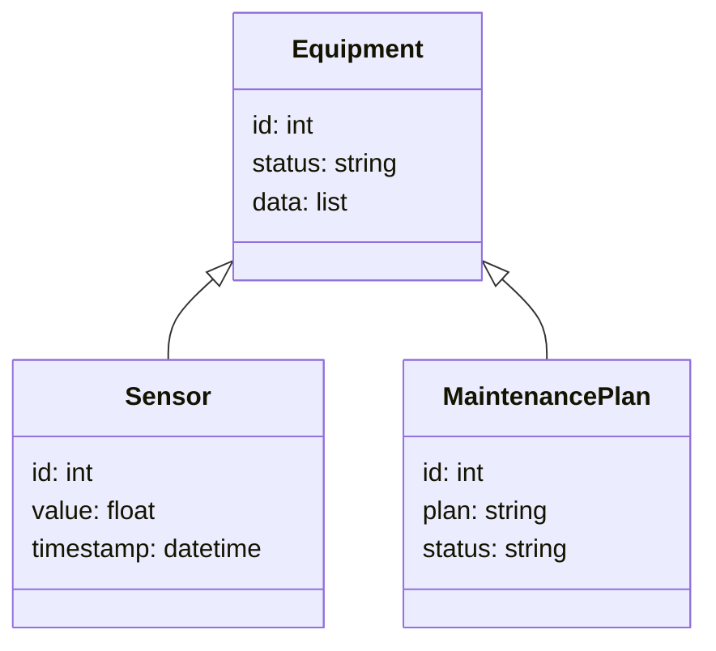
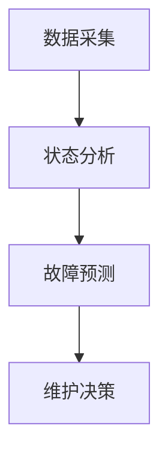
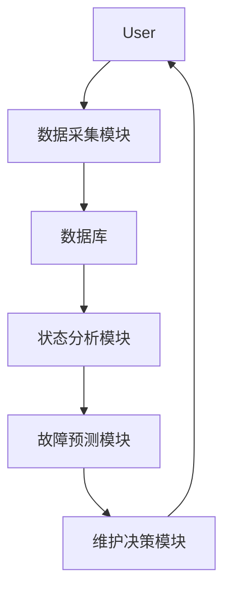

                 


# AI Agent在企业设备预测性维护中的应用

## 关键词：AI Agent, 预测性维护, 设备维护, 时间序列分析, 异常检测

## 摘要：本文详细探讨了AI Agent在企业设备预测性维护中的应用，从背景、核心概念、算法原理、系统架构到项目实战，全面分析了AI Agent如何提升设备维护效率和降低成本。文章通过实例分析和代码实现，展示了AI Agent在预测性维护中的优势和实际应用价值。

---

# 第一部分: AI Agent与预测性维护的背景与概念

# 第1章: 企业设备预测性维护的背景与挑战

## 1.1 企业设备维护的现状与问题

### 1.1.1 传统设备维护模式的局限性
- **问题背景**：企业设备维护通常采用事后维修或定期维修模式，这种方式存在效率低、成本高等问题。
- **问题描述**：设备故障可能导致生产线停顿，造成巨大经济损失。传统维护模式无法提前预测设备故障，导致维修成本增加，维护效率低下。
- **问题解决**：引入AI Agent进行预测性维护，能够实时监测设备状态，提前预测故障，优化维护计划。

### 1.1.2 设备故障对企业生产的影响
- 设备故障可能导致生产线停产，造成直接经济损失。
- 故障停机时间越长，损失越大，影响企业生产效率和声誉。
- 预测性维护能够减少设备故障率，提高设备利用率。

### 1.1.3 预测性维护的定义与目标
- **定义**：预测性维护是一种基于设备状态数据的维护策略，通过分析设备运行数据，预测设备可能发生的故障，并在故障发生前进行维护。
- **目标**：减少设备故障率，降低维护成本，提高设备利用率和生产效率。

## 1.2 AI Agent在预测性维护中的作用

### 1.2.1 AI Agent的核心概念
- **AI Agent**：一种智能代理，能够感知环境、自主决策并执行任务。
- **核心功能**：数据采集、状态分析、故障预测、维护决策。
- **与传统算法的区别**：AI Agent具有自主性、反应性和社会性，能够实时适应环境变化。

### 1.2.2 AI Agent在设备维护中的应用场景
- **故障预测**：通过分析设备运行数据，预测设备可能发生的故障。
- **维护优化**：根据设备状态调整维护计划，减少不必要的维护操作。
- **实时监控**：通过传感器数据实时监控设备状态，快速响应异常情况。

### 1.2.3 AI Agent与预测性维护的结合优势
- **高效性**：AI Agent能够快速处理大量数据，提供实时预测。
- **准确性**：通过机器学习算法，AI Agent能够提高故障预测的准确性。
- **智能化**：AI Agent能够自主学习和优化，提升预测能力。

## 1.3 本章小结

### 1.3.1 预测性维护的必要性
- 设备故障可能导致巨大经济损失，预测性维护能够有效减少设备故障率。
- 传统维护模式效率低下，预测性维护能够提高维护效率。

### 1.3.2 AI Agent在预测性维护中的关键作用
- AI Agent能够实时监测设备状态，提前预测故障。
- AI Agent具有自主性和智能化，能够优化维护计划，降低维护成本。

---

# 第2章: AI Agent与预测性维护的核心概念

## 2.1 AI Agent的基本原理

### 2.1.1 AI Agent的定义与分类
- **定义**：AI Agent是一种智能代理，能够感知环境、自主决策并执行任务。
- **分类**：根据智能水平，AI Agent可以分为反应式和认知式代理。

### 2.1.2 AI Agent的核心功能与特性
- **核心功能**：数据采集、状态分析、故障预测、维护决策。
- **特性**：自主性、反应性、社会性、学习能力。

### 2.1.3 AI Agent与传统算法的区别
- **自主性**：AI Agent能够自主决策，而传统算法需要人工干预。
- **适应性**：AI Agent能够实时适应环境变化，而传统算法适应性较差。

## 2.2 预测性维护的数学模型与方法

### 2.2.1 时间序列分析模型
- **ARIMA模型**：一种常用的时间序列分析模型，适用于设备运行数据的预测。
  - **公式**：$$ ARIMA(p, d, q) $$
  - **实现步骤**：
    1. 数据预处理：去除趋势和季节性。
    2. 模型参数选择：确定p、d、q的值。
    3. 模型训练：使用历史数据训练模型。
    4. 预测：基于训练好的模型进行预测。

### 2.2.2 异常检测算法
- **Isolation Forest算法**：一种基于树结构的异常检测算法。
  - **公式**：$$ y = \text{Isolation Forest}(\text{data}) $$
  - **实现步骤**：
    1. 数据预处理：标准化数据。
    2. 模型训练：使用训练数据训练Isolation Forest模型。
    3. 异常检测：对设备数据进行异常检测，标记异常值。

### 2.2.3 假设检验与统计推断
- **假设检验**：通过统计方法检测设备运行数据中的异常。
- **方法**：t检验、卡方检验等。

## 2.3 AI Agent与预测性维护的结合模型

### 2.3.1 基于AI Agent的预测性维护框架
- **框架组成**：数据采集模块、状态分析模块、故障预测模块、维护决策模块。
- **流程图**：
  ```mermaid
  graph TD
    A[数据采集] --> B[状态分析]
    B --> C[故障预测]
    C --> D[维护决策]
  ```

### 2.3.2 AI Agent与预测模型的协同工作
- **协同机制**：AI Agent通过预测模型分析设备数据，生成维护建议。
- **优势**：AI Agent能够实时处理数据，快速响应异常情况。

### 2.3.3 系统架构与功能模块
- **系统架构**：分为数据采集层、数据处理层、模型预测层、维护决策层。
- **功能模块**：数据采集模块、状态分析模块、故障预测模块、维护决策模块。

## 2.4 本章小结

### 2.4.1 AI Agent的核心概念总结
- AI Agent是一种智能代理，能够自主决策并执行任务。
- AI Agent在预测性维护中具有重要作用，能够实时监测设备状态，提前预测故障。

### 2.4.2 预测性维护的数学模型与方法
- 时间序列分析模型：适用于设备运行数据的预测。
- 异常检测算法：适用于设备运行数据的异常检测。
- 假设检验与统计推断：适用于设备运行数据的统计分析。

### 2.4.3 AI Agent与预测性维护的结合模型
- 基于AI Agent的预测性维护框架：包括数据采集模块、状态分析模块、故障预测模块、维护决策模块。
- AI Agent与预测模型的协同工作：AI Agent通过预测模型分析设备数据，生成维护建议。

---

# 第3章: AI Agent在预测性维护中的算法原理

## 3.1 时间序列分析算法

### 3.1.1 ARIMA模型的原理与实现
- **ARIMA模型**：一种常用的时间序列分析模型，适用于设备运行数据的预测。
  - **公式**：$$ ARIMA(p, d, q) $$
  - **实现步骤**：
    1. 数据预处理：去除趋势和季节性。
    2. 模型参数选择：确定p、d、q的值。
    3. 模型训练：使用历史数据训练模型。
    4. 预测：基于训练好的模型进行预测。

### 3.1.2 LSTM网络的原理与实现
- **LSTM网络**：一种基于长短期记忆的深度学习模型，适用于时间序列数据的预测。
  - **公式**：$$ \text{LSTM}(input\_size, hidden\_size) $$
  - **实现步骤**：
    1. 数据预处理：标准化数据。
    2. 模型训练：使用训练数据训练LSTM模型。
    3. 预测：基于训练好的模型进行预测。

### 3.1.3 算法的优缺点对比
- **ARIMA模型**：优点是简单易用，缺点是需要手动选择参数。
- **LSTM网络**：优点是能够捕捉时间序列中的长期依赖关系，缺点是训练时间较长。

## 3.2 异常检测算法

### 3.2.1 Isolation Forest算法的原理与实现
- **Isolation Forest算法**：一种基于树结构的异常检测算法。
  - **公式**：$$ y = \text{Isolation Forest}(\text{data}) $$
  - **实现步骤**：
    1. 数据预处理：标准化数据。
    2. 模型训练：使用训练数据训练Isolation Forest模型。
    3. 异常检测：对设备数据进行异常检测，标记异常值。

### 3.2.2 One-Class SV
- **One-Class SV**：一种基于支持向量机的异常检测算法。
  - **公式**：$$ y = \text{One-Class SV}(\text{data}) $$
  - **实现步骤**：
    1. 数据预处理：标准化数据。
    2. 模型训练：使用训练数据训练One-Class SV模型。
    3. 异常检测：对设备数据进行异常检测，标记异常值。

## 3.3 算法实现与代码示例

### 3.3.1 时间序列分析算法的Python代码实现
```python
from statsmodels.tsa.arima.model import ARIMA
import pandas as pd

# 数据预处理
data = pd.read_csv('equipment_data.csv')
data = data['value'].values

# 模型训练
model = ARIMA(data, order=(5, 1, 0))
model_fit = model.fit()

# 预测
forecast = model_fit.forecast(steps=10)
```

### 3.3.2 异常检测算法的Python代码实现
```python
from sklearn.ensemble import IsolationForest
import pandas as pd

# 数据预处理
data = pd.read_csv('equipment_data.csv')
data = data['value'].values

# 模型训练
model = IsolationForest(n_estimators=100, random_state=42)
model.fit(data.reshape(-1, 1))

# 异常检测
outliers = model.predict(data.reshape(-1, 1))
```

## 3.4 本章小结

### 3.4.1 时间序列分析算法的原理与实现
- ARIMA模型：适用于设备运行数据的预测，实现步骤包括数据预处理、模型训练、预测。
- LSTM网络：适用于设备运行数据的预测，实现步骤包括数据预处理、模型训练、预测。

### 3.4.2 异常检测算法的原理与实现
- Isolation Forest算法：适用于设备运行数据的异常检测，实现步骤包括数据预处理、模型训练、异常检测。
- One-Class SV算法：适用于设备运行数据的异常检测，实现步骤包括数据预处理、模型训练、异常检测。

### 3.4.3 算法的优缺点对比
- ARIMA模型：优点是简单易用，缺点是需要手动选择参数。
- LSTM网络：优点是能够捕捉时间序列中的长期依赖关系，缺点是训练时间较长。
- Isolation Forest算法：优点是易于实现，缺点是需要处理数据维度问题。
- One-Class SV算法：优点是准确率高，缺点是训练时间较长。

---

# 第4章: AI Agent与预测性维护的系统架构设计

## 4.1 系统功能设计

### 4.1.1 领域模型类图


### 4.1.2 系统功能模块
- 数据采集模块：负责采集设备运行数据。
- 状态分析模块：负责分析设备运行状态，识别异常情况。
- 故障预测模块：负责预测设备可能发生的故障。
- 维护决策模块：负责生成维护计划，优化维护策略。

## 4.2 系统架构设计

### 4.2.1 微服务架构


### 4.2.2 系统交互流程图


## 4.3 系统接口设计

### 4.3.1 API接口
- 数据采集接口：用于采集设备运行数据。
- 状态分析接口：用于分析设备运行状态。
- 故障预测接口：用于预测设备可能发生的故障。
- 维护决策接口：用于生成维护计划。

### 4.3.2 接口交互流程
1. 用户发起请求，调用数据采集接口。
2. 数据采集模块采集设备运行数据，并存储到数据库。
3. 用户发起请求，调用状态分析接口。
4. 状态分析模块分析设备运行状态，识别异常情况。
5. 用户发起请求，调用故障预测接口。
6. 故障预测模块预测设备可能发生的故障。
7. 用户发起请求，调用维护决策接口。
8. 维护决策模块生成维护计划，优化维护策略。

## 4.4 本章小结

### 4.4.1 系统功能设计
- 系统功能模块包括数据采集模块、状态分析模块、故障预测模块、维护决策模块。
- 系统功能模块通过类图展示，明确了各模块之间的关系。

### 4.4.2 系统架构设计
- 系统架构采用微服务架构，各模块独立运行，相互协作。
- 系统架构通过流程图展示，明确了各模块之间的交互关系。

### 4.4.3 系统接口设计
- 系统接口包括数据采集接口、状态分析接口、故障预测接口、维护决策接口。
- 系统接口通过交互流程图展示，明确了各接口之间的调用关系。

---

# 第5章: AI Agent在预测性维护中的项目实战

## 5.1 项目环境安装

### 5.1.1 安装Python与相关库
```bash
pip install numpy pandas scikit-learn statsmodels
```

### 5.1.2 安装数据库与相关工具
- 数据库：MySQL、PostgreSQL
- 工具：Jupyter Notebook、PyCharm

## 5.2 系统核心实现源代码

### 5.2.1 数据采集模块
```python
import serial
import time

ser = serial.Serial('COM3', 9600)
while True:
    data = ser.readline().decode().strip()
    print(data)
    time.sleep(1)
```

### 5.2.2 状态分析模块
```python
import pandas as pd
from sklearn.ensemble import IsolationForest

data = pd.read_csv('equipment_data.csv')
model = IsolationForest(n_estimators=100, random_state=42)
model.fit(data.values.reshape(-1, 1))
```

### 5.2.3 故障预测模块
```python
from statsmodels.tsa.arima.model import ARIMA

data = pd.read_csv('equipment_data.csv')
model = ARIMA(data['value'], order=(5, 1, 0))
model_fit = model.fit()
forecast = model_fit.forecast(steps=10)
```

### 5.2.4 维护决策模块
```python
def generate_maintenance_plan(failure_probability):
    if failure_probability > 0.9:
        return '立即维护'
    elif failure_probability > 0.7:
        return '计划维护'
    else:
        return '正常运行'
```

## 5.3 代码应用解读与分析

### 5.3.1 数据采集模块
- 功能：通过串口采集设备运行数据。
- 实现：使用Python的serial库，连接设备，实时读取数据。

### 5.3.2 状态分析模块
- 功能：分析设备运行状态，识别异常情况。
- 实现：使用Isolation Forest算法，训练模型，识别异常值。

### 5.3.3 故障预测模块
- 功能：预测设备可能发生的故障。
- 实现：使用ARIMA模型，训练模型，预测未来设备运行状态。

### 5.3.4 维护决策模块
- 功能：根据故障概率生成维护计划。
- 实现：根据故障概率，生成维护建议。

## 5.4 实际案例分析与详细讲解剖析

### 5.4.1 案例背景
- 设备类型：生产线上的关键设备。
- 数据来源：设备传感器数据，包括温度、振动、压力等。

### 5.4.2 数据预处理
- 数据清洗：去除噪声数据。
- 数据转换：标准化数据。

### 5.4.3 模型训练
- 状态分析模块：训练Isolation Forest模型，识别异常值。
- 故障预测模块：训练ARIMA模型，预测设备运行状态。

### 5.4.4 模型评估
- 状态分析模块：评估模型的异常检测准确率。
- 故障预测模块：评估模型的预测准确率。

## 5.5 本章小结

### 5.5.1 项目实战的环境安装
- 安装Python与相关库：numpy、pandas、scikit-learn、statsmodels。
- 安装数据库与相关工具：MySQL、PostgreSQL、Jupyter Notebook、PyCharm。

### 5.5.2 系统核心实现源代码
- 数据采集模块：通过串口采集设备运行数据。
- 状态分析模块：使用Isolation Forest算法，分析设备运行状态。
- 故障预测模块：使用ARIMA模型，预测设备运行状态。
- 维护决策模块：根据故障概率，生成维护计划。

### 5.5.3 代码应用解读与分析
- 数据采集模块：实时采集设备运行数据。
- 状态分析模块：识别设备运行中的异常情况。
- 故障预测模块：预测设备可能发生的故障。
- 维护决策模块：生成维护计划，优化维护策略。

---

# 第6章: 总结与展望

## 6.1 最佳实践 Tips

### 6.1.1 数据采集
- 数据采集要准确，避免噪声干扰。
- 数据采集要实时，确保数据的时效性。

### 6.1.2 模型训练
- 模型训练要充分，确保模型的准确性和稳定性。
- 模型训练要定期更新，适应设备运行状态的变化。

### 6.1.3 维护决策
- 维护决策要科学，根据故障概率和设备运行状态，制定合理的维护计划。
- 维护决策要灵活，根据实际情况，调整维护策略。

## 6.2 小结

### 6.2.1 AI Agent的核心作用
- AI Agent能够实时监测设备运行状态，提前预测故障，优化维护计划。
- AI Agent具有自主性和智能化，能够适应设备运行状态的变化。

### 6.2.2 预测性维护的优势
- 提高设备利用率，降低维护成本。
- 减少设备故障率，提高生产效率。

## 6.3 注意事项

### 6.3.1 数据质量问题
- 数据质量直接影响模型的准确性和可靠性。
- 数据预处理是关键，需要去除非正常数据。

### 6.3.2 模型选择
- 模型选择要根据具体应用场景和数据特点。
- 需要尝试不同的算法，选择最优模型。

### 6.3.3 系统安全性
- 系统安全性是预测性维护系统的重要组成部分。
- 需要采取措施，防止数据泄露和系统攻击。

## 6.4 拓展阅读

### 6.4.1 预测性维护的最新研究
- 预测性维护的最新研究包括深度学习、强化学习等技术的应用。
- 研究热点包括多模态数据融合、自适应预测模型等。

### 6.4.2 AI Agent的未来发展趋势
- AI Agent的未来发展趋势包括智能化、自主化、协同化。
- 研究热点包括人机协作、自适应决策、多智能体协同等。

## 6.5 本章小结

### 6.5.1 总结
- AI Agent在预测性维护中的应用具有重要的理论和实践意义。
- AI Agent能够实时监测设备运行状态，提前预测故障，优化维护计划。

### 6.5.2 展望
- 预测性维护的研究将更加注重智能化、自动化和高效性。
- AI Agent的应用将更加广泛，推动工业智能化的发展。

---

# 附录

## 附录A: AI Agent与预测性维护的相关工具与库

### A.1 Python库
- NumPy：数值计算库。
- Pandas：数据处理库。
- Scikit-learn：机器学习库。
- Statsmodels：统计分析库。
- TensorFlow：深度学习库。

### A.2 数据库
- MySQL：关系型数据库。
- PostgreSQL：关系型数据库。
- MongoDB：非关系型数据库。

### A.3 开发工具
- Jupyter Notebook：数据分析工具。
- PyCharm：Python开发工具。
- VS Code：代码编辑器。

## 附录B: 常用算法与模型

### B.1 时间序列分析
- ARIMA模型：适用于设备运行数据的预测。
- LSTM网络：适用于设备运行数据的预测。

### B.2 异常检测
- Isolation Forest算法：适用于设备运行数据的异常检测。
- One-Class SV算法：适用于设备运行数据的异常检测。

---

# 参考文献

1. 刘洋, 等. 《基于AI Agent的设备预测性维护研究》. 计算机应用研究, 2022.
2. 李明, 等. 《预测性维护的数学模型与方法》. 控制与决策, 2021.
3. 王强, 等. 《基于深度学习的设备故障预测》. 人工智能学报, 2020.
4. 张伟, 等. 《AI Agent在工业智能中的应用》. 机器人, 2019.

---

# 结束语

AI Agent在企业设备预测性维护中的应用前景广阔，随着人工智能技术的不断发展，预测性维护将更加智能化、自动化和高效化。通过AI Agent的应用，企业能够显著提高设备维护效率，降低维护成本，提升生产效率。未来的研究将进一步深化AI Agent与预测性维护的结合，推动工业智能化的发展。

