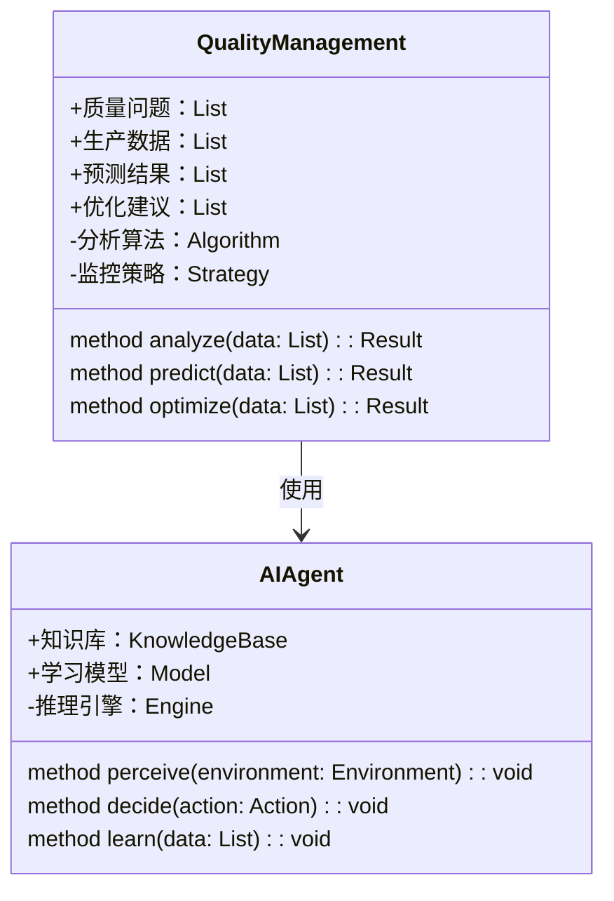
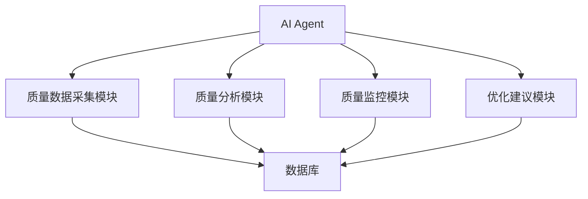
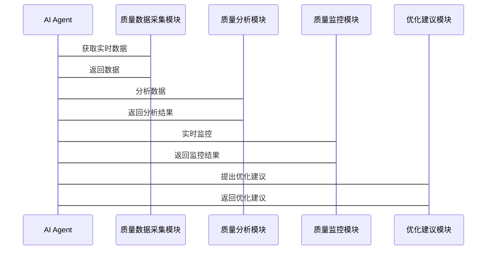

                 


# AI Agent在企业质量管理体系优化中的全面应用

> 关键词：AI Agent，企业质量管理体系，质量管理优化，智能监控，数据驱动决策

> 摘要：本文将详细探讨AI Agent在企业质量管理体系中的应用，从理论到实践，结合具体案例和算法实现，全面解析如何利用AI技术优化企业质量管理流程，提升效率和准确性。本文将涵盖AI Agent的核心概念、算法原理、系统架构设计、项目实施以及最佳实践等内容。

---

# 第一部分: AI Agent与企业质量管理体系概述

## 第1章: AI Agent与企业质量管理的背景

### 1.1 企业质量管理体系的基本概念

#### 1.1.1 质量管理体系的定义与核心要素
企业质量管理体系是确保产品或服务符合既定质量标准的一系列管理方法和流程。其核心要素包括：
- **质量目标**：明确的质量目标和指标。
- **过程控制**：对关键业务流程的监控和优化。
- **数据驱动**：基于数据进行质量分析和决策。
- **持续改进**：通过反馈和改进机制不断提升质量。

#### 1.1.2 企业质量管理的现状与挑战
现代企业质量管理面临以下挑战：
1. 数据量大且复杂，难以高效处理。
2. 质量问题的根源分析耗时且不够精准。
3. 人工干预过多，效率低下且易出错。
4. 跨部门协作不足，导致质量信息孤岛。

#### 1.1.3 AI Agent与企业质量管理的结合背景
AI Agent（人工智能代理）是一种能够感知环境、自主决策并采取行动的智能体。其核心能力包括：
- **自主性**：无需人工干预，自主完成任务。
- **反应性**：实时感知环境变化并做出响应。
- **学习能力**：通过数据和反馈不断优化行为。
- **协作性**：与其他智能体或系统协同工作。

AI Agent的这些特性使其成为解决企业质量管理问题的理想工具。

---

### 1.2 AI Agent的基本概念与特点

#### 1.2.1 AI Agent的定义与分类
AI Agent可以分为以下几类：
1. **基于规则的Agent**：通过预定义的规则进行决策。
2. **基于知识的Agent**：利用知识库和推理引擎进行决策。
3. **基于学习的Agent**：通过机器学习算法不断优化行为。
4. **混合型Agent**：结合上述多种方法。

#### 1.2.2 AI Agent的核心功能与优势
- **知识表示**：通过符号逻辑或概率模型表示知识。
- **推理与决策**：基于知识和环境信息做出最优决策。
- **学习与适应**：通过监督学习、强化学习等方法不断优化。
- **协作与通信**：与其他Agent或系统协同工作。

#### 1.2.3 AI Agent与传统质量管理工具的对比

| 对比维度         | AI Agent                          | 传统质量管理工具                  |
|------------------|------------------------------------|----------------------------------|
| **智能化**        | 高                                 | 低                               |
| **自主性**        | 高                                 | 低                               |
| **数据处理能力**  | 强大的数据挖掘和分析能力          | 依赖人工分析                      |
| **实时性**        | 实时响应和处理                    | 延时较长                         |

---

### 1.3 AI Agent在企业质量管理中的应用前景

#### 1.3.1 AI Agent在质量管理中的潜在应用场景
1. **质量数据的智能分析**：通过机器学习算法自动识别质量问题。
2. **实时质量监控**：AI Agent可以实时监控生产过程，发现异常并立即响应。
3. **质量预测与优化**：基于历史数据预测潜在质量问题并提出优化建议。

#### 1.3.2 企业采用AI Agent的优势与挑战
- **优势**：
  - 提高质量管理效率。
  - 降低人工成本。
  - 提升质量预测准确性。
- **挑战**：
  - 数据隐私和安全问题。
  - 系统集成复杂性。
  - 需要较高的技术投入。

#### 1.3.3 AI Agent在质量管理中的未来发展趋势
1. **智能化升级**：AI Agent将更加智能化，能够自主完成复杂任务。
2. **跨领域应用**：AI Agent将应用于更多行业和质量管理环节。
3. **人机协作**：AI Agent与人类专家协同工作，提升整体质量管理水平。

---

## 第2章: AI Agent与企业质量管理的核心概念

### 2.1 AI Agent的核心原理

#### 2.1.1 知识表示与推理机制
知识表示是AI Agent实现智能决策的基础。常用的表示方法包括：
- **符号逻辑表示**：用符号和规则表示知识。
- **概率表示**：用概率模型表示不确定性知识。
- **案例库表示**：基于相似案例进行推理。

#### 2.1.2 学习算法与自适应能力
AI Agent的学习能力使其能够不断优化自身行为。常用的学习算法包括：
- **强化学习**：通过奖励机制优化决策。
- **监督学习**：基于标注数据进行分类和回归。
- **无监督学习**：发现数据中的隐藏模式。

#### 2.1.3 多智能体协作与通信
在企业质量管理中，通常需要多个AI Agent协同工作。通信机制包括：
- **消息传递**：通过消息传递信息。
- **共享知识库**：多个Agent共享知识库。
- **分布式决策**：每个Agent负责特定任务。

---

### 2.2 企业质量管理的核心要素

#### 2.2.1 质量目标与指标体系
质量目标是企业质量管理的核心，通常包括：
- **顾客满意度**：衡量产品或服务是否满足客户需求。
- **合格率**：产品符合质量标准的比例。
- **缺陷率**：产品中出现缺陷的比例。

#### 2.2.2 质量控制流程与方法
常见的质量控制方法包括：
- **统计过程控制（SPC）**：通过统计方法监控生产过程。
- **因果图分析**：分析质量问题的根本原因。
- **六西格玛（Six Sigma）**：通过消除变异提高质量。

#### 2.2.3 质量数据的采集与分析
质量数据的采集和分析是AI Agent发挥价值的关键环节。常用的数据分析方法包括：
- **描述性分析**：总结数据的基本特征。
- **预测性分析**：预测未来可能出现的质量问题。
- **诊断性分析**：识别问题的根本原因。

---

### 2.3 AI Agent与质量管理的结合点

#### 2.3.1 数据驱动的质量分析
AI Agent可以通过机器学习算法对质量数据进行深度分析，识别潜在问题。

#### 2.3.2 智能化的质量监控
AI Agent可以实时监控生产过程，发现异常并立即发出警报。

#### 2.3.3 自动化的质量改进
基于AI Agent的分析结果，企业可以自动优化生产流程，减少浪费。

---

## 第3章: AI Agent在企业质量管理中的核心算法

### 3.1 知识表示与推理算法

#### 3.1.1 基于符号逻辑的知识表示
符号逻辑是一种常用的知识表示方法。例如，可以用逻辑规则表示“如果温度过高，则产品不合格”。

#### 3.1.2 基于概率推理的算法
概率推理适用于处理不确定性问题。例如，可以用贝叶斯网络表示质量问题的概率分布。

#### 3.1.3 基于案例推理的算法
案例推理是基于相似案例进行推理的方法。例如，AI Agent可以分析过去的质量问题案例，找到相似的解决方案。

---

### 3.2 学习与优化算法

#### 3.2.1 强化学习算法（Q-learning）
强化学习是一种通过奖励机制优化决策的算法。例如，AI Agent可以通过Q-learning算法优化质量监控策略。

**Q-learning公式**：
$$ Q(s, a) = Q(s, a) + \alpha \cdot (r + \gamma \cdot \max Q(s', a') - Q(s, a)) $$

**Python实现示例**：
```python
import numpy as np

# 初始化Q表
Q = np.zeros((state_space, action_space))

# 参数设置
alpha = 0.1
gamma = 0.9

# Q-learning算法
def q_learning():
    for episode in range(episodes):
        state = env.reset()
        while not done:
            action = np.argmax(Q[state, :])
            next_state, reward, done = env.step(action)
            Q[state, action] += alpha * (reward + gamma * np.max(Q[next_state, :]) - Q[state, action])

q_learning()
```

---

#### 3.2.2 监督学习算法（随机森林）
监督学习是一种基于标注数据进行分类或回归的算法。例如，AI Agent可以使用随机森林算法预测产品质量。

**Python实现示例**：
```python
from sklearn.ensemble import RandomForestClassifier

# 训练随机森林模型
model = RandomForestClassifier(n_estimators=100)
model.fit(X_train, y_train)

# 预测测试数据
y_pred = model.predict(X_test)
```

---

#### 3.2.3 聚类分析算法（K-means）
聚类分析是一种发现数据内在结构的算法。例如，AI Agent可以使用K-means算法将质量问题分为不同的类别。

**Python实现示例**：
```python
from sklearn.cluster import KMeans

# 训练K-means模型
model = KMeans(n_clusters=3)
model.fit(X)

# 获取聚类结果
clusters = model.labels_
```

---

## 第4章: 系统分析与架构设计方案

### 4.1 问题场景介绍
假设我们正在优化一个汽车制造企业的质量管理体系，目标是通过AI Agent实现生产过程的实时监控和质量预测。

---

### 4.2 系统功能设计

#### 4.2.1 领域模型设计
以下是领域模型的类图：



---

### 4.3 系统架构设计

#### 4.3.1 系统架构图
以下是系统架构图：



---

### 4.4 系统接口设计

#### 4.4.1 接口描述
以下是系统接口描述：

1. **AI Agent接口**：
   - 输入：环境状态数据。
   - 输出：决策行动。

2. **质量数据采集模块接口**：
   - 输入：无。
   - 输出：实时质量数据。

3. **质量分析模块接口**：
   - 输入：历史质量数据。
   - 输出：质量问题分析报告。

---

### 4.5 系统交互设计

#### 4.5.1 交互流程
以下是系统交互流程：



---

## 第5章: 项目实战

### 5.1 环境安装

#### 5.1.1 安装Python
```bash
python --version
# 确保Python 3.8以上版本
```

#### 5.1.2 安装依赖库
```bash
pip install numpy scikit-learn matplotlib
```

---

### 5.2 系统核心实现源代码

#### 5.2.1 AI Agent实现
```python
class AIAgent:
    def __init__(self):
        self.knowledge_base = {}
        self.models = {}

    def perceive(self, environment_data):
        # 处理环境数据，更新知识库
        self.knowledge_base.update(environment_data)

    def decide(self, action_space):
        # 根据知识库选择最优行动
        return self._get_best_action(action_space)

    def _get_best_action(self, action_space):
        # 简单的策略：选择当前知识库中效果最好的行动
        best_action = action_space[0]
        for action in action_space[1:]:
            if self.knowledge_base.get(action, 0) > self.knowledge_base.get(best_action, 0):
                best_action = action
        return best_action

    def learn(self, data):
        # 训练模型
        self.models['quality_predictor'] = self._train_model(data)
```

---

#### 5.2.2 质量预测模型实现
```python
from sklearn.ensemble import RandomForestClassifier

def _train_model(self, data):
    # 数据预处理
    X = data.drop('label', axis=1)
    y = data['label']
    # 训练随机森林模型
    model = RandomForestClassifier(n_estimators=100)
    model.fit(X, y)
    return model
```

---

### 5.3 案例分析

#### 5.3.1 数据准备
假设我们有以下质量数据：

| 特征1 | 特征2 | 标签（合格/不合格） |
|-------|-------|---------------------|
|  100  |  20   | 合格               |
|  110  |  25   | 不合格             |
|  95   |  18   | 合格               |
|  120  |  30   | 不合格             |

---

#### 5.3.2 模型训练
```python
data = {
    'feature1': [100, 110, 95, 120],
    'feature2': [20, 25, 18, 30],
    'label': ['合格', '不合格', '合格', '不合格']
}

agent = AIAgent()
agent.learn(data)
```

---

#### 5.3.3 模型预测
```python
new_data = {
    'feature1': [105],
    'feature2': [22]
}

predicted_label = agent.models['quality_predictor'].predict(new_data.drop('label', axis=1))
print(predicted_label)
```

---

## 第6章: 总结与展望

### 6.1 总结
本文详细探讨了AI Agent在企业质量管理体系中的应用，从理论到实践，结合具体案例和算法实现，全面解析了如何利用AI技术优化企业质量管理流程。

### 6.2 注意事项
- 数据隐私和安全问题需要特别注意。
- 系统集成复杂性可能会影响实施难度。
- 需要持续优化AI Agent的学习算法和知识库。

### 6.3 拓展阅读
- 《机器学习实战》
- 《企业级AI系统设计》
- 《质量管理的智能化转型》

---

以上就是《AI Agent在企业质量管理体系优化中的全面应用》的完整目录和内容框架。如果需要进一步的扩展或详细讲解某一部分，请随时告诉我！

