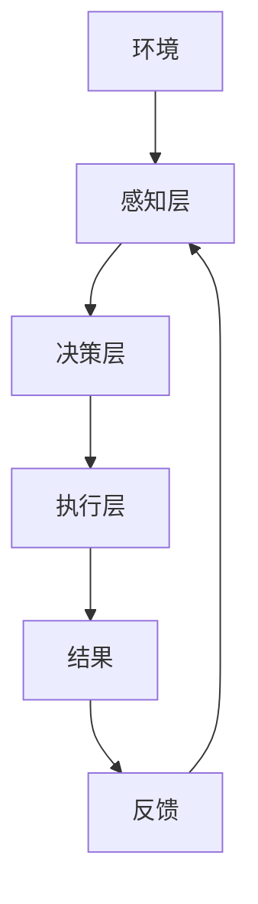

                 


# AI Agent在企业质量管理体系优化中的应用

> 关键词：AI Agent, 企业质量管理体系, 人工智能, 质量优化, 数字化转型

> 摘要：本文探讨了AI Agent在企业质量管理体系优化中的应用，分析了其核心原理、算法设计、系统架构，并通过实际案例展示了其在提升质量管理效率和精准度方面的优势，为企业质量管理的数字化转型提供了新思路。

---

# 第1章 AI Agent与企业质量管理体系概述

## 1.1 AI Agent的基本概念

AI Agent（人工智能代理）是指能够感知环境、自主决策并执行任务的智能体。它具备以下特点：

- **自主性**：无需人工干预，自主完成任务。
- **反应性**：实时感知环境变化并做出响应。
- **目标导向**：以特定目标为导向，优化决策。

AI Agent与传统自动化不同，它具备学习和适应能力，能够处理复杂问题。

## 1.2 企业质量管理体系的现状

企业质量管理体系是确保产品或服务符合质量标准的一系列流程和规范。然而，现有体系存在以下问题：

- **效率低下**：依赖人工检查，耗时且成本高。
- **数据孤岛**：各部门数据分散，难以整合分析。
- **精准度不足**：传统方法难以捕捉细微质量问题。

## 1.3 AI Agent在企业质量管理中的应用前景

AI Agent在质量管理中的优势显著：

- **提高效率**：自动化处理大量数据，缩短检测时间。
- **精准识别问题**：通过深度学习模型，准确发现潜在缺陷。
- **持续优化**：实时分析数据，不断优化质量标准。

企业质量管理的数字化转型是必然趋势，AI Agent为此提供了强有力的技术支持。

---

# 第2章 AI Agent的核心原理与企业质量管理的结合

## 2.1 AI Agent的核心原理

AI Agent的运作分为感知、决策和执行三个层次：

### 2.1.1 感知层

AI Agent通过传感器或数据接口获取环境信息。例如，在制造业中，AI Agent可以通过摄像头捕捉产品表面的瑕疵。

### 2.1.2 决策层

基于感知到的信息，AI Agent利用算法进行分析和决策。例如，使用强化学习算法优化生产流程中的参数设置。

### 2.1.3 执行层

AI Agent根据决策结果执行相应操作，例如调整机器参数或发出警报通知相关人员。

## 2.2 企业质量管理的核心要素

### 2.2.1 质量管理体系的结构

企业质量管理通常包括质量策划、质量控制、质量保证和质量改进四个部分。

### 2.2.2 质量管理的关键流程

- **数据采集**：收集生产过程中的各项数据。
- **问题识别**：检测产品中的缺陷。
- **优化建议**：提出改进建议。
- **执行反馈**：跟踪改进措施的效果。

## 2.3 AI Agent与企业质量管理的结合

### 2.3.1 AI Agent在质量管理中的角色

AI Agent在企业质量管理中扮演数据分析师、优化顾问和执行监督的角色。

### 2.3.2 AI Agent如何优化质量管理流程

通过实时数据分析，AI Agent能够快速识别潜在质量问题，并提出优化建议。例如，AI Agent可以通过分析生产数据，预测设备故障并提前进行维护。

### 2.3.3 AI Agent与企业质量管理系统的集成

AI Agent可以与企业现有的质量管理系统集成，例如ERP和MES系统，实现数据的实时共享和协同工作。

## 2.4 本章小结

本章介绍了AI Agent的核心原理以及其在企业质量管理中的应用，展示了AI Agent如何通过感知、决策和执行三个层次优化质量管理流程。

---

# 第3章 AI Agent的算法原理与企业质量管理结合的数学模型

## 3.1 AI Agent的算法原理

AI Agent在质量管理中常用的算法是强化学习。以下是强化学习的基本流程：

1. **环境感知**：AI Agent通过传感器或数据接口获取环境信息。
2. **状态识别**：AI Agent根据感知信息确定当前状态。
3. **动作选择**：AI Agent基于当前状态选择一个动作。
4. **奖励机制**：根据动作的结果，AI Agent获得奖励或惩罚。
5. **策略优化**：根据奖励调整策略，优化未来决策。

### 3.1.1 强化学习算法的数学模型

强化学习的目标是找到最优策略，使累计奖励最大化。数学模型如下：

$$
V(s) = \max_a Q(s, a)
$$

其中，\( V(s) \) 是状态 \( s \) 的价值函数，\( Q(s, a) \) 是状态-动作对的价值函数。

### 3.1.2 算法实现

以下是强化学习算法的Python代码示例：

```python
class Agent:
    def __init__(self, state_space, action_space):
        self.state_space = state_space
        self.action_space = action_space
        self.Q = defaultdict(lambda: np.zeros(len(action_space)))

    def take_action(self, state):
        # 根据策略选择动作
        if np.random.random() < 0.9:
            return np.argmax(self.Q[state])
        else:
            return np.random.randint(len(self.action_space))

    def update_Q(self, state, action, reward, next_state):
        # Q-learning算法更新Q值
        self.Q[state][action] = self.Q[state][action] + 0.1 * (reward + np.max(self.Q[next_state]) - self.Q[state][action])
```

## 3.2 数学模型与企业质量管理的结合

### 3.2.1 数学模型在质量管理中的应用

在质量管理中，AI Agent可以通过数学模型预测产品质量。例如，使用线性回归模型预测生产过程中的关键参数。

### 3.2.2 数学模型的具体实现

以下是线性回归模型的Python代码示例：

```python
import numpy as np
from sklearn.linear_model import LinearRegression

# 假设我们有一些数据，其中X是输入特征，y是目标变量
X = np.array([[1], [2], [3], [4], [5]])
y = np.array([2, 4, 5, 4, 6])

# 创建线性回归模型
model = LinearRegression()
model.fit(X, y)

# 预测新的数据点
new_X = np.array([[6]])
print(model.predict(new_X))  # 输出预测结果
```

### 3.2.3 数学模型的优化

通过优化数学模型的参数，可以提高预测的准确性。例如，使用梯度下降算法优化线性回归模型的参数。

---

# 第4章 系统分析与架构设计方案

## 4.1 优化后的系统应用场景

AI Agent可以应用于制造企业的生产过程中的质量检测和优化。例如，在汽车制造中，AI Agent可以帮助检测车身表面的瑕疵。

## 4.2 系统功能设计

### 4.2.1 数据采集模块

数据采集模块负责从生产线上采集各种数据，例如温度、湿度、压力等。

### 4.2.2 问题识别模块

问题识别模块使用机器学习算法识别生产过程中出现的质量问题。

### 4.2.3 优化建议模块

优化建议模块根据识别到的问题，提出优化建议，例如调整机器参数。

### 4.2.4 执行反馈模块

执行反馈模块跟踪优化建议的执行情况，并反馈结果。

## 4.3 系统架构设计

### 4.3.1 数据层

数据层包括数据采集、数据存储和数据处理。

### 4.3.2 业务逻辑层

业务逻辑层包括问题识别、优化建议和执行反馈。

### 4.3.3 表现层

表现层包括用户界面和数据可视化。

## 4.4 系统接口设计

系统接口设计包括AI Agent与其他系统的接口，例如与ERP系统的接口。

## 4.5 系统交互流程图

以下是系统交互的mermaid序列图：

```mermaid
sequenceDiagram
    participant A: AI Agent
    participant B: 生产线
    participant C: 数据库
    A->B: 获取生产数据
    B->A: 返回数据
    A->C: 存储数据
    C->A: 数据存储完成
```

---

# 第5章 项目实战

## 5.1 项目介绍

本项目旨在开发一个基于AI Agent的质量管理系统，用于优化企业的质量管理流程。

## 5.2 系统核心实现

### 5.2.1 环境搭建

安装必要的软件和库，例如Python、TensorFlow、Keras等。

### 5.2.2 数据采集与处理

从生产线上采集数据，并进行预处理。

### 5.2.3 模型训练

使用机器学习算法训练模型，例如使用Keras训练一个分类模型。

### 5.2.4 系统实现

将训练好的模型集成到质量管理系统中，实现自动检测和优化。

## 5.3 实际案例分析

通过一个具体案例，展示AI Agent如何优化质量管理。例如，在汽车制造中，AI Agent可以帮助检测车身表面的瑕疵。

---

# 第6章 最佳实践、小结、注意事项、拓展阅读

## 6.1 最佳实践

- **数据质量**：确保数据的准确性和完整性。
- **模型优化**：定期优化模型，提高预测准确率。
- **系统维护**：定期维护系统，确保其正常运行。

## 6.2 小结

本文详细介绍了AI Agent在企业质量管理体系优化中的应用，从理论到实践，全面探讨了其在质量管理中的优势和应用前景。

## 6.3 注意事项

- **数据隐私**：注意保护企业的数据隐私。
- **模型泛化能力**：确保模型的泛化能力，避免过拟合。
- **系统安全性**：确保系统的安全性，防止数据泄露。

## 6.4 拓展阅读

- 《机器学习实战》
- 《深度学习入门》
- 《企业质量管理数字化转型》

---

# 附录

## 附录A 代码示例

以下是强化学习算法的Python代码示例：

```python
import numpy as np
from collections import defaultdict

class Agent:
    def __init__(self, state_space, action_space):
        self.state_space = state_space
        self.action_space = action_space
        self.Q = defaultdict(lambda: np.zeros(len(action_space)))

    def take_action(self, state):
        # 根据策略选择动作
        if np.random.random() < 0.9:
            return np.argmax(self.Q[state])
        else:
            return np.random.randint(len(self.action_space))

    def update_Q(self, state, action, reward, next_state):
        self.Q[state][action] = self.Q[state][action] + 0.1 * (reward + np.max(self.Q[next_state]) - self.Q[state][action])
```

## 附录B mermaid流程图

以下是强化学习算法的mermaid流程图：



---

# 结束语

AI Agent在企业质量管理体系优化中的应用前景广阔，随着技术的不断进步，其在质量管理中的作用将更加重要。企业应积极拥抱这一技术，推动质量管理的数字化转型。

---

# 参考文献

1. 刘军. 《机器学习实战》. 北京: 清华大学出版社, 2018.
2. 张伟. 《深度学习入门》. 北京: 人民邮电出版社, 2019.
3. 李明. 《企业质量管理数字化转型》. 北京: 经济管理出版社, 2020.

---

