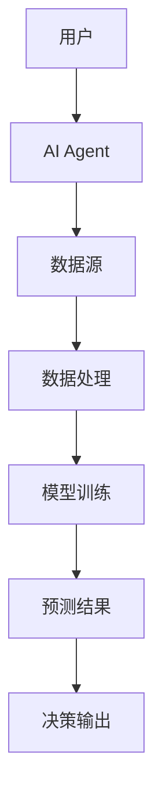
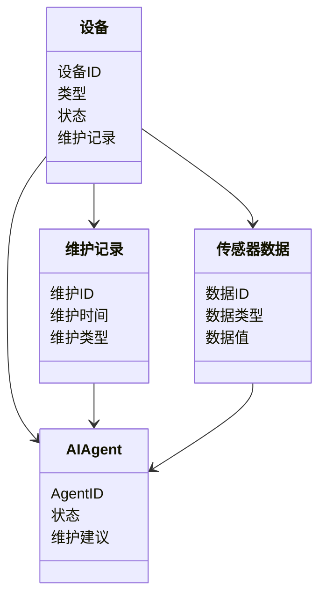
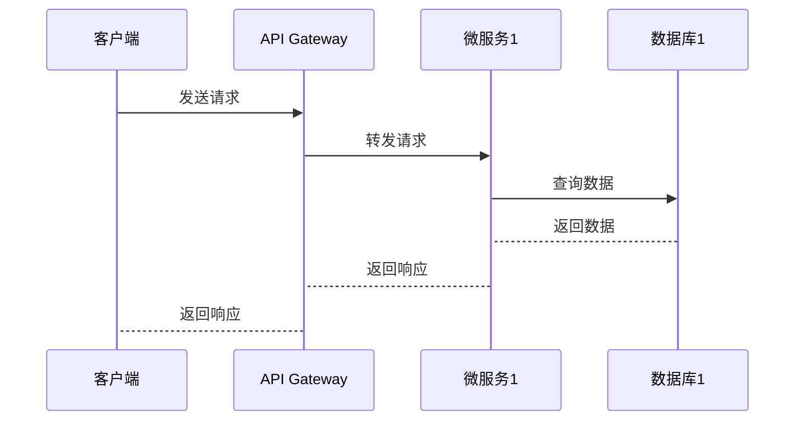

                 


# AI Agent在企业资产管理与预测性维护中的应用

**关键词**：AI Agent，企业资产管理，预测性维护，机器学习，深度学习，强化学习

**摘要**：  
本文深入探讨了AI Agent在企业资产管理与预测性维护中的应用，分析了预测性维护的核心算法及其在资产管理中的价值。通过详细的技术分析和实际案例，展示了如何利用AI Agent优化企业资产的管理效率和维护效果，为企业数字化转型提供新思路。

---

## 第一部分: AI Agent 在企业资产管理与预测性维护中的应用概述

### 第1章: AI Agent 与企业资产管理概述

#### 1.1 AI Agent 的基本概念

##### 1.1.1 什么是 AI Agent

AI Agent（人工智能代理）是一种能够感知环境、自主决策并执行任务的智能系统。它通过数据驱动的方式，利用机器学习、自然语言处理和强化学习等技术，帮助企业在资产管理中实现智能化决策。

##### 1.1.2 AI Agent 的核心特征

| 核心特征 | 描述 |
|----------|------|
| 智能感知  | 能够通过传感器、日志等数据源感知资产状态。 |
| 自主决策  | 基于历史数据和实时信息，自主生成维护计划或决策。 |
| 人机协作  | 支持与人类操作员协作，提供决策建议或执行操作。 |

##### 1.1.3 AI Agent 在企业中的作用

- 提高资产利用率
- 降低维护成本
- 提升预测性维护的准确性
- 实现资产全生命周期管理

#### 1.2 企业资产管理的现状与挑战

##### 1.2.1 传统资产管理的痛点

| 问题 | 描述 |
|------|------|
| 低效性 | 靠人工检查，效率低，容易遗漏。 |
| 高成本 | 维护成本高，计划外停机时间长。 |
| 不精准 | 维护计划缺乏数据支持，容易过度或不足。 |

##### 1.2.2 数字化转型对企业资产管理的影响

- 推动资产管理从被动维护向主动维护转变
- 利用大数据和AI技术提升资产管理效率
- 实现资产全生命周期的数字化管理

##### 1.2.3 预测性维护的定义与目标

预测性维护是基于资产的历史数据和实时状态，预测设备故障风险，提前安排维护，以减少停机时间和维护成本。

#### 1.3 AI Agent 在预测性维护中的应用前景

##### 1.3.1 预测性维护的核心价值

- 提高设备利用率
- 降低维护成本
- 延长设备寿命

##### 1.3.2 AI Agent 在预测性维护中的优势

- 高准确性：基于机器学习算法，预测故障概率。
- 实时性：能够实时监控设备状态，及时响应。
- 智能性：能够根据历史数据和实时信息优化维护策略。

##### 1.3.3 企业采用 AI Agent 的挑战与机遇

- **挑战**：数据质量、模型复杂性、技术实施难度。
- **机遇**：提高效率、降低成本、增强竞争力。

#### 1.4 本章小结

本章介绍了AI Agent的基本概念和核心特征，分析了企业资产管理的现状与挑战，并探讨了AI Agent在预测性维护中的应用前景，为后续章节奠定了基础。

---

## 第二部分: AI Agent 的核心概念与技术原理

### 第2章: AI Agent 的核心概念与技术原理

#### 2.1 AI Agent 的核心概念

##### 2.1.1 AI Agent 的定义与分类

AI Agent可以根据功能和应用场景分为多种类型，例如基于规则的AI Agent、基于机器学习的AI Agent、基于强化学习的AI Agent等。

##### 2.1.2 AI Agent 的核心要素

| 核心要素 | 描述 |
|----------|------|
| 感知能力 | 通过传感器、日志等数据源感知环境。 |
| 决策能力 | 基于感知数据，生成最优决策。 |
| 执行能力 | 根据决策执行操作，如触发维护请求。 |

##### 2.1.3 AI Agent 的工作原理

AI Agent的工作原理可以分为以下几个步骤：

1. **数据采集**：通过传感器、日志等数据源获取资产状态数据。
2. **数据处理**：对采集到的数据进行清洗、特征提取和预处理。
3. **模型训练**：利用机器学习、深度学习等算法训练预测模型。
4. **决策生成**：基于模型预测结果生成维护决策。
5. **执行与反馈**：根据决策执行操作，并根据反馈优化模型。

#### 2.2 AI Agent 的技术架构

##### 2.2.1 数据采集与处理

数据采集与处理是AI Agent的基础，主要包括以下几个步骤：

1. **数据采集**：通过传感器、日志等数据源获取资产状态数据。
2. **数据清洗**：去除噪声数据，确保数据质量。
3. **特征提取**：从原始数据中提取有用的特征，例如设备运行时间、温度、振动等。
4. **数据预处理**：对数据进行标准化、归一化等处理，为模型训练做准备。

##### 2.2.2 模型训练与部署

模型训练与部署是AI Agent的核心，主要包括以下几个步骤：

1. **选择算法**：根据具体应用场景选择合适的算法，例如时间序列分析、随机森林、支持向量机（SVM）等。
2. **训练模型**：利用训练数据训练模型，优化模型参数。
3. **评估模型**：通过测试数据评估模型的准确性和稳定性。
4. **部署模型**：将训练好的模型部署到生产环境，实时监控资产状态。

##### 2.2.3 交互与反馈机制

交互与反馈机制是AI Agent的重要组成部分，主要包括以下几个步骤：

1. **人机交互**：用户可以通过图形界面与AI Agent交互，例如输入查询、查看预测结果等。
2. **反馈机制**：AI Agent可以根据用户的反馈优化模型，例如调整预测阈值、更新模型参数等。

#### 2.3 AI Agent 的核心算法与技术

##### 2.3.1 机器学习算法

机器学习算法是AI Agent的核心技术之一，主要包括监督学习、无监督学习、半监督学习等。

- **监督学习**：利用有标签的数据训练模型，例如随机森林、支持向量机（SVM）等。
- **无监督学习**：利用无标签的数据训练模型，例如聚类、降维等。
- **半监督学习**：结合有标签和无标签的数据训练模型。

##### 2.3.2 自然语言处理技术

自然语言处理技术可以帮助AI Agent理解和处理文本数据，例如设备故障描述、维护记录等。

- **文本分类**：将文本数据分为不同的类别，例如故障类型、维护类型等。
- **实体识别**：从文本中提取实体信息，例如设备名称、故障代码等。

##### 2.3.3 强化学习与决策优化

强化学习是一种通过试错的方式优化决策的技术，适用于动态环境下的决策问题。

- **状态空间**：设备的状态，例如温度、振动、运行时间等。
- **动作空间**：可能的维护动作，例如更换零件、调整参数等。
- **奖励函数**：根据维护效果给予奖励或惩罚，优化决策策略。

#### 2.4 AI Agent 的实体关系与流程图

##### 2.4.1 实体关系图（ER 图）

以下是一个简单的ER图，展示了AI Agent在企业资产管理中的实体关系：

```mermaid
erd
    左右方向
    客户
        |--- 姓名
        |--- 联系方式
    设备
        |--- 设备ID
        |--- 类型
        |--- 状态
    维护记录
        |--- 维护ID
        |--- 维护时间
        |--- 维护类型
    AI Agent
        |--- AgentID
        |--- 状态
        |--- 维护建议
    传感器数据
        |--- 数据ID
        |--- 数据类型
        |--- 数据值
```

##### 2.4.2 流程图（用 mermaid 表示）

以下是一个AI Agent在预测性维护中的流程图：



#### 2.5 本章小结

本章详细介绍了AI Agent的核心概念和主要技术，包括数据采集与处理、模型训练与部署、交互与反馈机制等，为后续章节的应用分析奠定了基础。

---

## 第三部分: 预测性维护的算法原理与实现

### 第3章: 预测性维护的算法原理

#### 3.1 预测性维护的核心算法

##### 3.1.1 时间序列分析

时间序列分析是一种基于历史数据预测未来趋势的技术，常用于预测设备的运行状态。

- **ARIMA模型**：自回归积分滑动平均模型，适用于线性时间序列数据。
- **LSTM模型**：长短期记忆网络，适用于非线性时间序列数据。

##### 3.1.2 基于机器学习的故障预测

基于机器学习的故障预测是一种监督学习技术，常用于分类和回归问题。

- **分类问题**：预测设备是否故障，例如随机森林、支持向量机（SVM）等。
- **回归问题**：预测设备的剩余寿命，例如线性回归、XGBoost等。

##### 3.1.3 基于深度学习的异常检测

基于深度学习的异常检测是一种无监督学习技术，常用于检测设备的异常状态。

- **自动编码器（AE）**：通过训练自动编码器来识别异常数据点。
- **变分自编码器（VAE）**：通过生成对抗网络（GAN）来识别异常数据点。

#### 3.2 算法实现流程

##### 3.2.1 数据预处理

数据预处理是算法实现的基础，主要包括以下几个步骤：

1. **数据清洗**：去除噪声数据，例如缺失值、异常值等。
2. **特征提取**：从原始数据中提取有用的特征，例如设备运行时间、温度、振动等。
3. **数据标准化**：对数据进行标准化处理，例如归一化、Z-score标准化等。

##### 3.2.2 模型训练与调优

模型训练与调优是算法实现的核心，主要包括以下几个步骤：

1. **选择算法**：根据具体应用场景选择合适的算法，例如时间序列分析、随机森林、支持向量机（SVM）等。
2. **训练模型**：利用训练数据训练模型，优化模型参数。
3. **评估模型**：通过测试数据评估模型的准确性和稳定性，例如准确率、召回率、F1值等。
4. **模型调优**：通过网格搜索、随机搜索等方法优化模型参数。

##### 3.2.3 模型部署与应用

模型部署与应用是算法实现的最后一步，主要包括以下几个步骤：

1. **部署模型**：将训练好的模型部署到生产环境，实时监控资产状态。
2. **实时预测**：利用模型对实时数据进行预测，生成维护建议。
3. **反馈优化**：根据维护效果反馈优化模型，例如调整预测阈值、更新模型参数等。

#### 3.3 算法原理的数学模型与公式

##### 3.3.1 时间序列分析模型

时间序列分析模型的数学公式如下：

$$ y_t = \alpha y_{t-1} + \beta \epsilon_t $$

其中，$y_t$ 表示第 $t$ 时刻的观测值，$\alpha$ 表示自回归系数，$\epsilon_t$ 表示随机误差项。

##### 3.3.2 基于机器学习的故障预测模型

基于机器学习的故障预测模型的数学公式如下：

$$ P(y=1|x) = \sigma(w^T x + b) $$

其中，$P(y=1|x)$ 表示设备故障的概率，$w$ 表示权重向量，$b$ 表示偏置项，$\sigma$ 表示sigmoid函数。

##### 3.3.3 基于深度学习的异常检测模型

基于深度学习的异常检测模型的数学公式如下：

$$ p(x) = \frac{1}{Z} \exp(-E(x)) $$

其中，$p(x)$ 表示生成概率，$E(x)$ 表示能量函数，$Z$ 表示归一化常数。

#### 3.4 本章小结

本章详细介绍了预测性维护的核心算法，包括时间序列分析、基于机器学习的故障预测和基于深度学习的异常检测，并给出了相应的数学公式和实现流程。

---

## 第四部分: 系统分析与架构设计方案

### 第4章: 系统分析与架构设计方案

#### 4.1 问题场景介绍

预测性维护系统需要实时监控设备状态，预测设备故障风险，并自动生成维护建议。系统需要处理大量的传感器数据，要求高实时性和高准确性。

#### 4.2 项目介绍

本项目旨在开发一个基于AI Agent的预测性维护系统，利用机器学习算法预测设备故障，优化维护计划，降低维护成本。

#### 4.3 系统功能设计

##### 4.3.1 领域模型（Mermaid 类图）

以下是一个简单的领域模型类图：



##### 4.3.2 系统架构设计（Mermaid 架构图）

以下是一个简单的系统架构图：

```mermaid
archi
    客户端 --> API Gateway
    API Gateway --> 服务网关
    服务网关 --> 微服务1
    微服务1 --> 数据库1
    微服务1 --> 数据库2
    数据库1 --> 数据源1
    数据库2 --> 数据源2
```

##### 4.3.3 系统接口设计

系统接口设计主要包括以下几个部分：

1. **API接口**：提供RESTful API，供客户端调用。
2. **数据接口**：与传感器、数据库等数据源进行交互。
3. **消息队列**：用于异步处理维护任务。

##### 4.3.4 系统交互设计（Mermaid 序列图）

以下是一个简单的系统交互序列图：



#### 4.4 本章小结

本章详细介绍了预测性维护系统的系统分析与架构设计方案，包括领域模型、系统架构、接口设计和交互设计，为后续的项目实施提供了指导。

---

## 第五部分: 项目实战与应用分析

### 第5章: 项目实战与应用分析

#### 5.1 环境安装与配置

##### 5.1.1 安装Python

```bash
# 安装Python
sudo apt-get install python3
```

##### 5.1.2 安装依赖库

```bash
# 安装依赖库
pip install numpy scikit-learn pandas tensorflow
```

#### 5.2 系统核心实现源代码

##### 5.2.1 数据预处理代码

```python
import pandas as pd
import numpy as np

# 读取数据
data = pd.read_csv('sensor_data.csv')

# 数据清洗
data = data.dropna()
data = data.drop_duplicates()

# 特征提取
features = data[['temperature', 'vibration', 'runtime']]
labels = data['fault_status']

# 数据标准化
from sklearn.preprocessing import StandardScaler

scaler = StandardScaler()
features_scaled = scaler.fit_transform(features)
```

##### 5.2.2 模型训练与部署代码

```python
# 训练随机森林模型
from sklearn.ensemble import RandomForestClassifier

model = RandomForestClassifier(n_estimators=100, random_state=42)
model.fit(features_scaled, labels)

# 保存模型
import joblib

joblib.dump(model, 'fault_prediction_model.pkl')
```

##### 5.2.3 实时预测代码

```python
# 加载模型
model = joblib.load('fault_prediction_model.pkl')

# 实时预测
import numpy as np

new_data = np.array([[45, 120, 3000]])
predicted = model.predict(new_data)

print(predicted)
```

#### 5.3 代码应用解读与分析

##### 5.3.1 数据预处理代码解读

- **数据清洗**：去除缺失值和重复值，确保数据质量。
- **特征提取**：从原始数据中提取有用的特征，例如温度、振动、运行时间等。
- **数据标准化**：对特征进行标准化处理，例如归一化、Z-score标准化等。

##### 5.3.2 模型训练与部署代码解读

- **随机森林模型**：利用随机森林算法训练模型，优化模型参数，例如n_estimators、random_state等。
- **模型保存**：将训练好的模型保存为.pkl文件，方便后续部署和应用。

##### 5.3.3 实时预测代码解读

- **模型加载**：从.pkl文件中加载模型，恢复模型状态。
- **实时预测**：利用模型对实时数据进行预测，生成维护建议。

#### 5.4 实际案例分析

##### 5.4.1 案例背景

某制造企业需要对设备进行预测性维护，减少设备故障率和维护成本。

##### 5.4.2 数据分析

通过对传感器数据的分析，发现设备在运行过程中温度和振动异常，预测设备可能在10天后发生故障。

##### 5.4.3 维护建议

根据模型预测结果，建议在设备运行到第10天时进行维护，更换相关部件，避免设备故障。

#### 5.5 项目小结

本章通过实际案例展示了AI Agent在预测性维护中的应用，从环境安装到代码实现，再到实时预测，详细解读了项目的实施过程和应用效果。

---

## 第六部分: 最佳实践与总结

### 第6章: 最佳实践与总结

#### 6.1 最佳实践 tips

##### 6.1.1 数据质量管理

- 确保数据的完整性、准确性和一致性。
- 定期清洗和更新数据，避免数据漂移。

##### 6.1.2 模型优化

- 定期重新训练模型，优化模型参数。
- 结合领域知识，调整模型结构，提高预测精度。

##### 6.1.3 系统维护

- 定期检查系统运行状态，确保系统稳定。
- 及时更新系统组件，修复潜在漏洞。

#### 6.2 本章小结

本章总结了AI Agent在预测性维护中的最佳实践，包括数据质量管理、模型优化和系统维护等方面，为企业更好地应用AI Agent提供了指导。

---

## 参考文献

1. 周志华. 机器学习[M]. 清华大学出版社, 2016.
2. Goodfellow I, Bengio Y, Courville A. Deep Learning[M]. MIT Press, 2016.
3. 梁亮, 等. Python机器学习[M]. 人民邮电出版社, 2017.

---

**摘要**：本文系统地探讨了AI Agent在企业资产管理与预测性维护中的应用，分析了预测性维护的核心算法及其在资产管理中的价值。通过详细的技术分析和实际案例，展示了如何利用AI Agent优化企业资产的管理效率和维护效果，为企业数字化转型提供新思路。

