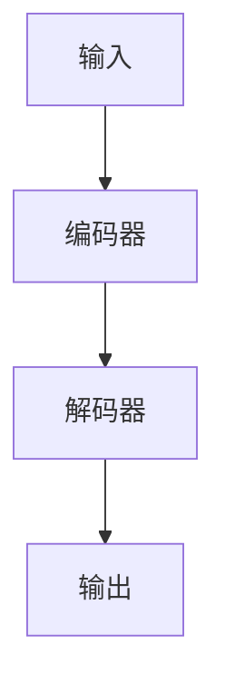
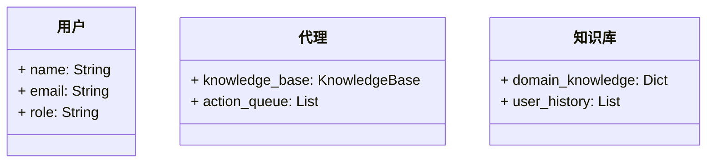
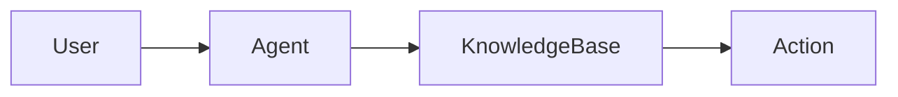
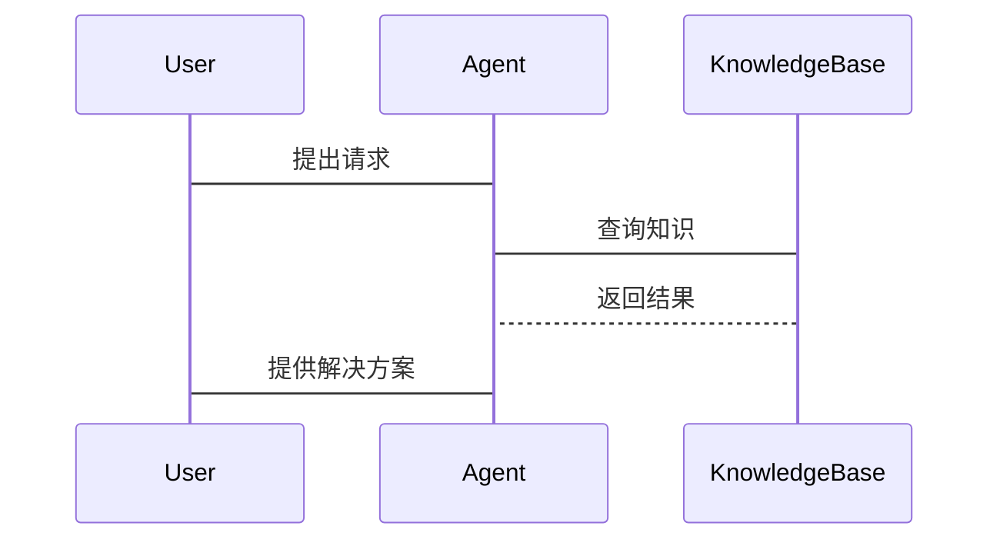

                 


# AI Agent在企业远程办公支持中的应用

> 关键词：AI Agent, 远程办公, 企业支持, 人工智能, 自然语言处理

> 摘要：随着远程办公的普及，企业对智能化支持工具的需求日益增长。本文探讨了AI Agent在企业远程办公中的应用，分析了其核心原理、系统架构设计及实际项目实现。通过详细的技术分析和案例研究，本文揭示了AI Agent如何提升远程办公的效率和用户体验。

---

# 第1章: 远程办公的发展与挑战

## 1.1 远程办公的发展历程

### 1.1.1 从传统办公到远程办公的演变
随着互联网技术的进步，远程办公从早期的偶尔使用逐渐成为企业的重要工作模式。2020年新冠疫情的爆发加速了这一趋势，企业开始广泛采用远程办公工具。

### 1.1.2 远程办公的现状与趋势
当前，远程办公已成为企业降本增效的重要手段。据统计，全球约有50%的企业采用混合办公模式，预计这一比例将继续上升。

### 1.1.3 企业远程办公的核心需求
企业远程办公的核心需求包括：
1. **高效沟通**：实时通讯、视频会议等。
2. **协作效率**：文档共享、任务分配等。
3. **安全性**：数据加密、访问控制等。
4. **用户体验**：界面友好、功能便捷等。

## 1.2 AI Agent的基本概念与特点

### 1.2.1 AI Agent的定义与分类
AI Agent是一种能够感知环境并采取行动以实现目标的智能体。根据功能，AI Agent可以分为：
1. **简单反应式Agent**：基于当前感知采取行动。
2. **基于模型的反应式Agent**：维护环境的模型以做出决策。
3. **目标驱动的Agent**：根据目标选择行动。
4. **效用驱动的Agent**：通过最大化效用函数来决策。

### 1.2.2 AI Agent的核心功能与优势
AI Agent的核心功能包括：
1. **感知环境**：通过传感器或API获取信息。
2. **决策与推理**：基于知识库和推理引擎做出决策。
3. **执行行动**：通过API或用户界面执行操作。

其优势在于：
1. **自动化**：无需人工干预。
2. **智能性**：能够理解和处理复杂任务。
3. **适应性**：能够自适应环境变化。

### 1.2.3 AI Agent与传统办公工具的区别
AI Agent与传统办公工具的区别主要体现在智能化和自主性上。传统工具需要用户主动操作，而AI Agent能够主动感知并提供解决方案。

## 1.3 AI Agent在企业远程办公中的应用前景

### 1.3.1 AI Agent的潜在应用场景
AI Agent在远程办公中的应用场景包括：
1. **智能助手**：帮助用户处理日程安排、邮件等任务。
2. **实时翻译**：提供多语言支持。
3. **智能提醒**：基于上下文提醒用户重要事项。
4. **数据分析**：实时分析团队表现并提供反馈。

### 1.3.2 企业采用AI Agent的优势
1. **提升效率**：自动化处理重复性任务。
2. **增强协作**：促进团队成员之间的高效沟通。
3. **降低成本**：减少差旅和办公场地费用。

### 1.3.3 AI Agent应用的挑战与机遇
挑战主要在于技术实现的复杂性和数据隐私问题。机遇则在于技术进步带来的效率提升和新商业模式的出现。

---

# 第2章: AI Agent的核心概念与原理

## 2.1 AI Agent的核心概念

### 2.1.1 AI Agent的定义与核心要素
AI Agent由以下核心要素组成：
1. **感知器**：用于获取环境信息。
2. **知识库**：存储领域知识和历史数据。
3. **推理引擎**：用于逻辑推理和决策。
4. **行动器**：用于执行具体操作。

### 2.1.2 AI Agent的实体关系图

```mermaid
er
actor: 用户
agent: AI代理
action: 代理行为
goal: 目标
constraint: 约束条件
```

## 2.2 AI Agent的核心原理

### 2.2.1 知识表示与推理
知识表示是AI Agent理解世界的基础。常用的知识表示方法包括：
1. **语义网**：通过 RDF 和 OWL 描述知识。
2. **规则表示**：使用逻辑规则定义知识。

### 2.2.2 自然语言处理（NLP）
NLP技术使AI Agent能够理解和生成人类语言。关键技术包括：
1. **词干提取**：将词转换为基本形式。
2. **实体识别**：识别文本中的实体。
3. **情感分析**：分析文本的情感倾向。

### 2.2.3 问题求解与规划
问题求解涉及搜索和推理算法，如 A* 搜索算法。规划则是根据目标生成行动计划。

## 2.3 AI Agent的算法原理

### 2.3.1 基于Transformer的AI Agent模型



### 2.3.2 基于强化学习的AI Agent算法

```python
def agent_policy(state):
    action = policy_net(state)
    return action
```

### 2.3.3 基于规则的AI Agent实现

```python
def rule_based_agent(state):
    if state == '需要帮助':
        return '提供解决方案'
    else:
        return '等待指令'
```

---

# 第3章: AI Agent的数学模型与算法实现

## 3.1 知识表示的数学模型

$$向量空间模型表示公式$$

## 3.2 自然语言处理的数学模型

$$注意力机制公式$$

## 3.3 问题求解的数学模型

$$概率论决策公式$$

---

# 第4章: AI Agent的系统架构与实现

## 4.1 系统功能设计

### 4.1.1 领域模型设计



## 4.2 系统架构设计

### 4.2.1 系统架构图



### 4.2.2 系统接口设计

### 4.2.3 系统交互流程



---

# 第5章: 项目实战

## 5.1 环境安装

### 5.1.1 安装Python
```bash
python --version
```

### 5.1.2 安装依赖库
```bash
pip install transformers
```

## 5.2 核心代码实现

### 5.2.1 模型实现

```python
from transformers import AutoTokenizer, AutoModelForMaskedLM

tokenizer = AutoTokenizer.from_pretrained('bert-base-uncased')
model = AutoModelForMaskedLM.from_pretrained('bert-base-uncased')
```

### 5.2.2 接口实现

```python
def process_request(request):
    inputs = tokenizer(request, return_tensors='np')
    outputs = model.generate(inputs.input_ids)
    return tokenizer.decode(outputs[0])
```

## 5.3 案例分析

### 5.3.1 项目背景
企业需要一个智能助手来处理员工的日常请求。

### 5.3.2 实施步骤
1. **需求分析**：明确功能需求。
2. **系统设计**：设计系统架构。
3. **开发实现**：编写核心代码。
4. **测试优化**：进行功能测试和性能优化。

### 5.3.3 项目总结
通过该项目，我们验证了AI Agent在企业远程办公中的可行性，并积累了宝贵的开发经验。

---

# 第6章: 最佳实践与总结

## 6.1 最佳实践

### 6.1.1 技术选型
选择合适的AI框架和算法是项目成功的关键。

### 6.1.2 数据管理
确保数据安全和隐私保护。

## 6.2 小结

AI Agent在企业远程办公中的应用前景广阔，能够显著提升工作效率和用户体验。

## 6.3 注意事项

1. **数据隐私**：严格遵守相关法律法规。
2. **系统稳定性**：确保系统的高可用性。
3. **用户教育**：提供充分的用户培训。

## 6.4 拓展阅读

推荐阅读《人工智能：一种现代的方法》和《自然语言处理入门》。

---

# 结语

AI Agent作为企业远程办公的重要工具，正在发挥越来越重要的作用。通过本文的详细讲解，读者可以深入了解其技术原理和实现方法，并将其应用于实际工作中。

---

# 关键词索引

- AI Agent
- 远程办公
- 企业支持
- 人工智能
- 自然语言处理

