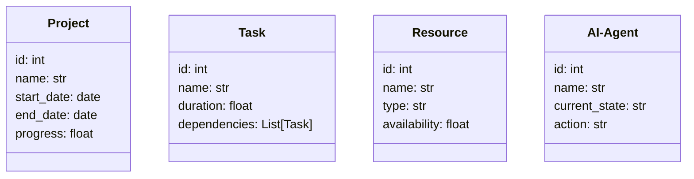

                 


# AI Agent在企业项目管理中的应用

---

## 关键词

AI Agent, 项目管理, 企业应用, 人工智能, 项目监控, 资源优化

---

## 摘要

本文探讨AI Agent在企业项目管理中的应用，分析其在项目监控、资源分配和团队协作中的作用，详细讲解核心概念、算法原理和系统架构设计，并通过实际案例展示其在企业中的应用价值。

---

## 正文部分

### 第1章: AI Agent的基本概念与项目管理背景

#### 1.1 AI Agent的定义与核心特征

- **1.1.1 AI Agent的定义**
  AI Agent（人工智能代理）是一种能够感知环境、自主决策并执行任务的智能体。它通过传感器获取信息，利用算法进行分析和决策，从而执行预设或自适应的目标。

- **1.1.2 AI Agent的核心特征**
  - **自主性**：能够自主决策和行动，无需人工干预。
  - **反应性**：能够实时感知环境变化并做出反应。
  - **目标导向性**：所有行动均以实现特定目标为导向。
  - **学习能力**：通过数据和经验不断优化自身行为。

- **1.1.3 AI Agent与传统项目管理工具的对比**

| 特性                | 传统项目管理工具                 | AI Agent                   |
|---------------------|---------------------------------|----------------------------|
| 决策方式            | 依赖人工制定规则和流程           | 自主学习和优化决策         |
| 数据处理能力        | 有限的规则和数据处理能力         | 强大的数据处理和分析能力   |
| 灵活性              | 较低，流程固定                   | 高度灵活，能快速适应变化   |
| 学习能力            | 无                              | 具备学习能力               |

#### 1.2 项目管理中的问题与挑战

- **1.2.1 传统项目管理的局限性**
  - 人工决策的低效性和误差。
  - 面对复杂环境时的灵活性不足。
  - 跨团队协作中的沟通不畅。

- **1.2.2 现代项目管理的需求变化**
  - 快速变化的商业环境要求更灵活的管理方式。
  - 数据驱动的决策需求增加。
  - 高效的团队协作工具成为刚需。

- **1.2.3 AI Agent在项目管理中的潜在价值**
  - 提高项目决策的准确性和效率。
  - 实现实时监控和动态调整。
  - 优化资源分配，降低成本。

---

### 第2章: AI Agent在企业项目管理中的应用场景

#### 2.1 项目监控与进度管理

- **2.1.1 项目进度预测**
  - AI Agent通过分析历史数据和当前进度，预测项目完成时间。
  - 示例：使用LSTM模型预测项目完成时间，预测结果为项目可能延迟1周。

- **2.1.2 任务优先级排序**
  - 基于任务的重要性、依赖关系和资源可用性，动态调整任务优先级。
  - 示例：任务A优先级高于任务B，因此应优先执行任务A。

- **2.1.3 风险预警与应对**
  - 识别潜在风险并提前预警。
  - 示例：AI Agent检测到关键路径可能存在延误，建议调整资源分配以规避风险。

#### 2.2 资源分配与优化

- **2.2.1 资源需求预测**
  - 基于项目需求和资源可用性，预测所需资源。
  - 示例：AI Agent预测项目X需要增加5名开发人员。

- **2.2.2 资源分配优化**
  - 利用优化算法，实现资源的最优分配。
  - 示例：使用贪心算法分配资源，确保关键任务优先获得充足资源。

- **2.2.3 资源利用效率提升**
  - 监控资源使用情况，动态调整分配策略。
  - 示例：AI Agent发现某资源利用率低，建议重新分配到其他项目。

#### 2.3 团队协作与沟通

- **2.3.1 团队协作效率提升**
  - AI Agent协助团队成员高效协作，减少沟通成本。
  - 示例：自动分配任务并提醒相关人员完成。

- **2.3.2 沟通渠道优化**
  - 通过自然语言处理技术，优化团队内部的沟通方式。
  - 示例：AI Agent自动整理会议纪要，提高团队协作效率。

- **2.3.3 团队成员行为分析**
  - 分析团队成员的行为模式，识别潜在问题。
  - 示例：AI Agent发现某成员工作效率下降，建议进行一对一沟通。

---

### 第3章: AI Agent在企业项目管理中的核心概念与联系

#### 3.1 AI Agent的核心概念原理

- **3.1.1 AI Agent的感知机制**
  - 通过传感器或数据接口获取环境信息。
  - 示例：AI Agent从项目管理系统中获取任务进度数据。

- **3.1.2 AI Agent的决策机制**
  - 利用算法对感知到的信息进行分析和决策。
  - 示例：使用强化学习算法，AI Agent在资源分配中选择最优方案。

- **3.1.3 AI Agent的执行机制**
  - 根据决策结果执行相应操作。
  - 示例：AI Agent向项目管理系统发送调整任务优先级的指令。

#### 3.2 AI Agent与项目管理工具的联系

- **3.2.1 AI Agent对项目管理工具的增强作用**
  - 通过AI技术提升工具的智能化水平。
  - 示例：AI Agent集成到项目管理软件中，实现智能任务分配和进度预测。

- **3.2.2 项目管理工具对AI Agent的支持**
  - 提供数据接口和环境，支持AI Agent的运行。
  - 示例：项目管理系统为AI Agent提供实时数据，支持其进行决策。

---

### 第4章: AI Agent的算法原理

#### 4.1 算法原理概述

- **4.1.1 强化学习算法**
  - 通过奖励机制训练AI Agent，使其在决策中获得最大累积奖励。
  - 示例：在资源分配中，AI Agent通过试错获得最优分配策略。

- **4.1.2 监督学习算法**
  - 使用标注数据训练AI Agent，使其能够准确分类或预测。
  - 示例：使用监督学习算法预测项目完成时间。

- **4.1.3 聚类分析**
  - 将类似的任务或资源进行分组，优化资源配置。
  - 示例：将类似的任务分组，优化资源分配。

#### 4.2 算法实现

- **4.2.1 强化学习算法实现**

```python
import numpy as np

class AI-Agent:
    def __init__(self, state_space, action_space):
        self.state_space = state_space
        self.action_space = action_space
        self.Q_table = np.zeros((state_space, action_space))

    def choose_action(self, state):
        # 使用epsilon-greedy策略选择动作
        epsilon = 0.1
        if np.random.random() < epsilon:
            return np.random.randint(self.action_space)
        else:
            return np.argmax(self.Q_table[state])

    def update_Q_table(self, state, action, reward):
        # 更新Q值
        self.Q_table[state, action] = self.Q_table[state, action] * 0.9 + reward
```

---

### 第5章: 系统分析与架构设计

#### 5.1 系统功能设计

- **5.1.1 领域模型设计**



- **5.1.2 系统架构设计**


---

### 第6章: 项目实战

#### 6.1 环境安装

- 安装Python和相关库：
  ```bash
  pip install numpy matplotlib scikit-learn
  ```

#### 6.2 核心代码实现

```python
import numpy as np
from sklearn import svm

def train_model(X, y):
    model = svm.SVC()
    model.fit(X, y)
    return model

# 示例数据
X = np.array([[1, 2], [3, 4], [5, 6]])
y = np.array([0, 1, 0])
model = train_model(X, y)
print(model.predict([[7, 8]]))  # 输出预测结果
```

#### 6.3 实际案例分析

- **案例1：项目进度预测**
  - 输入：项目历史数据
  - 输出：项目完成时间预测

- **案例2：资源分配优化**
  - 输入：项目需求和资源可用性
  - 输出：资源分配方案

---

### 第7章: 最佳实践与小结

#### 7.1 最佳实践

- **数据质量**：确保输入数据的准确性和完整性。
- **模型调优**：定期更新和优化AI Agent的算法模型。
- **用户反馈**：根据用户反馈不断改进AI Agent的行为。

#### 7.2 小结

AI Agent在企业项目管理中的应用前景广阔，能够显著提升项目管理的效率和效果。通过实时监控、智能决策和优化资源分配，AI Agent能够帮助企业更好地应对复杂多变的项目管理挑战。

---

### 第8章: 注意事项与拓展阅读

#### 8.1 注意事项

- **数据隐私**：确保项目数据的安全性和隐私性。
- **系统稳定性**：保证AI Agent系统的稳定运行，避免因系统故障导致项目延误。
- **团队适应性**：推动团队适应AI技术的应用，减少因技术引入带来的阻力。

#### 8.2 拓展阅读

- 推荐书籍：《机器学习实战》、《项目管理实战》
- 推荐在线课程：Coursera上的《人工智能基础》、edX上的《项目管理》

---

# 结语

通过本文的详细讲解，您可以了解到AI Agent在企业项目管理中的广泛应用和实际价值。希望本文能为您提供有益的启示，帮助您更好地理解和应用AI Agent技术。

