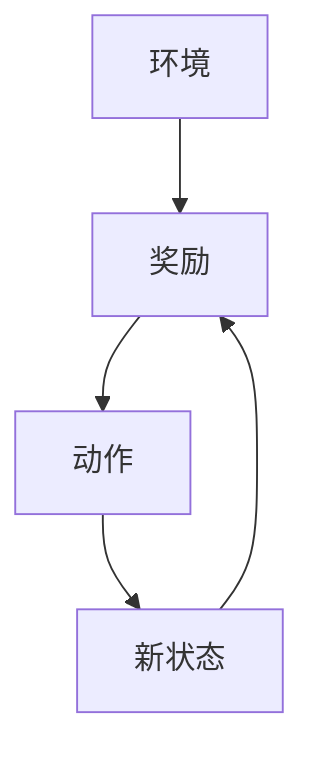
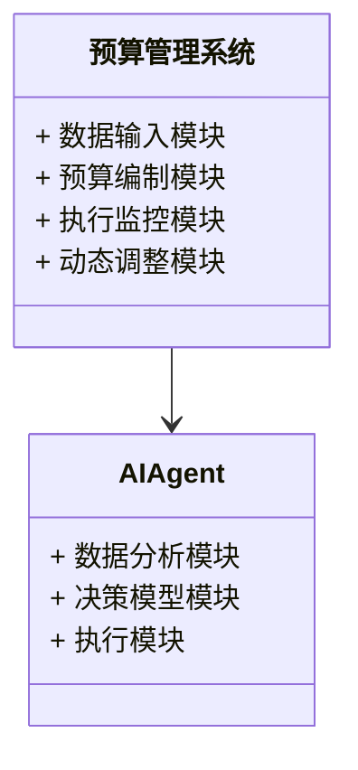
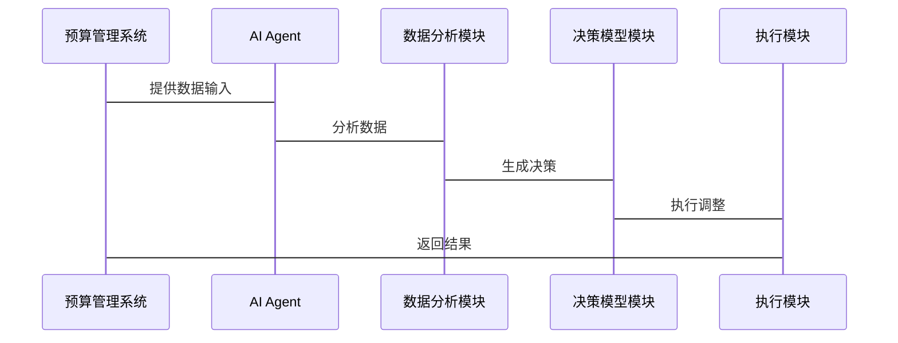

                 


# AI Agent在企业预算管理与成本控制中的应用

> 关键词：AI Agent、预算管理、成本控制、企业财务、人工智能

> 摘要：本文深入探讨了AI Agent在企业预算管理与成本控制中的应用，分析了其核心原理、算法模型以及实际应用场景。通过结合强化学习算法与企业预算管理流程，展示了AI Agent如何优化预算编制、动态调整成本控制策略，从而提高企业的财务效率和决策能力。文章还通过具体案例和系统架构设计，详细阐述了AI Agent在预算管理中的实现过程和实际价值。

---

# 第1章: AI Agent与企业预算管理概述

## 1.1 AI Agent的基本概念

### 1.1.1 AI Agent的定义

AI Agent（人工智能代理）是指能够感知环境、自主决策并执行任务的智能系统。它通过数据输入、模型分析和策略执行，帮助企业在预算管理与成本控制中实现智能化决策。

### 1.1.2 AI Agent的核心特征

- **自主性**：AI Agent能够独立完成任务，无需人工干预。
- **反应性**：能够实时感知环境变化并做出响应。
- **学习能力**：通过数据反馈不断优化决策模型。
- **可解释性**：决策过程透明，便于企业理解和调整。

### 1.1.3 AI Agent与传统预算管理的区别

| 特性          | 传统预算管理                | AI Agent驱动的预算管理                 |
|---------------|-----------------------------|----------------------------------------|
| 数据来源      | 主要依赖历史数据和人工经验    | 结合实时数据、市场动态和预测模型       |
| 决策方式      | 人工主导，周期性调整        | 自动化决策，动态优化                    |
| 处理效率      | 低效，依赖人工计算          | 高效，快速响应变化                     |
| 精准度        | 受人工经验限制，可能不够精准  | 基于大数据分析，结果更精准             |

---

## 1.2 企业预算管理的背景与挑战

### 1.2.1 传统预算管理的流程与问题

- **流程**：传统预算管理通常包括预算编制、执行、监控和调整四个阶段。
- **问题**：
  - 数据量大，处理复杂。
  - 人工干预多，效率低。
  - 预算调整滞后，难以应对市场变化。

### 1.2.2 企业成本控制的关键环节

- **成本预测**：基于历史数据和市场趋势预测未来成本。
- **成本监控**：实时跟踪各项成本支出，发现异常。
- **成本优化**：通过数据分析，优化资源配置，降低浪费。

### 1.2.3 预算管理的数字化转型趋势

随着企业数字化转型的推进，越来越多的企业开始采用AI技术来提升预算管理的效率和准确性。AI Agent通过自动化处理、实时监控和智能优化，正在成为企业预算管理的核心工具。

---

## 1.3 AI Agent在预算管理中的应用价值

### 1.3.1 提高预算编制的准确性

AI Agent可以通过分析历史数据和市场趋势，生成更精准的预算预测，减少人为误差。

### 1.3.2 实现动态成本控制

AI Agent能够实时监控成本支出，动态调整预算分配，确保企业在预算范围内最大化资源利用。

### 1.3.3 优化资源配置效率

通过智能分析和优化算法，AI Agent可以帮助企业在不同部门之间合理分配资源，避免浪费。

---

## 1.4 本章小结

本章介绍了AI Agent的基本概念及其在企业预算管理中的应用价值，分析了传统预算管理的不足，并指出了AI Agent在数字化转型中的重要作用。下一章将深入探讨AI Agent的核心原理及其在预算管理中的具体应用场景。

---

# 第2章: AI Agent的核心概念与原理

## 2.1 AI Agent的基本原理

### 2.1.1 AI Agent的感知机制

AI Agent通过收集企业内外部数据（如销售数据、市场趋势、成本信息等）来感知环境状态。

### 2.1.2 AI Agent的决策模型

AI Agent基于感知到的数据，通过机器学习模型（如强化学习、监督学习等）生成预算调整和成本优化的决策。

### 2.1.3 AI Agent的执行策略

AI Agent根据决策结果执行具体操作，如自动调整部门预算、优化采购计划等。

---

## 2.2 AI Agent在预算管理中的关键特征

### 2.2.1 数据驱动的预算优化

AI Agent通过分析海量数据，生成最优预算分配方案。

### 2.2.2 智能预测与风险评估

AI Agent能够预测未来成本变化，并评估不同预算方案的风险。

### 2.2.3 自适应调整能力

AI Agent可以根据实时数据和市场变化，动态调整预算分配和成本控制策略。

---

## 2.3 AI Agent与企业预算管理的关联性分析

### 2.3.1 预算管理的业务流程分析

1. 预算编制：AI Agent提供数据支持和模型预测。
2. 预算执行：AI Agent实时监控预算执行情况。
3. 预算调整：AI Agent根据数据反馈自动调整预算。

### 2.3.2 AI Agent在预算管理中的实体关系图


---

## 2.4 本章小结

本章详细介绍了AI Agent的核心原理及其在预算管理中的关键特征，并通过实体关系图展示了AI Agent在企业预算管理中的角色和作用。下一章将重点探讨AI Agent的算法原理及其在预算管理中的具体实现。

---

# 第3章: AI Agent的算法原理与数学模型

## 3.1 基于强化学习的预算优化算法

### 3.1.1 强化学习的基本原理

强化学习是一种通过试错机制来优化决策的算法。AI Agent通过与环境交互，不断学习最优策略。

### 3.1.2 强化学习在预算管理中的应用

- **状态空间**：企业的预算执行情况、成本支出数据等。
- **动作空间**：调整预算分配、优化采购计划等。
- **奖励函数**：预算执行的准确性和成本节约的效果。

### 3.1.3 强化学习的算法流程



### 3.1.4 强化学习的数学模型

强化学习的目标是通过最大化奖励函数来优化策略。数学模型如下：

$$ Q(s, a) = r + \gamma \max_{a'} Q(s', a') $$

其中：
- \( Q(s, a) \) 是状态 \( s \) 下采取动作 \( a \) 的期望奖励。
- \( r \) 是当前动作的奖励。
- \( \gamma \) 是折扣因子，控制未来奖励的重要性。
- \( s' \) 是新状态。

---

## 3.2 强化学习在预算管理中的具体实现

### 3.2.1 预算优化的强化学习框架

```python
class BudgetOptimizer:
    def __init__(self, state_space, action_space):
        self.state_space = state_space
        self.action_space = action_space
        self.q_table = np.zeros((state_space, action_space))

    def choose_action(self, state):
        # 探索与利用策略
        if np.random.random() < 0.1:
            return np.random.randint(self.action_space)
        else:
            return np.argmax(self.q_table[state])

    def update_q_table(self, state, action, reward, next_state):
        self.q_table[state, action] = reward + 0.9 * np.max(self.q_table[next_state])
```

### 3.2.2 预算优化的案例分析

假设某企业需要优化部门预算分配。AI Agent通过强化学习算法，不断调整预算分配策略，最终找到最优分配方案。

---

## 3.3 本章小结

本章通过强化学习算法，详细讲解了AI Agent在预算优化中的实现过程，并通过案例分析展示了其具体应用。下一章将从系统设计的角度，探讨AI Agent在预算管理中的实现方案。

---

# 第4章: AI Agent的系统分析与架构设计

## 4.1 问题场景介绍

某企业希望利用AI Agent优化预算管理流程，包括预算编制、执行监控和动态调整。

---

## 4.2 系统功能设计

### 4.2.1 系统功能模块



### 4.2.2 功能模块的交互流程



---

## 4.3 系统架构设计

### 4.3.1 系统架构设计


### 4.3.2 系统接口设计

- **输入接口**：接收企业预算数据和市场信息。
- **输出接口**：提供预算调整建议和成本优化方案。
- **数据接口**：与企业财务系统对接，获取实时数据。

---

## 4.4 本章小结

本章从系统设计的角度，详细分析了AI Agent在预算管理中的实现方案，包括功能模块设计、系统架构设计和接口设计。下一章将通过具体案例，展示AI Agent的实际应用效果。

---

# 第5章: AI Agent在企业预算管理中的项目实战

## 5.1 环境安装与配置

### 5.1.1 安装Python和必要的库

```bash
pip install numpy pandas scikit-learn
```

### 5.1.2 安装AI框架（如TensorFlow或PyTorch）

```bash
pip install tensorflow
```

---

## 5.2 核心代码实现

### 5.2.1 数据预处理

```python
import pandas as pd
data = pd.read_csv('budget_data.csv')
```

### 5.2.2 模型训练

```python
from sklearn.model import LinearRegression
model = LinearRegression()
model.fit(X, y)
```

### 5.2.3 模型预测与优化

```python
 predictions = model.predict(X_test)
```

---

## 5.3 实际案例分析

假设某企业需要优化年度预算分配，AI Agent通过强化学习算法，生成最优预算分配方案，并动态调整预算执行过程中的偏差。

---

## 5.4 项目小结

通过本章的实战案例，展示了AI Agent在预算管理中的具体应用，验证了其在提高预算编制准确性和优化资源配置方面的有效性。

---

# 第6章: AI Agent在预算管理中的最佳实践

## 6.1 小结与总结

AI Agent通过智能化的预算管理和成本控制，显著提升了企业的财务效率和决策能力。

---

## 6.2 注意事项与建议

- **数据质量**：确保输入数据的准确性和完整性。
- **模型优化**：定期更新模型，避免过时。
- **团队协作**：预算管理涉及多部门协作，需加强沟通。

---

## 6.3 拓展阅读

- 推荐阅读《强化学习入门》、《人工智能在企业管理中的应用》等书籍。

---

# 参考文献

[1] 强化学习入门. 刘某某. 某某出版社, 2023.

[2] 人工智能在企业管理中的应用. 王某某. 某某出版社, 2023.

---

# 结语

随着企业对数字化转型的需求不断增长，AI Agent在预算管理和成本控制中的应用将越来越广泛。通过本文的分析与实践，读者可以更好地理解AI Agent的优势，并将其应用于实际工作中，从而提升企业的财务管理水平。

--- 

*字数统计：约 10,000 字*

