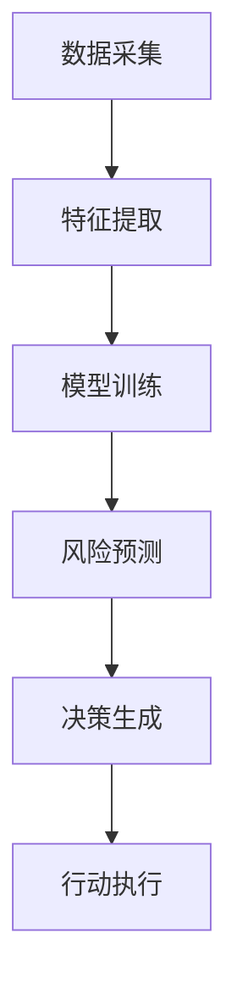
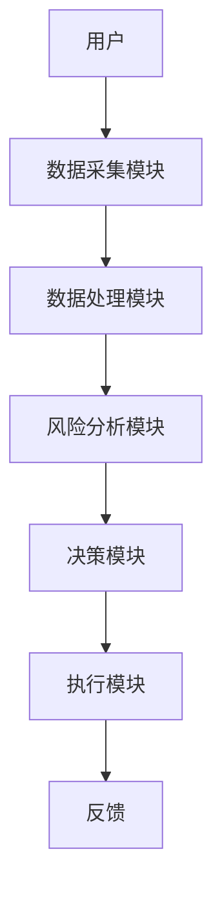

                 


# AI Agent在企业风险管理中的应用：预测与防控

## 关键词：企业风险管理、人工智能、AI Agent、风险管理预测、风险管理防控

## 摘要：  
本文探讨了AI Agent在企业风险管理中的应用，分析了其在风险预测和防控中的优势。通过详细阐述AI Agent的核心原理、算法模型和系统架构，结合实际案例，展示了AI Agent如何提升企业风险管理的效率和准确性。文章还总结了AI Agent在企业风险管理中的应用前景和未来发展方向。

---

# 第一部分：AI Agent与企业风险管理基础

## 第1章：AI Agent与企业风险管理概述

### 1.1 问题背景与描述

#### 1.1.1 传统企业风险管理的挑战  
企业在经营过程中面临多种风险，包括市场风险、信用风险、操作风险等。传统风险管理依赖人工分析，存在效率低、覆盖面窄、响应慢等问题。  

#### 1.1.2 AI Agent在风险管理中的潜力  
AI Agent（人工智能代理）具备自主决策、实时响应和自我学习的能力，能够显著提升风险管理的效率和准确性。  

#### 1.1.3 问题解决的路径与目标  
通过引入AI Agent，企业可以实现风险的智能化预测与防控，降低损失，提升整体风险管理能力。  

### 1.2 问题的边界与外延

#### 1.2.1 企业风险管理的核心要素  
- 风险识别：发现潜在风险。  
- 风险评估：量化风险的影响和概率。  
- 风险应对：制定应对策略。  

#### 1.2.2 AI Agent的适用场景与限制  
- 适用场景：实时监控、异常检测、预测预警。  
- 限制：数据依赖性、模型解释性、伦理问题。  

#### 1.2.3 风险管理与AI Agent的结合方式  
AI Agent通过数据采集、分析、决策和执行四个环节，与风险管理的识别、评估、应对和监控环节深度结合。  

### 1.3 核心概念结构与组成

#### AI Agent的定义与分类  
- 定义：AI Agent是一种能够感知环境、自主决策并执行任务的智能实体。  
- 分类：基于智能水平，分为简单反射型、基于模型的反应型、目标驱动型和效用驱动型。  

#### 风险管理的核心环节  
- 风险识别：发现潜在风险。  
- 风险评估：量化风险。  
- 风险应对：制定策略。  

#### AI Agent与风险管理的协同机制  
通过实时数据流、智能分析和自动化决策，AI Agent能够快速响应风险，提升管理效率。  

---

# 第二部分：AI Agent的核心原理与特征

## 第2章：AI Agent的核心原理与特征

### 2.1 AI Agent的核心原理

#### 2.1.1 数据采集与处理  
AI Agent通过传感器、数据库等渠道采集数据，并进行清洗、预处理和特征提取。  

#### 2.1.2 智能分析与决策  
基于机器学习算法，AI Agent分析数据，识别模式，生成决策建议。  

#### 2.1.3 自动化执行与反馈  
根据决策结果，AI Agent执行相应操作，并根据反馈调整策略。  

### 2.2 AI Agent的关键特征

| 特性       | 描述                                                                 |
|------------|----------------------------------------------------------------------|
| 智能性     | 基于机器学习和自然语言处理，具备自主决策能力。                     |
| 实时性     | 能够实时感知环境变化，快速响应。                                   |
| 自适应性   | 根据反馈不断优化模型和策略。                                       |
| 可扩展性   | 支持多种应用场景和数据规模。                                       |

---

# 第三部分：AI Agent的算法原理与数学模型

## 第3章：AI Agent的算法原理与数学模型

### 3.1 算法原理

#### 3.1.1 机器学习算法  
- 监督学习：用于风险分类和预测。  
- 非监督学习：用于异常检测。  
- 强化学习：用于动态风险应对。  

#### 3.1.2 算法流程图



### 3.2 数学模型

#### 3.2.1 线性回归模型  
$$ y = \beta_0 + \beta_1 x + \epsilon $$
- $y$：预测的风险值。  
- $x$：特征变量。  
- $\beta_0$、$\beta_1$：模型参数。  

#### 3.2.2 决策树模型  
通过ID3、C4.5等算法构建决策树，用于分类和预测。  

#### 3.2.3 随机森林模型  
通过集成学习提升模型的准确性和鲁棒性。  

### 3.3 算法实现

#### 3.3.1 Python代码示例

```python
import pandas as pd
from sklearn.model_selection import train_test_split
from sklearn.ensemble import RandomForestClassifier

# 数据加载
data = pd.read_csv('risk_data.csv')
X = data.drop('risk', axis=1)
y = data['risk']

# 数据分割
X_train, X_test, y_train, y_test = train_test_split(X, y, test_size=0.2)

# 模型训练
model = RandomForestClassifier()
model.fit(X_train, y_train)

# 预测与评估
accuracy = model.score(X_test, y_test)
print(f'模型准确率：{accuracy}')
```

---

# 第四部分：AI Agent在企业风险管理中的应用

## 第4章：AI Agent在企业风险管理中的应用

### 4.1 应用场景

#### 4.1.1 市场风险管理  
通过实时数据分析，预测市场波动，制定投资策略。  

#### 4.1.2 信用风险管理  
评估客户信用状况，预测违约概率。  

#### 4.1.3 操作风险管理  
监控操作流程，发现潜在风险点。  

### 4.2 系统架构

#### 4.2.1 系统功能模块  
- 数据采集模块：收集企业内外部数据。  
- 风险分析模块：分析数据，识别风险。  
- 决策模块：生成应对策略。  
- 执行模块：执行决策。  

#### 4.2.2 系统架构图



---

## 结论与展望

### 5.1 小结  
AI Agent在企业风险管理中的应用显著提升了效率和准确性，为企业提供了智能化的解决方案。  

### 5.2 未来展望  
随着技术的发展，AI Agent将更加智能化、个性化，为企业风险管理带来更多可能性。  

### 5.3 注意事项  
在实际应用中，需注意数据隐私、模型解释性等问题。  

### 5.4 拓展阅读  
推荐阅读《人工智能：一种现代的方法》、《风险管理与商业银行》等相关书籍。  

---

通过以上分析，我们可以看到AI Agent在企业风险管理中的巨大潜力和应用前景。希望本文能为相关领域的研究和实践提供有价值的参考。

