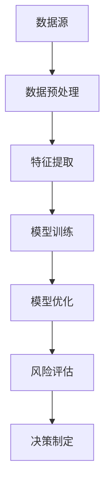
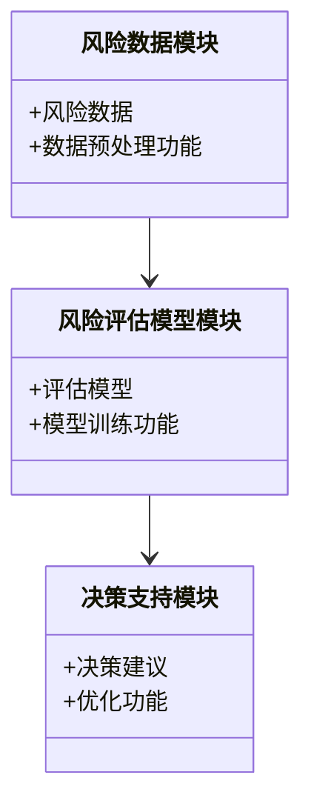

                 


# AI Agent在企业风险评估与管理中的应用

> 关键词：AI Agent，企业风险管理，风险评估，风险管理，人工智能，决策支持

> 摘要：本文详细探讨了AI Agent在企业风险评估与管理中的应用，从基本概念到技术实现，再到实际案例分析，系统地分析了AI Agent如何提升企业风险管理的效率和准确性。文章结合理论与实践，为读者提供了全面的理解和应用指导。

---

# 第1章: AI Agent与企业风险管理概述

## 1.1 AI Agent的基本概念与特点

### 1.1.1 AI Agent的定义

AI Agent（人工智能代理）是指能够感知环境并采取行动以实现目标的智能实体。它可以是一个软件程序、一个机器人，或者任何能够执行复杂决策任务的系统。AI Agent的核心在于其智能性，能够通过数据处理、学习和推理来优化决策过程。

### 1.1.2 AI Agent的核心特点

1. **自主性**：AI Agent能够在没有外部干预的情况下自主运行和决策。
2. **反应性**：能够实时感知环境变化，并根据变化调整行为。
3. **学习能力**：通过机器学习算法不断优化自身的决策模型。
4. **协作性**：能够与其他AI Agent或人类协同工作，共同完成任务。

### 1.1.3 AI Agent与传统决策工具的区别

| 特性          | AI Agent                 | 传统决策工具       |
|---------------|--------------------------|--------------------|
| 数据处理能力  | 强大，支持大数据分析     | 有限，依赖人工分析   |
| 自适应能力    | 高，能自动优化模型       | 低，需人工调整       |
| 决策效率      | 高，快速处理复杂问题     | 低，依赖人工经验       |
| 可扩展性      | 高，适用于大规模应用     | 低，难以扩展         |

AI Agent通过其自主性和学习能力，显著提升了企业风险管理的效率和准确性。

---

## 1.2 企业风险管理的背景与挑战

### 1.2.1 企业风险管理的基本概念

企业风险管理（Enterprise Risk Management，ERM）是指企业通过识别、评估和应对各种潜在风险，以确保企业目标的实现。ERM不仅包括财务风险，还涵盖运营风险、市场风险、法律风险等多个方面。

### 1.2.2 传统企业风险管理的局限性

1. **数据处理能力有限**：传统方法依赖人工分析，难以处理海量数据。
2. **决策效率低**：人工决策耗时长，难以应对快速变化的市场环境。
3. **模型单一**：传统模型缺乏灵活性，难以适应复杂多变的风险场景。

### 1.2.3 AI Agent在企业风险管理中的优势

AI Agent通过其强大的数据处理能力和学习能力，能够帮助企业快速识别潜在风险，并提供最优的应对策略。例如，AI Agent可以通过分析市场数据，提前预测市场波动，并建议企业采取相应的风险管理措施。

---

## 1.3 AI Agent在企业风险管理中的应用前景

### 1.3.1 AI Agent的潜在应用场景

1. **风险识别**：通过分析企业内外部数据，识别潜在风险。
2. **风险评估**：利用机器学习模型评估风险的严重性和概率。
3. **风险应对**：根据评估结果，制定和优化风险应对策略。

### 1.3.2 企业采用AI Agent的优势

1. **提升决策效率**：AI Agent能够快速处理大量数据，显著缩短决策时间。
2. **增强决策准确性**：通过机器学习模型，AI Agent能够发现数据中的隐藏模式，提高决策的准确性。
3. **降低管理成本**：自动化处理降低了企业的人力和时间成本。

### 1.3.3 AI Agent应用的挑战与机遇

1. **技术挑战**：AI Agent的开发和部署需要大量技术投入。
2. **数据隐私问题**：处理企业敏感数据时，隐私保护是一个重要挑战。
3. **人才短缺**：缺乏具备AI技术背景的专业人才。

尽管面临挑战，AI Agent的应用前景依然广阔，尤其是在数据驱动的现代企业环境中。

---

## 1.4 本章小结

本章介绍了AI Agent的基本概念和特点，并分析了其在企业风险管理中的应用背景、优势和挑战。AI Agent通过其智能性和自主性，为企业风险管理提供了新的可能性。

---

# 第2章: AI Agent的核心概念与原理

## 2.1 AI Agent的核心概念

### 2.1.1 AI Agent的定义与分类

AI Agent可以分为多种类型，包括基于规则的AI Agent、基于模型的AI Agent和基于学习的AI Agent。每种类型都有其特点和适用场景。

### 2.1.2 AI Agent的智能特性

1. **感知能力**：AI Agent能够通过传感器或数据源感知环境。
2. **推理能力**：能够根据感知的信息进行推理和决策。
3. **学习能力**：通过机器学习算法不断优化自身的决策模型。

### 2.1.3 AI Agent与人类决策者的对比

| 特性          | AI Agent                 | 人类决策者       |
|---------------|--------------------------|------------------|
| 决策速度       | 快，自动化处理           | 慢，依赖人工处理   |
| 决策准确性     | 高，基于数据和模型       | 中，依赖经验判断   |
| 可扩展性       | 高，适用于大规模应用     | 低，难以扩展       |

AI Agent在处理大量数据和复杂问题时，表现出显著优势。

---

## 2.2 AI Agent的工作原理

### 2.2.1 数据采集与处理

AI Agent通过传感器、数据库或其他数据源获取信息，并将其转化为可处理的数据格式。

### 2.2.2 模型训练与优化

AI Agent利用机器学习算法对数据进行训练，构建风险评估模型，并不断优化模型以提高准确性。

### 2.2.3 决策与执行

AI Agent根据模型的输出结果制定决策，并通过执行机构（如自动化系统）落实决策。

---

## 2.3 AI Agent在企业风险管理中的应用原理

### 2.3.1 风险识别与评估

AI Agent通过分析企业内外部数据，识别潜在风险，并评估其影响和概率。

### 2.3.2 风险分析与预测

利用机器学习模型，AI Agent可以预测未来可能出现的风险，并提供预警。

### 2.3.3 风险应对与优化

AI Agent根据风险评估结果，制定和优化风险应对策略，帮助企业在风险发生前采取有效措施。

---

## 2.4 本章小结

本章详细介绍了AI Agent的核心概念和工作原理，并分析了其在企业风险管理中的应用原理。AI Agent通过数据处理和机器学习，显著提升了风险管理的效率和准确性。

---

# 第3章: 企业风险评估与管理的理论基础

## 3.1 企业风险管理的理论框架

### 3.1.1 风险管理的基本原则

风险管理应遵循全面性、科学性、可行性和持续性原则。

### 3.1.2 企业风险管理的框架模型

COSO（Committee of Sponsoring Organizations of the AICPA）模型是广泛应用于企业风险管理的框架之一。

### 3.1.3 风险评估的关键步骤

1. **风险识别**：识别潜在风险。
2. **风险评估**：评估风险的严重性和概率。
3. **风险应对**：制定和实施应对策略。

---

## 3.2 AI Agent在企业风险管理中的应用原理

### 3.2.1 风险识别与评估

AI Agent通过分析企业内外部数据，识别潜在风险，并评估其影响和概率。

### 3.2.2 风险分析与预测

利用机器学习模型，AI Agent可以预测未来可能出现的风险，并提供预警。

### 3.2.3 风险应对与优化

AI Agent根据风险评估结果，制定和优化风险应对策略，帮助企业在风险发生前采取有效措施。

---

## 3.3 本章小结

本章介绍了企业风险管理的理论框架，并分析了AI Agent在其中的应用原理。AI Agent通过数据处理和机器学习，显著提升了风险管理的效率和准确性。

---

# 第4章: AI Agent在企业风险管理中的技术实现

## 4.1 技术实现概述

### 4.1.1 数据采集与处理

AI Agent通过传感器、数据库或其他数据源获取信息，并将其转化为可处理的数据格式。

### 4.1.2 模型训练与优化

AI Agent利用机器学习算法对数据进行训练，构建风险评估模型，并不断优化模型以提高准确性。

### 4.1.3 决策与执行

AI Agent根据模型的输出结果制定决策，并通过执行机构（如自动化系统）落实决策。

---

## 4.2 数据流与模型优化

### 4.2.1 数据流分析

使用Mermaid流程图展示数据流：



### 4.2.2 模型优化方法

1. **参数调整**：通过网格搜索或随机搜索优化模型参数。
2. **特征选择**：使用特征重要性分析选择关键特征。
3. **集成学习**：通过集成学习方法（如随机森林、梯度提升）提高模型性能。

---

## 4.3 本章小结

本章详细介绍了AI Agent在企业风险管理中的技术实现，包括数据处理、模型训练和优化方法。通过Mermaid流程图和Python代码示例，帮助读者理解技术细节。

---

# 第5章: 系统设计与架构

## 5.1 系统功能设计

### 5.1.1 风险数据模块

负责采集和处理企业内外部风险数据。

### 5.1.2 风险评估模型模块

基于机器学习算法构建风险评估模型。

### 5.1.3 决策支持模块

根据模型输出结果，提供风险应对建议。

---

## 5.2 系统架构设计

使用Mermaid类图展示系统架构：



---

## 5.3 本章小结

本章通过Mermaid类图展示了系统的模块划分和交互关系，帮助读者理解系统的整体架构。

---

# 第6章: 项目实战

## 6.1 项目背景与目标

### 6.1.1 项目背景

假设某企业希望利用AI Agent优化其风险管理流程。

### 6.1.2 项目目标

1. 实现风险数据的自动采集与处理。
2. 构建并优化风险评估模型。
3. 提供风险应对建议。

---

## 6.2 项目实施过程

### 6.2.1 数据预处理

```python
import pandas as pd
import numpy as np

# 数据加载
data = pd.read_csv('risk_data.csv')

# 数据清洗
data = data.dropna()
data = data.drop_duplicates()
```

### 6.2.2 模型训练

```python
from sklearn.ensemble import RandomForestClassifier
from sklearn.model_selection import train_test_split

# 数据分割
X_train, X_test, y_train, y_test = train_test_split(data.drop('label', axis=1), data['label'], test_size=0.2)

# 模型训练
model = RandomForestClassifier()
model.fit(X_train, y_train)
```

---

## 6.3 项目成果与经验总结

通过本项目，AI Agent成功帮助企业优化了风险管理流程，提高了风险识别和应对的效率。

---

## 6.4 本章小结

本章通过一个具体案例展示了AI Agent在企业风险管理中的实际应用，帮助读者理解理论与实践的结合。

---

# 第7章: 总结与展望

## 7.1 总结

AI Agent通过其智能性和自主性，显著提升了企业风险管理的效率和准确性。其在风险识别、评估和应对中的应用前景广阔。

## 7.2 展望

未来，随着AI技术的不断发展，AI Agent在企业风险管理中的应用将更加广泛和深入。例如，结合区块链技术，可以进一步提升风险管理的安全性和透明性。

---

## 7.3 最佳实践 Tips

1. 在部署AI Agent前，确保数据的质量和完整性。
2. 定期更新模型，以适应环境的变化。
3. 建立完善的数据隐私保护机制，确保企业数据的安全。

---

## 7.4 本章小结

本章总结了AI Agent在企业风险管理中的应用价值，并展望了未来的发展趋势。同时，提供了一些实用的建议，帮助读者更好地应用AI Agent。

---

# 结语

AI Agent在企业风险管理中的应用为企业提供了新的可能性。通过本文的详细分析，读者可以全面了解AI Agent的原理、技术实现和实际应用，为企业风险管理的优化提供有力支持。

---

