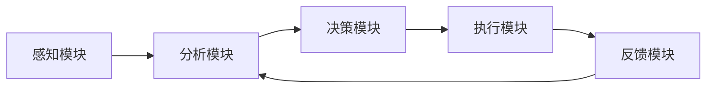
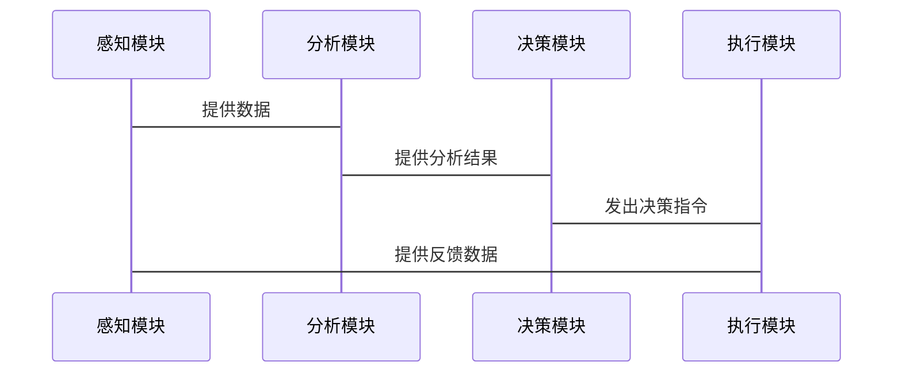

                 


# AI Agent在企业风险评估中的应用

## 关键词
- AI Agent（人工智能代理）
- 企业风险评估
- 机器学习
- 深度学习
- 风险预测
- 系统架构

## 摘要
本文详细探讨了AI Agent在企业风险评估中的应用，从基础概念到核心算法，再到系统架构和实际案例，全面解析了AI Agent如何提升企业风险评估的效率和准确性。通过结合机器学习、深度学习和自然语言处理等技术，AI Agent能够帮助企业识别潜在风险，优化决策过程，从而在复杂多变的商业环境中保持竞争优势。

---

## 第一部分: AI Agent与企业风险评估的背景介绍

## 第1章: AI Agent与企业风险评估概述

### 1.1 AI Agent的基本概念

#### 1.1.1 AI Agent的定义
AI Agent（人工智能代理）是一种能够感知环境、自主决策并执行任务的智能实体。它通过传感器获取信息，利用算法处理数据，并通过执行器采取行动，以实现特定目标。

$$
\text{AI Agent的定义：一种智能实体，具备感知、决策和执行能力。}
$$

#### 1.1.2 AI Agent的核心特征
- **自主性**：能够在没有外部干预的情况下独立运行。
- **反应性**：能够实时感知环境变化并做出响应。
- **目标导向性**：以特定目标为导向，优化决策过程。
- **学习能力**：通过数据和经验不断优化自身性能。

| 特征 | 描述 |
|------|------|
| 自主性 | 独立运行，无需外部干预 |
| 反应性 | 实时感知环境变化并响应 |
| 目标导向性 | 以特定目标为导向，优化决策 |
| 学习能力 | 通过数据和经验优化性能 |

#### 1.1.3 AI Agent与传统风险评估方法的区别
传统的风险评估方法依赖于人工分析和统计模型，而AI Agent结合了人工智能技术，能够实现自动化、实时化和智能化的风险评估。

### 1.2 企业风险评估的背景与挑战

#### 1.2.1 企业风险评估的定义
企业风险评估是通过分析潜在的威胁和机会，评估其对企业目标的影响，并制定相应的应对策略的过程。

#### 1.2.2 传统风险评估方法的局限性
- **效率低下**：依赖人工分析，耗时且成本高。
- **准确性有限**：传统统计模型难以捕捉复杂的风险因素。
- **实时性不足**：无法实时跟踪和评估风险变化。

#### 1.2.3 现代企业风险评估的需求与趋势
- **自动化**：利用技术实现风险评估的自动化。
- **智能化**：通过AI技术提升风险预测的准确性和效率。
- **实时化**：实时监控和评估风险变化。

### 1.3 AI Agent在企业风险评估中的作用

#### 1.3.1 AI Agent如何提升风险评估效率
AI Agent能够自动化数据收集、分析和预测，显著提高风险评估的效率。

#### 1.3.2 AI Agent在风险预测中的优势
- **高准确性**：通过机器学习和深度学习模型，AI Agent能够捕捉复杂的模式和关系。
- **实时性**：能够实时监控和评估风险变化。

#### 1.3.3 AI Agent在企业风险管理中的应用场景
- **财务风险管理**：预测财务风险，优化资金分配。
- **市场风险管理**：预测市场波动，制定投资策略。
- **运营风险管理**：优化企业运营流程，降低风险。

### 1.4 本章小结
本章介绍了AI Agent的基本概念、企业风险评估的背景与挑战，以及AI Agent在企业风险评估中的作用。通过对比传统方法和现代方法的优劣，明确了AI Agent在风险评估中的优势和应用场景。

---

## 第二部分: AI Agent的核心概念与原理

## 第2章: AI Agent的核心概念与原理

### 2.1 AI Agent的结构与功能

#### 2.1.1 AI Agent的组成模块
- **感知模块**：通过传感器或数据源获取信息。
- **分析模块**：利用算法对数据进行分析和处理。
- **决策模块**：基于分析结果做出决策。
- **执行模块**：根据决策采取行动。

#### 2.1.2 各模块的功能与交互关系
感知模块负责数据的输入，分析模块负责数据的处理，决策模块负责制定策略，执行模块负责执行决策。各模块之间通过数据流和控制流进行交互。


### 2.2 AI Agent的风险评估流程

#### 2.2.1 数据采集与预处理
- **数据源**：包括企业内部数据、外部市场数据、历史数据等。
- **数据清洗**：去除噪声数据，确保数据质量。
- **数据特征提取**：提取关键特征，为后续分析做准备。

#### 2.2.2 风险识别与分析
- **风险识别**：通过数据分析识别潜在风险。
- **风险分析**：利用算法对风险进行量化分析。

#### 2.2.3 风险预测与评估
- **风险预测**：基于机器学习模型预测风险发生的概率。
- **风险评估**：评估风险的影响程度和可能性。

### 2.3 AI Agent的核心算法与模型

#### 2.3.1 机器学习算法在风险评估中的应用
- **监督学习**：用于风险分类和回归分析。
- **非监督学习**：用于风险聚类和异常检测。

#### 2.3.2 深度学习模型在风险预测中的作用
- **神经网络**：用于复杂模式的识别和预测。
- **循环神经网络（RNN）**：用于时间序列数据分析。

#### 2.3.3 自然语言处理在风险文本分析中的应用
- **文本挖掘**：从文本数据中提取信息。
- **情感分析**：分析文本中的情感倾向。

### 2.4 AI Agent的决策机制

#### 2.4.1 多目标优化在风险评估中的应用
- **多目标优化**：在多个目标之间找到最优平衡。

#### 2.4.2 基于概率论的风险决策模型
- **贝叶斯网络**：用于概率推理和决策。

#### 2.4.3 风险优先级排序与决策支持
- **风险优先级排序**：根据风险的影响和可能性进行排序。
- **决策支持**：基于排序结果提供决策建议。

### 2.5 本章小结
本章详细介绍了AI Agent的结构与功能、风险评估流程、核心算法与模型，以及决策机制。通过结合机器学习、深度学习和自然语言处理技术，AI Agent能够实现智能化的风险评估和决策支持。

---

## 第三部分: AI Agent的风险评估算法原理

## 第3章: 基于机器学习的风险评估算法

### 3.1 机器学习在风险评估中的应用

#### 3.1.1 监督学习在风险分类中的应用
- **逻辑回归**：用于二分类问题。
- **支持向量机（SVM）**：用于高维数据的分类。

#### 3.1.2 非监督学习在风险聚类中的应用
- **K-means**：用于聚类分析。

### 3.2 基于深度学习的风险预测算法

#### 3.2.1 神经网络模型
- **多层感知机（MLP）**：用于分类和回归任务。
- **卷积神经网络（CNN）**：用于图像数据的处理。

#### 3.2.2 循环神经网络（RNN）在时间序列分析中的应用
- **LSTM**：用于时间序列数据分析。

### 3.3 基于概率论的风险评估模型

#### 3.3.1 贝叶斯网络
- **贝叶斯网络**：用于概率推理和决策。

### 3.4 本章小结
本章介绍了机器学习和深度学习在风险评估中的应用，包括监督学习、非监督学习、神经网络和贝叶斯网络等算法。通过这些算法，AI Agent能够实现高精度的风险预测和评估。

---

## 第四部分: AI Agent系统架构与设计

## 第4章: AI Agent系统架构设计

### 4.1 系统模块划分

#### 4.1.1 感知模块
- **数据采集**：通过API或数据库获取数据。
- **数据预处理**：清洗和特征提取。

#### 4.1.2 分析模块
- **模型训练**：基于训练数据训练机器学习模型。
- **风险识别**：利用模型识别潜在风险。

#### 4.1.3 决策模块
- **风险评估**：评估风险的影响和可能性。
- **决策制定**：基于评估结果制定决策。

#### 4.1.4 执行模块
- **行动执行**：根据决策采取行动。
- **反馈收集**：收集反馈数据，优化模型。

### 4.2 系统架构图



### 4.3 系统交互流程

#### 4.3.1 数据采集与预处理


### 4.4 系统功能设计

#### 4.4.1 风险识别与分析
- **数据采集**：通过API或数据库获取数据。
- **数据预处理**：清洗和特征提取。
- **风险识别**：利用机器学习模型识别潜在风险。

#### 4.4.2 风险预测与评估
- **模型训练**：基于训练数据训练机器学习模型。
- **风险预测**：利用模型预测风险发生的概率。
- **风险评估**：评估风险的影响和可能性。

### 4.5 系统架构优化

#### 4.5.1 分布式架构
- **数据层**：分布式存储和处理数据。
- **计算层**：分布式计算和模型训练。
- **应用层**：提供用户接口和决策支持。

### 4.6 本章小结
本章详细介绍了AI Agent系统的架构设计，包括模块划分、系统架构图、系统交互流程和系统功能设计。通过分布式架构和高效的模块设计，AI Agent系统能够实现高效的風險評估和决策支持。

---

## 第五部分: 项目实战与最佳实践

## 第5章: 项目实战

### 5.1 项目背景与目标

#### 5.1.1 项目背景
- **行业背景**：选择一个具体的行业，例如金融行业。
- **项目目标**：实现一个基于AI Agent的企业风险评估系统。

### 5.2 环境安装与配置

#### 5.2.1 环境要求
- **操作系统**：Windows/Mac/Linux。
- **编程语言**：Python 3.6+。
- **框架与库**：TensorFlow/PyTorch、Scikit-learn、Pandas等。

#### 5.2.2 安装步骤
```bash
pip install numpy
pip install pandas
pip install scikit-learn
pip install tensorflow
```

### 5.3 数据收集与预处理

#### 5.3.1 数据来源
- **内部数据**：企业财务数据、运营数据等。
- **外部数据**：市场数据、行业报告等。

#### 5.3.2 数据清洗
```python
import pandas as pd
data = pd.read_csv('data.csv')
# 删除缺失值
data = data.dropna()
# 去重
data = data.drop_duplicates()
```

### 5.4 模型训练与实现

#### 5.4.1 模型选择
- **监督学习模型**：逻辑回归、SVM。
- **深度学习模型**：LSTM。

#### 5.4.2 模型训练
```python
from sklearn.model_selection import train_test_split
from sklearn.linear_model import LogisticRegression

X_train, X_test, y_train, y_test = train_test_split(X, y, test_size=0.2)
model = LogisticRegression()
model.fit(X_train, y_train)
```

### 5.5 模型评估与优化

#### 5.5.1 模型评估
```python
from sklearn.metrics import accuracy_score

y_pred = model.predict(X_test)
print(accuracy_score(y_test, y_pred))
```

#### 5.5.2 模型优化
- **超参数调优**：使用网格搜索优化模型。
- **模型集成**：结合多种模型提升性能。

### 5.6 系统实现与部署

#### 5.6.1 系统实现
- **前端界面**：用户输入数据，系统显示风险评估结果。
- **后端逻辑**：接收数据，调用模型进行评估，返回结果。

#### 5.6.2 系统部署
- **本地部署**：将系统部署到服务器。
- **云部署**：将系统部署到云平台。

### 5.7 项目小结
本章通过一个实际项目展示了AI Agent在企业风险评估中的应用，从环境安装到模型训练，再到系统部署，详细介绍了项目的实现过程。

---

## 第六部分: 最佳实践与总结

## 第6章: 最佳实践与总结

### 6.1 最佳实践

#### 6.1.1 数据质量管理
- **数据清洗**：确保数据质量。
- **数据标注**：准确标注数据。

#### 6.1.2 模型选择与优化
- **模型选择**：根据任务选择合适的模型。
- **模型优化**：通过调优提升性能。

#### 6.1.3 系统架构设计
- **模块化设计**：提高系统的可维护性和扩展性。
- **分布式架构**：提升系统的性能和可靠性。

### 6.2 项目总结

#### 6.2.1 项目成果
- **实现了基于AI Agent的企业风险评估系统**。
- **提高了风险评估的效率和准确性**。

#### 6.2.2 经验与教训
- **数据质量对模型性能的影响**。
- **模型选择与优化的重要性**。

### 6.3 未来展望

#### 6.3.1 技术发展
- **AI Agent技术的进一步发展**。
- **更多行业的应用**。

#### 6.3.2 挑战与机遇
- **技术挑战**：模型的复杂性和计算资源的需求。
- **市场机会**：AI Agent技术在企业风险管理中的广泛应用。

### 6.4 本章小结
本章总结了项目实施的最佳实践，回顾了项目的成果和经验，并展望了未来的发展方向。通过不断优化和技术进步，AI Agent在企业风险评估中的应用将更加广泛和深入。

---

## 参考文献

1. 书籍或论文参考文献
2. 网站或技术文档参考
3. 其他相关资料

---

通过以上目录大纲，我们可以看到《AI Agent在企业风险评估中的应用》一书内容丰富，涵盖了从理论到实践的各个方面，帮助读者全面理解和掌握AI Agent在企业风险评估中的应用。

