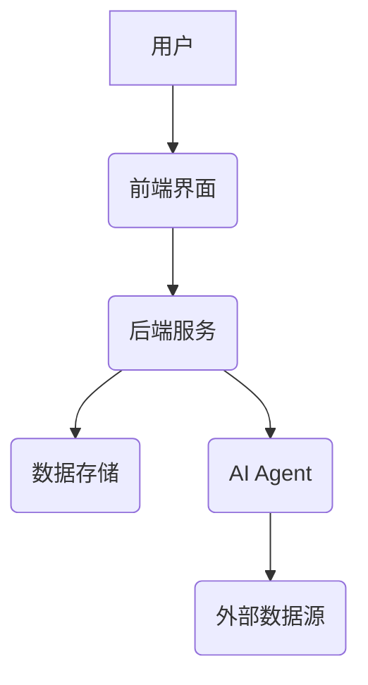
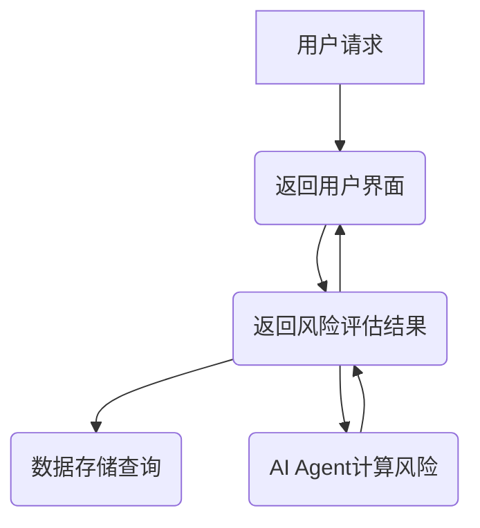
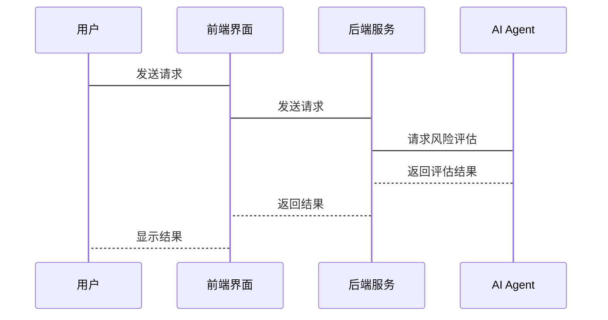
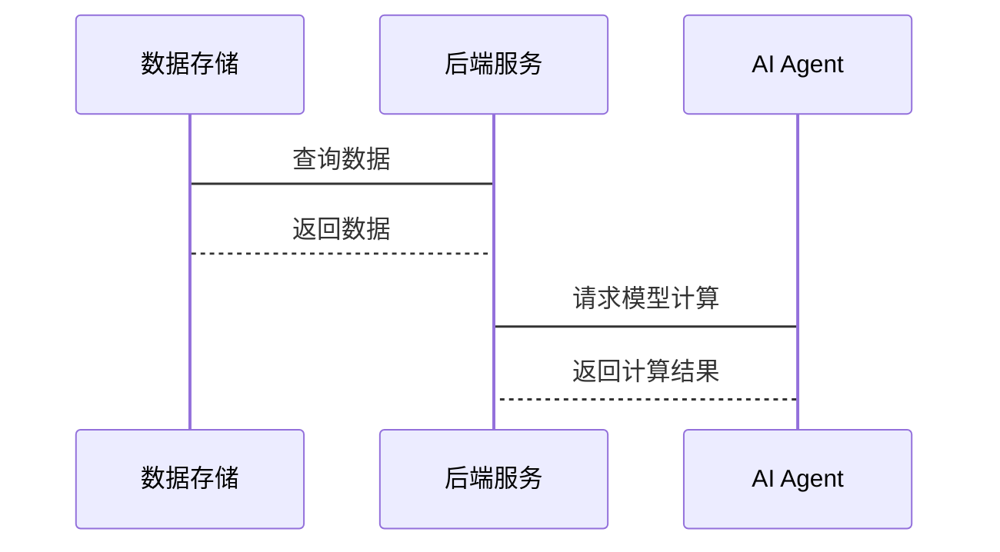

                 


# {{AI Agent在企业风险预测与动态管理中的应用}}

> 关键词：AI Agent, 风险预测, 动态管理, 企业风险管理, 人工智能, 风险模型

> 摘要：本文将详细探讨AI Agent在企业风险预测与动态管理中的应用。通过分析AI Agent的基本原理、技术特点以及其在风险管理中的具体应用场景，本文旨在为企业提供一种高效、智能的风险管理解决方案。我们还将介绍基于AI Agent的风险预测模型，并结合实际案例，详细讲解系统的架构设计与实现。通过本文，读者将能够全面理解AI Agent在企业风险管理中的重要作用，并掌握如何利用AI技术提升企业的风险预测与动态管理能力。

---

# 第一部分: AI Agent与企业风险管理概述

## 第1章: AI Agent与企业风险管理的背景

### 1.1 企业风险管理的基本概念
#### 1.1.1 企业风险管理的定义与范围
企业风险管理（Enterprise Risk Management，ERM）是指通过识别、评估、分析和应对各种可能影响企业目标实现的不确定性因素，从而优化企业决策、降低风险敞口的过程。

- 风险管理的范围包括财务风险、市场风险、操作风险、法律风险、声誉风险等。
- 企业风险管理的目标是确保企业在不确定环境下的稳健发展。

#### 1.1.2 风险管理在企业中的重要性
- 企业风险管理是企业战略制定和执行的核心支撑。
- 有效的风险管理能够帮助企业识别潜在风险，避免重大损失。
- 风险管理是企业合规经营的重要保障。

#### 1.1.3 传统风险管理方法的局限性
- 传统风险管理方法通常基于经验和静态数据，难以应对快速变化的市场环境。
- 传统方法缺乏实时性，难以实现风险的动态管理。
- 传统方法的效率较低，难以处理海量数据。

### 1.2 AI Agent的基本概念与特点
#### 1.2.1 AI Agent的定义与分类
- AI Agent（人工智能代理）是指具有感知环境、自主决策和执行任务能力的智能实体。
- AI Agent可以分为简单反射型代理、基于模型的反射型代理、目标驱动型代理和效用驱动型代理。

#### 1.2.2 AI Agent的核心技术与优势
- AI Agent的核心技术包括知识表示与推理、感知与决策、行为与交互。
- AI Agent的优势在于其智能化、自主化和适应性。

#### 1.2.3 AI Agent在企业中的应用场景
- AI Agent可以应用于企业风险预测、动态管理、决策支持等领域。

### 1.3 本章小结
本章介绍了企业风险管理的基本概念、重要性及其传统方法的局限性，同时详细讲解了AI Agent的基本概念、核心技术与在企业中的应用场景。通过本章，读者可以理解AI Agent在企业风险管理中的潜在价值。

---

# 第二部分: AI Agent的理论基础

## 第2章: AI Agent的原理与技术

### 2.1 AI Agent的基本原理
#### 2.1.1 知识表示与推理
- 知识表示是将现实世界中的信息转化为计算机可理解的形式。
- 推理是通过逻辑推理或概率推理，从已知信息中推导出新的结论。

#### 2.1.2 感知与决策
- 感知是指AI Agent通过传感器或数据输入接口获取环境信息。
- 决策是基于感知信息和内部知识库，选择最优行动方案。

#### 2.1.3 行为与交互
- 行为是指AI Agent根据决策结果执行具体操作。
- 交互是指AI Agent与外部环境或其他智能体之间的信息交换。

### 2.2 AI Agent的核心技术
#### 2.2.1 机器学习与深度学习
- 机器学习是通过数据训练模型，使其能够从经验中学习。
- 深度学习是基于人工神经网络的机器学习方法，能够处理复杂的数据模式。

#### 2.2.2 自然语言处理
- 自然语言处理（NLP）是使计算机能够理解、生成人类语言的技术。
- NLP在风险报告生成、文本分析等领域具有重要应用。

#### 2.2.3 计算机视觉
- 计算机视觉是使计算机能够理解图像或视频内容的技术。
- 计算机视觉在企业风险管理中的应用包括图像识别、视频监控等。

### 2.3 AI Agent与企业风险管理的结合
#### 2.3.1 AI Agent在风险识别中的应用
- AI Agent可以通过分析企业内外部数据，识别潜在风险因素。
- 示例：通过NLP技术分析新闻报道，识别市场风险。

#### 2.3.2 AI Agent在风险评估中的应用
- AI Agent可以利用机器学习模型评估风险的严重性和发生概率。
- 示例：通过时间序列分析预测市场波动风险。

#### 2.3.3 AI Agent在风险应对中的应用
- AI Agent可以根据风险评估结果，制定风险应对策略。
- 示例：自动调整投资组合以分散风险。

### 2.4 本章小结
本章详细讲解了AI Agent的基本原理及其核心技术，并探讨了AI Agent在企业风险管理中的具体应用。通过本章，读者可以理解AI Agent在企业风险管理中的技术基础和实现方式。

---

# 第三部分: 企业风险预测的AI Agent模型

## 第3章: 企业风险预测的理论与模型

### 3.1 企业风险预测的理论基础
#### 3.1.1 风险预测的基本原理
- 风险预测是通过分析历史数据和当前信息，预测未来可能发生的风险事件。
- 风险预测的关键在于建立合理的数学模型和选择合适的数据特征。

#### 3.1.2 风险预测的关键因素
- 市场因素：包括经济指标、行业趋势等。
- 公司因素：包括财务状况、管理能力等。
- 环境因素：包括政策变化、自然灾害等。

#### 3.1.3 风险预测的数学模型
- 线性回归模型：用于预测连续型风险指标。
- 支持向量机（SVM）：用于分类问题。
- 随机森林：用于非线性关系的建模。

### 3.2 基于AI Agent的风险预测模型
#### 3.2.1 模型的构建与训练
- 数据预处理：包括数据清洗、特征选择和数据增强。
- 模型训练：使用机器学习算法训练风险预测模型。

#### 3.2.2 模型的评估与优化
- 评估指标：包括准确率、召回率、F1分数等。
- 模型优化：通过调整超参数和优化算法提升模型性能。

#### 3.2.3 模型的实际应用案例
- 案例分析：假设某企业使用AI Agent预测财务风险。
- 数据来源：包括财务报表、市场数据、行业报告等。
- 模型输出：生成风险评分和应对建议。

### 3.3 本章小结
本章介绍了企业风险预测的理论基础，详细讲解了基于AI Agent的风险预测模型的构建与应用。通过实际案例分析，读者可以理解如何利用AI技术提升企业的风险预测能力。

---

# 第四部分: 企业风险动态管理的系统架构

## 第4章: 企业风险动态管理的系统设计

### 4.1 系统功能设计
#### 4.1.1 风险识别模块
- 功能：通过数据采集和分析，识别潜在风险因素。
- 示例：实时监控市场新闻，识别市场风险。

#### 4.1.2 风险评估模块
- 功能：评估风险的严重性和发生概率。
- 示例：使用时间序列模型预测市场波动。

#### 4.1.3 风险应对模块
- 功能：制定风险应对策略并执行。
- 示例：自动调整投资组合以分散风险。

### 4.2 系统架构设计
#### 4.2.1 系统整体架构图


#### 4.2.2 模块间的交互关系


### 4.3 系统接口设计
#### 4.3.1 API接口定义
- 输入：用户请求参数。
- 输出：系统处理结果。

#### 4.3.2 接口的调用流程
- 用户发送请求 --> 系统处理 --> 返回结果。

### 4.4 系统交互设计
#### 4.4.1 用户与系统的交互流程


#### 4.4.2 系统内部模块的交互流程


### 4.5 本章小结
本章详细讲解了企业风险动态管理系统的功能设计、架构设计和交互设计。通过系统架构图和交互流程图，读者可以清晰理解系统的整体结构和工作流程。

---

# 第五部分: 项目实战

## 第5章: 项目实战与经验分享

### 5.1 环境安装与配置
- 安装Python、机器学习库（如Scikit-learn、XGBoost）和深度学习框架（如TensorFlow、PyTorch）。
- 安装NLP库（如NLTK、spaCy）和计算机视觉库（如OpenCV）。

### 5.2 系统核心实现源代码
#### 5.2.1 风险预测模型实现
```python
import numpy as np
from sklearn.ensemble import RandomForestClassifier

# 示例数据
X = np.array([[feature1, feature2, feature3], ...])
y = np.array([label1, label2, ...])

# 模型训练
model = RandomForestClassifier()
model.fit(X, y)

# 预测
new_X = np.array([[new_feature1, new_feature2, new_feature3], ...])
prediction = model.predict(new_X)
print(prediction)
```

#### 5.2.2 系统交互实现
```python
# 示例API接口实现
from flask import Flask
from flask_restful import Resource, Api

app = Flask(__name__)
api = Api(app)

class RiskPrediction(Resource):
    def post(self):
        # 获取输入
        data = request.get_json()
        # 调用AI Agent进行预测
        result = ai_agent.predict(data)
        return result

api.add_resource(RiskPrediction, '/predict')

if __name__ == '__main__':
    app.run(debug=True)
```

### 5.3 代码应用解读与分析
- 风险预测模型代码解读：上述代码实现了基于随机森林的分类模型，用于预测风险事件的发生概率。
- 系统交互代码解读：上述代码实现了基于Flask的API接口，用于接收用户请求并返回预测结果。

### 5.4 实际案例分析
- 案例背景：某企业希望利用AI Agent预测财务风险。
- 数据来源：财务报表、市场数据、行业报告等。
- 预测结果：生成风险评分和应对建议。

### 5.5 项目小结
通过本章的项目实战，读者可以掌握如何利用AI Agent实现企业风险预测与动态管理。通过实际案例分析，读者可以理解理论知识在实践中的具体应用。

---

# 第六部分: 最佳实践与总结

## 第6章: 最佳实践与总结

### 6.1 最佳实践
- 数据质量是模型性能的基础，需要重视数据清洗和特征选择。
- 模型的可解释性是企业决策的关键，需要选择合适的模型并提供解释。
- 系统的实时性是动态管理的核心，需要优化系统架构和算法效率。

### 6.2 小结
通过本文的详细讲解，读者可以全面理解AI Agent在企业风险预测与动态管理中的应用。从理论到实践，从模型到系统，本文为读者提供了一套完整的解决方案。

### 6.3 注意事项
- 在实际应用中，需要根据企业实际情况调整模型和系统设计。
- 需要关注数据隐私和合规性问题。
- 需要定期更新模型和优化系统，以适应不断变化的环境。

### 6.4 拓展阅读
- 推荐阅读《机器学习实战》、《深度学习》等书籍。
- 参加相关技术会议和在线课程，进一步提升技术水平。

---

# 附录: 参考文献与工具清单

## 附录A: 参考文献
- Bishop, C. M. (2006). Pattern Recognition and Machine Learning.
- Goodfellow, I., Bengio, Y., & Courville, A. (2016). Deep Learning.
- Russell, S., & Norvig, P. (2010). Artificial Intelligence: A Modern Approach.

## 附录B: 工具清单
- Python
- Scikit-learn
- TensorFlow
- Flask
- Mermaid
- Jupyter Notebook

---

通过本文的系统讲解和实战分析，读者可以全面掌握AI Agent在企业风险预测与动态管理中的应用，并能够将其应用于实际工作中。希望本文对读者有所帮助，如有问题，欢迎随时交流。

