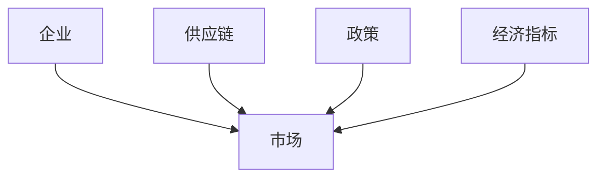
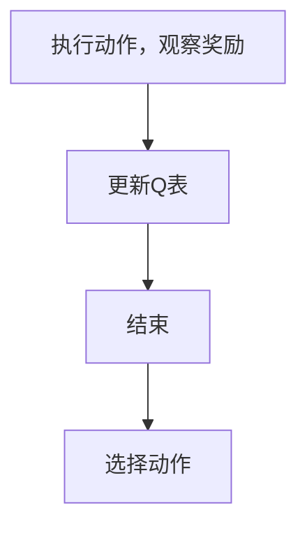
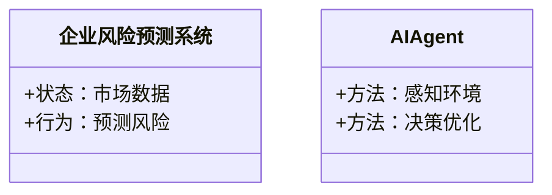
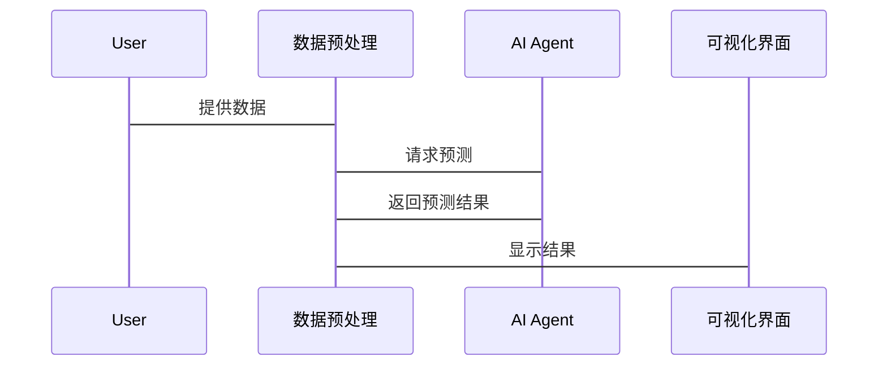

                 


# AI Agent在企业风险预测与情景模拟中的前沿应用

## 关键词：AI Agent，风险预测，情景模拟，企业应用，强化学习，系统架构

## 摘要：本文深入探讨AI Agent在企业风险预测与情景模拟中的前沿应用。通过分析AI Agent的核心概念、算法原理、系统架构，并结合实际案例，展示其在企业中的价值和未来发展方向。

---

## 第1章: AI Agent概述与背景

### 1.1 问题背景

#### 1.1.1 企业风险预测的挑战
企业面临复杂的内外部风险，如市场波动、供应链中断和政策变化。传统的统计模型和规则-based系统在处理动态和复杂问题时表现有限，难以实时响应和预测。

#### 1.1.2 情景模拟的重要性
情景模拟帮助企业预测不同策略下的结果，支持决策者制定应对策略。然而，传统方法难以处理多变量和动态变化的环境。

#### 1.1.3 AI Agent的引入及其优势
AI Agent具备实时感知、自主决策和学习能力，能够有效应对复杂和动态的环境，提供实时反馈和优化建议。

### 1.2 问题描述

#### 1.2.1 传统风险预测的局限性
传统方法依赖固定规则，缺乏灵活性和适应性，难以处理复杂场景。

#### 1.2.2 情景模拟中的不确定性
不确定性高，传统模型难以捕捉所有变量，导致预测不准确。

#### 1.2.3 AI Agent在动态环境中的应用
AI Agent能够实时处理动态数据，提供动态预测和优化策略。

### 1.3 问题解决与边界

#### 1.3.1 AI Agent的核心解决方法
通过强化学习和协作算法，AI Agent能够实时学习和优化决策。

#### 1.3.2 应用边界与外延
AI Agent适用于实时性要求高、动态变化的环境，但需与现有系统集成，解决边界问题。

#### 1.3.3 核心要素与组成结构
AI Agent包括感知、决策、执行和学习模块，具备多智能体协作能力。

---

## 第2章: AI Agent的核心概念与联系

### 2.1 核心概念原理

#### 2.1.1 AI Agent的基本原理
AI Agent通过感知环境、生成策略、执行操作和学习优化，实现目标。

#### 2.1.2 多智能体系统（MAS）的结构
MAS由多个智能体组成，通过协作和竞争实现系统目标。

#### 2.1.3 强化学习与策略网络
强化学习通过奖励机制优化决策，策略网络生成最优策略。

### 2.2 核心概念对比

#### 2.2.1 AI Agent与机器学习模型的对比
| 特性 | AI Agent | 机器学习模型 |
|------|-----------|--------------|
| 任务 | 实时决策   | 数据预测     |
| 学习 | 强化学习   | 监督/无监督  |
| 应用 | 动态环境   | 静态数据     |

#### 2.2.2 ER实体关系图


---

## 第3章: AI Agent的算法原理

### 3.1 算法原理讲解

#### 3.1.1 强化学习算法（Q-learning）
Q-learning通过更新Q值表，学习最优策略。

#### 3.1.2 多智能体协作算法
多智能体协作通过通信和协调，优化整体性能。

#### 3.1.3 策略网络与值函数网络
策略网络直接输出动作，值函数评估状态价值。

### 3.2 算法流程图

#### 3.2.1 Q-learning算法


#### 3.2.2 Python实现
```python
import numpy as np

class QAgent:
    def __init__(self, state_space, action_space):
        self.state_space = state_space
        self.action_space = action_space
        self.q_table = np.zeros((state_space, action_space))
        self.alpha = 0.1
        self.gamma = 0.9

    def choose_action(self, state):
        return np.argmax(self.q_table[state])

    def learn(self, state, action, reward, next_state):
        self.q_table[state, action] += self.alpha * (reward + self.gamma * np.max(self.q_table[next_state]) - self.q_table[state, action])
```

---

## 第4章: 系统分析与架构设计

### 4.1 问题场景介绍

#### 4.1.1 企业风险预测系统
实时监控市场、供应链和政策变化，预测潜在风险。

### 4.2 系统功能设计

#### 4.2.1 领域模型


### 4.3 系统架构设计

#### 4.3.1 整体架构


### 4.4 系统接口与交互

#### 4.4.1 交互流程


---

## 第5章: 项目实战与案例分析

### 5.1 项目环境安装

#### 5.1.1 安装Python和库
```bash
pip install numpy matplotlib
```

### 5.2 核心代码实现

#### 5.2.1 Q-learning实现
```python
def update_q_table(q_table, state, action, reward, next_state, alpha=0.1, gamma=0.9):
    q_table[state, action] += alpha * (reward + gamma * np.max(q_table[next_state]) - q_table[state, action])
```

### 5.3 案例分析

#### 5.3.1 企业风险预测
AI Agent实时分析市场数据，预测潜在风险，并提供应对策略。

---

## 第6章: 最佳实践与总结

### 6.1 小结
AI Agent在企业风险预测和情景模拟中具备实时性、动态性和智能性优势。

### 6.2 注意事项
数据质量和模型调参影响性能，需持续优化。

### 6.3 拓展阅读
推荐学习强化学习和多智能体协作，探索更复杂的应用场景。

---

通过以上章节的详细讲解，读者可以全面理解AI Agent在企业中的应用，并掌握其核心技术和实现方法。

