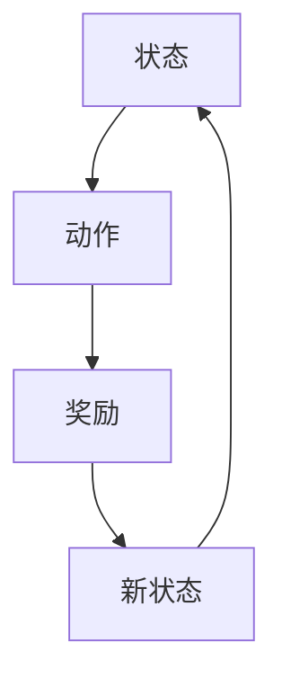
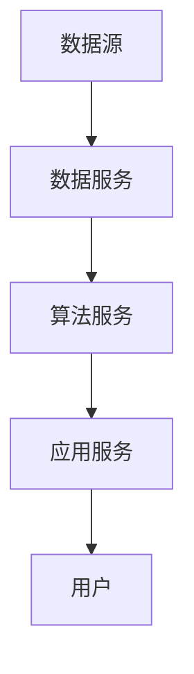

                 


# AI Agent在企业风险预测与情景模拟中的应用

## 关键词
AI Agent, 企业风险预测, 情景模拟, 强化学习, 风险管理, 人工智能

## 摘要
本文深入探讨了AI Agent在企业风险预测与情景模拟中的应用，从理论基础到实际案例，详细分析了AI Agent在企业风险管理中的核心作用。文章首先介绍了AI Agent的基本概念及其在企业风险预测中的优势，接着从算法原理、系统架构、项目实战等多个维度详细阐述了AI Agent在风险预测与情景模拟中的具体应用。最后，本文还总结了AI Agent在企业风险管理中的最佳实践和未来发展方向。

---

# 第1章 AI Agent与企业风险预测概述

## 1.1 AI Agent的基本概念

### 1.1.1 AI Agent的定义
AI Agent（人工智能代理）是指能够感知环境、自主决策并采取行动的智能实体。它通过传感器获取信息，利用算法进行分析，并通过执行器与环境交互。AI Agent的核心目标是通过优化目标函数，实现对环境的最优控制。

### 1.1.2 AI Agent的核心特点
- **自主性**：AI Agent能够自主决策，无需人工干预。
- **反应性**：能够实时感知环境变化并做出反应。
- **学习能力**：通过强化学习等方法不断优化自身策略。
- **适应性**：能够根据环境变化调整行为。

### 1.1.3 AI Agent与传统数据分析的区别
| 特性                | AI Agent                         | 传统数据分析         |
|---------------------|----------------------------------|----------------------|
| 决策能力            | 具备自主决策能力                | 依赖人工分析         |
| 适应性              | 能够实时调整策略                | 需要重新建模         |
| 数据处理能力        | 能够处理非结构化数据            | 主要处理结构化数据    |

## 1.2 企业风险预测的背景与挑战

### 1.2.1 企业风险预测的定义
企业风险预测是指通过分析历史数据和当前环境，预测未来可能出现的不利事件，并采取相应的防范措施。

### 1.2.2 传统风险预测方法的局限性
- **数据依赖性**：传统方法依赖于历史数据，无法预测新的未知风险。
- **计算复杂性**：处理大规模数据时计算效率低。
- **静态性**：无法实时更新模型。

### 1.2.3 AI Agent在风险预测中的优势
- **实时性**：能够实时感知环境变化并进行预测。
- **自适应性**：能够根据环境变化调整预测模型。
- **决策能力**：能够在复杂环境中做出最优决策。

## 1.3 情景模拟在企业决策中的作用

### 1.3.1 情景模拟的定义
情景模拟是指通过构建虚拟环境，模拟不同条件下的企业行为和结果，以帮助决策者制定更优策略。

### 1.3.2 情景模拟的应用场景
- **市场预测**：模拟市场变化对企业的影响。
- **供应链管理**：模拟供应链中断的风险。
- **企业战略**：模拟不同战略对企业绩效的影响。

### 1.3.3 AI Agent在情景模拟中的应用前景
AI Agent能够通过强化学习不断优化情景模拟的准确性，并能够在模拟过程中实时调整策略。

---

# 第2章 AI Agent的核心概念与原理

## 2.1 AI Agent的核心概念

### 2.1.1 状态空间与动作空间
- **状态空间**：AI Agent所处环境的所有可能状态的集合。
- **动作空间**：AI Agent在每个状态下可以执行的所有动作的集合。

### 2.1.2 策略与价值函数
- **策略**：AI Agent在给定状态下选择动作的概率分布。
- **价值函数**：衡量某个状态下采取某个动作的价值。

### 2.1.3 探索与利用的平衡
AI Agent需要在探索新策略和利用已知策略之间找到平衡，以最大化长期收益。

## 2.2 AI Agent的算法原理

### 2.2.1 强化学习的基本原理
强化学习是一种通过试错学习的算法，AI Agent通过与环境交互，逐步优化策略以最大化累计奖励。

### 2.2.2 Q-learning算法
Q-learning是一种经典的强化学习算法，通过更新Q值表来优化策略。



### 2.2.3 深度强化学习的原理
深度强化学习结合了深度学习和强化学习的优势，能够处理高维状态空间和动作空间。

---

# 第3章 AI Agent在企业风险预测中的应用

## 3.1 风险预测的基本流程

### 3.1.1 数据收集与预处理
- **数据收集**：从企业内部系统和外部数据源获取数据。
- **数据清洗**：去除噪声数据，处理缺失值。
- **数据转换**：将数据转换为模型可接受的格式。

### 3.1.2 风险特征的提取
- **特征选择**：根据业务需求选择关键特征。
- **特征工程**：通过组合和变换特征，提高模型性能。

### 3.1.3 风险模型的构建
- **模型训练**：使用训练数据训练AI Agent的策略。
- **模型验证**：通过验证数据评估模型性能。
- **模型部署**：将模型部署到生产环境，实时进行风险预测。

## 3.2 AI Agent在风险预测中的具体应用

### 3.2.1 金融风险预测
- **应用场景**：股票价格预测、信用风险评估。
- **算法选择**：使用深度强化学习模型进行预测。

### 3.2.2 供应链风险预测
- **应用场景**：预测供应链中断风险。
- **算法选择**：使用强化学习模型优化供应链管理。

### 3.2.3 市场风险预测
- **应用场景**：预测市场需求变化。
- **算法选择**：使用强化学习模型进行市场预测。

---

# 第4章 AI Agent在情景模拟中的应用

## 4.1 情景模拟的基本流程

### 4.1.1 情景构建与初始化
- **情景构建**：根据业务需求构建虚拟情景。
- **情景初始化**：设置初始状态和参数。

### 4.1.2 情景驱动与演化
- **情景驱动**：通过AI Agent的决策驱动情景演化。
- **情景演化**：根据决策结果更新情景状态。

### 4.1.3 情景结果的分析与反馈
- **结果分析**：分析情景模拟的结果，提取有用信息。
- **反馈机制**：将模拟结果反馈到模型中，优化AI Agent的策略。

## 4.2 AI Agent在情景模拟中的具体应用

### 4.2.1 市场情景模拟
- **应用场景**：预测市场变化对企业的影响。
- **算法选择**：使用强化学习模型进行市场情景模拟。

### 4.2.2 供应链情景模拟
- **应用场景**：模拟供应链中断对企业的影响。
- **算法选择**：使用强化学习模型优化供应链管理。

### 4.2.3 企业战略情景模拟
- **应用场景**：模拟不同战略对企业绩效的影响。
- **算法选择**：使用强化学习模型进行企业战略情景模拟。

---

# 第5章 系统分析与架构设计方案

## 5.1 系统功能设计

### 5.1.1 风险预测模块
- **功能描述**：实时进行风险预测，提供风险预警。
- **关键功能**：数据采集、特征提取、模型训练、风险预警。

### 5.1.2 情景模拟模块
- **功能描述**：模拟不同情景对企业的影响。
- **关键功能**：情景构建、情景驱动、结果分析。

### 5.1.3 数据管理模块
- **功能描述**：管理企业内外部数据。
- **关键功能**：数据采集、数据清洗、数据存储。

## 5.2 系统架构设计

### 5.2.1 分层架构设计
- **数据层**：负责数据的采集、存储和管理。
- **算法层**：负责AI Agent的算法实现和策略优化。
- **应用层**：负责与用户交互，展示结果。

### 5.2.2 微服务架构设计
- **数据服务**：负责数据的采集、清洗和存储。
- **算法服务**：负责AI Agent的算法实现和策略优化。
- **应用服务**：负责与用户交互，展示结果。

### 5.2.3 数据流与交互设计


---

# 第6章 项目实战与代码实现

## 6.1 环境安装与配置

### 6.1.1 Python环境的安装
- **安装步骤**：安装Python 3.8以上版本，安装pip工具。
- **安装命令**：`python -m pip install --user pip`

### 6.1.2 必需库的安装
- **安装命令**：`pip install numpy pandas tensorflow matplotlib`

## 6.2 代码实现

### 6.2.1 数据预处理
```python
import pandas as pd
import numpy as np

# 加载数据
data = pd.read_csv('data.csv')

# 数据清洗
data = data.dropna()
data = data.drop_duplicates()

# 数据转换
data['label'] = data['label'].astype(int)
```

### 6.2.2 模型训练
```python
import tensorflow as tf
from tensorflow.keras import layers

# 构建模型
model = tf.keras.Sequential([
    layers.Dense(64, activation='relu'),
    layers.Dense(1, activation='sigmoid')
])

# 编译模型
model.compile(optimizer='adam', loss='binary_crossentropy', metrics=['accuracy'])

# 训练模型
model.fit(x_train, y_train, epochs=10, batch_size=32)
```

### 6.2.3 模型预测
```python
# 预测结果
y_pred = model.predict(x_test)

# 输出结果
print(y_pred)
```

---

# 第7章 总结与展望

## 7.1 最佳实践 tips
- **数据质量**：确保数据的准确性和完整性。
- **模型优化**：定期更新模型，优化算法参数。
- **团队协作**：AI Agent的应用需要数据科学家、开发人员和业务分析师的协作。

## 7.2 小结
本文详细探讨了AI Agent在企业风险预测与情景模拟中的应用，从理论到实践，全面分析了AI Agent的优势和实现方法。

## 7.3 注意事项
- **数据隐私**：确保数据的安全性和隐私性。
- **模型解释性**：确保模型的可解释性，便于业务人员理解。

## 7.4 拓展阅读
- **推荐书籍**：《强化学习》、《深度学习》
- **推荐文章**：《强化学习在金融领域的应用》

---

通过本文的学习，读者可以全面了解AI Agent在企业风险预测与情景模拟中的应用，掌握AI Agent的核心概念和算法原理，并能够实际应用这些技术解决企业风险管理中的复杂问题。

