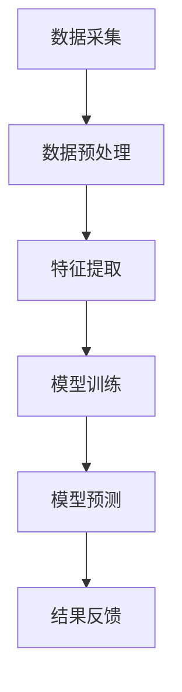
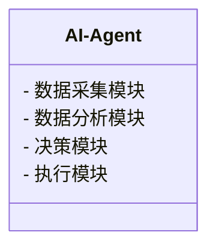
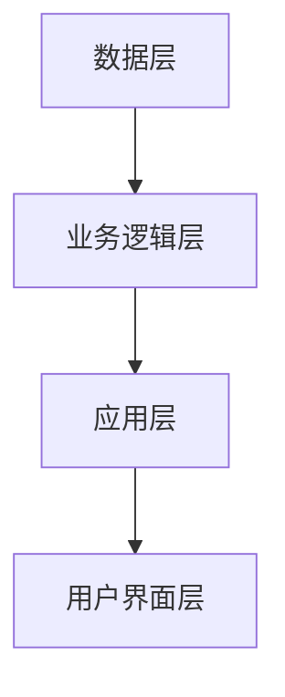
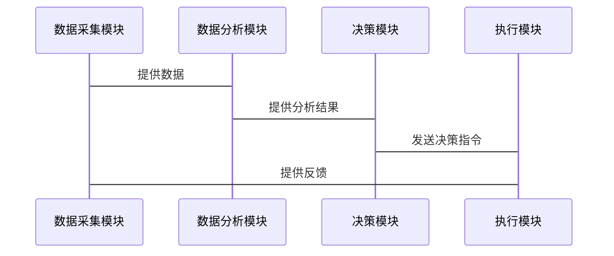

                 


# AI Agent在企业风险预警与危机管理中的应用

## 关键词：
AI Agent, 企业风险预警, 危机管理, 机器学习, 自然语言处理, 系统架构, 实时监控

## 摘要：
本文深入探讨AI Agent在企业风险预警与危机管理中的应用，从AI Agent的基本概念、核心原理到实际应用的系统架构设计，结合具体案例分析，详细阐述了如何利用AI Agent技术提升企业的风险预警能力和危机应对能力。文章内容涵盖背景介绍、核心概念、算法原理、系统架构、项目实战等部分，帮助读者全面理解和掌握AI Agent在企业风险管理中的应用。

---

# 第1章: AI Agent的基本概念与背景介绍

## 1.1 AI Agent的定义与技术基础
### 1.1.1 AI Agent的定义
AI Agent（人工智能代理）是指能够感知环境、自主决策并执行任务的智能实体。它结合了机器学习、自然语言处理、计算机视觉等多种技术，能够实现从数据采集到智能决策的全流程自动化。

### 1.1.2 AI Agent的核心技术基础
- **机器学习**：用于模式识别、分类和预测。
- **自然语言处理**：用于文本分析、情感分析和信息提取。
- **计算机视觉**：用于图像识别和视频监控。
- **知识图谱**：用于构建领域知识库，支持复杂决策。

### 1.1.3 AI Agent与传统软件的区别
| 特性 | 传统软件 | AI Agent |
|------|----------|----------|
| 智能性 | 无智能性  | 高智能性  |
| 学习能力 | 无学习能力 | 有学习能力 |
| 决策能力 | 无决策能力 | 有决策能力 |

## 1.2 企业风险预警与危机管理的背景
### 1.2.1 企业风险的定义与分类
- **风险定义**：可能对企业造成损失的不确定性事件。
- **风险分类**：市场风险、信用风险、操作风险、法律风险等。

### 1.2.2 危机管理的定义与流程
- **危机管理**：通过预防、应对和恢复策略，降低危机对企业的影响。
- **危机管理流程**：监测-评估-应对-恢复。

### 1.2.3 传统风险预警与危机管理的局限性
- **数据孤岛**：信息分散，难以全面分析。
- **反应滞后**：依赖人工判断，无法实时预警。
- **决策片面**：缺乏全局视角，难以制定最优策略。

## 1.3 AI Agent在企业风险预警中的应用潜力
### 1.3.1 AI Agent的优势与特点
- **实时性**：能够实时采集和分析数据。
- **智能性**：能够自主判断风险并制定应对策略。
- **可扩展性**：适用于多种场景和业务。

### 1.3.2 AI Agent在企业风险预警中的应用场景
- **财务风险预警**：通过分析财务数据预测企业破产风险。
- **市场风险预警**：通过市场数据预测市场波动。
- **操作风险预警**：通过监控操作流程发现潜在风险。

### 1.3.3 AI Agent与其他技术的结合
- **大数据技术**：结合大数据分析提高风险预警的准确性。
- **区块链技术**：结合区块链实现数据的安全性和可信性。

## 1.4 本章小结
本章从AI Agent的基本概念入手，分析了其在企业风险预警中的应用潜力，指出了其相较于传统软件的优势和特点。

---

# 第2章: AI Agent的核心概念与原理

## 2.1 AI Agent的感知机制
### 2.1.1 数据采集与处理
- **数据采集**：通过传感器、API接口等方式获取实时数据。
- **数据预处理**：对数据进行清洗、归一化处理，确保数据质量。

### 2.1.2 信息分析与特征提取
- **文本分析**：使用自然语言处理技术提取文本中的关键词和情感信息。
- **图像分析**：使用计算机视觉技术识别图像中的关键特征。

## 2.2 AI Agent的决策机制
### 2.2.1 风险评估模型
- **概率计算**：使用贝叶斯定理计算风险发生的概率。
$$P(risk) = \frac{P(risk|data) \cdot P(data)}{P(data|not risk)}$$

- **影响评估**：通过加权评分法评估风险的影响程度。
$$I(risk) = \sum_{i=1}^{n} w_i \cdot f_i$$

### 2.2.2 危机应对策略
- **应急预案**：根据风险类型制定不同的应对策略。
- **动态调整**：根据实时数据动态调整应对策略。

## 2.3 AI Agent的执行机制
### 2.3.1 系统接口设计
- **API设计**：定义清晰的API接口，支持与其他系统的集成。
- **消息队列**：使用消息队列实现异步任务处理。

### 2.3.2 执行过程与反馈机制
- **任务执行**：根据决策结果执行具体操作。
- **反馈机制**：通过日志和监控数据收集执行结果，不断优化决策模型。

## 2.4 本章小结
本章详细讲解了AI Agent的核心概念与原理，包括感知、决策和执行机制，为后续的系统设计奠定了基础。

---

# 第3章: AI Agent在企业风险预警中的算法原理

## 3.1 风险评估的数学模型
### 3.1.1 风险概率计算公式
$$P(risk) = \frac{事件发生次数}{总样本数}$$

### 3.1.2 风险影响评估公式
$$I(risk) = f(影响因素)$$

## 3.2 基于机器学习的AI Agent算法
### 3.2.1 算法选择
- **监督学习**：用于分类任务，如风险分类。
- **无监督学习**：用于聚类任务，如异常检测。

### 3.2.2 算法实现
#### 3.2.2.1 机器学习模型训练
```python
from sklearn.model_selection import train_test_split
from sklearn.ensemble import RandomForestClassifier

# 数据预处理
X = data.drop('label', axis=1)
y = data['label']

# 划分训练集和测试集
X_train, X_test, y_train, y_test = train_test_split(X, y, test_size=0.2)

# 模型训练
model = RandomForestClassifier()
model.fit(X_train, y_train)

# 模型预测
y_pred = model.predict(X_test)
```

#### 3.2.2.2 模型评估
```python
from sklearn.metrics import accuracy_score, precision_score, recall_score

print(f"Accuracy: {accuracy_score(y_test, y_pred)}")
print(f"Precision: {precision_score(y_test, y_pred)}")
print(f"Recall: {recall_score(y_test, y_pred)}")
```

## 3.3 算法流程图


## 3.4 本章小结
本章详细讲解了AI Agent在风险预警中的算法原理，包括数学模型和机器学习算法的实现，为后续的系统设计提供了技术支持。

---

# 第4章: AI Agent的系统分析与架构设计

## 4.1 系统功能设计
### 4.1.1 领域模型


### 4.1.2 功能模块
- **数据采集模块**：负责采集企业内外部数据。
- **数据分析模块**：负责对数据进行分析和特征提取。
- **决策模块**：负责风险评估和策略制定。
- **执行模块**：负责执行决策并反馈结果。

## 4.2 系统架构设计
### 4.2.1 分层架构


### 4.2.2 模块交互


## 4.3 本章小结
本章详细讲解了AI Agent系统的功能设计和架构设计，为后续的项目实现奠定了基础。

---

# 第5章: AI Agent在企业风险预警中的项目实战

## 5.1 项目背景
### 5.1.1 项目目标
- 实现企业财务风险预警系统。
- 提供实时风险评估和应对策略。

## 5.2 系统实现
### 5.2.1 环境配置
```python
# 安装依赖
pip install pandas numpy scikit-learn matplotlib
```

### 5.2.2 核心代码实现
```python
from sklearn.ensemble import RandomForestClassifier
from sklearn.metrics import accuracy_score
import pandas as pd

# 加载数据
data = pd.read_csv('risk_data.csv')

# 数据预处理
X = data.drop('label', axis=1)
y = data['label']

# 划分训练集和测试集
X_train, X_test, y_train, y_test = train_test_split(X, y, test_size=0.2)

# 模型训练
model = RandomForestClassifier()
model.fit(X_train, y_train)

# 模型预测
y_pred = model.predict(X_test)

# 模型评估
print(f"Accuracy: {accuracy_score(y_test, y_pred)}")
```

### 5.2.3 系统功能实现
- **数据采集**：通过API接口获取企业财务数据。
- **风险评估**：基于机器学习模型进行风险预测。
- **预警触发**：当风险概率超过阈值时，触发预警机制。

## 5.3 项目案例分析
### 5.3.1 案例背景
某企业财务数据异常，存在潜在的破产风险。

### 5.3.2 数据分析
- **数据预处理**：清洗数据，提取关键特征。
- **模型训练**：训练随机森林模型，预测破产概率。

### 5.3.3 结果分析
- **预测结果**：模型预测破产概率为85%。
- **应对策略**：建议企业立即采取财务调整措施。

## 5.4 本章小结
本章通过一个具体的案例，详细讲解了AI Agent在企业风险预警中的实际应用，展示了其在风险评估和应对策略制定中的优势。

---

# 第6章: AI Agent在企业风险预警中的最佳实践与总结

## 6.1 最佳实践
### 6.1.1 数据质量
- 确保数据的完整性和准确性。
### 6.1.2 模型可解释性
- 使用可解释性模型（如决策树）提高模型的透明度。
### 6.1.3 系统可扩展性
- 设计模块化架构，支持功能扩展。

## 6.2 小结
本文从AI Agent的基本概念出发，详细讲解了其在企业风险预警中的应用，包括算法原理、系统架构和项目实战。通过实际案例分析，展示了AI Agent在风险预警中的巨大潜力。

## 6.3 注意事项
- **数据隐私**：确保数据的安全性和隐私性。
- **模型优化**：定期更新模型，提高预测准确率。
- **系统维护**：定期检查系统运行状态，及时修复问题。

## 6.4 拓展阅读
- 《机器学习实战》
- 《深度学习》
- 《自然语言处理入门》

---

# 结语
AI Agent作为一项前沿技术，正在为企业风险预警与危机管理带来革命性的变化。通过本文的详细讲解，读者可以全面了解AI Agent的应用场景和技术实现，为企业风险管理提供新的思路和解决方案。

