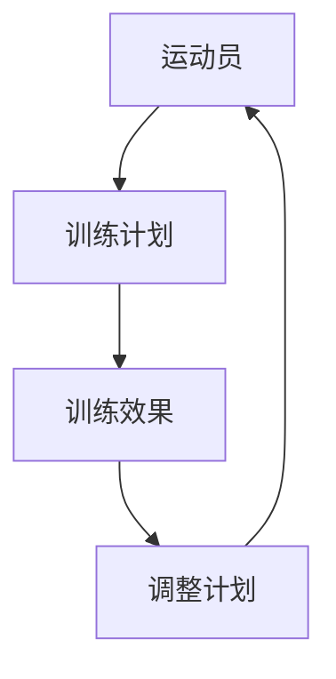
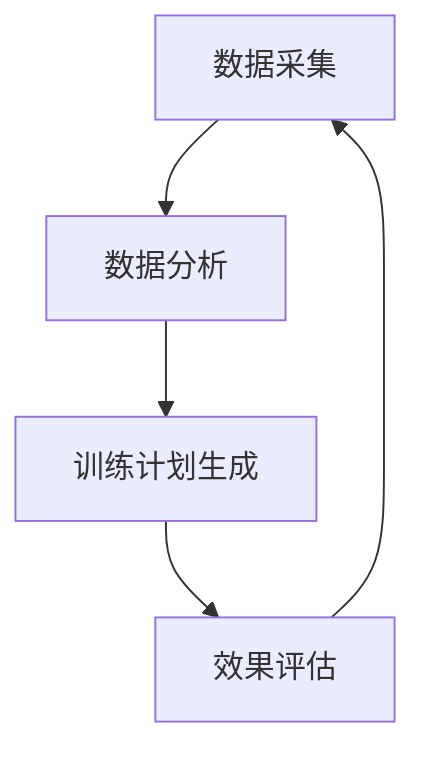
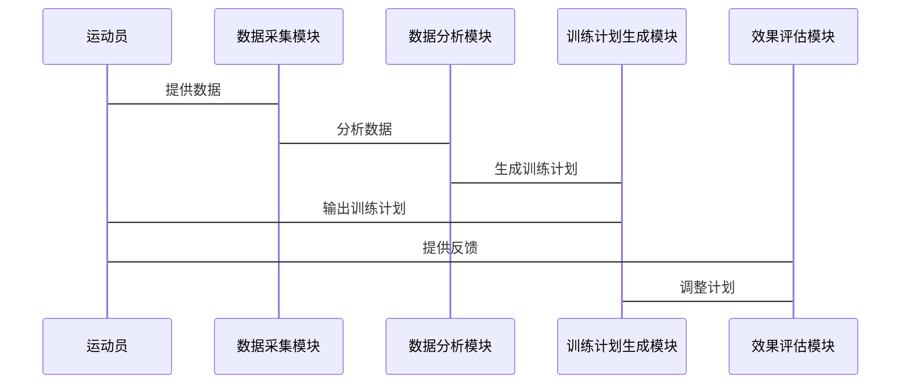

                 


# AI Agent在体育训练中的应用：个性化训练计划制定

## 关键词：
AI Agent，体育训练，个性化训练计划，强化学习，机器学习，数据驱动

## 摘要：
本文详细探讨了AI Agent在体育训练中的应用，特别是如何利用AI技术制定个性化训练计划。文章从AI Agent的基本概念出发，分析了个性化训练计划的核心要素，详细讲解了基于强化学习和机器学习的算法原理，并通过系统架构设计展示了如何构建一个完整的AI Agent系统。最后，通过实际案例分析，验证了AI Agent在体育训练中的有效性。

---

# 第1章: AI Agent与体育训练的背景介绍

## 1.1 AI Agent的基本概念

### 1.1.1 AI Agent的定义与特点
- **定义**：AI Agent（人工智能代理）是指能够感知环境、做出决策并采取行动的智能实体。
- **特点**：
  - **自主性**：能够在没有外部干预的情况下运行。
  - **反应性**：能够根据环境的变化实时调整行为。
  - **学习能力**：能够通过数据和经验不断优化决策能力。

### 1.1.2 AI Agent在体育领域的应用背景
- **背景**：体育训练需要高度个性化的方案，传统方法难以满足运动员的多样化需求。
- **问题**：
  - 运动员的个体差异（如体能、技术、心理状态）难以统一处理。
  - 训练计划的制定缺乏数据支持，容易导致过度训练或训练不足。
  - 现有训练方法难以实时调整以适应运动员的状态变化。

### 1.1.3 个性化训练计划的核心要素
- **运动员数据**：包括体能、技术、心理状态等。
- **训练目标**：根据运动员的具体目标（如提高速度、力量等）制定计划。
- **训练负荷**：确保训练强度适中，避免受伤。

---

## 1.2 体育训练中的问题背景

### 1.2.1 传统体育训练的局限性
- **问题**：
  - 训练计划缺乏科学性，难以最大化运动员的表现。
  - 训练强度难以精准控制，容易导致过度训练或训练不足。
  - 无法实时调整训练计划以适应运动员的状态变化。

### 1.2.2 运动员个性化需求的多样性
- **多样性**：
  - 不同运动员有不同的体能水平、技术特点和心理状态。
  - 同一运动员在不同阶段的需求也会发生变化。

### 1.2.3 数据驱动训练的优势
- **优势**：
  - 通过数据分析，能够更精准地制定训练计划。
  - 可以实时监控运动员的状态，动态调整训练方案。

---

# 第2章: AI Agent在个性化训练计划中的核心概念

## 2.1 AI Agent的核心原理

### 2.1.1 数据采集与分析
- **数据采集**：通过传感器、视频分析等手段获取运动员的生理数据、技术动作数据等。
- **数据分析**：利用数据分析技术（如机器学习）对数据进行处理，提取有用信息。

### 2.1.2 智能算法的应用
- **算法**：
  - 强化学习：通过不断试错，找到最优的训练方案。
  - 监督学习：基于历史数据，预测训练效果。

### 2.1.3 知识表示与推理
- **知识表示**：将训练计划中的知识表示为规则、决策树等形式。
- **知识推理**：根据知识表示，推理出最优的训练方案。

---

## 2.2 个性化训练计划的制定方法

### 2.2.1 基于规则的训练计划
- **方法**：
  - 根据预设的规则，制定训练计划。
  - 例如：如果运动员的体能水平低于某个阈值，则增加力量训练。

### 2.2.2 基于机器学习的训练计划
- **方法**：
  - 利用机器学习模型，根据运动员的历史数据，预测最佳的训练方案。

### 2.2.3 基于强化学习的训练计划
- **方法**：
  - 通过强化学习，不断调整训练计划，以达到最佳效果。

---

## 2.3 核心概念对比分析

### 2.3.1 规则引擎与机器学习的对比
| 对比维度 | 规则引擎 | 机器学习 |
|----------|----------|----------|
| 灵活性 | 较低 | 较高 |
| 学习能力 | 无 | 有 |
| 适用场景 | 简单规则 | 复杂场景 |

---

## 2.4 实体关系图的构建与分析


---

# 第3章: AI Agent算法原理与数学模型

## 3.1 算法原理

### 3.1.1 基于强化学习的训练计划生成
- **步骤**：
  1. 确定状态空间（如运动员的体能水平）。
  2. 定义动作（如增加力量训练）。
  3. 设定奖励函数（如训练效果提升）。
  4. 使用强化学习算法（如Q-learning）生成训练计划。

### 3.1.2 基于监督学习的训练效果预测
- **步骤**：
  1. 收集历史数据（如运动员的训练记录）。
  2. 建立回归模型，预测训练效果。

### 3.1.3 基于聚类分析的运动员分组
- **步骤**：
  1. 根据运动员的特征（如体能水平）进行聚类。
  2. 为每个聚类制定相应的训练计划。

---

## 3.2 数学模型与公式

### 3.2.1 强化学习的数学模型
- **Q-learning算法的数学表达式**：
  $$ Q(s,a) = r + \gamma \max Q(s',a') $$
  - $s$：当前状态
  - $a$：动作
  - $r$：奖励
  - $\gamma$：折扣因子
  - $s'$：下一个状态

### 3.2.2 监督学习的回归模型
- **回归模型**：
  $$ y = \beta_0 + \beta_1x_1 + \beta_2x_2 + \epsilon $$
  - $y$：预测的训练效果
  - $x_1, x_2$：输入特征
  - $\beta_0, \beta_1, \beta_2$：回归系数
  - $\epsilon$：误差项

---

## 3.3 算法实现与案例分析

### 3.3.1 强化学习算法的实现代码
```python
def ai_agent_action(state):
    # 状态转换
    next_state = state + action
    # 奖励函数
    reward = calculate_reward(next_state)
    # 更新Q值
    Q[state][action] = Q[state][action] + learning_rate * (reward + gamma * max(Q[next_state]))
```

---

# 第4章: 系统架构与设计

## 4.1 系统架构设计

### 4.1.1 系统功能模块划分
- **数据采集模块**：采集运动员的数据。
- **数据分析模块**：分析数据，提取有用信息。
- **训练计划生成模块**：根据分析结果，生成训练计划。
- **效果评估模块**：评估训练效果，调整计划。

### 4.1.2 系统架构图


---

## 4.2 系统交互流程图


---

# 第5章: 项目实战

## 5.1 环境安装

### 5.1.1 安装Python环境
- 使用Anaconda或Pyenv安装Python 3.8以上版本。

### 5.1.2 安装依赖库
- 使用pip安装以下库：
  ```bash
  pip install numpy pandas scikit-learn matplotlib
  ```

---

## 5.2 核心代码实现

### 5.2.1 强化学习算法实现
```python
import numpy as np

class AI_Agent:
    def __init__(self, state_space, action_space):
        self.state_space = state_space
        self.action_space = action_space
        self.Q = np.zeros((state_space, action_space))
    
    def take_action(self, state):
        # 探索与利用
        epsilon = 0.1
        if np.random.random() < epsilon:
            action = np.random.randint(self.action_space)
        else:
            action = np.argmax(self.Q[state])
        return action
    
    def update_Q(self, state, action, reward, next_state):
        alpha = 0.1
        gamma = 0.9
        self.Q[state][action] = self.Q[state][action] + alpha * (reward + gamma * np.max(self.Q[next_state]) - self.Q[state][action])
```

---

## 5.3 案例分析

### 5.3.1 数据分析
- 假设我们有100名运动员的数据，包括体能、技术、心理状态等。

### 5.3.2 算法实现
- 使用强化学习算法，根据运动员的状态生成训练计划。

### 5.3.3 结果分析
- 比较传统训练方法与AI Agent生成的训练计划的效果，验证AI Agent的优势。

---

## 5.4 项目小结
- 通过实际案例，验证了AI Agent在体育训练中的有效性。
- 展示了如何通过数据驱动的方法，制定个性化的训练计划。

---

# 第6章: 最佳实践与拓展阅读

## 6.1 最佳实践 tips
- **数据质量**：确保数据的准确性和完整性。
- **模型选择**：根据具体问题选择合适的算法。
- **实时调整**：定期监控运动员的状态，动态调整训练计划。

## 6.2 小结
- AI Agent在体育训练中的应用前景广阔。
- 通过数据驱动的方法，可以制定更加科学和个性化的训练计划。

## 6.3 注意事项
- 避免过度依赖AI，结合人类专家的经验。
- 注意数据隐私和安全性。

## 6.4 拓展阅读
- **推荐书籍**：
  - 《强化学习：理论与应用》
  - 《机器学习实战》
- **推荐论文**：
  - "Deep Reinforcement Learning for Sports Training"
  - "Personalized Training Plan Generation Using AI"

---

# 结语
AI Agent在体育训练中的应用，不仅提高了训练效率，还为运动员带来了更好的训练体验。通过本文的介绍，读者可以深入了解AI Agent的核心原理和实际应用，为未来的体育训练提供新的思路。

--- 

希望这篇文章能为您提供有价值的信息！

