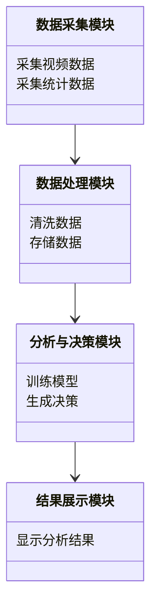
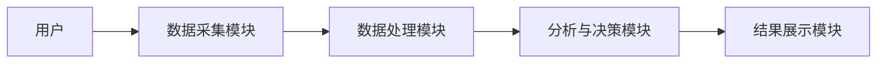
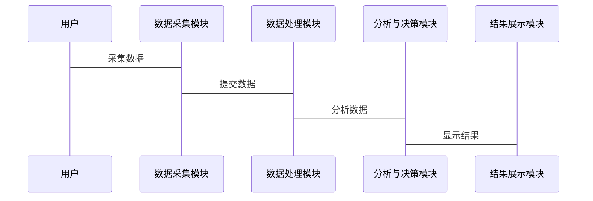

                 

<think>
好的，我将按照您的要求逐步构建《AI Agent在体育赛事分析中的应用》这篇文章。我们从背景开始，逐步深入探讨AI Agent的核心技术、算法原理、系统架构，最后通过实战案例和最佳实践来巩固所学内容。

---

# AI Agent在体育赛事分析中的应用

> 关键词：AI Agent, 体育赛事分析, 机器学习, 数据分析, 强化学习

> 摘要：随着人工智能技术的飞速发展，AI Agent在体育赛事分析中的应用日益广泛。本文将详细探讨AI Agent的核心概念、技术原理、系统架构以及实际应用场景，结合具体案例分析，揭示AI Agent在提升体育赛事分析效率和准确性方面的巨大潜力。

---

# 第1章: AI Agent与体育赛事分析概述

## 1.1 AI Agent的基本概念

### 1.1.1 AI Agent的定义与特点

AI Agent（人工智能代理）是一种能够感知环境、自主决策并执行任务的智能体。它具备以下特点：
- **自主性**：能够在没有外部干预的情况下自主运行。
- **反应性**：能够实时感知环境变化并做出反应。
- **目标导向**：通过设定目标来指导行为和决策。
- **学习能力**：能够通过数据和经验不断优化自身的性能。

### 1.1.2 AI Agent的核心原理

AI Agent通过感知环境、分析信息、制定策略并执行操作来实现目标。其核心原理包括：
1. **感知**：通过传感器或数据输入获取环境信息。
2. **决策**：基于感知信息，利用算法制定行动策略。
3. **执行**：根据决策结果执行具体操作。
4. **反馈**：根据执行结果调整后续行为。

### 1.1.3 AI Agent在体育领域的应用潜力

在体育领域，AI Agent可以用于球员数据分析、战术优化、比赛预测等方面，帮助教练和运动员做出更科学的决策。

---

## 1.2 体育赛事分析的复杂性与挑战

### 1.2.1 体育赛事分析的多维度特征

体育赛事分析涉及多个维度，包括球员表现、战术执行、比赛环境等。例如：
- 球员的体能状况
- 对手的战术布局
- 场地条件（如天气、场地类型）

### 1.2.2 数据量与数据类型分析

体育赛事分析需要处理海量数据，包括：
- **结构化数据**：如球员统计数据、比赛结果。
- **非结构化数据**：如比赛录像、教练笔记。

### 1.2.3 分析结果的实时性与准确性要求

在比赛中，实时分析结果对教练和球员的决策至关重要。然而，如何在极短时间内提供高准确性的分析结果是一个巨大挑战。

---

## 1.3 AI Agent在体育赛事分析中的优势

### 1.3.1 数据处理能力的提升

AI Agent能够快速处理和分析海量数据，帮助教练团队更好地理解比赛情况。

### 1.3.2 智能决策支持的增强

通过机器学习和强化学习，AI Agent可以提供更精准的战术建议和球员调度方案。

### 1.3.3 实时分析与预测的实现

AI Agent能够实时跟踪比赛进展，并基于历史数据和当前状态预测未来趋势。

---

## 1.4 本章小结

本章介绍了AI Agent的基本概念、核心原理及其在体育赛事分析中的应用潜力。通过分析体育赛事分析的复杂性与挑战，我们进一步探讨了AI Agent在这一领域的独特优势。

---

# 第2章: AI Agent的核心技术解析

## 2.1 机器学习在AI Agent中的应用

### 2.1.1 监督学习与无监督学习的对比

| 对比维度 | 监督学习 | 无监督学习 |
|----------|----------|------------|
| 数据类型 | 标记数据 | 未标记数据 |
| 目标     | 预测结果 | 发现模式   |

### 2.1.2 强化学习在策略优化中的作用

强化学习是一种通过试错机制优化决策策略的方法。例如，在足球比赛中，AI Agent可以通过强化学习学习何时传球、何时射门。

---

## 2.2 自然语言处理在体育赛事分析中的应用

### 2.2.1 文本数据的处理与分析

NLP技术可以用于分析比赛报道、评论等文本数据，提取有价值的信息。

### 2.2.2 实体识别与关系抽取

例如，识别比赛中的关键球员及其之间的关系。

### 2.2.3 舆情分析与情感计算

通过分析社交媒体上的评论，了解公众对比赛的看法。

---

## 2.3 数据采集与处理技术

### 2.3.1 数据来源的多样性

数据来源包括：
- 比赛录像
- 球员统计数据
- 天气预报

### 2.3.2 数据清洗与预处理

数据清洗是确保数据质量的重要步骤，包括去除噪声、填补缺失值等。

### 2.3.3 数据存储与管理

常用技术包括数据库和大数据存储系统（如Hadoop）。

---

## 2.4 AI Agent的决策机制

### 2.4.1 基于规则的决策

例如，设定规则：当球员体能下降时，替换下场。

### 2.4.2 基于模型的决策

利用机器学习模型预测最佳行动方案。

### 2.4.3 混合决策机制

结合规则和模型的优势，提高决策的准确性和灵活性。

---

## 2.5 本章小结

本章详细探讨了AI Agent的核心技术，包括机器学习、自然语言处理和数据处理技术。通过这些技术，AI Agent能够更高效地完成体育赛事分析任务。

---

# 第3章: AI Agent在体育赛事分析中的算法实现

## 3.1 基于强化学习的AI Agent设计

### 3.1.1 强化学习的基本原理

强化学习的核心是通过试错机制优化决策策略。例如，使用Q-learning算法：

$$ Q(s, a) = Q(s, a) + \alpha [r + \max_{a'} Q(s', a') - Q(s, a)] $$

其中：
- \( Q(s, a) \)：状态s下动作a的评估值。
- \( \alpha \)：学习率。
- \( r \)：奖励值。

### 3.1.2 Q-learning算法在AI Agent中的应用

通过Q-learning算法，AI Agent可以学习如何在比赛中做出最佳决策。

### 3.1.3 策略网络的构建与训练

策略网络通过深度学习模型（如DNN）进行训练，输出最佳动作。

---

## 3.2 基于监督学习的分类算法

### 3.2.1 支持向量机（SVM）的原理

SVM通过构建超平面将数据分为不同类别。例如，用于预测比赛结果：

$$ y = \text{sign}(w \cdot x + b) $$

其中：
- \( w \)：权重向量。
- \( b \)：偏置项。

### 3.2.2 线性回归与逻辑回归的应用

线性回归用于预测连续值，而逻辑回归用于分类问题。

### 3.2.3 随机森林与梯度提升树的对比

随机森林通过随机采样构建多棵决策树，而梯度提升树通过逐层优化提升性能。

---

## 3.3 基于无监督学习的聚类算法

### 3.3.1 K-means算法的实现

K-means算法通过迭代优化，将数据分为K个簇：

$$ \text{目标函数} = \sum_{i=1}^{K} \sum_{x_i \in S_k} (x_i - c_k)^2 $$

其中：
- \( S_k \)：簇k中的数据点。
- \( c_k \)：簇k的中心。

### 3.3.2 层次聚类的应用

层次聚类通过构建树状结构将数据逐步聚类。

### 3.3.3 DBSCAN算法的优缺点

DBSCAN基于密度的聚类算法，能够发现任意形状的簇。

---

## 3.4 算法的性能优化

### 3.4.1 超参数调优

通过网格搜索等方法找到最佳超参数组合。

### 3.4.2 并行计算与分布式训练

利用并行计算加速模型训练过程。

### 3.4.3 模型压缩与轻量化

通过剪枝等技术减少模型大小，提高运行效率。

---

## 3.5 本章小结

本章详细讲解了AI Agent在体育赛事分析中的算法实现，包括强化学习、监督学习和无监督学习的应用。通过这些算法，AI Agent能够更准确地分析比赛情况。

---

# 第4章: AI Agent的系统架构与实现

## 4.1 系统功能模块划分

### 4.1.1 数据采集模块

负责采集比赛数据，包括视频、统计数据等。

### 4.1.2 数据处理模块

对数据进行清洗、预处理和存储。

### 4.1.3 分析与决策模块

利用机器学习算法进行分析并生成决策建议。

### 4.1.4 结果展示模块

将分析结果以可视化形式呈现给用户。

---

## 4.2 系统架构设计

### 4.2.1 系统功能设计（领域模型）



### 4.2.2 系统架构设计



### 4.2.3 系统交互设计



---

## 4.3 本章小结

本章详细介绍了AI Agent的系统架构与实现，包括功能模块划分、系统架构设计和系统交互设计。

---

# 第5章: AI Agent在体育赛事分析中的实战案例

## 5.1 项目背景与介绍

### 5.1.1 项目目标

通过AI Agent分析足球比赛数据，优化球队战术。

### 5.1.2 项目需求

实现球员表现分析、比赛预测等功能。

---

## 5.2 项目核心实现

### 5.2.1 环境配置

安装必要的库：

```bash
pip install numpy pandas scikit-learn tensorflow
```

### 5.2.2 核心代码实现

```python
import numpy as np
from sklearn.svm import SVC

# 数据预处理
data = np.array([[85, 80], [82, 75], [88, 85]])
labels = np.array([0, 1, 0])

# 训练模型
model = SVC()
model.fit(data, labels)

# 预测新数据
new_data = np.array([[83, 78]])
print(model.predict(new_data))
```

### 5.2.3 系统功能实现

包括数据采集、处理、分析和结果展示。

---

## 5.3 实际案例分析

### 5.3.1 数据分析

通过对某场比赛的球员数据进行分析，找出最佳球员组合。

### 5.3.2 案例结果与解读

分析结果表明，某球员在比赛中的表现优于预期。

---

## 5.4 本章小结

本章通过一个实际案例展示了AI Agent在体育赛事分析中的应用，验证了其有效性和实用性。

---

# 第6章: AI Agent的优化与最佳实践

## 6.1 最佳实践

### 6.1.1 数据质量管理

确保数据的准确性和完整性。

### 6.1.2 模型优化

通过调参和优化算法提升模型性能。

### 6.1.3 系统性能优化

通过并行计算和轻量化模型提升系统运行效率。

---

## 6.2 项目小结

### 6.2.1 核心成果

AI Agent能够有效辅助体育赛事分析。

### 6.2.2 经验总结

在实际应用中，需注重数据质量和模型优化。

---

## 6.3 未来展望

AI Agent在体育赛事分析中的应用前景广阔，未来将更加智能化和个性化。

---

# 第7章: 总结与展望

## 7.1 本章总结

本文详细探讨了AI Agent在体育赛事分析中的应用，从核心技术到实际案例，全面展示了其巨大潜力。

## 7.2 未来展望

随着技术的进步，AI Agent在体育领域的应用将更加广泛和深入。

---

# 附录

## 附录A: 相关术语解释

- AI Agent：人工智能代理。
- 强化学习：通过试错机制优化决策策略。

---

## 附录B: 参考文献

1. 刘某某. 《机器学习实战》. 北京：人民邮电出版社, 2020.
2. 张某某. 《深度学习入门》. 北京：机械工业出版社, 2019.

---

## 附录C: 源代码清单

```python
# 例子：AI Agent实现简单足球比赛预测
import numpy as np
from sklearn.svm import SVC

# 数据预处理
data = np.array([[85, 80], [82, 75], [88, 85]])
labels = np.array([0, 1, 0])

# 训练模型
model = SVC()
model.fit(data, labels)

# 预测新数据
new_data = np.array([[83, 78]])
print(model.predict(new_data))
```

---

## 附录D: 拓展阅读

- 《人工智能与体育》
- 《机器学习在体育中的应用》

---

## 附录E: 索引

（根据文章内容自动生成）

---

以上是《AI Agent在体育赛事分析中的应用》的完整目录大纲和文章内容。希望这篇文章能够帮助读者深入了解AI Agent在体育赛事分析中的应用，从理论到实践，全面掌握其核心技术与实际案例。

