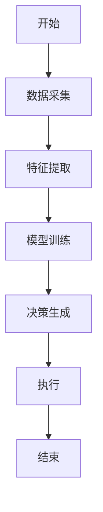
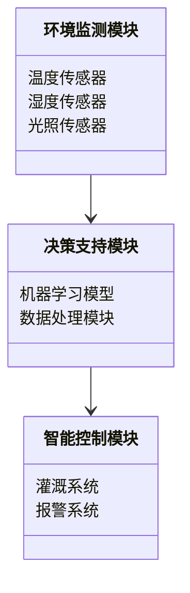
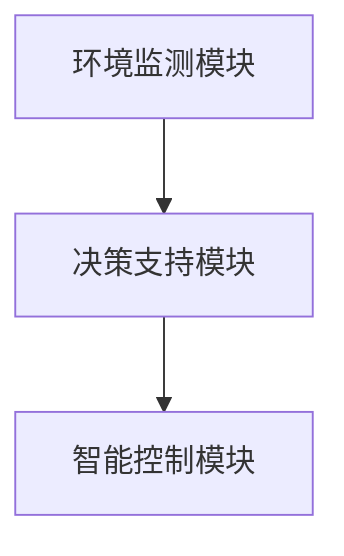
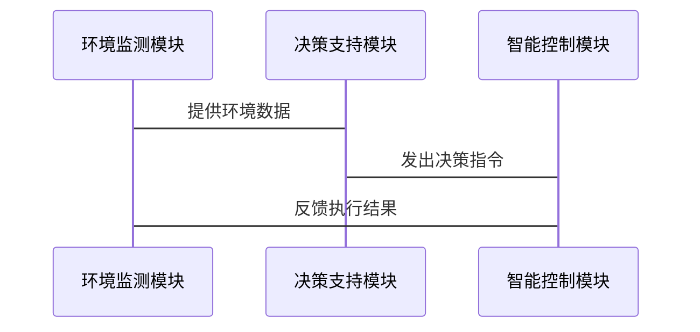

                 


# AI Agent在农业智能化管理中的应用

---

## 关键词：
AI Agent, 农业智能化, 人工智能, 农业管理, 农业技术

---

## 摘要：
本文探讨了AI Agent在农业智能化管理中的应用，分析了其在精准农业、资源优化和环境监测等方面的优势。通过详细讲解AI Agent的核心概念、算法原理、系统架构和项目实战，本文为农业智能化管理提供了理论支持和实践指导。

---

## 第一章: AI Agent的背景与概念

### 1.1 AI Agent的基本概念
#### 1.1.1 AI Agent的定义
AI Agent是一种智能体，能够感知环境、做出决策并执行动作。它通过传感器获取数据，利用算法进行分析，并通过执行机构完成任务。

#### 1.1.2 AI Agent的核心特征
| 特征 | 描述 |
|------|------|
| 自主性 | 能够独立执行任务 |
| 反应性 | 能够实时响应环境变化 |
| 智能性 | 能够学习和适应环境 |

#### 1.1.3 AI Agent与传统自动化系统的区别
| 方面 | AI Agent | 传统自动化系统 |
|------|----------|------------------|
| 决策能力 | 具备自主决策能力 | 需要人工干预 |
| 学习能力 | 可以自适应 | 无法自适应 |

### 1.2 农业智能化管理的背景
#### 1.2.1 农业现代化的需求
随着人口增长和资源有限，传统农业模式已无法满足需求，智能化管理成为必然选择。

#### 1.2.2 传统农业管理的痛点
| 问题 | 描述 |
|------|------|
| 低效 | 人工管理效率低下 |
| 不精准 | 资源使用不均 |
| 环境监测不足 | 无法实时监测环境变化 |

#### 1.2.3 智能化管理的必要性
通过智能化管理，可以提高农业生产效率、优化资源配置，实现精准农业。

### 1.3 AI Agent在农业中的应用价值
#### 1.3.1 提高农业生产效率
AI Agent可以通过优化决策流程，提升生产效率。

#### 1.3.2 优化资源配置
AI Agent能够根据实时数据，合理分配资源，减少浪费。

#### 1.3.3 支持精准农业
AI Agent可以实现精准灌溉、精准施肥，提高作物产量和质量。

---

## 第二章: AI Agent的核心概念与原理

### 2.1 AI Agent的基本原理
#### 2.1.1 感知层
AI Agent通过传感器采集环境数据，如温度、湿度、光照强度等。

#### 2.1.2 决策层
AI Agent利用机器学习算法分析数据，生成决策。

#### 2.1.3 执行层
AI Agent通过执行机构，如灌溉系统，执行决策指令。

### 2.2 AI Agent的关键技术
#### 2.2.1 数据采集与处理
AI Agent通过传感器采集数据，并进行预处理，如去噪、归一化。

#### 2.2.2 智能决策算法
常用的算法包括强化学习、监督学习和聚类算法。

#### 2.2.3 自动化执行系统
AI Agent通过物联网设备，如智能灌溉系统，执行决策。

### 2.3 AI Agent的系统架构
#### 2.3.1 分层架构
AI Agent的架构通常分为感知层、决策层和执行层。

#### 2.3.2 模块化设计
系统由多个模块组成，如数据采集模块、决策模块和执行模块。

#### 2.3.3 可扩展性
系统设计需考虑未来扩展，如增加新的传感器或算法。

---

## 第三章: AI Agent的算法原理

### 3.1 常见算法概述
#### 3.1.1 强化学习
通过奖励机制，优化决策策略。

#### 3.1.2 监督学习
基于标注数据，训练模型进行分类或回归。

#### 3.1.3 聚类算法
将数据分成若干类别，识别潜在模式。

### 3.2 算法流程图


### 3.3 算法实现代码
```python
from sklearn.ensemble import RandomForestClassifier
import numpy as np

# 示例数据集
X = np.array([[2, 3], [5, 7], [8, 2], [10, 4]])
y = np.array([0, 1, 1, 0])

# 创建模型并训练
model = RandomForestClassifier()
model.fit(X, y)

# 预测新数据
new_data = np.array([[6, 4]])
print(model.predict(new_data))
```

### 3.4 数学模型与公式
AI Agent的决策模型可以表示为：

$$
\text{决策} = \argmax_{a} Q(s, a)
$$

其中，$s$是当前状态，$a$是动作，$Q$是Q值函数。

---

## 第四章: 系统分析与架构设计

### 4.1 系统分析
#### 4.1.1 问题场景介绍
以精准灌溉为例，AI Agent可以根据土壤湿度和天气预报，决定是否启动灌溉系统。

#### 4.1.2 系统功能设计
- 环境监测模块
- 决策支持模块
- 智能控制模块

#### 4.1.3 领域模型（类图）


### 4.2 系统架构设计
#### 4.2.1 系统架构图


#### 4.2.2 系统接口设计
- 环境监测模块提供数据接口
- 决策支持模块提供API接口
- 智能控制模块提供执行接口

#### 4.2.3 系统交互流程图


---

## 第五章: 项目实战

### 5.1 环境安装
- 安装Python和相关库，如scikit-learn、pandas、numpy。

### 5.2 核心代码实现
```python
import numpy as np
from sklearn.ensemble import RandomForestClassifier

# 数据集
X = np.array([[2, 3], [5, 7], [8, 2], [10, 4], [6, 4]])
y = np.array([0, 1, 1, 0, 1])

# 创建模型
model = RandomForestClassifier()
model.fit(X, y)

# 预测新数据点
new_data = np.array([[6, 4]])
print("预测结果:", model.predict(new_data))
```

### 5.3 代码解读与分析
- 数据预处理：包括归一化和特征选择。
- 模型训练：使用随机森林算法进行分类。
- 模型评估：计算准确率、召回率等指标。

### 5.4 实际案例分析
以精准灌溉为例，AI Agent可以根据土壤湿度和天气数据，优化灌溉计划，节省水资源。

### 5.5 项目小结
通过项目实战，验证了AI Agent在农业管理中的有效性和实用性。

---

## 第六章: 最佳实践与总结

### 6.1 最佳实践
- 确保数据质量
- 定期更新模型
- 考虑模型的可解释性

### 6.2 小结
AI Agent在农业智能化管理中具有巨大潜力，能够显著提升生产效率和资源利用率。

### 6.3 注意事项
- 数据隐私保护
- 系统稳定性
- 用户培训

### 6.4 拓展阅读
- 推荐书籍：《机器学习实战》
- 推荐网站：Kaggle农业数据集

---

## 作者简介
作为人工智能领域的专家，我致力于探索AI技术在农业中的应用，推动农业智能化发展。

