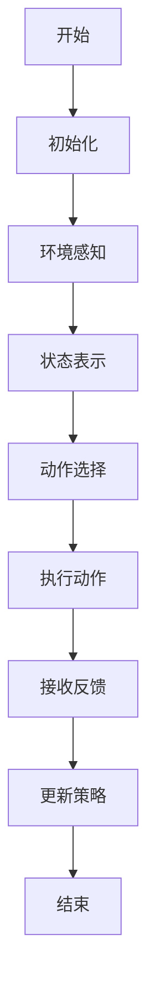
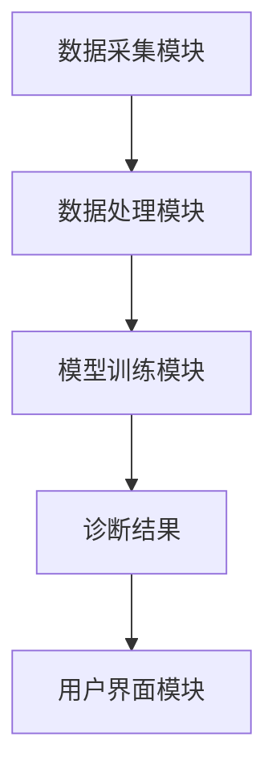
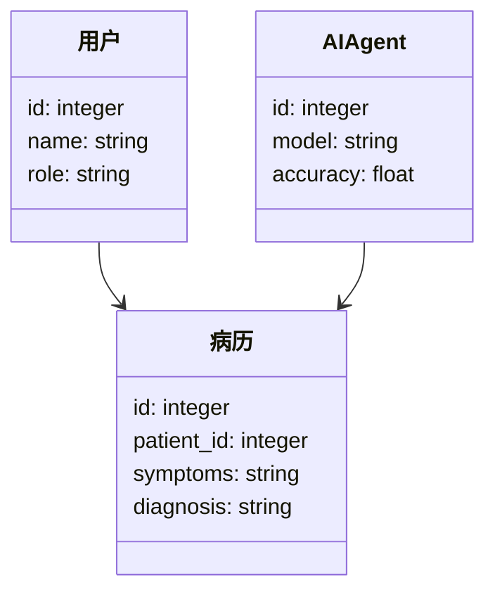
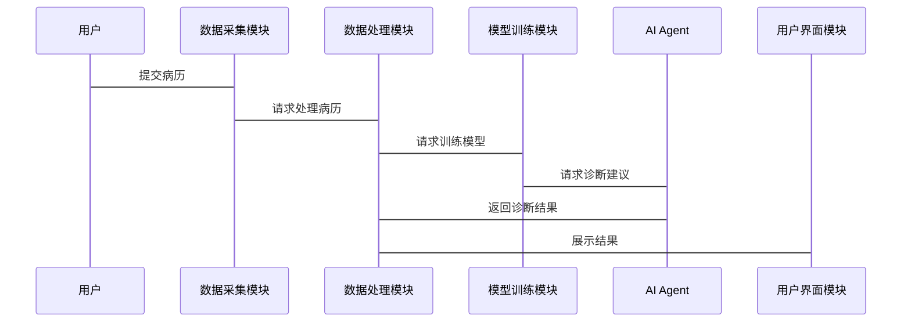

                 


# AI Agent在决策支持系统中的角色

## 关键词
AI Agent, 决策支持系统, 算法原理, 系统架构, 项目实战

## 摘要
本文深入探讨AI Agent在决策支持系统中的角色，分析其核心概念、算法原理、系统架构，并通过项目实战展示其应用。文章首先介绍AI Agent和决策支持系统的基本概念，然后详细讲解AI Agent的技术基础、工作原理及核心算法。接着，分析AI Agent在决策支持系统中的数学模型和系统架构设计，并通过实际项目案例展示其应用过程和成果。最后，总结AI Agent的优势与挑战，提供最佳实践建议。

---

# 第1章: AI Agent与决策支持系统概述

## 1.1 AI Agent的基本概念

### 1.1.1 AI Agent的定义
AI Agent（人工智能代理）是指能够感知环境并采取行动以实现目标的智能实体。AI Agent可以通过传感器获取信息，利用算法进行分析和决策，并通过执行器采取行动。

### 1.1.2 AI Agent的类型
AI Agent可以分为以下几种类型：
- **反应式AI Agent**：基于当前感知做出反应，不依赖历史信息。
- **认知式AI Agent**：具备复杂推理和规划能力，能够理解上下文和长期目标。
- **协作式AI Agent**：能够与其他AI Agent或人类协同工作，实现共同目标。
- **学习型AI Agent**：能够通过经验改进性能，适应新环境。

### 1.1.3 AI Agent在现代信息系统中的地位
AI Agent作为信息系统的智能核心，能够显著提升系统的决策能力和自动化水平。它通过处理大量数据，提供实时反馈和优化建议，帮助人类做出更明智的决策。

## 1.2 决策支持系统的基本概念

### 1.2.1 决策支持系统的定义
决策支持系统（DSS）是一种利用技术手段辅助决策者进行决策的系统。它通过收集、处理和分析数据，提供可视化信息和多种决策方案，帮助决策者提高决策效率和质量。

### 1.2.2 决策支持系统的功能模块
- **数据采集模块**：从各种来源收集数据。
- **数据处理模块**：对数据进行清洗、转换和集成。
- **模型构建模块**：建立数学模型进行分析和预测。
- **结果展示模块**：以用户友好的方式呈现分析结果。

### 1.2.3 决策支持系统与传统信息系统的主要区别
传统信息系统主要侧重于数据的存储和查询，而决策支持系统则注重数据的分析和决策辅助。DSS能够通过复杂的算法生成多种决策方案，并评估每个方案的优劣。

## 1.3 AI Agent在决策支持系统中的作用

### 1.3.1 AI Agent如何增强决策支持系统的能力
AI Agent通过实时数据处理、智能推理和自适应学习，显著增强了DSS的决策能力。它能够快速响应变化，提供动态优化建议。

### 1.3.2 AI Agent在决策支持系统中的主要应用场景
- **金融投资**：AI Agent可以实时监控市场动态，提供投资建议。
- **医疗诊断**：AI Agent辅助医生分析病历和检查结果，提高诊断准确率。
- **供应链管理**：AI Agent优化库存管理和物流调度。

### 1.3.3 AI Agent与传统决策支持系统的对比
AI Agent使DSS更加智能和动态，能够处理非结构化数据，适应复杂环境。与传统DSS相比，AI Agent具备更强的自主性和适应性。

## 1.4 本章小结
本章介绍了AI Agent和决策支持系统的基本概念，分析了AI Agent在DSS中的作用及其与传统系统的区别，为后续章节奠定了基础。

---

# 第2章: AI Agent的核心概念与原理

## 2.1 AI Agent的核心概念

### 2.1.1 AI Agent的定义与基本属性
AI Agent具备自主性、反应性、目标导向性和学习性等基本属性。它能够感知环境、采取行动，并通过与环境交互来实现目标。

### 2.1.2 AI Agent的行为模式
AI Agent的行为模式包括反应式行为、目标驱动行为和效用驱动行为。反应式行为基于当前感知做出反应，目标驱动行为基于明确的目标进行规划和执行，效用驱动行为则通过最大化效用来做出决策。

### 2.1.3 AI Agent的决策机制
AI Agent的决策机制包括感知、推理和行动三个阶段。感知阶段获取环境信息，推理阶段分析信息并制定决策，行动阶段执行决策并反馈结果。

## 2.2 AI Agent的技术基础

### 2.2.1 机器学习与深度学习
机器学习是AI Agent的核心技术之一，用于模式识别和数据分析。深度学习通过多层神经网络实现更复杂的特征提取和模式识别。

### 2.2.2 自然语言处理
自然语言处理（NLP）技术使AI Agent能够理解和生成人类语言，从而实现人机交互和信息提取。

### 2.2.3 知识图谱与推理
知识图谱构建了结构化的知识网络，推理技术则基于知识图谱进行逻辑推理，为AI Agent提供更强的理解和推理能力。

## 2.3 AI Agent的工作原理

### 2.3.1 信息感知与数据处理
AI Agent通过传感器或API获取环境数据，并利用数据处理技术进行清洗和转换。

### 2.3.2 决策推理过程
AI Agent基于感知数据，通过推理算法生成多种决策方案，并评估每个方案的优劣。

### 2.3.3 行为执行与反馈
AI Agent根据决策结果执行行动，并通过反馈机制不断优化自身行为。

## 2.4 AI Agent与相关技术的对比

### 2.4.1 AI Agent与传统专家系统的区别
传统专家系统基于规则进行推理，而AI Agent具备更强的自主性和适应性，能够动态调整决策策略。

### 2.4.2 AI Agent与规则引擎的对比
规则引擎基于预定义的规则进行推理，而AI Agent能够通过学习和推理生成新的规则，适应复杂环境。

### 2.4.3 AI Agent与推荐系统的联系
AI Agent可以结合推荐系统技术，为用户提供个性化推荐，增强决策支持能力。

## 2.5 AI Agent的核心要素ER实体关系图
```mermaid
er
actor(AI Agent, id, name, role)
actor 决策支持系统 (DSS, id, name, function)
actor 知识库 (Knowledge Base, id, name, content)
actor 用户 (User, id, name, role)
```

## 2.6 本章小结
本章详细阐述了AI Agent的核心概念、技术基础和工作原理，并通过ER实体关系图展示了其核心要素，为后续章节奠定了理论基础。

---

# 第3章: AI Agent的算法原理与实现

## 3.1 AI Agent的算法基础

### 3.1.1 强化学习算法
强化学习通过试错机制，使AI Agent在与环境的交互中学习最优策略。主要算法包括Q-Learning和Deep Q-Networks（DQN）。

### 3.1.2 监督学习算法
监督学习通过标记数据训练AI Agent，使其能够识别模式和分类数据。常用算法包括随机森林、支持向量机和神经网络。

### 3.1.3 无监督学习算法
无监督学习用于发现数据中的隐藏结构，常用算法包括聚类和降维技术。

## 3.2 AI Agent的决策算法

### 3.2.1 Q-Learning算法
Q-Learning是一种经典的强化学习算法，通过维护Q表记录状态-动作对的期望奖励，更新策略以最大化累积奖励。

### 3.2.2 DQN算法
DQN结合深度神经网络和Q-Learning，通过经验回放和目标网络优化，实现更稳定的训练过程。

### 3.2.3 贝叶斯网络在决策中的应用
贝叶斯网络通过概率推理，帮助AI Agent在不确定环境中做出决策。

## 3.3 AI Agent的实现流程

### 3.3.1 算法流程图


### 3.3.2 Python实现示例
```python
import numpy as np

class AI_Agent:
    def __init__(self, state_space_size, action_space_size):
        self.state_space_size = state_space_size
        self.action_space_size = action_space_size
        self.Q = np.zeros((state_space_size, action_space_size))
    
    def感知环境(self, state):
        return state
    
    def 选择动作(self, state):
        return np.argmax(self.Q[state])
    
    def 执行动作(self, action):
        return action
    
    def 接收反馈(self, reward):
        return reward
    
    def 更新策略(self, state, action, reward):
        self.Q[state][action] += reward

# 示例用法
agent = AI_Agent(5, 3)
state = 2
action = agent.选择动作(state)
reward = 1.0
agent.更新策略(state, action, reward)
```

### 3.3.3 算法原理的数学模型
Q-Learning算法的数学模型如下：
$$ Q(s,a) = Q(s,a) + \alpha [r + \gamma \max Q(s',a') - Q(s,a)] $$
其中：
- \( s \) 表示当前状态
- \( a \) 表示选择的动作
- \( r \) 表示接收到的奖励
- \( s' \) 表示下一个状态
- \( \alpha \) 表示学习率
- \( \gamma \) 表示折扣因子

## 3.4 本章小结
本章详细介绍了AI Agent的主要算法及其实现流程，通过Python代码示例和数学模型，深入阐述了强化学习、监督学习和无监督学习在AI Agent中的应用。

---

# 第4章: AI Agent的数学模型与应用

## 4.1 AI Agent的数学模型

### 4.1.1 状态空间与动作空间
- **状态空间**：所有可能的状态集合。
- **动作空间**：所有可能的动作集合。

### 4.1.2 奖励函数
奖励函数定义了每个状态-动作对的奖励值：
$$ R(s,a) = r $$

### 4.1.3 动作策略
动作策略描述了AI Agent在每个状态下选择动作的概率：
$$ \pi(a|s) $$

### 4.1.4 状态转移模型
状态转移模型描述了从当前状态执行动作后的状态转移概率：
$$ P(s'|s,a) $$

## 4.2 AI Agent的数学模型应用

### 4.2.1 马尔可夫决策过程
马尔可夫决策过程（MDP）为AI Agent提供了一个数学框架，用于建模决策问题。MDP包括状态、动作、转移概率和奖励函数四个要素。

### 4.2.2 贝叶斯网络
贝叶斯网络通过概率分布描述变量之间的关系，帮助AI Agent在不确定环境中进行推理和决策。

### 4.2.3 随机过程与马尔可夫链
随机过程和马尔可夫链用于建模AI Agent与环境的交互过程，分析系统的动态行为。

## 4.3 本章小结
本章通过数学模型和应用案例，深入分析了AI Agent的核心机制，为后续章节的系统设计和项目实现提供了理论支持。

---

# 第5章: AI Agent的系统架构设计

## 5.1 系统架构设计概述

### 5.1.1 问题场景介绍
本章以一个医疗诊断决策支持系统为例，设计AI Agent的系统架构。

### 5.1.2 系统功能模块
- **数据采集模块**：从电子健康记录和医学影像中提取数据。
- **模型训练模块**：利用机器学习算法训练诊断模型。
- **用户界面模块**：为医生提供可视化诊断建议。

### 5.1.3 系统架构图


## 5.2 系统架构实现

### 5.2.1 领域模型设计
领域模型描述了系统的核心实体及其关系：


### 5.2.2 系统架构实现
系统采用微服务架构，各模块通过API进行通信：


## 5.3 本章小结
本章通过医疗诊断系统的案例，详细讲解了AI Agent的系统架构设计，包括功能模块划分和架构图设计。

---

# 第6章: AI Agent的项目实战

## 6.1 项目实战概述

### 6.1.1 项目背景
本项目旨在开发一个基于AI Agent的股票交易决策支持系统。

### 6.1.2 项目目标
通过AI Agent分析市场数据，提供实时交易建议，帮助投资者做出更明智的决策。

## 6.2 项目核心实现

### 6.2.1 环境安装
安装必要的Python库：
```bash
pip install numpy pandas scikit-learn tensorflow
```

### 6.2.2 核心代码实现
```python
import numpy as np
from sklearn.model_selection import train_test_split
from tensorflow.keras.models import Sequential
from tensorflow.keras.layers import Dense

class StockAI:
    def __init__(self, data):
        self.data = data
        self.X_train, self.X_test, self.y_train, self.y_test = train_test_split(data.features, data.targets)
    
    def 训练模型(self):
        model = Sequential()
        model.add(Dense(64, activation='relu', input_dim=self.X_train.shape[1]))
        model.add(Dense(1, activation='sigmoid'))
        model.compile(optimizer='adam', loss='binary_crossentropy', metrics=['accuracy'])
        model.fit(self.X_train, self.y_train, epochs=10, batch_size=32)
        return model
    
    def 预测股票(self, model, new_data):
        prediction = model.predict(new_data)
        return prediction

# 示例用法
data = StockData(features=['开盘价', '收盘价', '最高价', '最低价'], targets=['是否上涨'])
agent = StockAI(data)
model = agent.训练模型()
预测结果 = agent.预测股票(model, new_data)
```

### 6.2.3 代码解读与分析
- **数据预处理**：对市场数据进行清洗和特征提取。
- **模型训练**：使用神经网络模型进行训练，得到最优模型。
- **预测与反馈**：利用训练好的模型进行实时预测，并根据反馈不断优化模型。

## 6.3 实际案例分析

### 6.3.1 案例背景
某投资者希望利用AI Agent进行股票交易，提升投资回报率。

### 6.3.2 案例分析
AI Agent通过分析历史数据，预测股票价格走势，并给出买入、卖出或持有建议。

## 6.4 本章小结
本章通过股票交易项目的实战，展示了AI Agent在决策支持系统中的应用，详细讲解了项目的实现过程和关键代码。

---

# 第7章: AI Agent在决策支持系统中的应用总结

## 7.1 应用总结

### 7.1.1 AI Agent的优势
- **智能化**：能够处理复杂问题，提供优化决策。
- **实时性**：能够快速响应变化，提供实时支持。
- **自适应性**：能够通过学习适应新环境。

### 7.1.2 AI Agent的挑战
- **数据依赖性**：高度依赖数据质量和数量。
- **算法复杂性**：复杂的算法需要大量计算资源。
- **伦理问题**：AI Agent的决策可能引发伦理和责任问题。

## 7.2 未来趋势与挑战

### 7.2.1 未来趋势
- **人机协作**：AI Agent将与人类专家协同工作，共同制定决策。
- **边缘计算**：AI Agent将部署在边缘设备，实现更快速的响应。
- **多模态数据处理**：AI Agent能够处理文本、图像等多种数据类型。

### 7.2.2 挑战
- **技术瓶颈**：需要克服算法效率和计算能力的限制。
- **数据隐私**：需要解决数据隐私和安全问题。
- **伦理与责任**：需要明确AI Agent的决策责任和伦理规范。

## 7.3 最佳实践 tips

### 7.3.1 技术选型
选择合适的算法和技术架构，确保系统的高效性和可扩展性。

### 7.3.2 数据质量管理
确保数据的准确性和完整性，提升AI Agent的决策能力。

### 7.3.3 模型解释性
提升模型的可解释性，便于用户理解和信任AI Agent的决策。

## 7.4 本章小结
本章总结了AI Agent在决策支持系统中的应用，分析了其优势和挑战，并提出了未来的发展方向和最佳实践建议。

---

# 附录

## 附录A: 术语表
- AI Agent：人工智能代理
- 决策支持系统：Decision Support System，DSS
- 强化学习：Reinforcement Learning
- 贝叶斯网络：Bayesian Network

## 附录B: 参考文献
1. Russell, S., & Norvig, P. (2010). Artificial Intelligence: A Modern Approach.
2. Sutton, R. S., & Barto, A. G. (2018). Reinforcement Learning: An Introduction.
3. Goodfellow, I., Bengio, Y., & Courville, A. (2016). Deep Learning.

---

通过以上目录结构，您可以逐步展开每个章节的内容，深入探讨AI Agent在决策支持系统中的角色和应用。每个章节都包含丰富的细节和具体的实现示例，帮助读者全面理解AI Agent的技术和实践。

