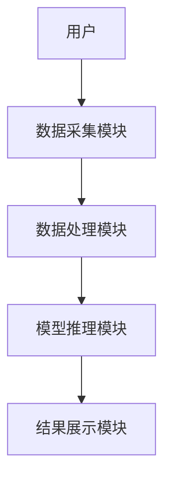
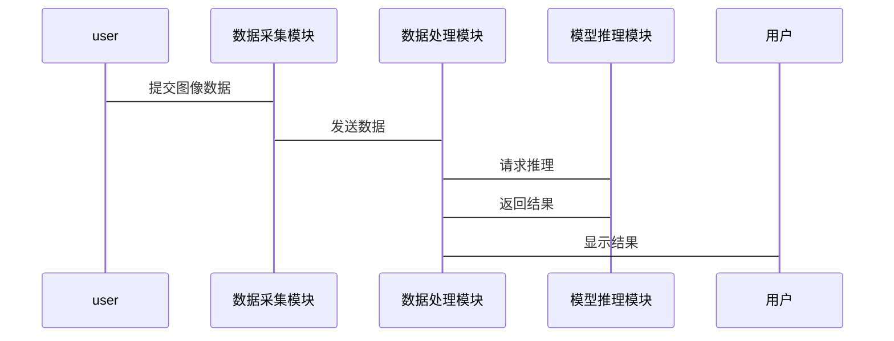

                 


# AI Agent在动物保护中的监测与追踪

## 关键词：AI Agent、动物保护、监测与追踪、计算机视觉、机器学习、生态保护、人工智能技术

## 摘要：  
随着野生动物数量的减少和栖息地的破坏，动物保护变得越来越重要。AI Agent（人工智能代理）作为一种高效的技术手段，正在被广泛应用于野生动物的监测与追踪中。本文将深入探讨AI Agent在动物保护中的应用，分析其核心技术、算法原理、系统架构，并通过实际案例展示其在监测与追踪中的优势。通过本文的讲解，读者将了解如何利用AI Agent技术提升动物保护的效率和准确性。

---

# 引言：AI Agent在动物保护中的重要性

在野生动物保护领域，监测与追踪技术是确保动物种群生存和生态平衡的关键手段。传统的方法依赖于人工观察和记录，效率低下且容易受到环境因素的干扰。AI Agent的出现，为动物保护带来了革命性的变化。通过计算机视觉、机器学习等技术，AI Agent能够实时监测和追踪野生动物，提高数据采集的准确性和效率。

---

## 第1章：背景介绍

### 1.1 AI Agent的基本概念  
AI Agent（人工智能代理）是一种能够感知环境、自主决策并执行任务的智能系统。它结合了计算机视觉、自然语言处理和机器学习等多种技术，能够处理复杂的数据并提供高效的解决方案。

#### 1.1.1 AI Agent的核心特征  
- **自主性**：AI Agent能够自主决策，无需人工干预。  
- **反应性**：能够实时感知环境并做出响应。  
- **学习能力**：通过机器学习算法不断优化性能。  

### 1.2 动物保护中的监测与追踪问题  
#### 1.2.1 动物保护的基本需求  
- 监测动物的活动轨迹。  
- 确保动物种群的安全。  
- 保护生态环境的平衡。  

#### 1.2.2 监测与追踪的主要挑战  
- **环境复杂性**：野生动物生活在复杂的自然环境中。  
- **数据多样性**：需要处理图像、视频等多种数据类型。  
- **实时性要求**：监测需要快速响应。  

---

## 第2章：AI Agent的核心技术

### 2.1 计算机视觉  
计算机视觉是AI Agent在动物保护中的核心技术之一。通过图像处理和目标检测，AI Agent能够识别和跟踪野生动物。

#### 2.1.1 计算机视觉的核心算法  
- **目标检测算法**：YOLO、Faster R-CNN等。  
- **图像分割算法**：U-Net、FCN等。  

#### 2.1.2 计算机视觉的应用场景  
- **野生动物识别**：通过图像识别技术，快速识别动物种类。  
- **行为分析**：分析动物的行为模式，帮助保护工作。  

### 2.2 机器学习  
机器学习是AI Agent的另一项核心技术。通过训练模型，AI Agent能够预测动物的位置和行为。

#### 2.2.1 机器学习的核心算法  
- **监督学习**：用于分类任务。  
- **无监督学习**：用于聚类任务。  

#### 2.2.2 机器学习的应用场景  
- **预测动物位置**：通过历史数据预测动物的活动区域。  
- **异常行为检测**：识别异常行为，及时发出警报。  

### 2.3 数据处理技术  
数据处理是AI Agent工作的基础。通过高效的数据处理技术，AI Agent能够快速分析大量数据，提取有用信息。

#### 2.3.1 数据预处理  
- 数据清洗：去除噪声数据。  
- 数据归一化：统一数据格式。  

#### 2.3.2 数据存储与管理  
- 使用数据库存储数据。  
- 通过分布式存储提高数据处理效率。  

---

## 第3章：算法原理与实现

### 3.1 目标检测算法  
目标检测是计算机视觉中的核心任务。通过YOLO算法，AI Agent能够快速检测出动物的位置和种类。

#### 3.1.1 YOLO算法原理  
YOLO（You Only Look Once）是一种单-shot目标检测算法。它通过将图像分成网格，预测每个网格中的目标位置和类别。

#### 3.1.2 YOLO算法实现  
```python
import torch
model = torch.hub.load('ultralytics/yolov5', 'yolov5')
results = model(img)
```

### 3.2 图像识别算法  
图像识别是另一个重要的技术。通过训练一个卷积神经网络，AI Agent能够识别出动物的种类。

#### 3.2.1 卷积神经网络原理  
卷积神经网络（CNN）通过卷积层提取图像特征，通过全连接层进行分类。

#### 3.2.2 CNN实现  
```python
import torch.nn as nn
class AnimalClassifier(nn.Module):
    def __init__(self):
        super(AnimalClassifier, self).__init__()
        self.conv1 = nn.Conv2d(3, 6, 5)
        self.pool = nn.MaxPool2d(2, 2)
        self.conv2 = nn.Conv2d(6, 16, 5)
        self.fc1 = nn.Linear(16 * 5 * 5, 120)
        self.fc2 = nn.Linear(120, 10)
    
    def forward(self, x):
        x = self.pool(F.relu(self.conv1(x)))
        x = self.pool(F.relu(self.conv2(x)))
        x = x.view(-1, 16 * 5 * 5)
        x = F.relu(self.fc1(x))
        x = self.fc2(x)
        return x
```

### 3.3 算法实现步骤  
1. 数据采集：收集野生动物的图像数据。  
2. 数据预处理：归一化、裁剪等。  
3. 模型训练：使用训练数据训练目标检测和图像识别模型。  
4. 模型部署：将模型部署到实际应用中。  

---

## 第4章：系统架构设计

### 4.1 系统模块划分  
AI Agent系统可以划分为以下几个模块：  
- 数据采集模块：负责采集图像数据。  
- 数据处理模块：负责数据的预处理和存储。  
- 模型推理模块：负责目标检测和图像识别。  
- 结果展示模块：将结果展示给用户。  

### 4.2 系统架构图  


### 4.3 接口设计  
- 数据采集接口：接收图像数据。  
- 模型推理接口：接收模型输入，返回检测结果。  

### 4.4 交互序列图  


---

## 第5章：项目实战

### 5.1 环境安装  
首先安装必要的库：  
```bash
pip install torch numpy matplotlib
```

### 5.2 核心代码实现  
#### 5.2.1 目标检测实现  
```python
import torch
model = torch.hub.load('ultralytics/yolov5', 'yolov5')
results = model(img)
```

#### 5.2.2 图像识别实现  
```python
import torch.nn as nn
class AnimalClassifier(nn.Module):
    def __init__(self):
        super(AnimalClassifier, self).__init__()
        self.conv1 = nn.Conv2d(3, 6, 5)
        self.pool = nn.MaxPool2d(2, 2)
        self.conv2 = nn.Conv2d(6, 16, 5)
        self.fc1 = nn.Linear(16 * 5 * 5, 120)
        self.fc2 = nn.Linear(120, 10)
    
    def forward(self, x):
        x = self.pool(F.relu(self.conv1(x)))
        x = self.pool(F.relu(self.conv2(x)))
        x = x.view(-1, 16 * 5 * 5)
        x = F.relu(self.fc1(x))
        x = self.fc2(x)
        return x
```

### 5.3 案例分析  
通过实际案例分析，展示AI Agent在动物保护中的应用效果。例如，使用YOLO算法检测大象的位置，使用卷积神经网络识别动物种类。

---

## 第6章：总结与展望

### 6.1 项目总结  
通过本文的讲解，我们了解了AI Agent在动物保护中的重要作用。AI Agent结合计算机视觉和机器学习技术，能够高效地监测和追踪野生动物，为动物保护工作提供了强有力的支持。

### 6.2 未来展望  
随着技术的不断进步，AI Agent在动物保护中的应用将更加广泛。未来，我们可以通过以下方式进一步优化：  
- 提高模型的准确性和实时性。  
- 开发更加智能化的系统，实现自动化保护。  

---

## 参考文献  
[1] YOLO官方文档  
[2] PyTorch官方文档  
[3] 《深度学习》—— Ian Goodfellow  

---

通过本文的详细讲解，读者可以深入了解AI Agent在动物保护中的应用，并掌握相关技术的实现方法。希望本文能够为野生动物保护工作提供有价值的参考和指导。

