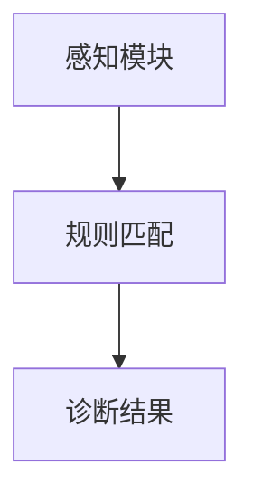
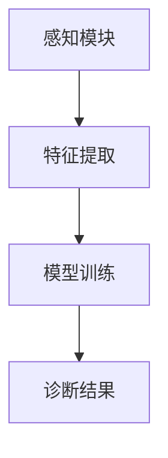
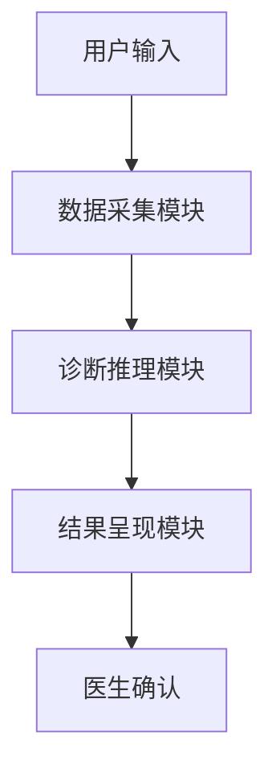
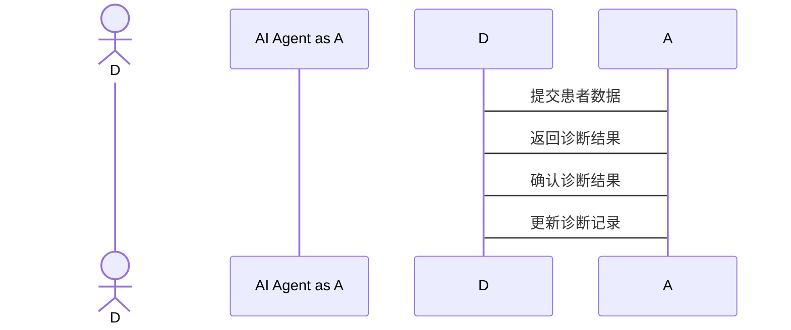

                 


# AI Agent在医疗诊断中的应用前景

## 关键词
- AI Agent
- 医疗诊断
- 人工智能
- 医疗影像分析
- 病历数据分析

## 摘要
本文探讨了AI Agent在医疗诊断中的应用前景，分析了AI Agent的核心概念、算法原理、系统设计及实际应用场景。通过详细的技术分析和案例解读，本文展示了AI Agent如何提升医疗诊断的效率和准确性，为医疗行业带来革命性的变化。

---

# 第一部分: AI Agent与医疗诊断的背景与现状

## 第1章: AI Agent的基本概念与医疗诊断概述

### 1.1 AI Agent的基本概念
#### 1.1.1 AI Agent的定义
AI Agent（人工智能代理）是指能够感知环境、自主决策并执行任务的智能实体。它能够通过传感器获取信息，利用算法进行推理，并采取行动以实现目标。

#### 1.1.2 AI Agent的特点
- **自主性**：能够在没有外部干预的情况下自主运行。
- **反应性**：能够实时感知环境变化并做出反应。
- **学习能力**：能够通过数据和经验不断优化自身的决策能力。
- **协作性**：能够与其他AI Agent或人类协同工作。

#### 1.1.3 AI Agent在医疗诊断中的角色
AI Agent在医疗诊断中主要扮演辅助角色，帮助医生快速分析数据、识别病症、提供诊断建议，并协助制定治疗方案。

### 1.2 医疗诊断的现状与挑战
#### 1.2.1 当前医疗诊断的主要方法
传统的医疗诊断主要依赖医生的经验和病历分析，辅以实验室检测和影像学检查。然而，这种方法存在效率低、准确性受主观因素影响较大的问题。

#### 1.2.2 医疗诊断中的主要挑战
- **数据量大**：医疗数据包括病历、影像、基因信息等，数据量庞大且复杂。
- **诊断准确性**：医生的经验有限，容易出现误诊或漏诊。
- **效率问题**：医疗资源有限，医生需要处理大量患者，时间压力大。

#### 1.2.3 AI Agent在医疗诊断中的应用前景
通过AI Agent的技术支持，医疗诊断可以实现自动化、智能化，提高诊断效率和准确性，减少人为错误。

## 第2章: AI Agent的核心概念与医疗诊断的核心要素对比

### 2.1 AI Agent的核心原理
#### 2.1.1 AI Agent的感知模块
感知模块是AI Agent获取环境信息的关键部分，包括数据采集和特征提取。在医疗诊断中，感知模块可以读取病历数据、医学影像等。

#### 2.1.2 AI Agent的推理模块
推理模块负责根据感知到的信息进行逻辑推理，得出可能的诊断结果。常用的推理方法包括基于规则的推理和基于机器学习的推理。

#### 2.1.3 AI Agent的决策模块
决策模块基于推理结果做出最终的诊断决策，并输出诊断建议。决策模块需要考虑多种因素，如诊断的准确性和治疗的风险。

#### 2.1.4 AI Agent的执行模块
执行模块负责将决策结果转化为实际操作，如生成诊断报告或触发进一步检查。

### 2.2 AI Agent与医疗诊断的核心要素对比
通过对比AI Agent和医疗诊断的核心要素，我们可以更好地理解它们的联系与区别。

#### 2.2.1 AI Agent的核心属性特征
| 属性 | 特征 |
|------|------|
| 感知能力 | 多模态数据处理能力 |
| 推理能力 | 基于规则和机器学习的推理 |
| 决策能力 | 高准确性和实时性 |
| 执行能力 | 自动化操作 |

#### 2.2.2 医疗诊断的核心要素
| 要素 | 特征 |
|------|------|
| 数据采集 | 精准性和完整性 |
| 数据分析 | 统计分析和模式识别 |
| 诊断推理 | 逻辑推理和经验判断 |
| 诊断结果 | 准确性和可解释性 |

#### 2.2.3 AI Agent与医疗诊断的核心联系
- AI Agent通过感知模块获取医疗数据。
- 推理模块利用医疗诊断的核心要素进行推理。
- 决策模块根据推理结果生成诊断建议。
- 执行模块将诊断建议转化为实际操作。

---

## 第3章: AI Agent的算法原理与医疗诊断的数学模型

### 3.1 AI Agent的算法原理
#### 3.1.1 基于规则的推理算法
基于规则的推理算法通过预定义的规则进行推理，适用于医疗诊断中的模式识别。



#### 3.1.2 基于机器学习的推理算法
基于机器学习的推理算法通过训练模型进行预测，适用于复杂的医疗诊断场景。



### 3.2 医疗诊断的数学模型
#### 3.2.1 逻辑回归模型
逻辑回归模型用于分类问题，广泛应用于疾病预测。

$$ P(y=1|x) = \frac{1}{1 + e^{- (w \cdot x + b)}} $$

#### 3.2.2 决策树模型
决策树模型通过树状结构进行分类，适用于医疗诊断中的多分类问题。

---

## 第4章: AI Agent在医疗诊断中的系统设计与架构

### 4.1 系统功能设计
#### 4.1.1 数据采集模块
数据采集模块负责收集患者的病历数据、影像数据等。

#### 4.1.2 诊断推理模块
诊断推理模块利用AI Agent的核心算法进行推理，生成诊断结果。

#### 4.1.3 结果呈现模块
结果呈现模块将诊断结果以可视化的方式展示给医生。

### 4.2 系统架构设计


### 4.3 接口设计
#### 4.3.1 数据接口
数据接口负责与医疗系统进行数据交互。

#### 4.3.2 用户接口
用户接口负责与医生进行交互，接收输入并展示结果。

### 4.4 交互流程设计


---

## 第5章: AI Agent在医疗诊断中的项目实战

### 5.1 环境安装
- **Python**：安装Python 3.8及以上版本。
- **库依赖**：安装numpy、pandas、scikit-learn等库。

### 5.2 核心代码实现
```python
import numpy as np
from sklearn.tree import DecisionTreeClassifier

# 示例数据
X = np.array([[40, 1], [42, 1], [45, 0], [50, 0]])
y = np.array([0, 1, 1, 0])

# 训练决策树模型
model = DecisionTreeClassifier()
model.fit(X, y)

# 预测新样本
new_sample = np.array([[48, 0]])
print(model.predict(new_sample))
```

### 5.3 案例分析
- **案例背景**：一位患者出现咳嗽、发热症状，疑似流感或COVID-19。
- **AI Agent分析**：通过病历数据和影像数据，AI Agent进行诊断推理，最终确认诊断结果为COVID-19。

### 5.4 项目小结
通过实际案例分析，展示了AI Agent在医疗诊断中的应用价值和实际效果。

---

## 第6章: 未来展望与注意事项

### 6.1 未来研究方向
- **多模态数据融合**：结合文本、影像等多种数据源，提高诊断准确性。
- **实时诊断能力**：提升AI Agent的实时推理能力，适用于紧急医疗场景。
- **可解释性增强**：优化算法的可解释性，帮助医生理解和信任AI诊断结果。

### 6.2 注意事项
- **数据隐私**：确保患者数据的安全性和隐私性。
- **算法可靠性**：验证AI Agent的诊断结果，避免误诊风险。
- **医生主导**：AI Agent应作为辅助工具，医生仍需主导最终诊断。

---

## 结语
AI Agent在医疗诊断中的应用前景广阔，能够显著提升医疗诊断的效率和准确性。通过不断的技术创新和实践积累，AI Agent有望成为未来医疗领域的重要组成部分。

---

## 参考文献
1. Russell, S., & Norvig, P. (2010). Artificial Intelligence: A Modern Approach.
2. Hastie, T., Tibshirani, R., & Friedman, J. (2009). The Elements of Statistical Learning.
3. LeCun, Y., Bengio, Y., & Hinton, G. (2015). Deep Learning.

---

## 拓展阅读
1. [AI在医学影像分析中的应用](https://example.com/medical-image-analysis)
2. [机器学习在疾病预测中的应用](https://example.com/disease-prediction)

---

通过以上目录和内容，您可以开始撰写完整的文章。如果需要进一步细化某个部分的内容，请随时告诉我！

